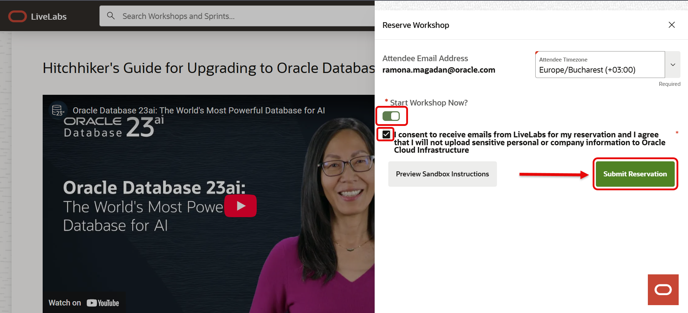
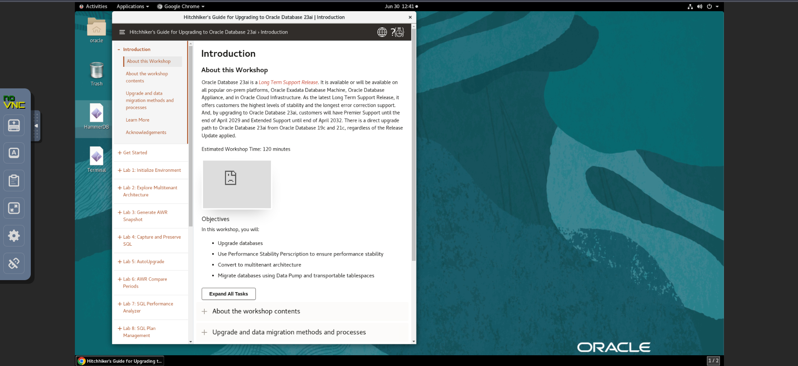

# Lab 1: Test Access to LiveLabs Sandbox

## Introduction

Welcome to your Oracle LiveLabs journey! 
This guide is designed to get you up and running quickly by walking you through the essential steps of provisioning a dedicated sandbox environment. From initial reservation and SSO authentication to launching your development tools like Jupyter Notebooks and SQL Worksheets, these tasks ensure your network and credentials are fully prepared for a seamless hands-on experience. Follow along to set up your workspace and verify your access so you can focus on what matters most: building and learning.

### Objectives

By the end of this lab, you will have successfully configured a functional cloud environment and verified your access to key development tools. Specifically, you will achieve the following:

* **Provision a sandbox environment** through the Oracle LiveLabs platform using a dedicated reservation system.
* **Authenticate and manage credentials** via Oracle Single Sign-On to ensure secure access to workshop resources.
* **Validate network connectivity** for various development interfaces including Streamlit demos and Jupyter Notebooks.
* **Access database management tools** by launching the SQL Worksheet and confirming live database interaction.
* **Explore remote desktop capabilities** to provide a consistent virtual workspace for more complex development tasks.

**Estimated Time:** 10 minutes

## Task 1: Open the workshop page

1. Start by navigating to your selected workshop on [LiveLabs](https://livelabs.oracle.com/ords/r/dbpm/livelabs/view-workshop?clear=RR,180&wid=4126).

2. Look for the green **START** button and click it to begin the reservation process.

    

3. Next, you may see 2 option: ***Run on your own tenancy*** or ***Run on LiveLbs Sandbox***.

    Select the option to run the lab in the LiveLabs Sandbox environment.

    

## Task 2: Log in with your Oracle SSO

1. Login using your **Oracle Single Sign-On (SSO) ID**.
If you don’t have one, follow the prompts to create a [free Oracle account](https://profile.oracle.com/myprofile/account/create-account.jspx).

    

## Task 3: Reserve your workshop

1. In the Reserve Workshop window, toggle the **Start Workshop Now** option. Confirm your selection to begin provisioning the environment.

    

2. *Note: You can Preview Sandbox Instructions before submitting your reservation.*

    

Now your reservation was submitted!

## Task 4: View your reservation

1. Once reserved, head to the **My Reservations** page. If you don’t see your workshop right away, simply refresh your browser.

    

## Task 5: Wait for the environment to be ready

1. It typically takes 10–20 minutes for the sandbox environment to be fully provisioned.

    

You’ll know it’s ready when the status shows as active.

## Task 6: Test the login process

1. Click **Launch Workshop**.

    

2. At the top-left of the page, a link labeled “View Login Info” will appear – click it to see your credentials.

    

## Task 7: Start the Demo

1. Click **Open Link** in line with Start the Demo.

    

2. If a browser window opens showing the Seer Holdings login page, your network supports access to the Streamlit demo environment.

    

## Task 8: Start Development IDE

1. Click **Open Link** in line with Start the Development IDE.

    

2. If a browser window opens showing the Jupyter Notebook login page, your network supports access to the Jupyter Notebook IDE environment.

    

## Task 9: Start SQL Worksheet

1. Click **Open Link** in line SQL Worksheet.

    

2. If a browser window opens showing the database login page, your network supports access to the SQL Worksheet environment.

    

You're all set, and happy labbing!

## Task 10: Launch the remote desktop (Optional)

1. Click the **Launch Remote Desktop** button.

    

2. If a browser window opens showing the virtual environment, your network supports LiveLabs access – you’re all set!

    

## Contact & Support

If you encounter any blocks or require further information regarding the OCI infrastructure, please contact the Oracle Workshop Coordinator.

## Acknowledgements

- **Created By/Date** - Ramona Magadan, Database Product Management, May 2025
- **Last Updated By/Date** - Matt Kowalik, February 2026