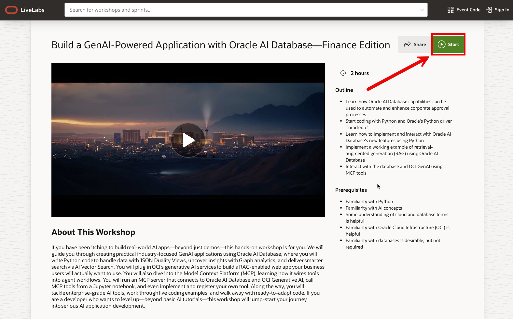
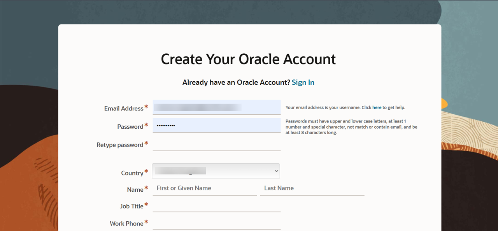
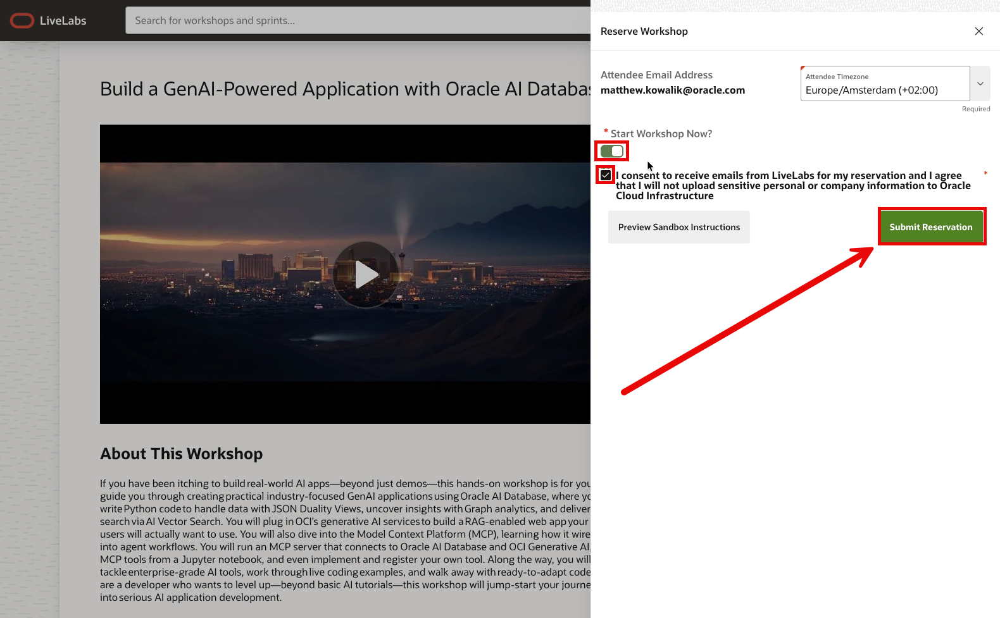
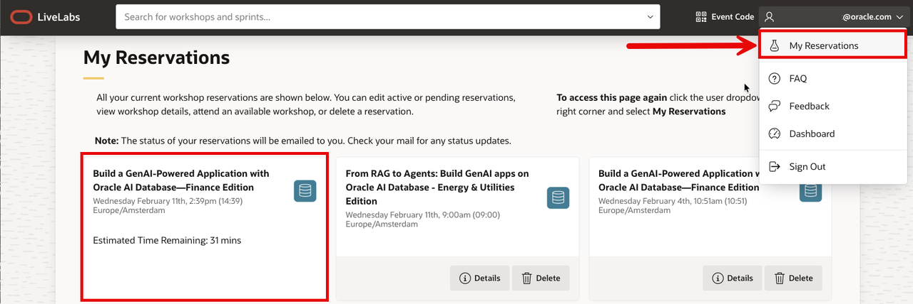
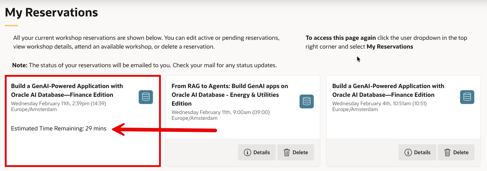
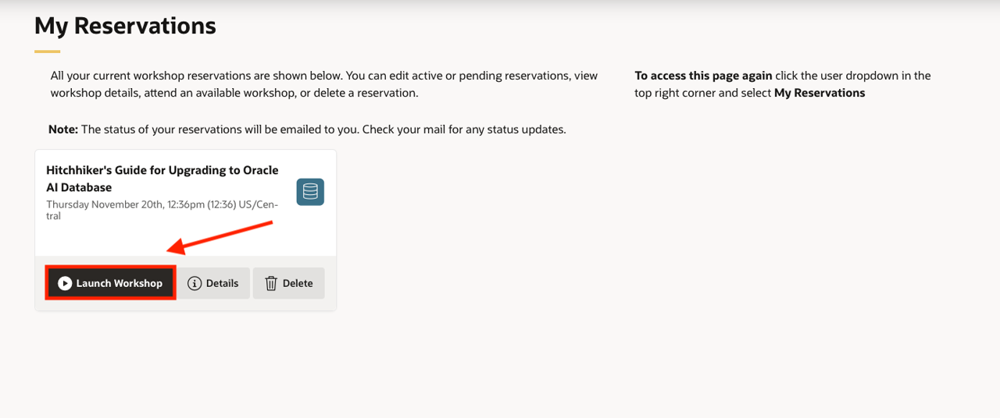
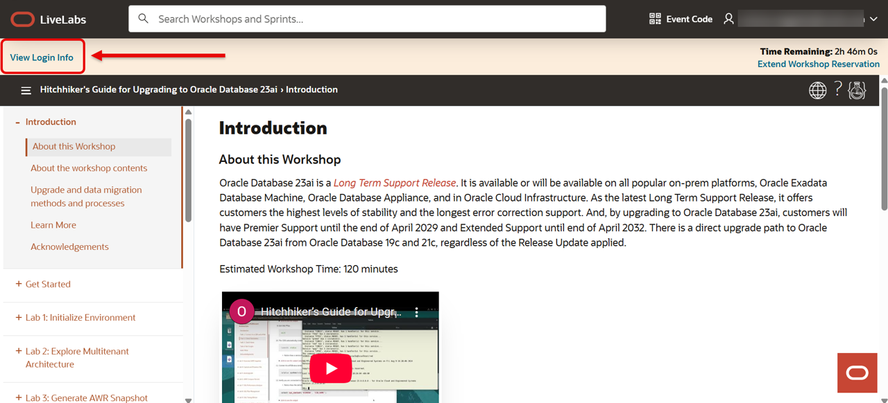
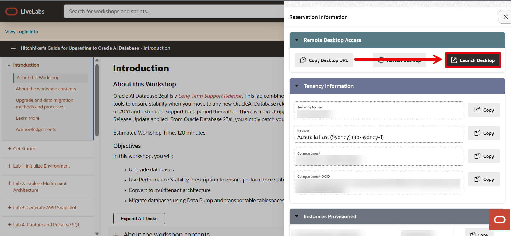
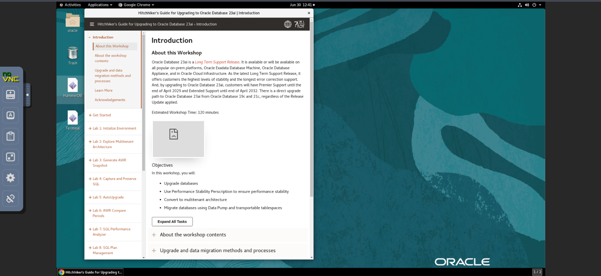

# How to test access to your sandbox environments

## Introduction

To get started, you need to have an active Oracle Cloud account and a LiveLabs reservation. An Oracle Cloud account is free and needed to gain access to your LiveLabs reservation, Oracle Support, and other Oracle publicly-accessible content.

If you already have an Oracle Cloud account, you can skip to Task 3.

Estimated Time: 5 minutes

### Objectives

- Verify that you can access the Oracle LiveLabs sandbox environment from your current network.

- Check if your corporate firewall or proxy blocks access to Oracle Cloud Infrastructure (OCI) IP addresses via HTTP.

- Ensure your environment is ready before attending a LiveLabs workshop.

- Avoid delays or troubleshooting during your actual workshop session.

- Know how to reach out to support if access issues occur.

- Help your workshop conductor ensure a smooth experience by completing this step in advance.

### Prerequisites

- An active Oracle Cloud account
If you don’t have one yet, you can create one for [free](https://www.oracle.com/uk/cloud/sign-in.html).

- Access to the Oracle LiveLabs platform
Visit [livelabs.oracle.com](livelabs.oracle.com) and sign in with your Oracle SSO.

## Task 1: Open the workshop page

1. Start by navigating to your selected workshop on [LiveLabs](livelabs.oracle.com).

2. Look for the green **START** button and click it to begin the reservation process.

  

3. Next, you may see 2 option: ***Run on your own tenancy*** or ***Run on LiveLbs Sandbox***.

    Select the option to run the lab in the LiveLabs Sandbox environment.

  

## Task 2: Log in with your Oracle SSO

Next, log in using your **Oracle Single Sign-On (SSO) ID**.
If you don’t have one, follow the prompts to create a [free Oracle account](https://profile.oracle.com/myprofile/account/create-account.jspx).

  

## Task 3: Reserve your workshop

In the Reserve Workshop window, toggle the **Start Workshop Now** option. Confirm your selection to begin provisioning the environment.

*Note: You can Preview Sandbox Instructions before submitting your reservation.*

  

Now your reservation was submitted!

## Task 4: View your reservation

Once reserved, head to the **My Reservations** page. If you don’t see your workshop right away, simply refresh your browser.

## Task 5: Wait for the environment to be ready

It typically takes 10–20 minutes for the sandbox environment to be fully provisioned.

You’ll know it’s ready when the status shows as active.

## Task 6: Test the login process

Click **Launch Workshop**.

At the top-left of the page, a link labeled “View Login Info” will appear – click it to see your credentials.

## Task 7: Launch the remote desktop

Now, click the **Launch Remote Desktop** button.

If a browser window opens showing the virtual environment, your network supports LiveLabs access – you’re all set!

## Acknowledgements

- **Created By/Date** - Ramona Magadan, Database Product Management, May 2025
- **Last Updated By/Date** - Ramona Magadan, June 2025