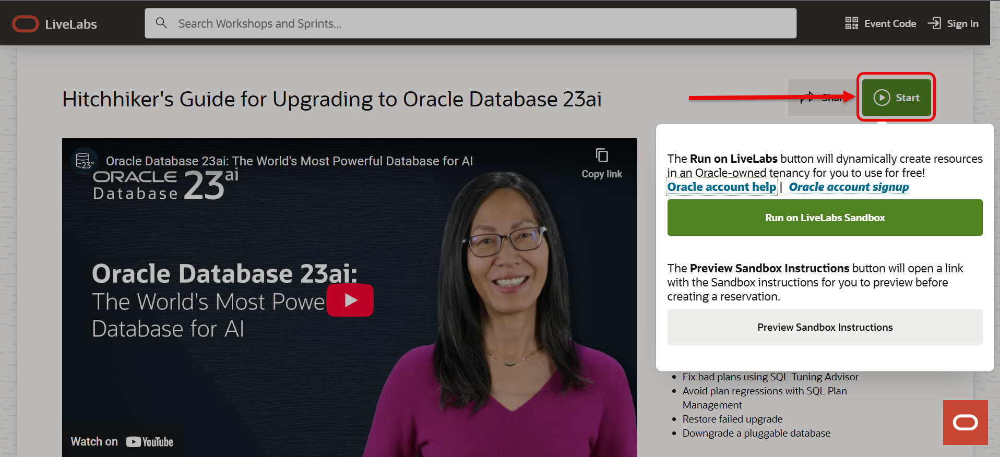
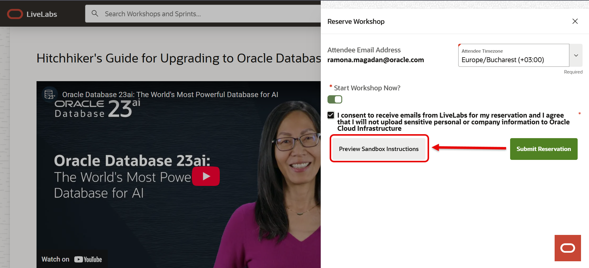
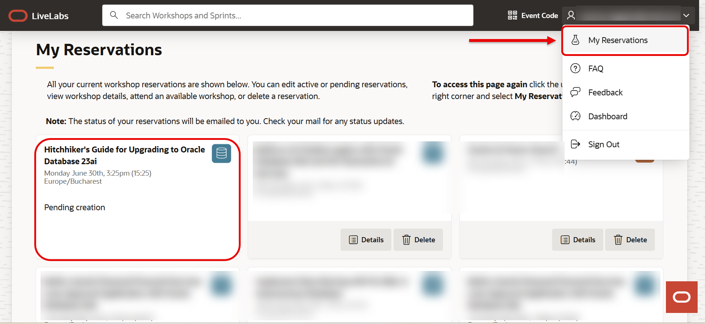
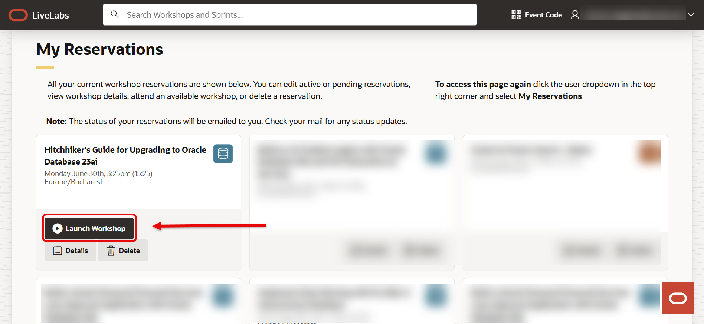
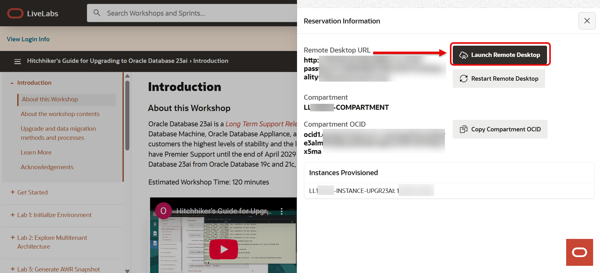

# Technical Readiness & Connectivity Guide: Oracle LiveLabs Workshop

## Introduction
The upcoming **Oracle Hands-on Lab (HOL)** is an interactive, educational session designed to give your developers real-world experience with Oracle technologies. Participants will use the **Oracle LiveLabs Sandbox environment**, which provisions temporary, isolated cloud infrastructure for learning purposes.

### Objectives

The primary goal of this document and the associated connectivity checks is to ensure a friction-free learning experience. By completing these checks, we aim to:

* **Validate Connectivity:** Confirm that participants can reach all necessary cloud endpoints required for the Hands-on Lab.
* **Minimize Downtime:** Identify and resolve network restrictions (Firewalls, Proxies, or VPN policies) before the session begins.
* **Ensure Feature Compatibility:** Verify that interactive components—specifically **WebSockets** for Jupyter and **Streamlit** applications—function correctly within your corporate network environment.
* **Secure Environment Parity:** Ensure that the local machine environment (browser and network) matches the requirements of the provisioned OCI Sandbox.

**Estimated Time:** 10 minutes

## Architecture & Security Context
The sandbox environment consists of three primary layers:

* **Autonomous AI Database:** Secured via encrypted tunneling.
* **Jupyter Notebooks & Application VMs:** These instances provide the hands-on coding environment and UI.
* **Data Layer (Object Storage):** Used to pull workshop scripts, datasets, and lab assets.

### **Security Statement on Public Endpoints**
**Note to Security Teams:** To provide a seamless "hands-on" experience for large groups without the complexity of managing hundreds of individual VPN tunnels or VCN peerings, the Jupyter, Streamlit, and VM layers are accessed via public IP addresses.

**Risk Mitigation:**
* **Non-Production:** These instances contain no sensitive or corporate data.
* **Ephemeral:** The environment is provisioned for the duration of the lab and is permanently destroyed immediately following the session.
* **Isolation:** The sandbox is logically isolated from other OCI tenancies and has no access to your internal corporate network.

## Network Configuration Requirements
Please ensure the following domains, ports, and protocols are permitted for participant machines.

### **A. Core Service Domains**
Whitelist the following domains for **HTTPS (Port 443)** access:
* `*.oracle.com`
* `*.oraclecloud.com`
* `livelabs.oracle.com`

### **B. OCI Object Storage Regional Endpoints**
Workshop assets are stored globally. Please ensure connectivity to the following Object Storage endpoints (**Port 443**):

| Region | Identifier | Object Storage Endpoint |
| :--- | :--- | :--- |
| **US East** | `us-ashburn-1` | `objectstorage.us-ashburn-1.oraclecloud.com` |
| **US West** | `us-phoenix-1` | `objectstorage.us-phoenix-1.oraclecloud.com` |
| **US West** | `us-sanjose-1` | `objectstorage.us-sanjose-1.oraclecloud.com` |
| **UK South** | `uk-london-1` | `objectstorage.uk-london-1.oraclecloud.com` |
| **Germany Central** | `eu-frankfurt-1` | `objectstorage.eu-frankfurt-1.oraclecloud.com` |
| **Netherlands** | `eu-amsterdam-1` | `objectstorage.eu-amsterdam-1.oraclecloud.com` |
| **Switzerland** | `eu-zurich-1` | `objectstorage.eu-zurich-1.oraclecloud.com` |
| **UAE** | `me-dubai-1` | `objectstorage.me-dubai-1.oraclecloud.com` |
| **Saudi Arabia** | `me-jeddah-1` | `objectstorage.me-jeddah-1.oraclecloud.com` |
| **Japan** | `ap-tokyo-1` | `objectstorage.ap-tokyo-1.oraclecloud.com` |
| **Japan** | `ap-osaka-1` | `objectstorage.ap-osaka-1.oraclecloud.com` |
| **Australia** | `ap-sydney-1` | `objectstorage.ap-sydney-1.oraclecloud.com` |
| **Australia** | `ap-melbourne-1` | `objectstorage.ap-melbourne-1.oraclecloud.com` |
| **India** | `ap-mumbai-1` | `objectstorage.ap-mumbai-1.oraclecloud.com` |
| **India** | `ap-hyderabad-1` | `objectstorage.ap-hyderabad-1.oraclecloud.com` |
| **Brazil** | `sa-saopaulo-1` | `objectstorage.sa-saopaulo-1.oraclecloud.com` |
| **Canada** | `ca-toronto-1` | `objectstorage.ca-toronto-1.oraclecloud.com` |
{: title="OCI Object Storage Regional Endpoints"}

### **C. Port & Protocol Specifics**
| Protocol | Port | Description |
| :--- | :--- | :--- |
| **HTTPS** | `443` | Standard web access to LiveLabs and OCI Console. |
| **HTTP** | `80` | Application layer access for specific lab modules. |
| **WebSockets** | `8888` | **Crucial:** Jupyter Notebooks require persistent WebSocket connections. |
| **Streamlit** | `5000` | Used for interactive AI/ML application front-ends. |
{: title="Port & Protocol Specifics"}

> **Important:** If your network uses Deep Packet Inspection (DPI) or a Proxy that terminates SSL, please ensure that **WebSockets** are not stripped or blocked on ports `8888` or `5000`, as this will cause the lab environment to freeze or disconnect.

## IT Readiness Checklist
Please complete these steps at least **72 hours** before the workshop:

1.  **Oracle Account:** Ensure you have an active Oracle account. If you don’t have one yet, you can create one for [free](https://profile.oracle.com/myprofile/account/create-account.jspx).
2.  **LiveLabs Access:** Verify you can access [livelabs.oracle.com](https://livelabs.oracle.com).
3.  **VPN Policy:** Confirm if participants should be off-VPN (recommended) or if the VPN allows split-tunneling for the domains listed above.
4.  **Browser:** Ensure participants have a modern browser (Chrome, Firefox, or Edge).
5.  **Connectivity Test:** Proceed to **Task 1** below to begin the validation.

## Task 1: Open the workshop page

1. Start by navigating to your selected workshop on [LiveLabs](https://livelabs.oracle.com/ords/r/dbpm/livelabs/view-workshop?clear=RR,180&wid=4126).

2. Look for the green **START** button and click it to begin the reservation process.

    

3. Next, you may see 2 option: ***Run on your own tenancy*** or ***Run on LiveLbs Sandbox***.

    Select the option to run the lab in the LiveLabs Sandbox environment.

    

## Task 2: Log in with your Oracle SSO

1. Login using your **Oracle Single Sign-On (SSO) ID**.
If you don’t have one, follow the prompts to create a [free Oracle account](https://profile.oracle.com/myprofile/account/create-account.jspx).

    

## Task 3: Reserve your workshop

1. In the Reserve Workshop window, toggle the **Start Workshop Now** option. Confirm your selection to begin provisioning the environment.

    

*Note: You can Preview Sandbox Instructions before submitting your reservation.*

    

Now your reservation was submitted!

## Task 4: View your reservation

1. Once reserved, head to the **My Reservations** page. If you don’t see your workshop right away, simply refresh your browser.

    

## Task 5: Wait for the environment to be ready

1. It typically takes 10–20 minutes for the sandbox environment to be fully provisioned.

    

You’ll know it’s ready when the status shows as active.

## Task 6: Test the login process

1. Click **Launch Workshop**.

    

At the top-left of the page, a link labeled “View Login Info” will appear – click it to see your credentials.

    

## Task 7: Start the Demo

1. Click **Open Link** in line with Start the Demo.

    

If a browser window opens showing the Seer Holdings login page, your network supports access to the Streamlit demo environment.

    

## Task 8: Start Development IDE

1. Click **Open Link** in line with Start the Development IDE.

    

If a browser window opens showing the Jupyter Notebook login page, your network supports access to the Jupyter Notebook IDE environment.

    

## Task 9: Start SQL Worksheet

1. Click **Open Link** in line SQL Worksheet.

    

If a browser window opens showing the database login page, your network supports access to the SQL Worksheet environment.

    

You're all set, and happy labbing!

## Task 9: Launch the remote desktop (Optional)

1. Click the **Launch Remote Desktop** button.

    

If a browser window opens showing the virtual environment, your network supports LiveLabs access – you’re all set!

    

## Contact & Support
If you encounter any blocks or require further information regarding the OCI infrastructure, please contact the Oracle Workshop Coordinator.

## Acknowledgements

- **Created By/Date** - Ramona Magadan, Database Product Management, May 2025
- **Last Updated By/Date** - Matt Kowalik, February 2026