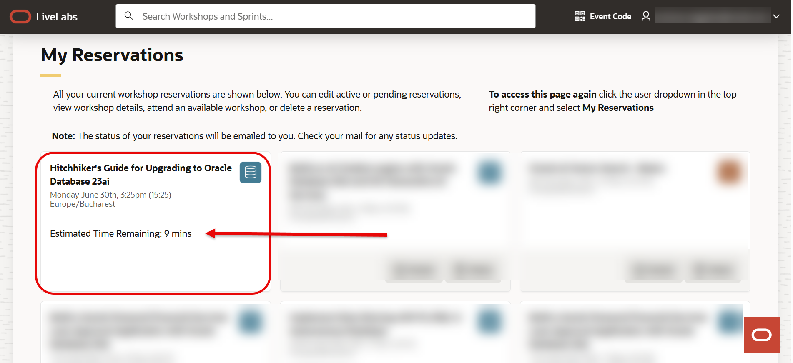

# Using Secure Desktops 

## Introduction

Use this guide to learn more about how to start with Secure Desktops! This guide will walk you through launching the desktop and provide a few tips to make using it easier. To ensure a smooth experience, please review the following requirements before you begin:

- Use Google Chrome as the browser. It's tools best support Secure Desktop. 
- Make sure you have pop-ups enabled in your browser. 
- You are logged out of any OCI tenants in the browser. 

### Objectives

* **Validate Connectivity:** Confirm that participants can reach and use Secure Desktops.

**Estimated Time:** 10 minutes

## Task 1: Open the workshop page

1. Start by navigating to your selected workshop sent to you by your account team.

2. Look for the green **START** button and click it to begin the reservation process.

    

3. Next, you may see 2 option: ***Run on your own tenancy*** or ***Run on LiveLbs Sandbox***.

    Select the option to run the lab in the LiveLabs Sandbox environment.

    

## Task 2: Log in with your Oracle SSO

1. Login using your **Oracle Single Sign-On (SSO) ID**.
If you don’t have one, follow the prompts to create a [free Oracle account](https://profile.oracle.com/myprofile/account/create-account.jspx).

    

## Task 3: Reserve your workshop

1. In the Reserve Workshop window, toggle the **Start Workshop Now** option. Confirm your selection to begin provisioning the environment.

    

2. *Note: You can Preview Sandbox Instructions before submitting your reservation.*

    

Now your reservation was submitted!

## Task 4: View your reservation

1. Once reserved, head to the **My Reservations** page. If you don’t see your workshop right away, simply refresh your browser.

    

## Task 5: Wait for the environment to be ready

1. It typically takes 10–20 minutes for the sandbox environment to be fully provisioned.

    

You’ll know it’s ready when the status shows as active.

## Task 6: Test the login process

1. Click **Launch Workshop**.

    

2. At the top-left of the page, a link labeled “View Login Info” will appear – click it to see your credentials.

    

## Task 7: Login to Secure Desktops

1. Click the **Launch Secure Desktop** button in LiveLabs. 

    

2. If you have another OCI session in your browser, you will need to click the "Sign in with a different user account" option after launching secure desktops. 

    

2. Enter the Desktop Tenancy name, found in the Secure Desktop Information section in LiveLabs. 

    

4. If you have to select an identity domain for the tenancy, please select the **Default** domain. 

    

3. Login with the Secure Desktop user information. You will have to provide a new password since this is the first login of the user. **NOTE:** If after logging in you see a blank page, simply refresh the page to reach the reset password screen.

    

    

4. Now you will see the Secure Desktops home page. You will see the desktops you have available to you. Click on the available desktop pool. This will begin provisioning a brand-new desktop for you to use. Please allow for 5-10 minutes for the compute instance to stand up. 

    **Note:** Secure Desktops use pop-ups. Please enable pop-ups in your browser settings before clicking on a Desktop Pool. 

    

    

5. Once the desktop has been created, a pop-up window will open and display your desktop. 

    **Note:** you will have to allow pop-ups in your browser settings if nothing pops up after the creation window closes. 

    If you notice that your desktop failed to open or otherwise has issues like the one below, try closing the window and click on the desktop pool again. After a bit more time, the desktop should open in another pop-up window. 

    

6. Once the desktop has been opened, click through the Oracle Linux setup screens. 

    

    

    

    

    

    

7. After finishing setup, you can open the Firefox browser by going to Activities > Firefox. 

    

8. With the browser open, you can navigate to **livelabs.oracle.com** to sign in and use your LiveLabs environment. 

    

## Appendix: Tips and Tricks for Secure Desktops 

1. You can use your local machine's clipboard by using the buttons on the left side of the screen. 

    - The top button imports your clipboard to the secure desktop. Use the top button to send information from your computer to the desktop.
        
    - The second button exports the secure desktop's clipboard to your local machine. Use the second button to get information from the desktop to your machine. 
        

2. If you are using a NoVNC image in LiveLabs, you may be confused with multiple layers of browser and remote desktop views. In order to minimize these instructions, you can do the following: 

    - Go fullscreen with your browser. 
    - Remove the toolbar of your browser. In chrome, go to **View** and uncheck **Always Show Toolbar in Full Screen**. 

## Contact & Support

If you encounter any blocks or require further information regarding the OCI infrastructure, please contact the Oracle Workshop Coordinator.

## Acknowledgements

- **Created By/Date** - Ramona Magadan, Database Product Management, May 2025
- **Last Updated By/Date** - Matt Kowalik, February 2026