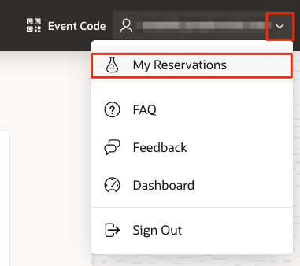
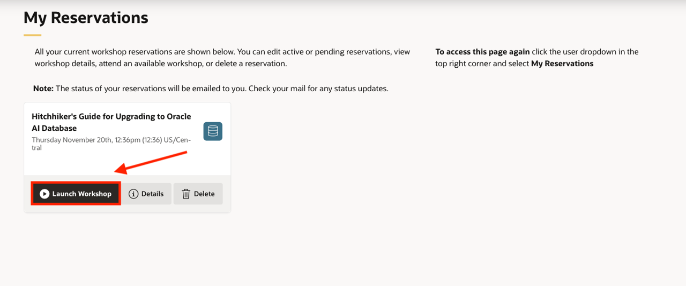
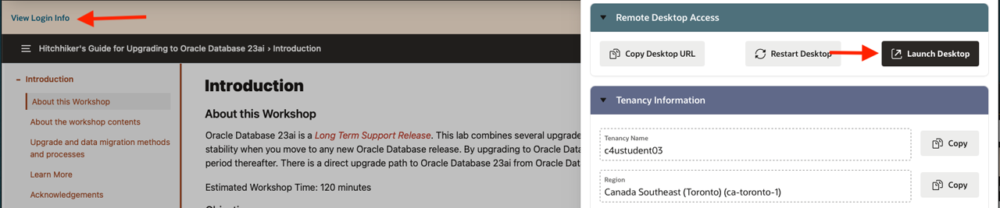
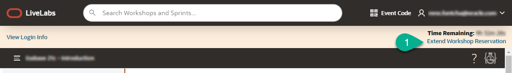

# Verify compute instance setup

## Introduction
This lab will show you how to log in to your pre-created compute instance running on Oracle Cloud.

Estimated Time: 5 minutes

### Objectives
In this lab, you will:
- Learn how to connect to your compute instance using Remote Desktop

### Prerequisites

This lab assumes you have:
- Successfully submitted a reservation using the **Run on LiveLabs** option
- Your reservation has been successfully executed, and a valid remote desktop URL has been provided

## Task 1: Access the Graphical Remote Desktop
For ease of execution of this workshop, your VM instance has been pre-configured with a remote graphical desktop - accessible using any modern browser on your laptop or workstation. Proceed as detailed below to log in.

1. Now that your instance has been provisioned. If you are not already on the **My Reservations** page, then:
    - Sign in to [LiveLabs](https://oracle.com/livelabs)
    - Click the drop-down arrow next to your **Username**
    - Click **My Reservations**

   

2. Find the request you submitted from the list displayed (only one item will be displayed if this is your first request), then click **Launch Workshop**

    

    >**Note:** The *Launch Workshop* link will be visible only when provisioning is completed

3. Click **View Login Info** and then **Launch Remote Desktop**.

    

    This should take you directly to your remote desktop in a single click.

    

    >**Note:**  While rare, you may see an error titled **Deceptive Site Ahead** or similar depending on your browser type as shown below.

    Public IP addresses used for LiveLabs provisioning come from a pool of reusable addresses and this error is because the address was previously used by a compute instance long terminated, but that wasn't properly secured, got compromised, and was flagged.

    You can safely ignore and proceed by clicking **Details**, and finally, **Visit this unsafe site**.

    

4. During the lifetime of your environment, you may return to this page to request an extension. To further extend the duration of your reservation, click **Extend Workshop Reservation**

    

    >**Note:** You may extend your reservation up to 4 times yielding a maximum lifetime equal to double the initial duration.

You may now **proceed to the next lab**.

## Acknowledgements
* **Author** - Rene Fontcha, LiveLabs Platform Lead, NA Technology
* **Contributors** - LiveLabs Team
* **Last Updated By/Date** - Arabella Yao, Product Manager, Database Product Management, Dec 2022