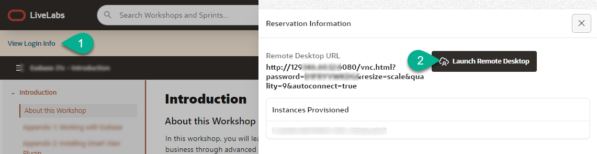

# Verify Compute Instance Setup

## Introduction
This lab will show you how to login to your pre-created compute instance running on Oracle Cloud.

*Estimated Time*: 5 minutes

### Objectives
In this lab, you will:
- Learn how to connect to your compute instance using Remote Desktop

### Prerequisites

This lab assumes you have:
- Successfully submitted a reservation using the **Run on LiveLabs** option
- Your reservation has been Successfully executed and valid remote desktop URL provided in the output

## Task 1: Access the Graphical Remote Desktop
For ease of execution of this workshop, your VM instance has been pre-configured with a remote graphical desktop accessible using any modern browser on your laptop or workstation. Proceed as detailed below to login.
 
1. Now that your instance has been provisioned, navigate to **My Reservations**, find the request you submitted from the list displayed (only one item will be displayed if this is your first request).

   

2. Click on **Launch Workshop** after the reservation provisioning has been completed.

     

3. Click on **Login info** and then on **Remote Desktop** link.

    

    This should take you directly to your remote desktop in a single click.

    

    >**Note:**  While rare, you may see an error titled **Deceptive Site Ahead** or similar depending on your browser type as shown below.

    Public IP addresses used for LiveLabs provisioning comes from a pool of reusable addresses and this error is due to the fact that the address was previously used by a compute instance long terminated, but that wasn't properly secured, got compromised and was flagged.

    You can safely ignore and proceed by clicking on **Details**, and finally on **Visit this unsafe site**.

    

You may now proceed to the next lab.

## Acknowledgements
* **Author** - Rene Fontcha, LiveLabs Platform Lead, NA Technology
* **Contributors** - LiveLabs Team
* **Last Updated By/Date** - Rene Fontcha, LiveLabs Platform Lead, NA Technology, August 2021
