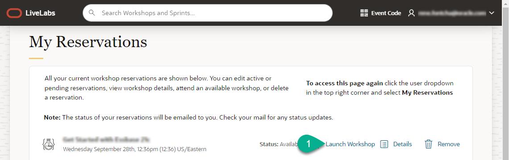
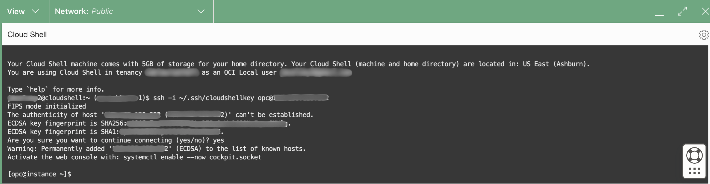
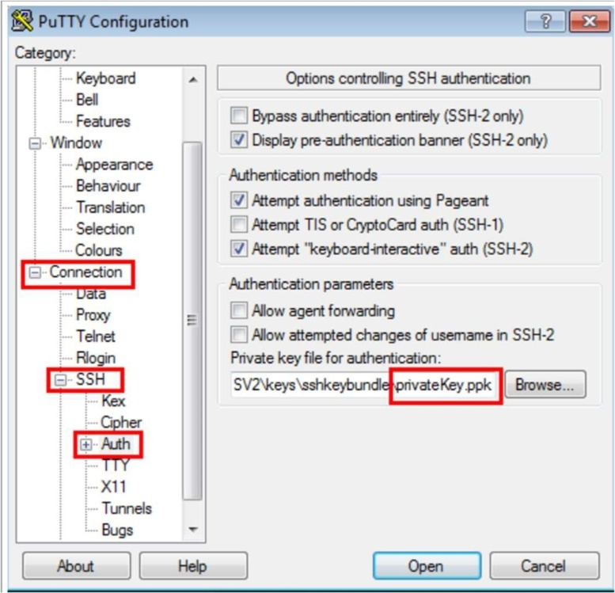

# Verify compute instance setup

## Introduction
This lab will show you how to log in to your pre-created compute instance running on Oracle Cloud.

Estimated Time: 10 minutes

### Objectives
In this lab, you will:
- Gather details needed to connect to your instance (Public IP Address)
- Learn how to connect to your compute instance using SSH protocol

### Prerequisites

This lab assumes you have:
- A LiveLabs Cloud account and assigned compartment
- The IP address and instance name for your compute instance
- Successfully logged into your LiveLabs account
- A valid SSH key pair

## Task 1: Gather Compute Instance Details
1. Now that your instance has been provisioned. If you are not already on the **My Reservations** page, then:
    - Sign in to [LiveLabs](https://oracle.com/livelabs)
    - Click the drop-down arrow next to your **Username**
    - Click **My Reservations**

   

2. Find the request you submitted from the list displayed (only one item will be displayed if this is your first request), then click **Launch Workshop**

    

    >**Note:** The *Launch Workshop* link will be visible only when provisioning is completed

3. Click **View Login Info**. Look for the instance(s) and write down the **public IP address**(es).
    
4. Note the **Compartment** your compute instance was created in.

## Task 2: Choose a Path

Now it's time to choose a path. You can connect to the compute instance by one of 3 methods.  If you are doing a LiveLab that it can be done within a terminal completely, we recommend you choose Oracle Cloud Shell (Step 2A).

Your options are:
1. Task 2A: Connect using Cloud Shell *(recommended)*
2. Task 2B: Connect using MAC or a Windows CYGWIN Emulator
3. Task 2C: Connect using Putty *(Requires you to install applications on your machine)*

## Task 2A: Upload Key to Cloud Shell and Connect

1.  Go to **Compute** -> **Instances**. Make sure you choose the correct compartment assigned to you. Select the instance created for you. On the instance homepage, find the **Public IP address** for your instance - you will need this information in Step 7.

    

2.  To start the Oracle Cloud Shell, go to your Cloud console and click **Cloud Shell** at the top right of the page.

	

	

>**Note**: If you receive a *Policy Missing* error, make sure you have completed Step 1 and you are in the compartment assigned to you.

3.  Click the Cloud Shell setting icon and select **Upload** to upload your SSH private key.

    

4.  To connect to the compute instance that was created for you, you will need to upload your SSH private key.  This is the half of the SSH key pair that does *not* have a `.pub` extension.  Locate that file on your machine and click **Upload** to process it.

    

5. Be patient while the SSH key file uploads to your Cloud Shell directory.
    

    

6. Once uploading is finished, you can run the command below to check to see if your SSH key was uploaded.  Move it into your .ssh directory and change the permissions.

    ```nohighlight
    <copy>
    ls
    </copy>
    ```
    ```nohighlight
    mkdir ~/.ssh
    mv <privatekeyname> ~/.ssh
    chmod 600 ~/.ssh/<privatekeyname>
    ls ~/.ssh
    ```

    

7.  Secure Shell (SSH) into the compute instance using your uploaded SSH key name (the SSH private key). Enter the following command, replace the **&lt;sshkeyname&gt;** with the name of your SSH private key, and replace the **&lt;Your Compute Instance Public IP Address&gt;** with the compute instance's public IP address. When you are prompted, answer **yes**.

    ```text
    ssh -i ~/.ssh/<sshkeyname> opc@<Your Compute Instance Public IP Address>
    ```
    

If you are unable to SSH into the compute instance, check out the troubleshooting tips below.

You may now **proceed to the next lab**.

## Task 2B: Connect via MAC or Windows CYGWIN Emulator
Depending on your workshop, you may need to connect to the instance via a secure shell client (SSH). If you're instructed in the next lab(s) to execute tasks via an SSH terminal, review the options below and select the one that best meets your needs.

1.  Go to **Compute** -> **Instances**. Make sure you choose the correct compartment. Select the instance you created.
    

2.  On the instance homepage, find the **Public IP address** for your instance.

3.  Open up a terminal (MAC) or cygwin emulator. Secure Shell (SSH) into the compute instance using your uploaded SSH key name (the SSH private key). Enter the following command, replace the **&lt;sshkeyname&gt;** with the name of your SSH private key, and replace the **&lt;Your Compute Instance Public IP Address&gt;** with the compute instance's public IP address. When you are prompted, answer **yes**.

    ```text
    ssh -i ~/.ssh/<sshkeyname> opc@<Your Compute Instance Public IP Address>
    ```
    

You may now **proceed to the next lab**.

## Task 2C: Connect via Windows Using Putty
On Windows, you can use PuTTY as an SSH client. PuTTY enables Windows users to connect to remote systems over the Internet using SSH and Telnet. SSH is supported in PuTTY, provides for a secure shell, and encrypts information before it's transferred.

1.  Download and install PuTTY. [http://www.putty.org](http://www.putty.org)
2.  Run the PuTTY program. On your computer, go to **All Programs > PuTTY > PuTTY**
3.  Select or enter the following information:
    - Category: _Session_
    - IP address: _Your service instance’s public IP address_
    - Port: _22_
    - Connection type: _SSH_

    

### Configure Automatic Login

4.  In the Category section on the left side, click **Connection** and then select **Data**.

5.  For the Auto-login username, enter **opc**.

    

### Add Your Private Key

6.  In the Category section, click **Connection** -> **SSH** -> **Auth**.
7.  Click **Browse** and find the private key file that matches your VM’s public key. This private key should have a *.ppk* extension for PuTTy to work.
8.  If you do not have a .ppk extension, see the [Appendix](#Appendix:TroubleshootingTips) for instructions for converting your private key to .ppk format using PuttyGen.

    

### Save All Your Settings

9.  In the Category section, click **Session**.
10.  In the saved sessions section, name your session, for example ( EM13C-ABC ), and click **Save**.

You may now **proceed to the next lab**.

## Appendix: Troubleshooting Tips

If you encountered any issues during the lab, follow the steps below to resolve them.  If you are unable to resolve them, please skip to the **Need Help** lab to submit your issue via our support emailbox.

### Issue 1: Can't log in to the instance
The participant is unable to log in to the compute instance

#### Tips for fixing Issue #1
There may be several reasons why you can't log in to the instance.  Here are some common ones we've seen from workshop participants
- Permissions are too open for the private key - be sure to chmod the file using `chmod 600 ~/.ssh/<yourprivatekeyname>`
- Incorrectly formatted SSH key
- The user chose to log in from MAC Terminal, Putty, etc and the instance is being blocked by the company VPN (shut down VPNs and try to access or use Cloud Shell)
- Incorrect name supplied for SSH key (Do not use sshkeyname, use the SSH key name you provided)
- @ placed before opc user (Remove @ sign and log in using the format above)
- Make sure you are the *oracle* user (type the command *whoami* to check, if not type *sudo su - oracle* to switch to the oracle user)
- Make sure the instance is running (type the command *ps -ef | grep oracle* to see if the oracle processes are running)

### Issue 2: Need a ppk key
The participant is running PuTTY on Windows and needs a private SSH key in *ppk* format

#### Tips for fixing Issue #2
If you want to use Putty to connect to your server, you must convert your SSH key into a format compatible with Putty. To convert your key into the required .ppk format, you can use PuTTYgen.

[Download PuTTYgen](https://www.google.com/url?sa=t&rct=j&q=&esrc=s&source=web&cd=&cad=rja&uact=8&ved=2ahUKEwigtZLx47DwAhUYKFkFHf99BmAQFjAAegQIAxAD&url=https%3A%2F%2Fwww.puttygen.com%2F&usg=AOvVaw1fagG6hM51oZWfQB_rqn2t)

To use PuTTYgen to convert a key into .ppk format, complete the following steps:

1. Open PuTTYgen, go to **Conversions**, and then click **Import key**. PuTTYgen will display a window to load your key.
2. Browse to your **SSH private key**, select the file, and then click **Open**. Your SSH private key may be in the *Users/[user_name]/.ssh* directory.
3. Enter the passphrase associated with the SSH private key, or leave it blank if none, and then click **OK**.
>**Note:** the key fingerprint confirms the number of bits is 4096.

4. Go to **File**, and then click **Save private key** to save the key in .ppk format.

## Acknowledgements
* **Author** - Rene Fontcha, LiveLabs Platform Lead, NA Technology
* **Contributors** - LiveLabs Team
* **Last Updated By/Date** - Arabella Yao, Product Manager, Database Product Management, Dec 2022