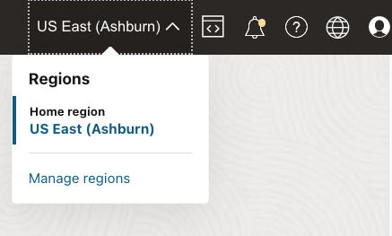

# Provision Oracle Autonomous Database

## Introduction

This lab walks you through the steps to get started using the Oracle Autonomous Database on Oracle Cloud. You will provision a new Oracle Autonomous Data Warehouse instance and connect to the database using Oracle SQL Developer Web.

> **Note:** While this lab uses Oracle Autonomous Data Warehouse, the steps are identical for creating and connecting to an Oracle Autonomous Transaction Processing database.

### Objectives

-   Learn how to provision a new autonomous database

### Video Preview

Watch a video demonstration of provisioning a new Oracle Autonomous Transaction Processing database: 

<iframe width="560" height="315" src="https://www.youtube.com/embed/Q6hxMaAPghI" frameborder="0" allow="accelerometer; autoplay; clipboard-write; encrypted-media; gyroscope; picture-in-picture" allowfullscreen></iframe>

> **Note:** Interfaces in this video may look different from the interfaces you will see. For updated information, please see steps below.

## Choose ADW or ATP from the Services Menu

1. Log in to Oracle Cloud.
2. Once you are logged in, you are taken to the cloud services dashboard where he can see all the services available to him. Click the navigation menu in the upper left corner to show top level navigation choices.

    > **Note:** You can also directly access your Oracle Autonomous Data Warehouse or Oracle Autonomous Transaction Processing service with a drag action in the __Quick Actions__ section of the dashboard.

3. The following steps apply similarly to either Oracle Autonomous Data Warehouse or Oracle Autonomous Transaction Processing. This lab shows provisioning of an Oracle Autonomous Data Warehouse database, so click **Autonomous Data Warehouse**.

4. Make sure your workload type is __Data Warehouse__ or __All__ to see your Oracle Autonomous Data Warehouse instances. Use the __List Scope__ drop-down list to select a compartment. 

     > **Note:** Avoid the use of the ManagedCompartmentforPaaS compartment as this is an Oracle default used for Oracle Platform Services.

5. This console shows that no databases yet exist. If there were a long list of databases, you could filter the list by the **State** of the databases (Available, Stopped, Terminated, and so on). You can also sort by __Workload Type__. Here, the __Data Warehouse__ workload type is selected.

6. If you are using a Free Trial account, and you want to use Always Free Resources, you need to be in a region where Always Free Resources are available. You can see your current default **region** in the top, right hand corner of the page.

    
    [Description of Region.png](./files/regionDescrption.txt)

## Create the Oracle Autonomous Database Instance

1. Click **Create Autonomous Database** to start the instance creation process.

2.  This brings up the __Create Autonomous Database__ screen where you will specify the configuration of the instance.
3. Provide basic information for the autonomous database:

    - __Choose a compartment__ - Select a compartment for the database from the drop-down list.
    - __Display Name__ - Enter a memorable name for the database for display purposes. For this lab, use __ADW Finance Mart__.
    - __Database Name__ - Use letters and numbers only, starting with a letter. Maximum length is 14 characters. (Underscores not initially supported.) For this lab, use __ADWFINANCE__.

4. Choose a workload type. Select the workload type for your database from the choices:

    - __Data Warehouse__ - For this lab, choose __Data Warehouse__ as the workload type.
    - __Transaction Processing__ - Alternatively, you could have chosen Transaction Processing as the workload type.

5. Choose a deployment type. Select the deployment type for your database from the choices:

    - __Serverless__ - For this lab, choose __Serverless__ as the deployment type.
    - __Dedicated Infrastructure__ - Alternatively, you could have chosen Dedicated Infrastructure as the deployment type.

6. Configure the database:

    - __Always Free__ - If your Cloud Account is an Always Free account, you can select this option to create an always free autonomous database. An always free database comes with 1 CPU and 20 GB of storage. For this lab, we recommend you leave Always Free unchecked.
    - __Choose database version__ - Select a database version from the available versions.
    - __OCPU count__ - Number of CPUs for your service. For this lab, specify __2 CPUs__. Or, if you choose an Always Free database, it comes with 1 CPU.
    - __Storage (TB)__ - Select your storage capacity in terabytes. For this lab, specify __1 TB__ of storage. Or, if you choose an Always Free database, it comes with 20 GB of storage.
    - __Auto Scaling__ - For this lab, keep auto scaling enabled, to allow the system to automatically use up to three times more CPU and IO resources to meet workload demand.
    - __New Database Preview__ - If a checkbox is available to preview a new database version, do NOT select it.

     > **Note:** You cannot scale up/down an Always Free autonomous database.

7. Create administrator credentials:

    - **Password and Confirm Password**: Specify the password for ADMIN user of the service instance. 
    
    The password must meet the following requirements:
    - The password must be between 12 and 30 characters long and must include at least one uppercase letter, one lowercase letter, and one numeric character.
    - The password cannot contain the username.
    - The password cannot contain the double quote (") character.
    - The password must be different from the last 4 passwords used.
    - The password must not be the same password that is set less than 24 hours ago.
    - Re-enter the password to confirm it. Make a note of this password.

8. Choose network access:
    - For this lab, accept the default, "Allow secure access from everywhere".
    - If you want a private endpoint to allow traffic only from the VCN you specify, where access to the database from all public IPs or VCNs is blocked, then select "Virtual cloud network" in the **Choose network access** area.
    - You can control and restrict access to your autonomous database by setting network access control lists (ACLs). You can select from 4 IP notation types: IP Address, CIDR Block, Virtual Cloud Network, Virtual Cloud Network OCID).

9. Choose a license type. For this lab, choose __License Included__. The two license types are:

    - __Bring Your Own License (BYOL)__ - Select this type when your organization has existing database licenses.
    - __License Included__ - Select this type when you want to subscribe to new database software licenses and the database cloud service.

10. Click __Create Autonomous Database__.

11.  Your instance will begin provisioning. In a few minutes, the state will turn from Provisioning to Available. At this point, your Oracle Autonomous Data Warehouse database is ready to use! Have a look at your instance's details here including its name, database version, OCPU count, and storage size.

## Related Links

Visit Oracle Help Center for documentation on the [typical workflow](https://docs.oracle.com/en/cloud/paas/autonomous-data-warehouse-cloud/user/autonomous-workflow.html#GUID-5780368D-6D40-475C-8DEB-DBA14BA675C3) for using Oracle Autonomous Data Warehouse.

## Acknowledgements

- **Author** - Nilay Panchal, ADB Product Management
- **Adapted for Cloud by** - Richard Green, Principal Developer, Database User Assistance
- **Contributors** - Oracle LiveLabs QA Team (Jeffrey Malcolm Jr, Intern and Arabella Yao, Product Manager Intern)

