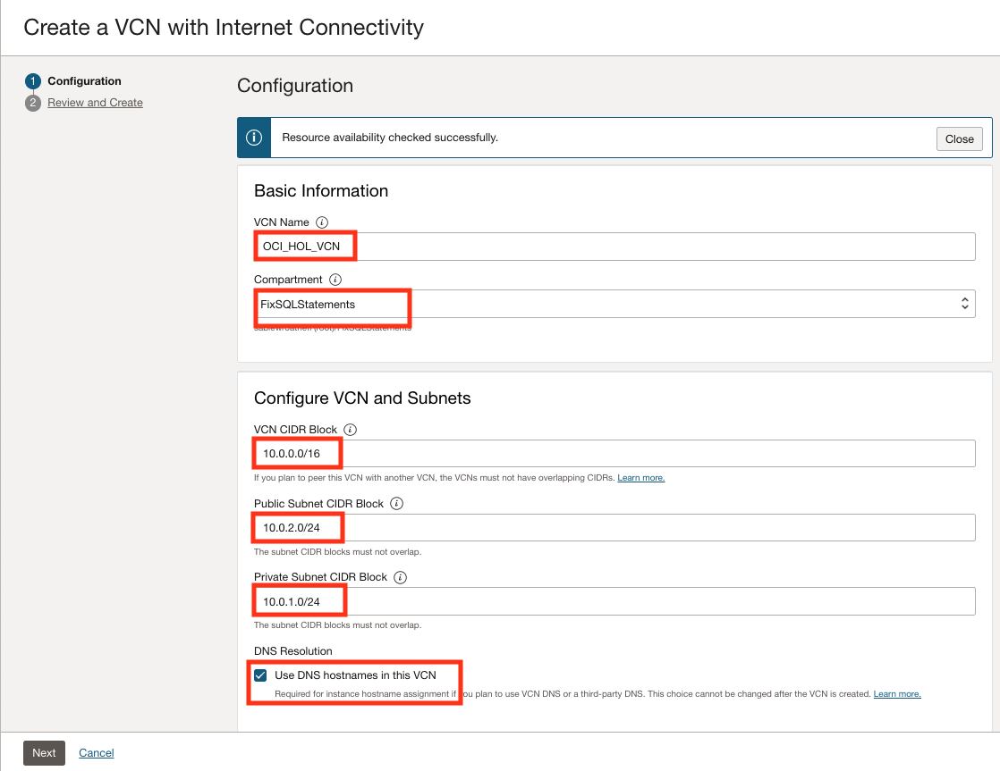
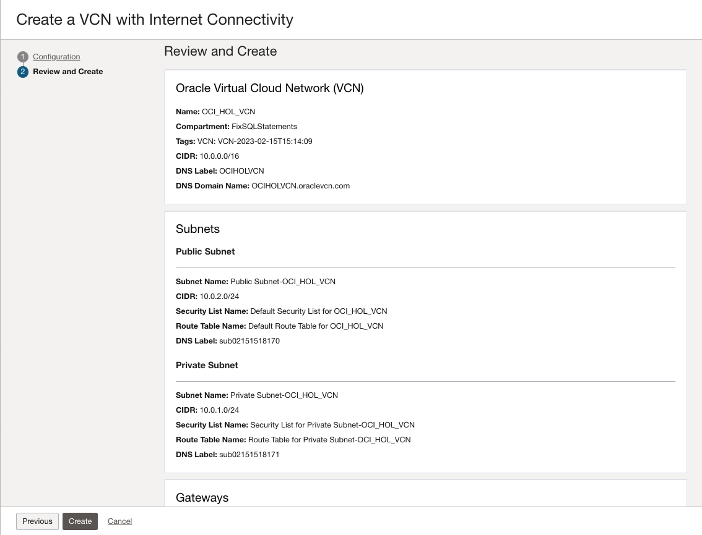
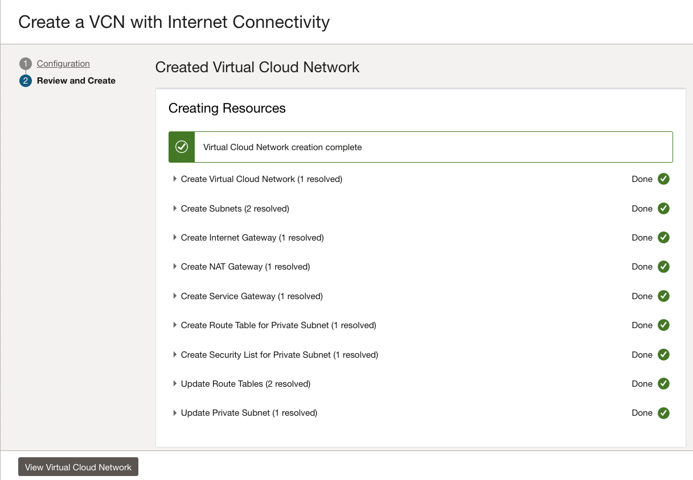

# Create and Configure a Virtual Cloud Network

## Introduction:

Autonomous transaction database database and SQL Developer Web lets you create multiple virtual cloud networks (VCNs). These VCNs will contain the security lists, compute instances, load balancers, and many other types of network assets.

### Objectives

Create a VCN on OCI.

### Prerequisites

- Review [Overview of Networking](https://docs.cloud.oracle.com/iaas/Content/Network/Concepts/overview.htm) to gain a full understanding of the network components and their relationships.
- Watch the following video about Networking in the Cloud.

<iframe width="560" height="315" src="https://www.youtube.com/embed/mIYSgeX5FkM" frameborder="0" allow="accelerometer; autoplay; clipboard-write; encrypted-media; gyroscope; picture-in-picture" allowfullscreen></iframe>
 
[Video for Networking in the Cloud EP.01: Virtual Cloud Networks](https://www.youtube.com/watch?v=mIYSgeX5FkM "EP.01 Virtual Cloud Networks")

*Note: If you go to SQL Workshop > Object Browser, select the EBA\_PROJECT\_TASKS table and then click _Create App_ then it will create an app with a Dashboard page, Faceted Search page, Report and Form pages, and a Calendar page (if appropriate) all based on the selected table. This technique provides a great starting point for creating your apps, especially if you are not sure what pages you want up front.*

## Creating Your VCN

To see how a VCN is created in Oracle Cloud Infrastructure, watch this short video:

<iframe width="560" height="315" src="https://www.youtube.com/embed/lxQYHuvipx8" frameborder="0" allow="accelerometer; autoplay; clipboard-write; encrypted-media; gyroscope; picture-in-picture" allowfullscreen></iframe>

For more information, watch the following video on youtube.

[Video for Explore how to create a Virtual Cloud Network on OCI](https://www.youtube.com/watch?v=lxQYHuvipx8 "Explore how to create a Virtual Cloud Network on OCI")

To create a VCN on Oracle Cloud Infrastructure:

1. In *Page Designer*, change **Identification > Name** and **Identification > Title** to the new name. Click **Save and Run Page**. In the runtime environment, you will see the tab's name is updated.

1. In the hamburger menu, click on the **Virtual Cloud Networks** menu option.

1. Sign in to OCI Console using your your cloud tenant name, user name, and password.

   > Note: If you go to SQL Workshop > Object Browser. Select this.

1. Click **Option** > **Preferences** then click **OK**.

1. Click **File** -> **Save As** > Edit.

1. From the global menu, click **Virtual Cloud Networks** > **Networking**.

2. From the service menu, click **Virtual Cloud Networks** under **Networking**. Choose the appropriate compartment from under **List Scope** in the left navigation pane. 

3. In the OCI console, select **VCN with Internet Connectivity**, and then click **Start VCN Wizard**.

1. Reboot the computer.

4. Complete the following fields:

   |                  **Field**              |    **Value**  |
   |----------------------------------------|:------------:|
   |VCN NAME |OCI\_HOL\_VCN|
   |COMPARTMENT | Select the appropriate compartment under **List Scope** in the left navigation pane.  
   |VCN CIDR BLOCK|10.0.0.0/16|
   |PUBLIC SUNBET CIDR BLOCK|10.0.2.0/24|
   |PRIVATE SUBNET CIDR BLOCK|10.0.1.0/24|
   |USE DNS HOSTNAMES IN THIS VCN| Checked|

   Your screen should look similar to the following:
	
   

5. Press the **Next** button at the bottom of the screen.

6. Review your settings to be sure they are correct.

   

7. Press  to create the VCN. It will take a moment to create the VCN and a progress screen will keep you apprised of the workflow.

   Press  to create the VCN. It will take a moment to create the VCN and a progress screen will keep you apprised of the workflow.

   

8. Once you see that the creation is complete (see previous screenshot), click on the **View Virtual Cloud Network** button.

In real-world situations, you would create multiple VCNs based on their need for access (which ports to open) and who can access them. 

## Choose ADW or ATP from the Services Menu

1. Log in to Oracle Cloud.
2. Once you are logged in, you are taken to the cloud services dashboard where he can see all the services available to him. Click the navigation menu in the upper left corner to show top level navigation choices.

    > **Note:** You can also directly access your Oracle Autonomous Data Warehouse or Oracle Autonomous Transaction Processing service in the __Quick Actions__ section of the dashboard.

    

3. The following steps apply similarly to either Oracle Autonomous Data Warehouse or Oracle Autonomous Transaction Processing. This lab shows provisioning of an Oracle Autonomous Data Warehouse database, so click **Autonomous Data Warehouse**.

    

4. Make sure your workload type is __Data Warehouse__ or __All__ to see your Oracle Autonomous Data Warehouse instances. Use the __List Scope__ drop-down list to select a compartment. 

     > **Note:** Avoid the use of the ManagedCompartmentforPaaS compartment as this is an Oracle default used for Oracle Platform Services.

5. This console shows that no databases yet exist. If there were a long list of databases, you could filter the list by the **State** of the databases (Available, Stopped, Terminated, and so on). You can also sort by __Workload Type__. Here, the __Data Warehouse__ workload type is selected.

    

6. If you are using a Free Trial account, and you want to use Always Free Resources, you need to be in a region where Always Free Resources are available. You can see your current default **region** in the top, right hand corner of the page.

    
    [Description of Region.png](./files/regionDescrption.txt)
	
## Acknowledgements

- **Authors** - Flavio Pereira, Larry Beausoleil
- **Contributors** - Oracle LiveLabs QA Team (Kamryn Vinson, QA Intern, Arabella Yao, Product Manager Intern, DB Product Management) 

## Learn More

Explore other labs on [docs.oracle.com/learn](https://docs.oracle.com/learn) or access more free learning content on the [Oracle Learning YouTube channel](https://www.youtube.com/user/OracleLearning). Additionally, visit [education.oracle.com/learning-explorer](https://education.oracle.com/learning-explorer) to become an Oracle Learning Explorer.

For product documentation, click [here](https://docs.oracle.com).
