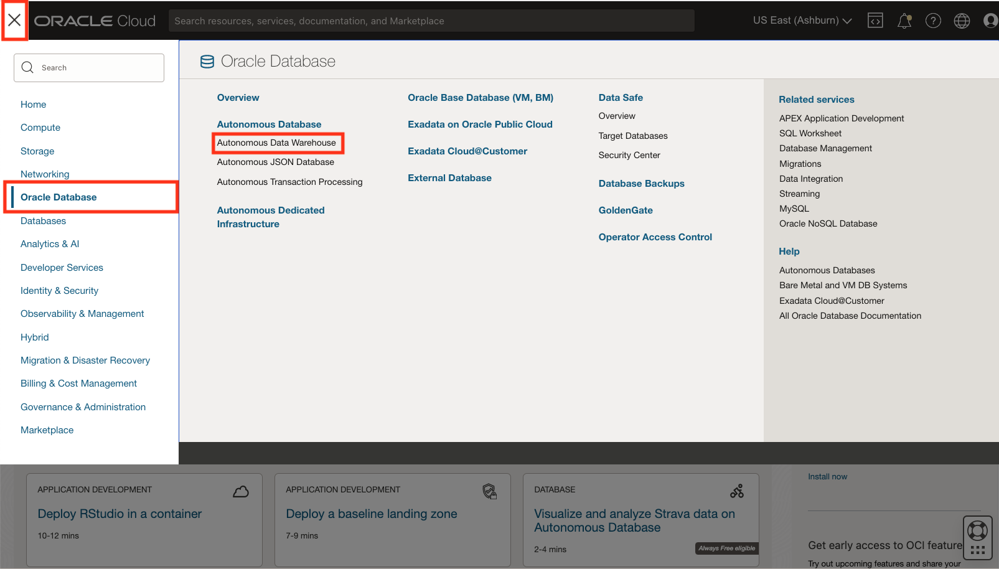
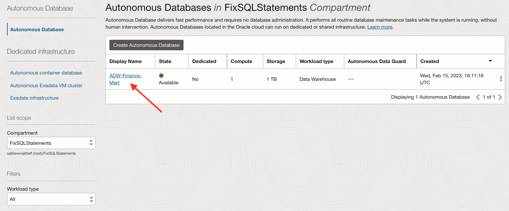

# Query data in external files

## Introduction

In this lab, you will query files on the Oracle Cloud Infrastructure (OCI) Object Storage directly without loading them to your database.

### Objectives

-   Learn how to create external tables on top of files residing on the object store
-   Learn how to query external data by the external tables

## Create External Tables: DBMS_CLOUD

1.  If you are not logged in to OCI console, login and select **Autonomous Data Warehouse** from the navigation menu in the upper left corner and navigate into your Oracle Autonomous Data Warehouse Finance Mart instance.

    

    

2.  To login to Oracle SQL Developer Web, in your ADW Finance Mart Database Details page, click the **Tools** tab and then click on **Open SQL Developer Web**. Enter **Username - ADMIN** and with the ADMIN **Password** you specified when creating the database and click **Sign in**.

    

    

3. Download this [code snippet](/files/create_external_tables_without_base_url.txt) to a text editor.

4. Replace `<file_uri_base>` in the code with the base URL you copied in the Load Data into an Oracle Autonomous Database Instance lab (in Object Store URL). You should make 9 substitutions.

    This code uses the **create\_external\_table** procedure of the **DBMS\_CLOUD** package to create external tables on the files staged in your object store. Note that you are still using the same credential and URLs of files on OCI Object Storage you used when loading data in the Load Data into an Autonomous Database Instance lab.

    For each `<file_uri_list>` statement:

    - Change `us-phoenix-1` to your real region name. The name is case-sensitive.
    - Change `idthydc0kinr` to your real namespace. The name is case-sensitive.
    - Change `ADWCLab` to your real bucket name. The name is case-sensitive.

    

5.  Run the script. In the Substitutions Variables dialog, paste the base URL you copied in the Load Data into an Oracle Autonomous Database Instance lab (in Object Store URL) and click **OK**.

  

  

Now you have **external tables** for the sample data pointing to files in the object store. Any query against the external tables will return the same result as against the original tables, e.g., as a businessman he could point the files to the object store.

   

## Query Internal, External, and Common Data

1.  Copy and paste this [code snippet](./files/query_external_data.txt) to an Oracle SQL Developer Web Worksheet. Compared to the query in the previous lab, we only replaced the original table names **table\_name** with **table\_name\_ext** in the sample query.

2.  Run the script to add the items to the blacklist. You will now see the same query result as in the previous lab, but from data pulled directly from the Object Store.

    

## (Optional: Hands-On Lab Only) Oracle's Guidelines for Querying *External* Data

This section is created to test dynamic generation of TOC.

## Acknowledgements

- **Author** - Nilay Panchal, ADB Product Management
- **Adapted for Cloud by** - Richard Green, Principal Developer, Database User Assistance

