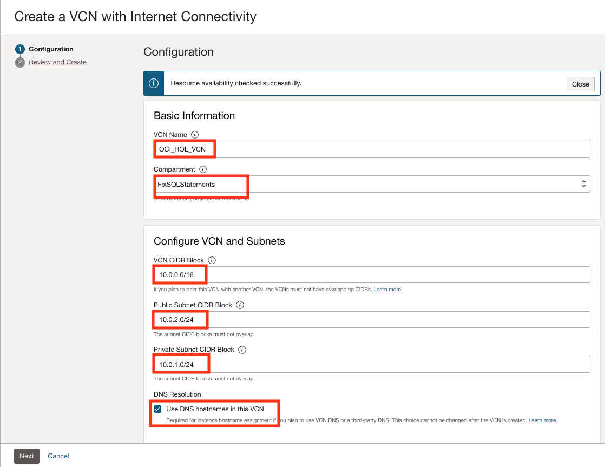
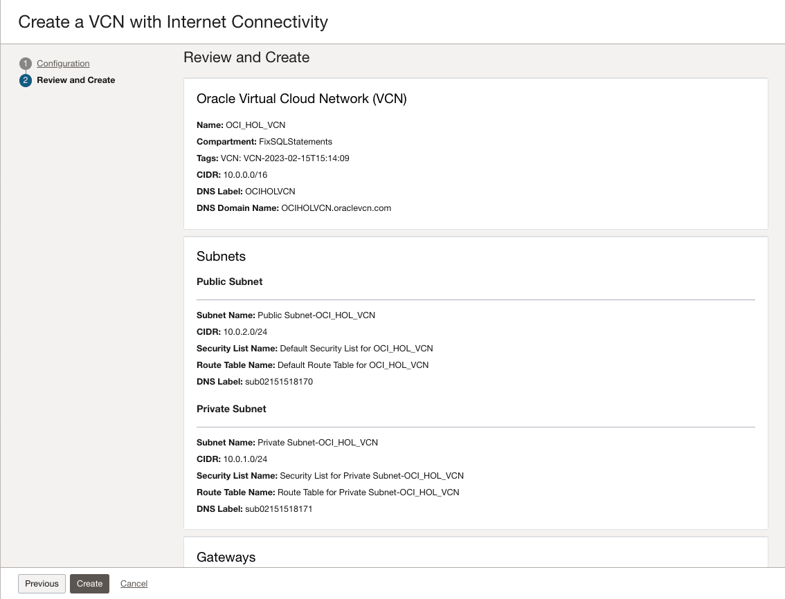

# Create and Configure a Virtual Cloud Network

## Introduction

Autonomous transaction database and SQL Developer Web lets you create multiple virtual cloud networks (VCNs). These VCNs will contain the security lists, compute instances, load balancers, and many other types of network assets.

### Objectives

Create a VCN on OCI.

### Prerequisites

- Review [Overview of Networking](https://docs.cloud.oracle.com/iaas/Content/Network/Concepts/overview.htm) to gain a full understanding of the network components and their relationships.
- Watch the following video about Networking in the Cloud.

<iframe width="560" height="315" src="https://www.youtube.com/embed/mIYSgeX5FkM" frameborder="0" allow="accelerometer; autoplay; clipboard-write; encrypted-media; gyroscope; picture-in-picture" allowfullscreen></iframe>
 
[Video for Networking in the Cloud EP.01: Virtual Cloud Networks](https://www.youtube.com/watch?v=mIYSgeX5FkM "EP.01 Virtual Cloud Networks")

## Creating Your VCN

To see how a VCN is created in Oracle Cloud Infrastructure, watch this short video:

<iframe width="560" height="315" src="https://www.youtube.com/embed/lxQYHuvipx8" frameborder="0" allow="accelerometer; autoplay; clipboard-write; encrypted-media; gyroscope; picture-in-picture" allowfullscreen></iframe>

For more information, watch the following video on youtube.

[Video for Explore how to create a Virtual Cloud Network on OCI](https://www.youtube.com/watch?v=lxQYHuvipx8 "Explore how to create a Virtual Cloud Network on OCI")

To create a VCN on Oracle Cloud Infrastructure:

1. In the navigation menu, click on **Virtual Cloud Networks**.

1. Click **File** > **Save As**.

1. Click **File** -> **Save As** > Edit.

1. From the OCI services menu, click **Virtual Cloud Networks** > **Networking**. Click OK.

1. Sign in to OCI Console using your cloud tenant name, user name, and password.

2. From the OCI services menu, click **Virtual Cloud Networks** > **Networking**. Choose the appropriate compartment from under **List Scope** in the left navigation pane. 

3. Select **VCN with Internet Connectivity**, and then click **Start VCN Wizard**.

1. This is a substep.

4. Complete the following fields:

   |                  **Field**              |    **Value**  |
   |----------------------------------------|:------------:|
   |VCN NAME |OCI\_HOL\_VCN|
   |COMPARTMENT | Select the appropriate compartment under **List Scope** in the left navigation pane.  
   |VCN CIDR BLOCK|10.0.0.0/16|
   |PUBLIC SUNBET CIDR BLOCK|10.0.2.0/24|
   |PRIVATE SUBNET CIDR BLOCK|10.0.1.0/24
   |USE DNS HOSTNAMES IN THIS VCN| Checked|

   Your screen should look similar to the following:
	
   

5. Press the **Next** button at the bottom of the screen.

6. Review your settings to be sure they are correct.

   

7. Press the **Create** button to create the VCN. It will take a moment to create the VCN and a progress screen will keep you apprised of the workflow.

   

8. Once you see that the creation is complete (see previous screenshot), click on the **View Virtual Cloud Network** button.

In real-world situations, you would create multiple VCNs based on their need for access (which ports to open) and who can access them. 

## Acknowledgements

- **Authors** - Flavio Pereira, Larry Beausoleil
- **Contributors** - Oracle LiveLabs QA Team (Kamryn Vinson, QA Intern, Arabella Yao, Product Manager Intern, DB Product Management) 

## Learn More

Explore other labs on [docs.oracle.com/learn](https://docs.oracle.com/learn) or access more free learning content on the [Oracle Learning YouTube channel](https://www.youtube.com/user/OracleLearning). Additionally, visit [education.oracle.com/learning-explorer](https://education.oracle.com/learning-explorer) to become an Oracle Learning Explorer.

For product documentation, click [here](https://docs.oracle.com).
