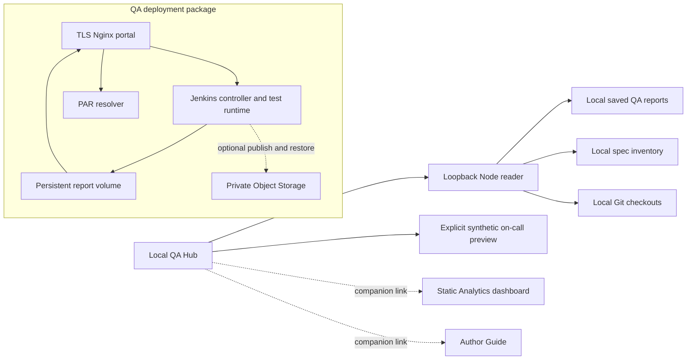
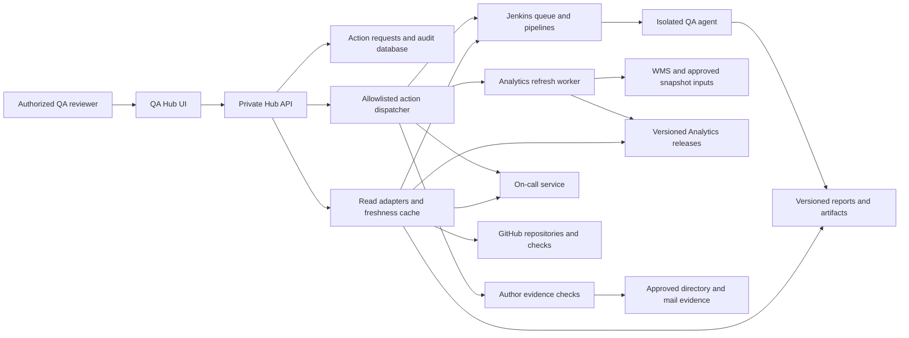

# QA Hub architecture and component actions review

Reviewed 5 October 2026. This is a source-backed architecture assessment and implementation proposal. The current Hub remains a local, read-only preview. This review does not enable execution, change deployed configuration, or refresh source data.

## Recommendation

Put platform tests, LiveLabs content checks, and PAR checks under **QA Automation**, with four prominent tabs: **Platform**, **Content**, **PAR Links**, and **Run History**. Give every tab a stable URL, its own table/filter state, and a scoped Run action. Retain direct links to PAR findings from Overview and reports.

Keep **Analytics** separate, with **Portfolio**, **Authors**, and **Snapshots** tabs. Its actions update datasets and review ownership evidence. Keep **CI & Services** separate for Jenkins jobs, queues, schedules, agents, VM/service health, and report publication. Automation Run History owns the test-result view; CI & Services links to that same result instead of maintaining a second interpretation.

Recommended menu: **Overview → On-Call → QA Automation → Analytics → Repositories → CI & Services**. Keep Settings at the bottom and the Author Guide as a contextual help link. This is the next navigation proposal; the local app still has the previously delivered menu.

## Evidence and live access

| Area | Evidence in this review | Limit |
| --- | --- | --- |
| Supplied Jenkins and regression report URLs | Both browser requests returned `ERR_CERT_AUTHORITY_INVALID` | No authenticated page, build history, or supplied September 18 report content was read |
| OCI VM inventory | Read-only compartment requests using both existing configured profiles returned `NotAuthenticated` | VM identity, shape, actual ports, volumes, containers, backups, and topology remain unverified |
| QA deployment | Current Compose, JCasC, Job DSL, Jenkinsfile, Nginx, image and report scripts | Establishes packaged behavior, not deployed state |
| QA framework | 28 Playwright spec files and 30 distinct declared tags, runner, page objects, reporter and Workshop QA utility | Static inventory, not collected/expanded or executed test counts |
| Reports | Current renderer and local saved-report adapters | Local September 24 evidence is separate from the supplied September 18 report |
| Analytics | Current static release config, scripts and inventory metadata: 2,293 rows; WMS/views/tags dated September 28 | GitHub evidence is dated August 15; workshop update evidence August 14; deployed release not verified |
| On-call | October 2 activation document, runtime contracts, current `enabled:false` intake configuration and separate responder package | Live intake and unattended operation not established |

Credentials and private deployment addresses are excluded from this repository document. Browser certificate warnings require user handling or a trusted endpoint. The OCI errors do not establish why authentication failed. No credential changes, jobs, cloud resources, messages, WMS writes, or data refreshes were performed.

## Current connections

There is no current connection from the local Hub to Jenkins. `app/scripts/serve.mjs` allows GET/HEAD only and serves three fixed `/api/local/*` readers. Demo browser login is presentation state, not server authorization. The proposed action service must be a production backend; changing the local Run button alone cannot connect the system.

The checked-in deployment contains three services on one Compose bridge: Jenkins, PAR resolver, and the report portal. The portal exposes one configured TLS binding and routes `/jenkins/`, `/regression/`, and `/api/par-link/resolve`; `/par/` redirects to regression. Jenkins writes the shared report volume; the portal mounts it read-only. There is no second report VM or separate Jenkins agent defined here. A shared URL does not establish how many VMs are deployed.

## Findings that affect integration

| Priority | Finding and source | Consequence and proposed change |
| --- | --- | --- |
| P0 | Live TLS and OCI authentication checks are blocked | Resolve the trusted endpoint and existing OCI access; read back actual job/configuration and VM identities before declaring live connectivity |
| P0 | `deploy/vm/README.md` describes SSO/group roles, while `casc.yaml` configures local users and `loggedInUsersCanDoAnything`; Nginx uses Basic authentication | Reconcile documentation and deployment. Enforce named Viewer/Operator/Admin permissions before exposing Hub actions; use a service identity with only the required Jenkins permissions |
| P1 | `Jenkinsfile` runs `tests/platform/generated` plus `tests/platform/par/catalogParLinks.spec.ts` for all three profiles | The job named overall regression is a catalog/PAR scan, not all 28 spec files. Add explicit platform, content, PAR, selected-scope, and full-suite profiles |
| P1 | Runner supports paths/tags; Jenkins has no corresponding scope parameters | Add a validated, versioned selection contract and server-owned profile mapping; do not expose arbitrary CLI text |
| P1 | Multiple runner `--tag` values use AND lookaheads, with substring matching | UI must distinguish All tags from Any tag. Exact tag matching needs implementation; `@catalog` can currently also match `@catalog-index` |
| P1 | Engine uses `disableConcurrentBuilds(abortPrevious: true)` | A second engine request can abort an unrelated run. Queue requests by default; cancellation must be an explicit authorized action |
| P1 | JCasC enables two controller executors; image bundles Node/Playwright; pipeline uses `agent any` | Move browser execution to an isolated agent with its own workspace and resource limits before wider use; then disable controller executors |
| P1 | Playwright config defines Chromium, Firefox and WebKit; current image installs Chromium only | Advertise browser availability from the deployed agent capability registry; do not offer unusable browsers |
| P1 | Legacy PAR retest page links to `livelabs-par-audit`; Job DSL deletes that job | Replace legacy retest routing with the shared request API and preserve selection/source-run provenance |
| P1 | Report retest selections are browser localStorage; fix action creates a local prompt package | Neither is a durable shared execution queue. Store review selections privately by run/reviewer; expose retest as a job and fix as a reviewable handoff |
| P1 | Report publisher reads `latest/summary.json` from an `always` post block | If a build fails before writing a summary, publication may target an older run. Publish by the current attempt/run manifest and record publication status separately |
| P1 | Analytics refresh assumes specific filenames and contains September 28/August source-date literals | Turn it into a repeatable worker with a manifest of input versions/dates. A new run timestamp must not imply all data was refreshed |
| P1 | Analytics contact coverage checks for an owner email or group only | Add a separate author verification dataset. Contact presence, directory account state, mailbox evidence, and confirmed affiliation must remain distinct |
| P2 | Portal startup depends on healthy Jenkins/resolver; `/healthz` only returns static `ok` | Decouple report-read availability from execution and expose service-specific readiness/freshness; measure outside-in TLS separately |
| P2 | Engine build retention is 30; report volume retention is separate and not bounded here; Object Storage copy uses overwrite | Define report retention, disk thresholds, backup/restore and immutable object policy separately from Jenkins build retention |

Jenkins recommends running builds off the built-in node; isolated agents can also be separate OS processes on the same host if they cannot access Jenkins home. [Jenkins controller isolation](https://www.jenkins.io/doc/book/security/controller-isolation/).

## Automation coverage and trigger design

### What exists

| Source directory or tool | Scope | Proposed location and actions |
| --- | --- | --- |
| `tests/platform/smoke` — 8 specs | Homepage, accessibility, responsive layout, search, catalog, content shell and event code | Platform: Run smoke, Run feature, Run selected specs |
| `tests/platform/regression` — 9 specs | Filters, catalog/search navigation, launch options, overview, instructions and LiveStack resources | Platform: Run platform regression, Run directory/specs, Run selected tags |
| `tests/platform/auth` — 3 specs | Authenticated home, private page, reservations page loading | Platform: Run authenticated checks when the deployed environment supplies the required session/targets |
| `tests/platform/generated` — 6 specs | Catalog index and per-item workshop/LiveStack overview, resources, preview/tenancy instructions | Content: Scan full catalog, Scan IDs, Check selected content features |
| `tests/platform/par/catalogParLinks.spec.ts` — 1 spec | Per-item PAR discovery/probing and source evidence | PAR Links: Check catalog, Check IDs, Retest affected items |
| `tests/platform/par/parAuditCore.spec.ts` — 1 spec | PAR implementation/unit assertions | Platform/framework maintenance preset; label distinctly from live PAR coverage |
| `QA_GUI/scripts/published-workshop-qa.mjs` | Published workshop `?qa=true` checker, selected labs or all labs, JSON/Markdown output | Content: Check published workshop; job adapter reuses the CLI |
| Shared `common/.github/workflows` | Markdown lint, image size and manual content validation | Content and Repositories: source evidence and scoped validation requests after workflow integration |

The [capability inventory](automation-capability-inventory.json) lists every spec path, declared tag, and source digest. Spec counts are not test totals: generated specs expand using catalog input and browsers. The `@smoke` tag appears in 11 specs because the three auth specs also use it; choosing the smoke directory yields 8 files. The 30 tags are overlapping filters, not 30 independent suites.

The framework uses TypeScript `.spec.ts` files. Its runner explicitly rejects old `.feature` files. A UI feature selector should group current specs by area; it should not offer obsolete feature files.

Current CLI selection supports multiple paths, repeated/comma-separated tags, title keyword, raw marker regex, browser, workers/retries, environment, and collect-only mode. Multiple tags mean **all selected tags**. Playwright itself can express both OR and AND through grep; the Hub should compile validated tag selections into exact matching internally. [Playwright tags and filtering](https://playwright.dev/docs/test-annotations).

Content checks inspect published/rendered instructions and resources. The reviewed tenancy test opens instructions, and the reservation smoke test checks page loading. These do not prove a learner provisioned infrastructure or completed a lab. Future provision/run/teardown checks need a separate capability with resource limits and cleanup evidence.

### Recommended run controls

Use a compact toolbar with **Run smoke**, **Run regression**, and **Custom run** on Platform. Content and PAR get equivalent task-specific actions. A custom-run drawer contains:

1. Approved environment and execution preset.
2. Directory/feature/spec selection from the capability catalog.
3. Tags with explicit **All / Any** matching and optional exclusions; presets store structured selectors.
4. Catalog IDs or approved workshop URL/lab IDs when applicable.
5. Supported browsers; bounded workers, retries and timeout under Advanced.
6. A scope preview showing source commit, selected files/tests, catalog version, prerequisites, and coverage limits.

Use separate names for **Platform regression**, **Catalog and PAR regression** (current Jenkins behavior), and **Full QA suite** (new combined scope). Full QA suite must be explicitly defined as the approved union and must not silently skip unavailable auth checks or imply content checks provision infrastructure.

For generated scope, reuse a named catalog snapshot or perform an explicit catalog-refresh stage. If its contents change, recompute the planned scope. Do not automatically crawl the live catalog merely because the user opens a selector. Exact collected test IDs should be indexed in CI per source commit/catalog version and selected server-side; stale selections require reconciliation. This review did not collect or execute tests.

The current PAR CLI can run alone through `npm run test:par`, but the Jenkins profiles always combine PAR with generated checks. Implement a PAR-only profile using that same runner and report schema. Keep a single schedule owner to avoid double scanning when full catalog runs already include PAR.

## Target service architecture

The Hub UI and API should share a trusted authenticated origin. Reuse the private portal as the entry point, with a separate API process and service permissions. Keep original report HTML behind protected deep links; its existing framing policy rejects iframes. Evaluate a separate report origin for active HTML artifacts so report scripts do not gain the Hub session's origin privileges. JSON projections power Hub tables.

A logical service does not require a new VM. First inventory the actual machines. A practical target has a stable control/report service, isolated QA execution agents, and independently managed data/on-call workers. If initially colocated, separate accounts, filesystems, credentials, CPU/memory budgets and lifecycle. Large catalog scans must not interrupt report reading or on-call intake.

Use Jenkins for QA build/scan scheduling. Analytics refresh can use a dedicated Jenkins job on its own agent or a durable worker behind the same request contract; choose one scheduler. On-call retains its own service/cadence and is not dependent on a QA build. The separate author responder remains a separately scoped, currently undeployed component.

## Page to action and result mapping

All endpoints below are **proposed**, except the explicitly identified existing local/utility routes. No listed POST endpoint is enabled in the Hub today.

| Page | Data shown | User actions | Owner and result |
| --- | --- | --- | --- |
| Overview | Cross-component findings, freshness, active requests | Refresh overview; open or launch a contextual action | Reuses each component's request/result; no duplicate scheduler |
| On-Call | Cases, drafts, important issues, collection coverage, run/delivery history | Collect now within configured scope; retry failed source; review current draft | On-call worker and revision-bound private case store; source replies/publication remain separate actions |
| QA Automation / Platform | Feature/spec/tag inventory, recent checks, failures and duration | Smoke, platform regression, auth checks, custom directory/spec/tag selection, cancel, retest | Jenkins → QA agent → immutable report |
| QA Automation / Content | Catalog/workshop evidence, validation findings, source links | Full/targeted catalog, published workshop/lab check, scoped repo content validation | QA/Workshop QA workers; report records which checker ran |
| QA Automation / PAR Links | Broken/unverified links, unscanned sources, affected items, retest selection | PAR-only full/targeted scan, retest selected affected items, protected link resolution | Existing PAR engine/resolver, shared run identity |
| QA Automation / Run History | All QA executions with execution and quality states, scope, commit and artifacts | Open/compare report, rerun saved scope, cancel active request | Shared run store, linked Jenkins job/build |
| Analytics / Portfolio | Inventory, usage/governance queues and per-source freshness | Open full Analytics, compare snapshots, request selected evidence refresh | Analytics read model and immutable release metadata |
| Analytics / Authors | WMS contacts, matching status, directory evidence, mailbox evidence, affected content | Check selected/all allowed authors; retry unknowns; review conflicts/ownership proposals | Author evidence worker and private review store; no automatic affiliation or WMS update from email alone |
| Analytics / Snapshots | Inputs, dates, validation results, staging/current release and refresh history | Acquire/import approved sources, build candidate, compare, validate; separately promote an approved candidate | Analytics worker; atomic release pointer and rollback reference |
| Repositories | Repo/path mappings, PR/checks, workflow coverage, commit/source freshness | Refresh metadata; validate selected repo/workshop; open source/PR | GitHub reader and explicitly registered validation job; no implicit push/merge |
| CI & Services | Jenkins jobs/queue/schedules, agents, report publishing, VM/service readiness | Run registered job, cancel permitted request, refresh health, open Jenkins | Jenkins API/health readers; VM restart/deploy actions require their own designed capability |
| Settings | Connection state, identities, capability readiness, retention/audit | Inspect connection checks and configuration | Private configuration registry; secrets never stored in the client |

Author Guide and workshop-authoring tools belong in contextual help/actions. Their published documentation is not an executable service. Add a launch capability only when a concrete CLI/API, inputs, result, owner and permission model exist.

### API and request lifecycle

- `GET /api/capabilities` returns supported actions, selector catalogs, deployed version and readiness reason; capabilities are server-derived.
- `GET /api/qa/catalog`, `/api/qa/runs`, `/api/qa/runs/:id`, `/api/qa/runs/:id/par` serve normalized QA evidence.
- `GET /api/ci/jobs`, `/api/ci/queue`, `/api/services` serve execution/service status.
- `GET /api/analytics/snapshots`, `/api/analytics/portfolio`, `/api/authors/checks` serve minimized data with source dates.
- Existing on-call contract remains `/api/on-call/review`, with additional private history endpoints.
- `POST /api/action-requests` accepts a capability ID, structured scope, environment ID, expected source/catalog version and idempotency key. Earlier `/api/qa/run-requests` can remain a compatibility alias to this shared service.
- `GET /api/action-requests/:id` and `/events` expose progress. `POST /api/action-requests/:id/cancel` targets that request only. An unknown submission outcome must be reconciled before retry.

The service validates scope and role, records the request, dispatches once, and correlates request → Jenkins queue → build/attempt → report or snapshot. Use argument arrays or structured job parameters. Browser input must not choose executable commands, unrestricted paths, raw regex, credential IDs, arbitrary URLs or Git refs. Server-controlled URL/origin allowlists apply to workshop/WMS/identity inputs.

Store `requestId`, actor, capability/version, scope, source commit, catalog/input versions, environment, timestamps, queue/build/attempt IDs, execution state, findings outcome, coverage, artifact manifest, and publication state. Failed execution, completed with findings, missing data, and failed publication are distinct. Stream only redacted logs. Persist requests and cancellation receipts across restarts.

Jenkins provides read APIs and parameterized build submission; its documentation prefers API-token authentication for scripted use. Credentials stay in the server connector. [Jenkins remote access API](https://www.jenkins.io/doc/book/using/remote-access-api/).

## Analytics and author evidence

### Snapshot workflow

The current Analytics is a static dashboard reading a canonical JSON payload, with a local file fallback and a release manifest. Older ADB/APEX/VM plans are historical alternatives, not proof of a current live backend. Integrate the actual static release first.

Proposed refresh: **acquire/import sources → stage immutable inputs → normalize by identity → recompute views → check completeness/diffs → build candidate → review → promote**. Store timestamps and hashes separately for WMS, views, tags, GitHub and author evidence. Keep the prior release on failure. The existing release builder's manifest/staging approach is a useful base; the refresh scripts need configurable input mappings and source metadata.

Join by `livelabs_id` where present, preserve `wms_id` family relationships and draft/unpublished identity, and retain repository/path mappings with confidence. Do not merge content solely by title. Quarantine duplicate/ambiguous metrics and unavailable author lookups. Add an authoritative crosswalk between framework catalog item IDs and WMS/Analytics IDs rather than assuming they are identical.

The local inventory has 1,990 rows with individual contact evidence, 285 with group fallback and 18 missing contact evidence. These are content rows, not unique authors or current employees. Report these totals only as the September 28 snapshot.

### Author checks

No verified employee-status automation was found in the reviewed current sources. Build a scoped worker that:

1. Reads current WMS owner/contact assignments and deduplicates exact approved identities.
2. Looks up identity/affiliation evidence in an approved authoritative source under an authorized reader.
3. Reads permitted mailbox/delivery evidence when available, without sending probe messages or altering mailbox state.
4. Keeps **WMS assignment**, **directory account state**, **mailbox evidence**, and **affiliation verification** as separate fields, with source/timestamp and complete/partial/unavailable states.
5. Produces a review queue for unresolved identity, disabled account, contradictory/stale evidence, missing owner, or confirmed departure affecting content.

An Oracle email address, an inactive WMS account, a failed lookup or a bounced email alone does not establish departure. Display **Unknown / Needs review** when the authoritative evidence is absent. Only a suitable authoritative employment/affiliation source or authorized human confirmation can support **Confirmed no longer at Oracle**. Do not automatically reassign ownership, retire content, or change access based on this queue.

Suggested author table: author/reference, WMS assignments, directory result, mail evidence, affiliation state, affected items, checked at, evidence age, next action. Mask/minimize personal details according to the reviewer audience; keep this dataset out of public static assets.

## Deployment review still required

Once trusted access is available, capture a read-only inventory of:

- VM identity/owner, tenancy/compartment/region, shape/architecture, OS and disk usage; confirm whether Jenkins and reports share a host.
- Running container/service versions and image digests; deployed source commit; actual portal bindings and network exposure.
- TLS hostname/SAN/issuer/expiry, current login mechanisms, role enforcement and Jenkins service identity.
- Jenkins jobs and actual parameter definitions, schedules/timezone, queue, agents/executors, last builds and retention.
- Exact run/attempt-to-build correlation for the supplied historical report and a recent run; schema, counts, artifact links and protected resolver behavior.
- Report mounts/permissions, backup and restore history, Object Storage policy, publication failures and disk thresholds.
- Analytics current release/input dates and actual refresh owner; on-call live readiness and unattended execution receipts.

Reading configuration must exclude secret values. Login credentials supplied for Jenkins/reports do not provide SSH or OCI authorization by themselves. The failed OCI inventory calls returned no VM inventory.

## Implementation sequence and acceptance

| Stage | Work | Completion evidence |
| --- | --- | --- |
| 1 | Restore trusted read access; record deployed jobs and VM/service topology | Authenticated reads, documented source versions, one build/report correlation |
| 2 | Add capability registry, run/report manifest, private read adapters and shared action ledger | UI displays actual supported scope, freshness and immutable evidence; missing services stay unavailable |
| 3 | Add QA tab navigation and exact directory/spec/tag selection; extend Jenkins profiles and isolate agent | Selected scope, collected catalog and executed scope agree; queued requests do not cancel unrelated work |
| 4 | Connect QA submission/progress/cancel/retest and full artifact navigation | One requested run yields one job and a correlated report; replay/timeout does not duplicate it |
| 5 | Add Analytics candidate-refresh and author-evidence workers | Dated source inputs, stable identities, reviewable diff, unknown identity handling, prior release preserved |
| 6 | Connect private on-call and repository actions independently as ready | Current cases/source completeness and repo checks reconcile to their sources; no duplicated scheduler |
| 7 | Exercise roles, recovery, retention, cancellation and deployment behavior | Read/write isolation, restart recovery, rollback and unattended evidence recorded |

Stages 3 UI/catalog work, 5 adapter preparation and 6 on-call preparation can proceed independently of the live Jenkins blocker. Live action rollout depends on the appropriate service readiness. The listed verification is proposed acceptance work, not tests executed during this review.

For the page structure, retain one horizontal tab row, one scoped action toolbar, a concise metric strip and a review table. Show counts/status in tab labels only when meaningful; keep technical configuration in a drawer. Preserve deep links from the current `par-links`, `automation` and `jenkins` routes when migrating.

## Source references

- QA execution: [runner](../../qa-automation/scripts/qa.mjs), [Playwright config](../../qa-automation/playwright.config.ts), [Jenkinsfile](../../qa-automation/Jenkinsfile), [jobs](../../qa-automation/deploy/vm/jenkins/jobs.groovy).
- Deployment: [Compose](../../qa-automation/deploy/vm/compose.yaml), [JCasC](../../qa-automation/deploy/vm/jenkins/casc.yaml), [portal](../../qa-automation/deploy/vm/portal/nginx.conf), [image](../../qa-automation/deploy/vm/jenkins/Containerfile), [publisher](../../qa-automation/deploy/vm/scripts/publish-reports.sh).
- Reporting: [root reporter](../../qa-automation/scripts/reporters/root-summary-reporter.mjs), [PAR renderer](../../qa-automation/scripts/reporters/par-link-report.mjs), [review actions](../../qa-automation/scripts/report-review-action.mjs), [Workshop QA](../../qa-automation/QA_GUI/README.md).
- Analytics: [snapshot refresh](../../livelabs-analytics/dev/scripts/refresh-snapshot-data.py), [release builder](../../livelabs-analytics/dev/scripts/build-static-release.mjs), [release metadata](../../livelabs-analytics/dev/config/release-manifest.json).
- Hub: [local server](../app/scripts/serve.mjs), [source readers](../app/scripts/local-data.mjs), [on-call contract](on-call-review-slice.md), [prior source review](source-review-2026-10-05.md).
- Private workspace evidence reviewed: periodic-health-check `ON-CALL-ACTIVATION.md` and `config/on-call.json`; authors-help runtime and author-responder `README.md`; August Analytics migration plan (historical only).

GitHub adapters must follow API pagination rather than treating one response as a complete inventory. [GitHub pagination](https://docs.github.com/en/rest/using-the-rest-api/using-pagination-in-the-rest-api).
