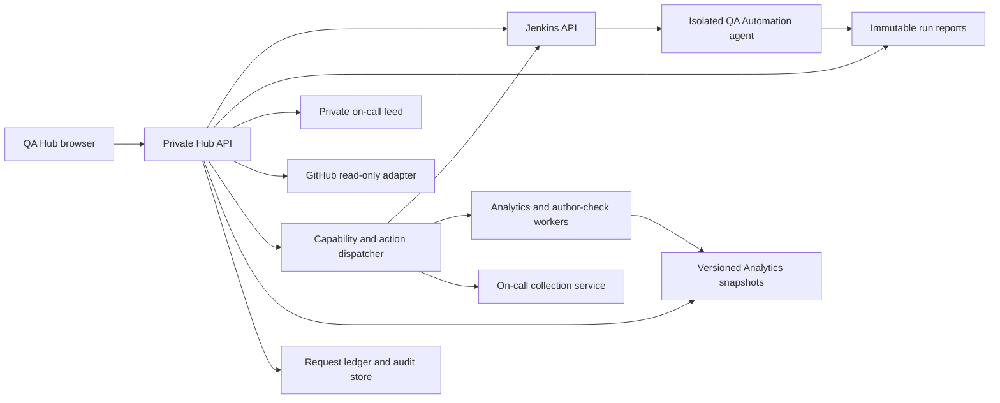

# Connected QA Hub implementation plan

Prepared 5 October 2026. Updated after the architecture and component-action review. Status: interface rework and local read-only integration implemented; expanded navigation and private service actions planned.

## Outcome and decisions

Make QA Hub the review and control surface for LiveLabs QA: inspect a run, identify the affected workshop or repository, review on-call issues, and request an approved test profile. Jenkins continues scheduling and executing jobs; QA Automation continues producing evidence. The Hub reads those sources through an authenticated service.

The current delivery removes the QA Operations launcher and replaces the seeded operational dashboards with source-backed local views. TMS and the Knowledge Base remain outside the Hub. The next increment adds an Analytics workspace for snapshot and author review, and consolidates platform, content and PAR checks under QA Automation. The Author Guide remains contextual help. Each component retains ownership of its data and execution.

The code and evidence reviewed are recorded in [Source review](source-review-2026-10-05.md) and the expanded [Architecture and component actions review](architecture-and-actions-review-2026-10-05.md). The latter includes the trigger matrix, target service architecture, Analytics/author workflow and [28-spec capability inventory](automation-capability-inventory.json). This plan supersedes the earlier TMS-centered consolidation and the old V3 navigation plan.

Live review status: the supplied Jenkins and report pages both failed browser certificate trust (`ERR_CERT_AUTHORITY_INVALID`); read-only OCI inventory requests using both existing configured profiles returned `NotAuthenticated`. No authenticated page, deployed job configuration or VM inventory was obtained. Private addresses and credentials are kept out of these repository documents.

## Navigation and page contracts

The proposed menu follows the work sequence: assess risk, review support, run/review QA, inspect portfolio and authors, investigate source repositories, then inspect execution infrastructure. Settings sits at the bottom. This table is the target design; the current local menu still has Jenkins Reports and PAR Links as separate pages.

| Order | Page | Primary review task | Current implementation | Live increment |
| --- | --- | --- | --- | --- |
| 1 | Overview | Find results that need attention | Latest saved run counts, findings table, source connections | Cross-source priority queue with owner, age and next action |
| 2 | On-Call | Review important issues and draft responses | Four-source synthetic inbox, versioned case detail, source coverage | Authorized private cases, run history, changed/aging cases, delivery status |
| 3 | QA Automation | Platform, Content, PAR Links and Run History tabs | Spec inventory and local reports are currently on separate pages; preview-only run form | Directory/spec/tag selection, full/targeted/PAR-only execution, progress, retest and shared evidence |
| 4 | Analytics | Portfolio, Authors and Snapshots tabs | Companion link only | Candidate snapshot refresh, source freshness, author evidence checks, comparison and separate release promotion |
| 5 | Repositories | Locate code and review coverage | 30 local checkouts with workflow/manifest counts and commit dates | PR queue, checks, changed paths, repo ownership and scoped validation actions |
| 6 | CI & Services | Jobs, queues, schedules, agents and VM/service readiness | Current Jenkins Reports page shows local reports only | Actual Jenkins controls and service health, linking to shared Automation run detail |
| 7 | Settings | Inspect connection and access state | Read-only source state, preview access and freshness notes | Identity roles, adapter health, retention and audit inspection |

Design contract: one page title, a short description, at most one metric strip, then tables. Use a shared search/filter/sort/pagination component. Keep evidence and technical identifiers in disclosures or row details. Preserve visible source, scope and timestamp. Empty, stale, unavailable and partial are separate states. Keep table scrolling inside the table on narrow screens. Old bookmarked routes map to the corresponding new page.

## Architecture

Recommended first deployment: use the existing private portal as the entry point for a Hub UI and separate API service under one trusted identity origin. Preserve the report renderer and persistent volumes; evaluate a separate authenticated origin for active report HTML. Avoid iframe embedding: the current report portal explicitly denies framing. Isolate QA execution from the controller and report reader. Logical services do not require a separate VM each; confirm the deployed topology before choosing placement. The local Node reader is a development convenience, not a production authorization service.

Keep the frontend in its current framework for this iteration. It uses Oracle Sans and Redwood colors/collection patterns. It is not an Oracle JET application. If JET/Core Pack is selected for production, keep the adapter contracts and replace the presentation components without duplicating execution logic.

## Source ownership and contracts

| Source | Existing contract | Proposed Hub API | Key boundary |
| --- | --- | --- | --- |
| Jenkins | `livelabs-overall-regression` delegates to `livelabs-qa-engine`; engine profiles `pr-slice`, `nightly-full`, `manual-items` | `GET /api/ci/jobs`, `/api/ci/queue`, `/api/qa/runs` | Preserve Jenkins build result separately from report outcome |
| Reports | `history.json`, `runs/<runId>/summary.json`, `summary.html`, results CSV, JUnit and artifacts | `GET /api/qa/runs/:id`, `/api/qa/runs/:id/artifacts/:artifactId` | Immutable run identity; protected artifact access; no arbitrary file/URL proxy |
| PAR | `summary.parAudit`: counts, catalog links and scan errors | `GET /api/qa/runs/:id/par` | `has_data:false` is unknown coverage, never a healthy zero |
| On-call | `hub-operations.v1`, profile `on-call-review`, explicit live/synthetic mode | Existing `/api/on-call/review` and protected `/api/on-call/reports/:id`; add run-history endpoint | Same-origin reads, private authorization, redaction, source-specific watermarks |
| GitHub | Public LiveLabs org, local content workflows and shared tools in `common` | `GET /api/repositories`, `/api/repositories/:repo/pulls`, `/api/repositories/:repo/checks` | Read-only token/App permissions, pagination, rate limits, timestamped snapshots |
| Framework | Playwright specs, generated catalog, JSON/JUnit, reporter sections | `GET /api/qa/catalog`, `GET /api/qa/profiles` | Separate spec files, expanded tests, catalog items and executed checks |
| Analytics | Static canonical inventory and release manifest; local refresh/build scripts | `GET /api/analytics/snapshots`, `/api/analytics/portfolio` | Per-source dates, staged candidate, stable identities and explicit promotion |
| Authors | WMS contact presence exists; employee verification adapter is not established | `GET /api/authors/checks` | Separate contact, account, mailbox and affiliation evidence; unknown is not departed |
| Actions | No Hub execution endpoint exists | `GET /api/capabilities`, `POST /api/action-requests`, request status/events/cancel | Durable identity, server-owned selectors, authorization and idempotency |

Proposed normalized run envelope: `schemaVersion`, `sourceId`, `runId`, `attemptId`, `jobFullName`, `buildNumber`, `queueId`, `profile`, `catalogItemIds`, `commitSha`, `environmentId`, `startedAt`, `completedAt`, `executionState`, `jenkinsResult`, `reportOutcome`, `counts`, `coverage`, `reportManifest`, `sourceObservedAt`, `lastCompleteObservationAt`, `freshnessState`, `limitations`.

Unknown fields remain null. A local report without a build ID or commit is not retroactively attributed to a Jenkins build. Correlate by immutable run/attempt identity, with catalog item ID and repository/path as explicit optional links. Do not join records by titles alone.

## Metric definitions

| Metric | Grain and definition | Availability |
| --- | --- | --- |
| Latest checks | `summary.counts.total` for the selected run | Implemented locally |
| Pass rate | passed / (passed + unexpected); skip a zero denominator | Implemented locally; 38/48 = 79.2% in the newest saved run |
| Skipped | Skipped tests, displayed separately from passes | Implemented locally |
| Flaky results | Reporter `counts.flaky`, by run | Implemented locally; trend planned |
| Run success | Completed without unexpected outcomes / completed runs within explicit scope | Planned; do not count incomplete executions as successes |
| Duration | Execution duration; trend by profile/environment | Latest local duration available; p50/p95 planned |
| PAR coverage | Has-data flag, source pages scanned, unscanned sources and links by classification | No measurements in the current saved runs |
| PAR unique affected items | Distinct catalog item IDs with findings; separate from link occurrences | Planned |
| On-call backlog | Current non-superseded cases by priority/state/source | Synthetic preview only |
| On-call collection health | Complete/partial/unavailable per source with observed window and last complete read | Synthetic preview only |
| Draft review | Current revision-bound drafts needing review; separate from approved, sent and resolved | Synthetic preview only |
| On-call schedule/delivery | Intended next run, actual last run, delivery accepted/read-back state | Planned; active schedule config alone is not execution evidence |
| Repository coverage | Local workflow/manifest file counts and local commit timestamp | Implemented; not active CI coverage or unique workshop count |
| PR review age | Current time minus ready-for-review time, with draft and requested-review state | Planned; SLA thresholds require confirmed policy |

Trend windows should default to 7/30 days with environment/profile filters. Denominators and missing coverage must remain visible. Never mix synthetic cases into live metrics or multiply local run totals into a unique-test claim.

## Delivery sequence and acceptance

### Phase 0 — Resolve deployment facts

1. The private Jenkins/report URL is supplied. Resolve its trusted TLS access and the failed OCI authentication, then obtain deployment owner, branch/commit and current VM inventory.
2. Reconcile the SSO/Vault deployment README with the checked-in Basic-auth portal and local Jenkins realm. The current JCasC policy grants any logged-in user broad rights; the Hub must not assume Viewer/Operator/Admin enforcement exists.
3. Confirm the two actual deployed jobs, enabled schedules, allowed profiles, parameters, retention and storage mount. Source definitions alone do not establish deployed behavior.
4. Record private environment values outside public Git. Confirm the GitHub credential scope and on-call private store/reviewer audience separately.

Acceptance: authenticated read-only API/report checks succeed with normal TLS validation, identity and role boundaries are evidenced, and a real build can be matched to one immutable report. No jobs need to run merely to discover history.

### Phase 1 — Connect Jenkins reports and PAR evidence

1. Add a versioned run manifest to the reporter containing commit, environment, profile, attempt/build identity and artifact digests.
2. Implement bounded Jenkins and report readers with timeouts, caching, schema validation and freshness metadata. Load the latest page first; paginate history on the server.
3. Map execution outcomes carefully: queued, running, completed, cancelled, failed/incomplete. Display findings separately. Reconcile `UNSTABLE`/completed-with-findings semantics with `classify-run-outcome.mjs`.
4. Populate the QA Automation Run History and PAR Links tabs with real run IDs, filters, source locations and protected artifact links. CI & Services links to the same run records. Keep scan errors separate from broken links; distinguish link occurrences from unique links/items.
5. Check the old standalone PAR job/report compatibility paths. Source Job DSL deletes `livelabs-par-audit` and the portal redirects `/par/` to `/regression/`, but the legacy PAR retest renderer still points at the old job. Update that link before relying on that workflow.

Acceptance: successful, finding-bearing, incomplete, cancelled, malformed and stale reports render correctly; all report counts reconcile to source artifacts; no credentials, PAR tokens or auth state reach browser storage; no-data PAR remains unknown.

### Phase 2 — Connect on-call review and repository queues

These adapters can proceed independently after their own identity/privacy prerequisites; Jenkins deployment is not a universal blocker for on-call intake.

- Reuse the existing on-call collector/core/review pipeline and strict `hub-operations.v1` adapter. Add a private service endpoint and paginated run/case history. Preserve four-source scope, context completeness, source revisions, draft lineage and exact-version human review.
- Retain the confirmed daily 09:00 Europe/Bucharest schedule. Distinguish the active local heartbeat configuration from disabled intake and unverified unattended execution. Do not create a duplicate schedule. Prove server operation with the personal app/PC closed before claiming unattended monitoring.
- Treat the verified status-only Slack post as delivery-connection evidence only. Real case/report publication needs its authorized audience, retention and source-context checks. Keep drafts and responses separate from workflow execution state.
- Implement GitHub repository and PR/check readers; honor pagination and rate limits. Store ETags/watermarks and mark partial collection. Inspect default branches and workflow triggers, then associate changed paths with catalog/workshop IDs. Roll out shared tooling in `common` first and one workshop repository second.
- Add on-call new/changed/aging counts and PR queues. Keep unsupported owner, SLA and resolution assertions unknown.

Acceptance: authorized reviewers see minimized current cases, stale/superseded drafts cannot receive valid approvals, unavailable sources do not become empty-success states, PR counts reconcile across pages, and no unsolicited source replies or GitHub mutations occur.

### Phase 3 — Enable test execution from the Hub

1. Add `POST /api/action-requests` and a durable request ledger; `/api/qa/run-requests` may remain a compatibility alias. Input is a capability/profile/environment plus validated directory/spec IDs, exact tags with All/Any semantics, catalog IDs and bounded worker/retry values. Do not accept shell fragments, arbitrary Git refs, source URLs or credential IDs from the browser.
2. Enforce Viewer read-only, Operator run/cancel and Admin configuration on the server. Show an exact scope summary before an authorized user submits a request.
3. Extend the approved Jenkins job contract to cover the framework's platform/auth directories, selected specs/tags, PAR-only and published-workshop checks. The current overall-regression job runs generated catalog plus PAR, not every framework directory. Add isolated agent capabilities, prerequisite checks and exact scope preview. Send requests using server-held credentials, return request ID immediately, and correlate queue ID, build number, attempt and report ID. Only expose capabilities supported by the deployed job.
4. Use idempotency keys. On timeout after submission, reconcile before retrying; never start a duplicate expensive catalog scan. Replace the engine's abort-previous behavior with queueing or explicit scoped cancellation before accepting concurrent Hub requests.
5. Add progress, stage state and cancellation with audit events. Jenkins remains schedule owner. Record actor, approved scope, source commit, timestamps and resulting build/report IDs.

Acceptance: authorized bounded run reaches a report; a viewer cannot launch; replay submits only once; cancelled/failed/partial runs remain distinguishable; audit survives restart; credentials never enter the client. Run the first real execution only against the agreed environment/profile.

### Phase 4 — Trends and operational rollout

Persist normalized run metadata and triage state in an approved database; keep heavy artifacts in existing private report/Object Storage storage. Add profile/environment trends, recurrence, flaky-test history, affected-item counts and source-specific freshness thresholds. Add persistent PAR retest selection and protected resolver access. Introduce WMS/LiveStack mapping only when authoritative identifiers and read contracts are available.

Acceptance: restart preserves history and audit; current and historical evidence remain reproducible; role/retention boundaries are independently checked; backup/restore and rollback are rehearsed. Deploy a small group of reviewers first.

### Analytics and author integration

This work can be prepared alongside the QA stages. Reuse the existing Analytics JSON/release contracts and full dashboard. Add Portfolio, Authors and Snapshots tabs in the Hub, then register separate actions to acquire/import inputs, build a candidate, compare/validate it and promote an approved version. Refactor the snapshot-specific filenames and hard-coded source dates before scheduling refreshes. Preserve old release data on failure and display each source's date.

Add a private author-check worker over current WMS assignments plus an approved identity source and permitted read-only mail evidence. Contact presence is not employment evidence. Keep account state, mailbox evidence and affiliation verification separate; failed lookup, inactive WMS account or bounce alone must result in Unknown/Needs review. Confirmed departure needs suitable authoritative evidence or authorized human confirmation. Ownership changes and content retirement are separate reviewed actions.

Acceptance: new inputs produce a reproducible candidate with a reviewable diff, identities remain stable, partial source reads remain explicit, duplicate refreshes reconcile to one request, and author classifications include provenance/date without automatic WMS or access changes.

## Implementation backlog

| ID | Priority | Deliverable | Depends on |
| --- | --- | --- | --- |
| HUB-01 | Done locally | Minimal Redwood navigation and shared tables | Current sources |
| HUB-02 | Done locally | Read-only local reports, framework and repository inventory | Sibling workspaces |
| HUB-03 | P0 | Verify live endpoint, TLS, identity and deployed jobs | Supplied URL; trusted access, OCI authentication and owner still needed |
| HUB-04 | P0 | Run manifest and source/report schema adapter | HUB-03 |
| HUB-05 | P0 | Live Jenkins/immutable report history | HUB-04 |
| HUB-06 | P0 | PAR coverage and source-location adapter; legacy retest link repair | HUB-04 |
| HUB-07 | P0 | Private on-call feed, approved audience and exact-version review | On-call intake prerequisites |
| HUB-08 | P1 | GitHub repo/PR/check adapter | Read credentials and repository scope |
| HUB-09 | P1 | Idempotent, authorized run requests and progress | HUB-03 through HUB-05 |
| HUB-10 | P1 | Cross-source queue and owner/age correlations | HUB-06 through HUB-08 |
| HUB-11 | P2 | History/trends, retest persistence and Analytics release links | Stable source contracts |
| HUB-12 | P1 | Deployment, backup, rollback and unattended on-call proof | Respective service readiness |
| HUB-13 | P1 | QA Automation tabs and complete directory/spec/tag capability catalog | Static source inventory; no live dependency for UI preparation |
| HUB-14 | P0 before actions | Jenkins selection profiles, agent isolation, queueing and attempt-bound publishing | HUB-03 and HUB-04 |
| HUB-15 | P1 | Analytics workspace and repeatable candidate-refresh worker | Source input manifest, private data boundary |
| HUB-16 | P1 | Author evidence checks and review queue | Authoritative identity source and scoped reader |
| HUB-17 | P1 | Shared component action service and per-page progress/result access | Capability registry, private ledger and service readiness |

## Verification and stop conditions

The earlier interface delivery included syntax/build, HTTP and desktop/mobile browser checks; automated suites were not run. Existing smoke-script expectations were updated for that delivered navigation. This architecture follow-up changed documentation and a static capability inventory only: local document links resolve, inventory lists 28 specs and 30 tags, Git whitespace review is clean, and the running preview returns HTTP 200. No framework tests, Jenkins jobs or Analytics refreshes were executed.

Before private rollout, run adapter contract tests with malformed/stale/partial inputs; cross-source ID collision tests; auth/role and artifact authorization tests; request idempotency/cancellation tests; and rendered accessibility/responsive checks. Verify service behavior separately from local builds. A historical reporter failure mentioned in September planning is a regression-check candidate, not a current confirmed failure until rerun.

Stop dependent live work if the destination, TLS trust, authorization, report identity or private data boundary cannot be verified. Continue independent UI/read-adapter work. Do not migrate schedulers, deploy, send support responses or run production tests as a side effect of planning.

Immediate next action: resolve trusted access to the supplied portal and OCI read authentication, then complete HUB-03 and match a current build to its report. Independently prepare HUB-13, the Analytics input manifest and the October 2 on-call private reader/reviewer bindings. The expanded architecture review defines each page's actions and separates current implementation from proposed capabilities.
