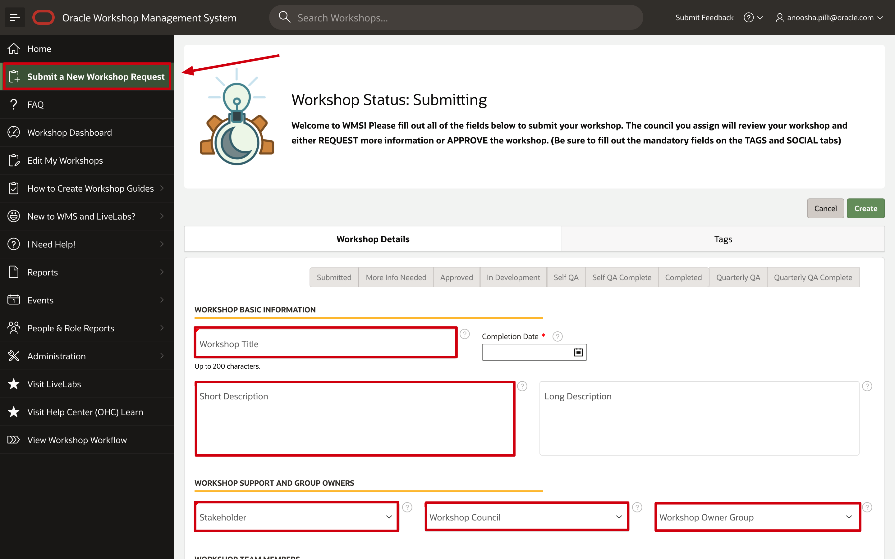
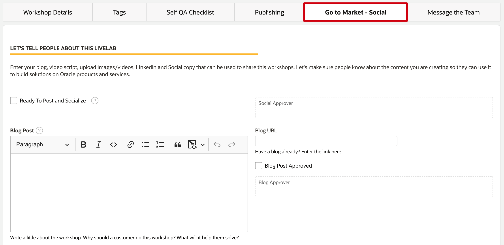
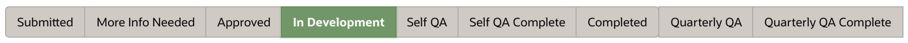

# Submit New Workshop in WMS

## Introduction

Oracle Workshop Management System (WMS) manages workshop submissions, team approvals, development, and publishing. This guide focuses on publishing to LiveLabs.

WMS displays the workflow through statuses, providing visibility into development progress. It also supports marketing through social media and tracks regular quality checks.

Estimated Time: x

### Objectives

* Submit a LiveLabs workshop request using WMS
* Understand roles and responsibilities
* Follow the status workflow

### What Do You Need?

* Access to the Oracle Workshop Management System (WMS)

## Task 1: Submit a Workshop Request to WMS

Before starting development, submit your LiveLabs workshop request to WMS. This informs the Oracle ecosystem that you are working on a workshop and submits your idea to the Workshop Council. Do not delay this step—it preserves the quality and integrity of the workshop catalog.

1. Log in to Corporate VPN.

2.  Access the **Oracle Workshop Management System (WMS)** page.
    > **Note:** This page is only accessible to Oracle Employees.

3.  Click **Submit a New Workshop Request**.

4.  Fill in required *Workshop Basic Information*. Select the *Stakeholder*, *Workshop Council*, and *Workshop Owner Group* for your workshop. Fill in the *Workshop Abstract* **thoroughly**, *Workshop Outline*, and *Workshop Prerequisites*. Click **?** besides those fields to see more details.

  
  

5.  Click the *Tags* tab, and select the proper tags for your workshop. You should select a *Level* tag, and at least one tag for *Role*, *Focus Area*, and *Product* respectively. Tags are required for Level, Role, Focus Area and Product, other sections are optional. Click **Create**.

  

6.  We recommend you don't start working on your workshop until your workshop has been approved by a council member.

After submission, the workshop council reviews your request within 3 business days. If you have not received a response after 3 business days, message them via WMS. Once approved, you enter the workflow with additional steps toward production.

To find your council members, go to WMS and select **People & Role Reports** > **Workshop Council Members**.

> **Note:** You can create and subscribe to reports in WMS to track workshop status.

## Task 2: Plan Workshop Development and Social

Once your workshop is **Approved**, start development using the sample template or a similar existing workshop. Review the LiveLabs standards below before you begin. Environment setup is covered in the next lab.

Workshops can run in free tier accounts, paid accounts, or LiveLabs sandbox. Plan how to organize resources in a compartment for LiveLabs sandbox compatibility.

1. **Development standards**:
    - **Naming**: Use lowercase for all file names (markdowns, images, csv, folders). Use descriptive names, not step numbers or auto-generated names.
    - **Titles**: Start with imperative verbs. Keep them short, concise, and consistent.
    - **Lab sections**: Each lab has a title, objectives, and tasks.
    - **Screenshots**: Store in an `images` folder. Keep them clear and properly cropped. Blur personal or sensitive information. Include alt text for accessibility.

2. If you are a developer, QA, or PM, you can create and publish a custom image of an on-premises product to OCI Marketplace. See [Creating Compute Images for Marketplace](https://oracle-livelabs.github.io/common/sample-livelabs-templates/create-labs/labs/workshops/compute/index.html?lab=6-labs-setup-graphical-remote-desktop).

3. Click the **Go to Market - Social** tab to add a blog link, LinkedIn/Twitter post text, and a promotional tweet for your workshop. Complete these details before publishing and check the approved box when ready.

  

    The **Video script** field records workshop highlights. Keep it short and focused on objectives or use cases. Check the box when the script is ready.

    

    You can also upload images and video files for marketing.

    

    [Video: Go to Market - Social Tab in WMS](https://otube.oracle.com/media/LiveLabsA+Go+to+Market+-+Social+Tab+in+WMS./1_hr3dmmwx)

## Task 3: Workshop Workflow - Status

A workshop progresses through the following phases (statuses) in WMS before reaching production. Refer to this section for your current and next steps.

1. After submitting the workshop request (see Task 1), the workshop enters *Submitted* status. The council reviews submissions within 2-3 business days and either approves or requests more information.

    > **Note:** If you have not heard back within 3 business days, follow up with your council group. Find council members in WMS under **People & Role Reports** > **Workshop Council Members**.

    

2. Council requests *more information*. Respond via the **Message the Team** tab in WMS to clarify the use case or provide additional details.

    

3. Council *approves* the workshop. Development can begin. The notification email contains your action items.

    

4. Move the workshop to *In Development* when starting. The next labs explain how to proceed.

    

5. After development, move to *Self QA* status. Perform end-to-end testing of the workshop.

    

6. Complete the **Self QA Checklist** tab. See Lab 6 for self-QA details.

    
    

7. After Self QA, move to *Self QA Complete*. Stakeholders receive automated notifications and see the workshop on their WMS dashboard.

    

    Stakeholders verify QA within 2 business days. They either return issues to fix or move the workshop to *Completed* status.

8. The workshop is *completed* and ready for publishing. Submit a publishing request (see Lab 7). After approval, the workshop goes live within one business day.

    

9. Published workshops require Quarterly QA every 90 days to ensure current information. The status automatically updates to *Quarterly QA* after 60 days, and you receive an email with instructions. Complete the Self QA Checklist to perform Quarterly QA.

    

10. After completing Quarterly QA using the Self QA Checklist, update the status to *Quarterly QA Complete*.

    

11. If Quarterly QA is not completed within 90 days, the LiveLabs team removes the workshop from production. The workshop remains in the WMS catalog for 30 days before being purged.

    

## Task 4: Workshop Development Workflow

Now that you understand the status workflow and approvals, you can begin content development. The following labs cover GitHub and Markdown in detail. The steps below outline the general workflow for setting up your environment. Most tasks are one-time setup; your configured environment can be reused for future workshops.

Videos for these steps are available in the labs and in the WMS **I Need Help** menu.

1. Create, set up, and access GitHub account
2. Install GitHub Desktop
3. Fork repositories from [oracle-livelabs](https://github.com/oracle-livelabs)
4. Clone repositories that you forked
5. Install and use Visual Studio Code
6. Create your workshop's folder structure
7. Create content using Visual Studio Code and the [sample workshop template](https://github.com/oracle-livelabs/common/tree/main/sample-livelabs-templates/sample-workshop)
8. Review content by stakeholders or subject matter experts (SMEs)
9. QA your workshop
10. Deploy completed content to the oracle-livelabs main branch

Ready to publish!

> **Note:** For detailed instructions on each step, see the corresponding labs in the left menu.

You may now **proceed to the next lab**.

## Acknowledgements

* **Last Updated By/Date:** LiveLabs Team, January 2026
