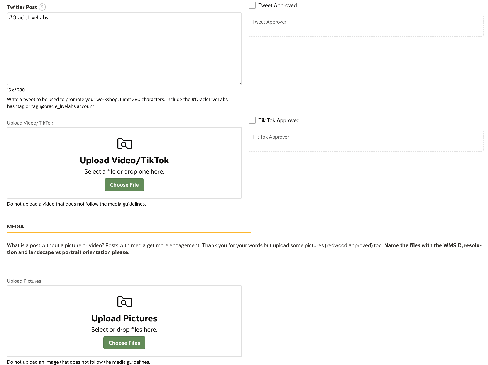
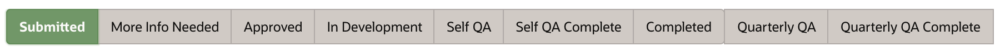
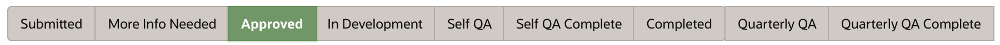
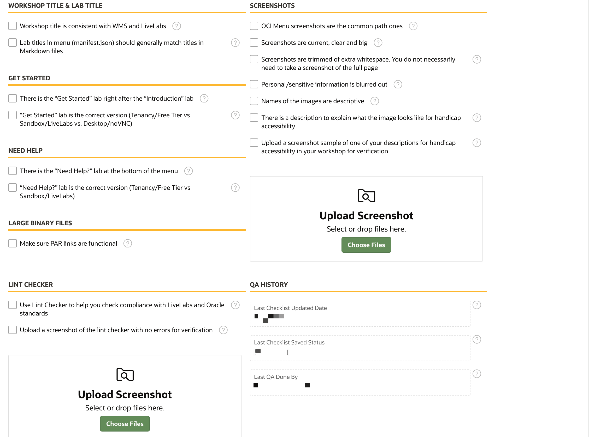
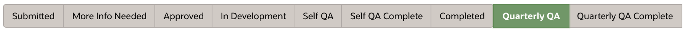

# Submit new workshop in WMS

## 🧭 Introduction

Oracle Workshop Management System (WMS) is used to submit workshops, follow a process for team approvals, develop and publish the workshop. Most of our focus in these step by step guides will talk about publishing to LiveLabs, which will use the workshop that was published in LiveLabs.

The WMS workflow is shown with statuses and gives visibility into the development steps. WMS also hosts ways to market the workshop with social media, and keep track of regular quality checks to keep the workshop relevant.

---

| 🎯 Objectives                                      |           |
| ------------------------------------------------- | ------------------------------------------------------- |
| - Submit a LiveLabs workshop request using WMS    |                                                         |
| - Understand roles and responsibilities            |                                                         |
| - Follow the status and workflow                    |                                                         |
| **What Do You Need?**                              |                                                         |
| - Access to Oracle Workshop Management System (WMS) |                                                         |
| - [WMS](https://bit.ly/oraclewms)                  |                                                         |

---

## Task 1: Submit a workshop request to the Oracle Workshop Management System

Before getting started, you should submit your LiveLabs workshop request to the WMS. Submitting a workshop informs the Oracle ecosystem that you are working on a workshop and submits your idea to the Workshop Council. We urge you not to delay this step. There are hundreds of workshops already, this step is important to help us preserve the quality and integrity of the workshop catalog.

1. Log in to Corporate VPN.

2.  Access the **Oracle Workshop Management System (WMS)** page.
    > **Note:** This page is only accessible to Oracle Employees.

3.  Click **Submit a New Workshop Request**.

4.  Fill in required *Workshop Basic Information*. Select the *Stakeholder*, *Workshop Council*, and *Workshop Owner Group* for your workshop. Fill in the *Workshop Abstract* **thoroughly**, *Workshop Outline*, and *Workshop Prerequisites*. Click **?** besides those fields to see more details.

  
  

5.  Click the *Tags* tab, and select the proper tags for your workshop. You should select a *Level* tag, and at least one tag for *Role*, *Focus Area*, and *Product* respectively. Tags are required for Level, Role, Focus Area and Product, other sections are optional. Click **Create**.

  

6.  We recommend you don't start working on your workshop until your workshop has been approved by a council member.

Once your workshop is submitted, it will be sent to the workshop council.  The workshop council will approve your workshop or ask for more details within 3 business days. If you have not heard back from your council group after 3 business days, please message them via WMS. Once approved, you will be entered into the workflow and given additional steps to progress through to production.

To find your council members, go to WMS, under **People & Role Reports**, select **Workshop Council Members**, and you can find your council members.

> **Note:** There are reports that can be created and subscribed to get all of the details and follow the status of the workshop.
[WMS Report](https://apex.oraclecorp.com/pls/apex/f?p=24885:18)

## Task 2: Plan workshop development and social

Once your workshop is **Approved**, development starts with using the sample template or another similar workshop. Before you get going, there are some LiveLabs standards, things to keep in mind and plan for while developing that we will discuss here. Setup of the environment is in the next lab.

There are different ways to deploy your workshop. It can run in a free tier account, paid account and LiveLabs sandbox. How to deploy in these options will be discussed later but you should be thinking of how to keep resources in a compartment and other resources that would be needed to run in the LiveLabs sandbox.

1. Development standards
**Naming standards** - File names should all be lower case, which means markdowns, images, csv, etc., basically all of the workshop files including folders. Match the folders and file names where possible. Also be descriptive, not just step numbers or auto-generated names.
**Titles** - Start titles with imperative verbs, keep short, concise and consistent.
**Lab Sections** - Each labs has a title and objectives and then tasks.
**Screenshots** - Keep screenshots in one folder - images. Keep them clear and big, which means trimming whitespace and using what is needed in the screenshot. Blur out personal/sensitive information. Provide alternate text as part of the markdown (described in detail later) but this is for accessibility.

2. If you are a developer, QA, or PM, you can create and publish a Custom image of the on-premises product to OCI Marketplace. See the [Creating Compute Images for Marketplace](https://oracle-livelabs.github.io/common/sample-livelabs-templates/create-labs/labs/workshops/compute/index.html?lab=6-labs-setup-graphical-remote-desktop) LiveLabs workshop.

3. Click the *Go to Market - Social* tab to include a link to the blog of your workshop, write a couple of sentences that would accompany a LinkedIn or Twitter post about your workshop, and write a tweet to be used to promote your workshop. Of course this can be done anytime while working on your workshop, or maybe you are using a blog to create the workshop. These details should be completed for when your workshop is published. Be sure to check the approved box when ready to use for social media posting and blogs.

  

  There is also a video script for recording some details about the workshop. Keep it short and simple to highlight the objectives or use case. Again, just check the box when the script is ready for publishing.

  

  You can also upload images and video files for marketing the workshop.

  

  [Video walking through the social tab](https://otube.oracle.com/media/LiveLabsA+Go+to+Market+-+Social+Tab+in+WMS./1_hr3dmmwx)

## Task 3: Workshop workflow - Status

For a workshop to go from an idea to a LiveLabs workshop in production, it has to go through the following phases or statuses in WMS. You can refer to this section to see your current and next steps.

1. After the workshop team submits the workshop request (see details in Lab 1 -> Task 1), the workshop is in *Submitted* status. The workshop's *council* group will review the workshop within 2-3 business days. Council will either approve the workshop and move it to *Approved*, or ask the workshop team for more information and move it to *More Info Needed*.

  This is the status you are currently at if you worked through the first couple steps of this lab. When you hit save on the information you provided as details about your new workshop, it saves it in submitted status. Which means it is ready for the council to review and either approve your workshop or ask for more details. The council does receive an automated email message alerting them to this submission as well as having this appear on their dashboard in WMS for newly submitted workshops.

    >**Note:** If workshop teams have not heard back from the council for more than 3 business days, please follow up with your council group. To find your council members, go to WMS, under **People & Role Reports**, select **Workshop Council Members**, and you can find your council members.

  

2. Council asks workshop team for *more information*. The workshop team will respond to the council via the **Message the Team** tab in WMS to get the workshop approved.

  If something is unclear or more details are needed to understand the workshop, the council will ask for more information before continuing. This is to validate the use case make sure that what is being highlighted is clear or could be just wanting more details to how this is going to be accomplished.

  

3. Council *approves* the workshop. Now, the workshop team can start developing the workshop. Refer to the notification email to see your action items. Congratulations - you will receive an email notifying of this approval and the next steps.
  

4. Workshop team will move the workshop to *In Development* when they start workshop development. Now it is time to work through the development of the content. The next couple of labs will tell you how to get started.
  

5. After development, the workshop team will move the workshop status to *Self QA*. Workshop team will perform the end to end testing of the workshop functionality.

  

6. Click on *Self QA Checklist* tab to thoroughly perform the self QA of the workshop. Follow Lab 4 to more details on performing the self-QA of the workshop.

  
  

7. After Self QA, the workshop team will move the workshop status to *Self QA Complete*. When the status is moved into *Self QA Complete* automated email messages are sent to the stakeholders and appears on their dashboard in WMS for completed workshops.

  

  The workshop's *stakeholders* will verify the QA within 2 business days. They will either send workshop team issues to fix, or move the workshop to *Completed* status, meaning the workshop is ready for production.

8. The workshop is *completed* and is ready for publishing! Workshop teams will submit a publishing request, and the LiveLabs team will approve it. Steps to complete publishing are in Lab 6. After the publishing request is approved, the workshop will be live in LiveLabs automatically within a business day.

  

9. For the published workshops, we want to ensure that customers benefit from workshops that contain up-to-date information. So, the workshop team needs to perform Quarterly QA of the workshop within every 90 days.

  The workshop status will automatically update to Quarterly QA after 60 days and workshop team will receive an email to perform Quarterly QA of the workshop. In the stage, the workshop team needs to follow the instructions in the email and complete the self QA Checklist as in step 6 to perform the Quarterly QA of the workshop.

  

10. Once you complete the Quarterly QA using the Self QA Checklist and save it, update the workshop status to Quarterly QA Complete.

  

11. If the workshop team does not perform the Quarter QA within the 90 days period, the LiveLabs publishers will remove the published workshop from production. The workshop will remain in the WMS catalog and will be purged after 30 days.

  

## Task 4: Workshop development workflow

Now that you understand the general status workflow and approvals involved, it is time to get started with developing the content. In the next couple of labs we will walk through the details of using GitHub and Markdown content, but the following steps show the general workflow process that you need to follow to set up your environment to develop labs and workshops. Most of the tasks are performed only once, but there are others that will be repeated and you can use your configured environment to develop other new workshops.

This is the overview of the steps, and in the next lab these topics will be covered to walk you through setting up your environment, writing and editing and QA of your workshop to get it ready to publish. We have videos for these steps that are also part of the labs and in the WMS **I Need Help** menu.

1. Create, set up, and access GitHub account
2. Install GitHub Desktop
3. Fork repositories from [oracle-livelabs](https://github.com/oracle-livelabs)
4. Clone repositories that you forked
5. Install and use Visual Studio Code
6. Create your workshop's folder structure
7. Create content using Visual Studio Code and the [sample workshop template](https://github.com/oracle-livelabs/common/tree/main/sample-livelabs-templates/sample-workshop)
8. Review content by stakeholders or subject matter experts (SMEs)
9. QA your workshop
10. Deploy completed content to the oracle-livelabs main branch

Ready to publish!

>**Note:** If you want more information about how to perform each step above, click on labs on the left.

This concludes this lab. You may now **proceed to the next lab**.

## Acknowledgements

* **Authors:**
    * Michelle Malcher, Senior Manager, Oracle Database Product Management
* **Contributors:**
    * Anuradha Chepuri, Principal User Assistance Developer, Oracle GoldenGate
    * Lauran Serhal, Principal User Assistance Developer, Oracle Database and Big Data
    * Kay Malcolm, Database Product Management
    * Madhusudhan Rao, Principal Product Manager, Database
    * Aslam Khan, Senior User Assistance Manager, ODI, OGG, EDQ
    * Arabella Yao, Product Manager, Database

* **Last Updated By/Date:** Ana Coman, March 2024
