# Develop LiveLabs Sprints

## Introduction

This lab walks you through the steps to setup Sprints repository in Oracle LiveLabs GitHub Project, provides an overview of Sprints Folder Structure and use the folder components to  develop sprints content. Then shows you how to commit you changes to your clone and create a pull request and submit a new sprint publish request in WMS.

> **Note:** For any questions related to the LiveLabs Sprints or about the process of Sprints development lifecycle, reach out to the LiveLabs Sprints Admin team through WMS messaging system or mail us to livelabs-help-sprints_us@oracle.com or send us a message in #workshop-authors-help slack channel (share the sprint WMS ID, LiveLabs ID if you already have one).

### What are Oracle LiveLabs Sprints?

The scope for LiveLabs Sprint differs from a standard LiveLabs workshop. A LiveLabs Sprint provides users with a quick & easy form of help by providing answers to a particular technical question, challenge or issue. The maximum duration to complete the steps in a sprint should be less than 10-15 minutes.

The following diagram shows the general LiveLabs Sprints Development Workflow process that your need to follow to set up your environment and to develop sprints. Most of the tasks are performed only once.

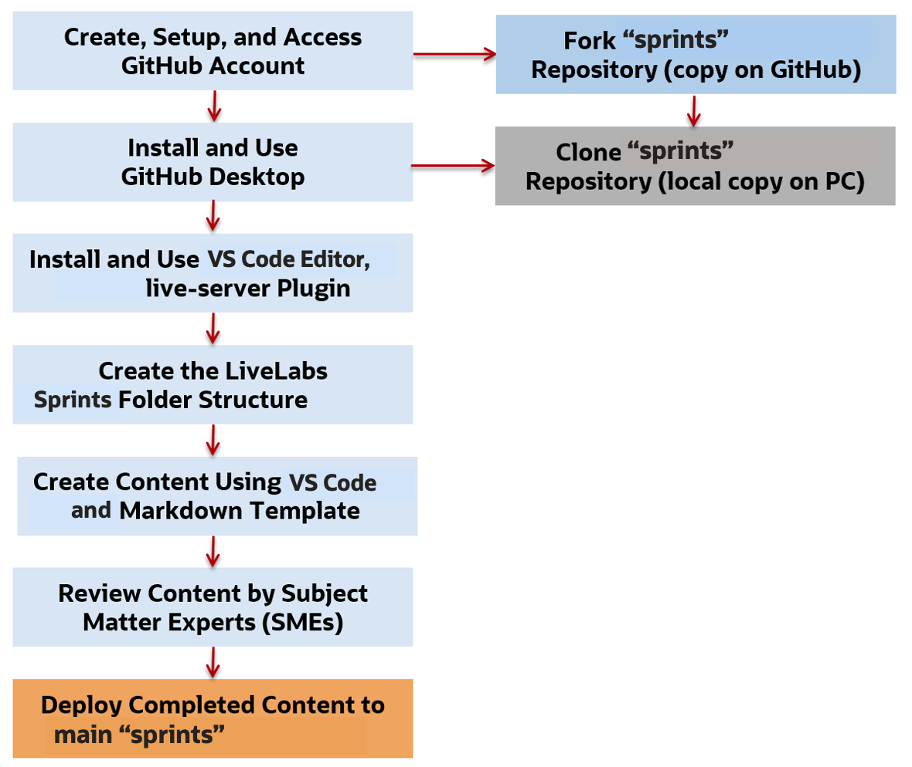

### Objectives

* Set up Oracle LiveLabs Sprints GitHub Repository
* Understand the Oracle LiveLabs Sprints Folder Structure and its components
* Create content for your Sprint
* Commit Your Changes to Your Clone and Create Pull Request
* Request Sprint Publish in WMS

### What Do You Need?

To get started with Oracle LiveLabs Sprints development, you should have completed Lab 2:

* A GitHub Account (steps in Lab 2 Task 1)
* Installed GitHub Desktop on your machine (steps in Lab 2 Task 3)
* Installed Visual Studio Code editor (steps in Lab 2 Task 4) with LiveServer extension (steps in Lab 2 Task 5)

## Task 1: Set up Oracle LiveLabs Sprints GitHub Repository

> **Note:** Before you create a new sprint, check if there is a sprint with same content in [WMS](http://livelabs.oracle.com/wms). If there is no sprint with the content you want to create, please proceed.

1.  Navigate to [oracle-livelabs/sprints](https://github.com/oracle-livelabs/sprints) repository in Oracle Livelabs GitHub Project

    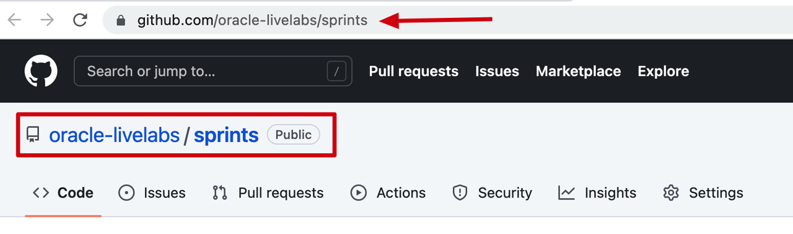

2.  Fork the **oracle-livelabs/sprints** repository (Steps in Lab 3 Task 1 Steps 4-6)

3.  Create a local clone of the forked repository (Steps in Lab 3 Task 2)

## Task 2: Understand the Oracle LiveLabs Sprints Folder Structure and its components

> **Note:** You will be creating your sprint folder anywhere within the domain folder of your cloned sprints repository. See the different domain folders and decide on a folder for your sprint. If no existing folder fits your sprint, please contact our LiveLabs Sprints team by emailing us to [livelabs-help-sprints_us@oracle.com](livelabs-help-sprints_us@oracle.com) or send us a message in slack #workshop-authors-help channel with the details of the folder you wish to create. We will respond within 20 minutes over slack or within 24 hours via email respectively.

1.  The following image shows folder structure of the sample **sprint** that is opened in the Visual Studio Code Editor. Inside this **oracle-livelabs/sprints** repository in Oracle LiveLabs GitHub Project, there is a sample-sprints folder. You can see this structure at the following URL https://github.com/oracle-livelabs/common/tree/main/sample-livelabs-templates/sample-sprints. You can get started with sprint development by copying this sprint folder inside the sprint folder.

    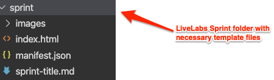

2.  The following describes the components of the above example:
    * The root folder of this example is the name of the sprint, **sprint**.
    * Each sprint has its own
        * an **images** folder that contains the screenshots used in this sprint.
        * a **.md** file that contains this sprint's content.
        * an **index.html** file, which is executed when it is accessed by a browser. When you copy this file from *sample-sprints* folder, you can use it without changes.
        * a **manifest.json** file, which defines the structure of the sprint that the `index.html` file renders. When you copy this file from *sample-sprints* folder, you can need to customize it for your sprint.

3.  The following screenshot shows a sample `manifest.json` file that is opened in the **Visual Studio Code** Editor.

    > **Note:** Make sure that the **livelabs-help-sprints_us@oracle.com** email is listed in ***help***.

    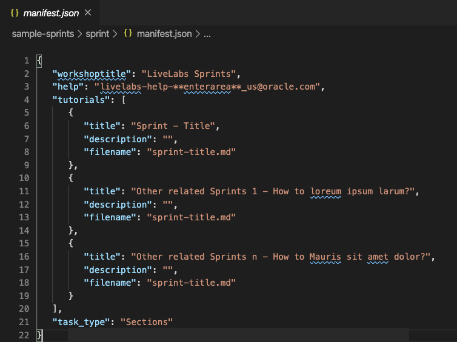

## Task 3: Create content for your Sprint

1.  Every day before you start editing your content, make sure to do a Merge in GitHub Desktop (steps in Lab 3 Task 3). Merging synchronizes the content in your cloned repository with the latest content on the upstream/main repository and ensures that you have the most recent versions of the templates and other workshops/labs.

2.  Copy along with the files in **sprint** folder in the **sample-sprints** folder as it is into the domain folder you decided or copy from an existing Sprint in that domain folder to create your content.

    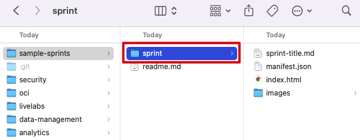

3.  Re-name your sprint folder name and the markdown (.md) file to match the folder name.

4.  To edit the .md file of your sprint, open the text editor of your choice. In this case, we are using VS Code, click File > Open.

    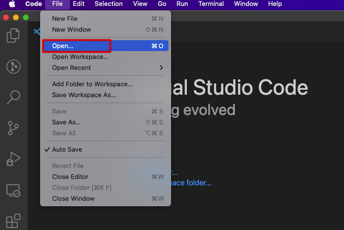

5.  Navigate to your sprint folder and click Open to open your sprint folder. Your sprint folder along with the images folder, markdown, index.html and manifest.json files will then be displayed in your text editor.

    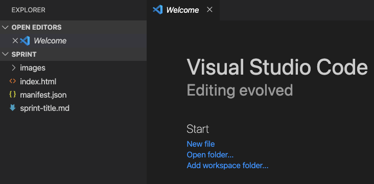

6.  If you want to add images in your sprint, then include them within the images folder. You can delete the images folder if you do not need it.

7.  Edit the manifest.json file.
    -   help: Update the field to point to *livelabs-help-sprints_us@oracle.com* email.
    -   title: Update the first title field with the title of your sprint.
    -   description: Add a short description about the sprint
    -   filename: Update this field with your file name
    -   Other related sprints: The manifest.json is like your book map file in SDL. If you would like to add related sprints, update the title fields with the respective sprints title, their description and absolute paths (steps in Lab 4 Task 4) to their markdown files in filename. You can add up to a maximum of six related sprints and also delete the existing sprints sections if you do not need them.

        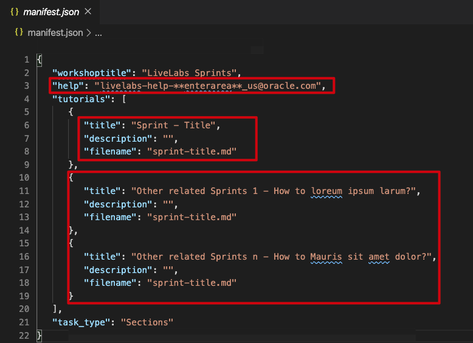

8.  You can take the help of the formatting in .md file you copied earlier and edit it to develop your sprint.

9.  Make sure you develop the content considering all the security related points mentioned in Lab 4 Task 3 of the LiveLabs guide.

10. Preview you Sprint using the Live Server.

You can refer the Lab 4 for markdown features for content development and Lab 2 Task 6 for helpful resources and extensions for VS Code.

## Task 4: Commit Your Changes to Your Clone and Create Pull Request

You will push the updated content from your clone into the origin of your clone, that is, your fork, to synchronize your clone with your fork. Again as a reminder, it is a best practice to merge your repository every day or whenever you start your GitHub Desktop application. Merge pulls all the commits (changes) from the upstream/main repositories (production), into your local filesystem clone (local machine). This keeps your local clone up-to-date with other people's work (commits) from the upstream/main. Next, Merging also avoids the long time it could take to complete if you do not do that often.

1.  Once you have complete the development of the sprint or when you create, delete, or modify assets in your clone (local copy), you should commit (save) those changes to your clone, and then push those changes from your clone to your fork (Steps in Lab 3 Task 6). Then these changes get saved to your forked repository.

2.  Before you create a pull request, get the latest updates from the production repository into your clone. (Steps in Lab 3 Task 3).

3. Set up GitHub Pages for your Fork (Steps in Lab 3 Task 7) to test or review your Sprint content (Steps in Lab 3 Task 8).

4. Create a Pull Request to upload your content to the main repository i.e., **https://github.com/oracle-livelabs/sprints** (Steps in Lab 6 task 1) and follow the steps in Task 5 to request sprint publishing in WMS.

5.  Once the PR is approved, it takes a few minutes for the changes to reflect on **oracle-livelabs.github.io/sprints** GitHub pages site. You can access your Sprint on GitHub by following the steps in Lab 3 Task 8.

##  Task 5: Request Sprint Publish in WMS

1.  After you submit the pull request, navigate to your domain sprint bucket in [WMS](http://bit.ly/oraclewms). If no existing domain sprint bucket fits your sprint, please contact our LiveLabs Sprints team by emailing us to [livelabs-help-sprints_us@oracle.com](livelabs-help-sprints_us@oracle.com) or send us a message in slack #workshop-authors-help to create a new bucket. We will respond within 20 minutes over slack or within 24 hours via email respectively and create the bucket if needed.

2. In your sprint bucket in WMS, click on the **Publishing** tab. and then click **Publish to LiveLabs** button to submit a new sprint publish request.

      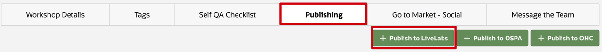

3.  Provide all these **required** details below and click **Create**:

    -   **Publish Type:** Leave the default - Public
    -   **Workshop Time (in hours):** The maximum duration to complete the steps in a sprint should be less than 10-15 minutes. Convert the sprints duration time to hours. Make sure they end with odd number. For example, if a sprint duration is 4 minutes, update the field with 0.067 hours.
    -   **LiveLabs Sprint:** Turn *ON* the radio button for the sprint and provide the oracle-livelabs.github.io/sprints pages URL (Follow the steps in Lab 5 task 1 and replace your github account name with oracle-livelabs to create production URL) for the sprint once it is published. Format: https://oracle-livelabs.github.io/sprints/domain-folder-name/your-sprint-folder-name/

    Scroll down to the Override Workshop Fields Section and provide these details:
    -   **Title Override field:** Choose a descriptive title up to 200 characters. Do not include the word "Sprint" and use "Oracle Speak". Choose a title that users would recognize or understand. Do not use abbreviations ("Autonomous Database" not "ADB") and start the title with a question, for example, How can I, Where do I, What do I do) and use only imperative verbs ("Build" not "Building").
    -   **Desc Short Override field:** The short description is the key piece of information that goes on the tile of the workshop. Keep it crisp, catchy, and interesting. The length is up to 400 characters.

    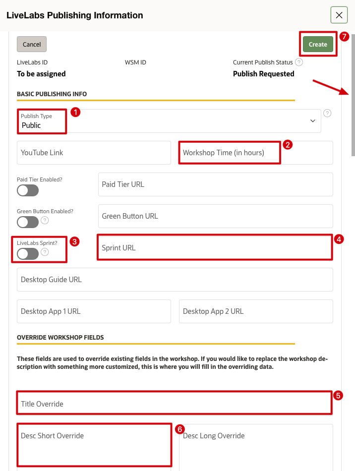

4. Now, the sprint will be in **Publish Requested** status. Click on your sprint tile to view your Sprint's Current Publish Status and note the WMS ID and LiveLabs ID as we will need it now and for your reference as well.

    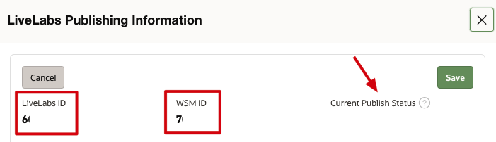

5. After you have submitted the new sprint request in WMS, update the pull request with the WMS ID and LiveLabs ID of the sprint by clicking on Edit next to title of the pull request.

    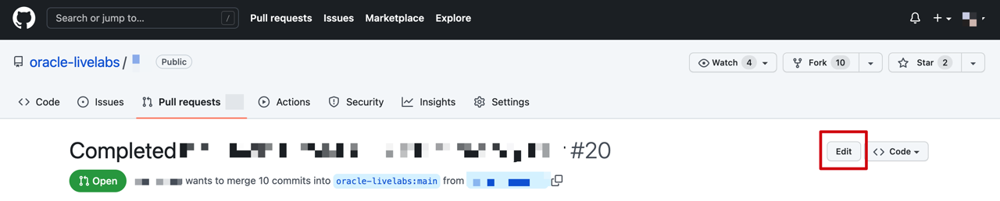

6.  LiveLabs team will now review your sprint request and the pull request. If there are any changes to the sprint, the pull request will be updated with the comments and if there are changes to the sprint submit request, the LiveLabs Sprints team will reach out to you via email or WMS and update the publishing status of the sprint to **Changes Requested** in WMS.

7.  If there are no changes needed, LiveLabs Admin team will approve the new sprint submit publish request and the pull request within 1-2 business days and update the sprint status to **Publish Approved** in WMS.

8. Once the sprint is approved in WMS, the sprint will be live in Production in 1 business day.

Feel free to make changes to the Sprints to keep them updated. Make sure to create a pull request with the changes you made to the sprint.

> **Note:** If you update the Sprint title, make sure to update the respective Sprint title in WMS as well and keep the LiveLabs sprints team updated.

## Acknowledgements

* **Author** - Anoosha Pilli, Product Management, Database Product Management
* **Last Updated By/Date** - Anoosha Pilli, February 2023