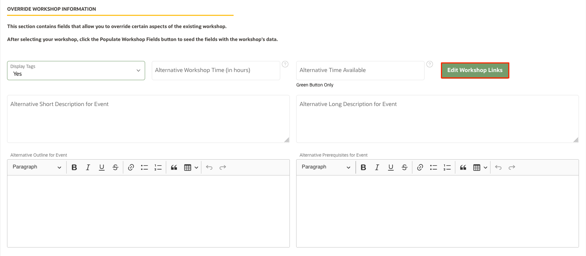

# Develop LiveLabs Sprints

## Introduction

This lab walks you through the steps to customize a workshop for events, create an event code, and use the event code.

### What is Event Code?

An Event code is a fully customizable way to run a customized set of focused labs for your target audience. We now fully support hidden workshops for Oracle sales/PM and marketing purposes. They won’t be accessible to the general audience, cannot be indexed by search engines, the user must login with Oracle SSO and have the code to proceed.

If for an event, you want to add additional labs, remove some labs, have a different version of a lab, or change the workshop's meta info (see the screenshot below), you can do that via an event code, without affecting the workshop already in production. PMs and Sales at Oracle have widely used event codes for big events like Oracle CloudWorld, as well as smaller events like training sessions, both internally and externally.

The following screenshot shows the landing page of an event code. The information squared in red can all be customized.

### Objectives

* Customize a workshop for an event
* Create an event code
* Use the event code

### Prerequisites

To get started with creating an event code, you should have:

* A published workshop in LiveLabs you want to create the event for (the publishing type can be "Public" or "Event")
* Event information, including the event tile, organizer, time, expected number of participants, etc.
* Customers should have Oracle accounts to log in to LiveLabs to use the event code

## (Optional) Task 1: Customize a workshop

If you are the workshop team of this workshop, you can change the workshop title, add additional labs, remove labs, and/or have a different version of a lab for the event.

1.  Depending which repo your workshop is in, merge content from GitHub by following Lab 3: Stay in sync with GitHub environment -> Task 3: Merge content from Git before you start editing your content.

2.  Go to Visual Studio Code, under the **workshops** folder, where you can see a **freetier** folder and/or a **livelabs** folder, create a new folder and give it a descriptive name (lowercase) for the event (e.g. cloudworld, training, event, etc.).

3.  Then, copy the *index.html* and *manifest.json* from the **freetier** or **livelabs** folder.

4. Now, in the new *manifest.json* file under the event code, you can edit the workshop title, add labs, remove labs, or replace labs.

5. You can also create new Markdown files under lab folders to have a different version of labs.

6. Finally, push your changes and create a pull request to one of the oracle-livelabs GitHub repos. After your pull request is approved and merged, you can proceed to Task 2.

## Task 2: Create an Event Code

1.  Go to the Workshop Management System (WMS). Expand **Events**, then click **Request an Event Code**.

    

2.  Fill out the event code information:
    * **Active?**: should this Event be live (Yes) or not (No)? You can change this later if needed.
    * **Event Requestor**: this field will be populated with your Oracle email
    * **Who else should be notified**: other people who should be notified about this event code (e.g. other event organizers)
    * **Workshop**: use the dropdown menu to find the workshop, or type the workshop's title, WMS ID, or LiveLabs ID to find it
    * Click **Populate Workshop Fields**

    

    >**Note:** If you cannot find a workshop, please find the workshop in WMS and make sure that it is published (with publishing type "Event" or "Public"). If not, follow **Lab 6: Publish your workshop** to publish the workshop first.

3. Fill out the **Event Page Details** (information squared in right is mandatory information):
    

    * **Event Title**: the title of the event - this will be displayed at the top of the event landing page
    * **Event Type**: choose from **Event** (for most cases), **PTS**, **GetTogether**, **AskTom**
    * **Event Date**: a text field that will be displayed on the event page, so you can add a date range if needed. If left bank it will default to the date the event page is being viewed
    * **Event Organizer**: this field will display under the Organizer heading of the event. If left blank, the field will default to "Oracle"
    * **Event Location**: only applies to Get-Togethers events
    * **Event Icon URL**: for "Event" event types you can specify a graphic to be used on the orange panel on the left of the event page
    * **YouTube Link**: this is the embed URL from the Share dialog on YouTube - it's important the URL includes "embed"
    * **Marketing Code**: only applies to Get-Togethers events
    * **Start Date**: choose the start date of the event (the date the event code becomes valid) -  we recommend you set the Start Date one day before the actual event
    * **End Date**: choose the end date of the event (the date the event code becomes invalid) - we recommend you set the End Date one day after the actual event
    * **Timezone**: choose the timezone where the event will take place
    * **Max Users** (Green Button only): enter how many users should be allowed to use this event code
    * **Concurrent Users** (Green Button only): how many users should be able to use this event code at the same time?
    * **Tenancy** (Green Button only): DO NOT set this value unless you need to run this event on a very specific tenancy

>**Note:** Please include any explanation for an Event Duration longer than 30 days in the **Remarks to the LiveLabs Team** field at the bottom of the screen.

4. Go to the **Override Workshop Information** section, where some information should be already populated after you click **Populate Workshop Fields** in Step 2. Check if the following information is correct or override the information:

    * **Alternative Workshop Time (in hours)** (Green Button only): this field is the estimated time it will take for a user to complete this workshop.
    * **Alternative Time Available (in hours)** (Green Button only): this field is how long the users will have to complete the workshop if there is a green button - the maximum allowed time for this field is 8 (hours)
    * Click **Edit Workshop Links**: make sure the correct buttons are turned on and the corresponding URLs are correct, or overwrite those information
    * Check or override the **Short Description**, **Long Description**, **Outline**, and **Prerequisites**

   

5. (Optional:) In the **Remarks to the LiveLabs Team**, you can put anything the LiveLabs Team should know about this event.

    

6. After you fill in all the information, scroll up to the top of the page, and click **Request Event**. The event code request is submitted to the LiveLabs team. The LiveLabs team will review the event code, and approve it or request changes within 1 business day.
    

7. If the LiveLabs team requests any changes, you can see the comments under the **Remarks to the LiveLabs Team** section.
    

## Task 3: Share and Use the Event Code

## Acknowledgements

* **Author** - Arabella Yao, Product Management, Database Product Management
* **Last Updated By/Date** - Arabella Yao, November 2022