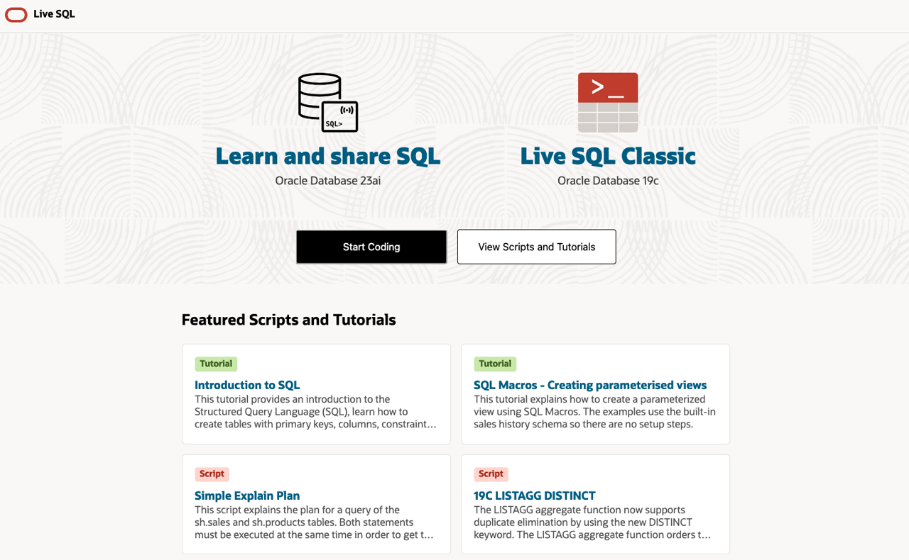
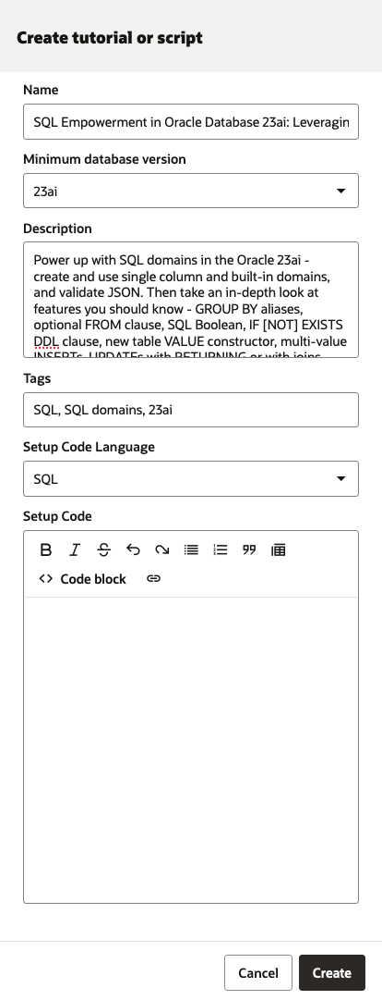
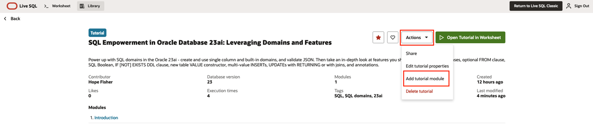
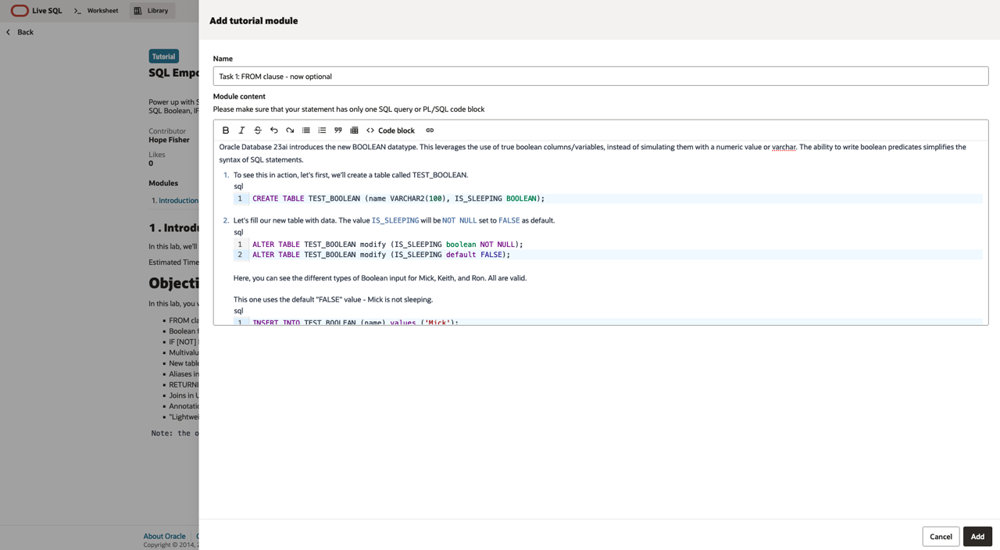
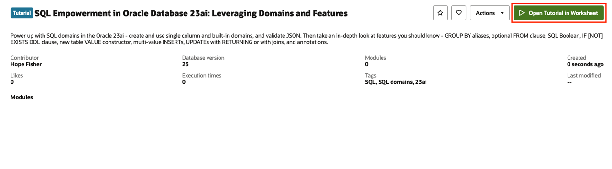
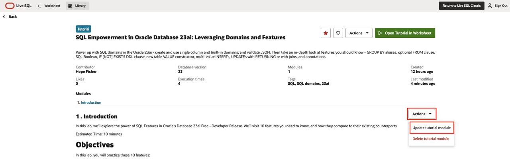
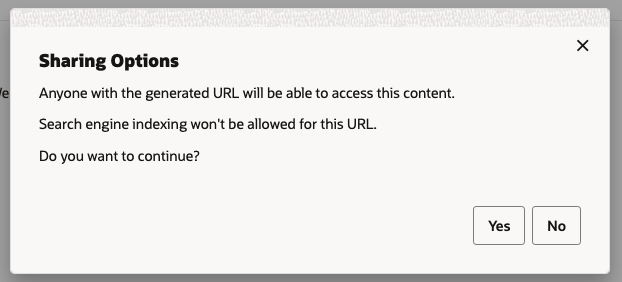
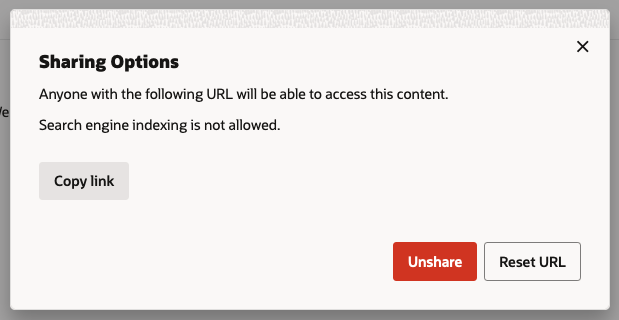
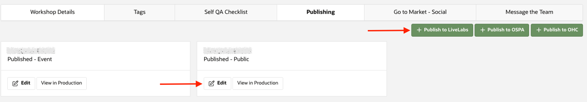
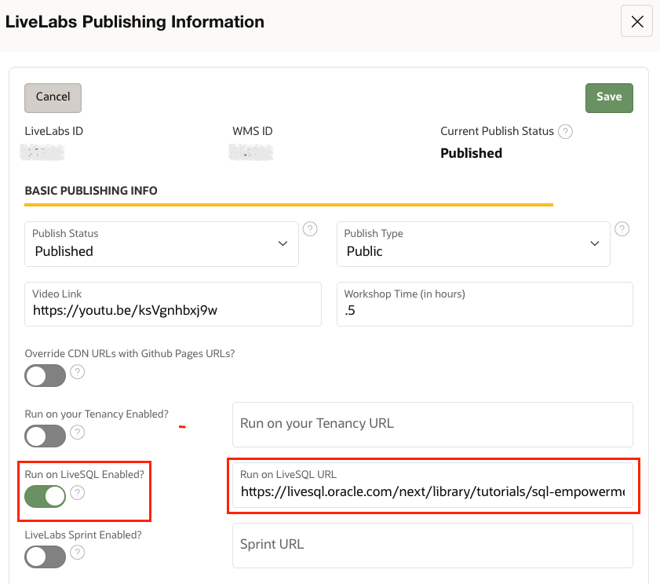

# Create a LiveLab on FreeSQL

## Introduction

This lab walks you through the steps to set up a LiveLabs workshop on the FreeSQL platform.

### What Is Oracle FreeSQL?

FreeSQL provides instant access to Oracle Database versions 19c and 23ai, letting users learn from community scripts and tutorials. The user-friendly interface simplifies SQL and PL/SQL practice.

LiveLabs offers several options for users to access instructions.

| Instruction Type | Button Color | Description |
| ---------------- | ------------ | ----------- |
| Run on Your Tenancy | Brown | Opens instructions for users to run in their own environment, using their own resources |
| Run on LiveLabs Sandbox | Green | Uses Oracle LiveLabs resources in a temporary environment, free to users |
| Run on FreeSQL | Orange | Opens instructions on the FreeSQL platform, more user-friendly for SQL and PL/SQL exercises |

This lab focuses on the orange "Run on FreeSQL" option.

### Objectives

* Create a Tutorial in FreeSQL
* Add Tasks as Modules
* View and Edit Content
* Publish to LiveLabs

## Task 1: Create a Tutorial
1. Navigate to [Oracle FreeSQL](https://freesql.com/).

2. Select your Oracle AI Database
    * For 23ai, select **Learn and share SQL**
    * For 19c, select **FreeSQL Classic**

    

3. Sign in.

4. Navigate to **My Content** -> **Create tutorial or script**
    > Note - This option is also available from the library tab, then **My Content** -> **Create tutorial or script**. You can navigate from the worksheet or library to open the sidebar form.

    

5. Fill in the form fields. Match the information from your [WMS Workshop Details](https://livelabs.oracle.com/wms).
    | Field | Details |
    | ----- | ------- |
    | Content Type | Tutorial allows modules, letting you create sections similar to Labs. A script allows only one SQL query or PL/SQL code block |
    | Name | Your workshop name from WMS Workshop Details |
    | Minimum database version | Options are 19c or 23ai |
    | Description | Short description from WMS Workshop Details |
    | Tags | Optionally include product tags |
    | Setup Code Language | Options are SQL or PL/SQL |
    | Setup Code | Leave this section blank for now |

    

6. Click "Create" - This creates your tutorial or script but publishes it privately, making it unavailable to the public library.
    Your new content opens automatically. You can also navigate to it by selecting the library tab, then "My Content", and selecting the correct card.

## Task 2: Add Tasks as Modules
1. From your details page, click the actions dropdown. Choose "Add tutorial module" to add your workshop's lab tasks.

    

2. A sidebar form opens. Fill in these fields to match your workshop. Each module should match one task, but you'll need one to handle the introduction and details.
    * Name - This first module is your introduction, so name it "Introduction".
    * Module content - The introductory module should include your introduction, estimated time, and objectives.

3. Add the actual lab tasks as modules. Adding each task as a module ensures easy navigation for users. Select "Add tutorial module".
    * Name - Match your lab's task titles.
    * Module Content - Enter the instructions for the task.

    

4. Repeat as needed until you include all tasks.

## Task 3: View and Edit Content
1. View your tutorial in the FreeSQL worksheet by clicking the green **Open Tutorial in Worksheet** button.

    

2. Your instructions appear in the right panel, with the worksheet in the top center. Review your instructions to ensure they work and display correctly.

    

3. Use this icon in the top right to return to your details page and make edits as needed.

    

4. To edit your Tutorial information (such as Name, Description, Tags), select **Edit tutorial properties** from the tutorial **Actions** dropdown.

5. To edit modules, hover over the module. Click the **Actions** dropdown for that module, and select **Update tutorial module**.

    

6. To reorder modules, select **Reorder** from the tutorial **Actions** dropdown. Use the arrows next to the modules to move them up or down. Once they are in order, use the same **Actions** dropdown to select **Save Reorder**.

## Task 4: Publish to LiveLabs
1. Once you finalize your instructions, select **Share** from the tutorial **Actions** dropdown.

2. Follow the prompts to **Copy link**.

    
    

3. Navigate to your [WMS Workshop Details](https://livelabs.oracle.com/wms).

4. Go to the **Publishing** tab. Click the Edit icon to expand your publishing details.
    a. Note: If you don't have an existing publishing entry, create one using the green **+Publish to LiveLabs** button.

    

5.  Paste your FreeSQL link into the **Run on FreeSQL URL** field.
    a. Enable the **Run on FreeSQL Enabled?** slider.

    

6. Click **Save**.
    a. The system typically updates existing entries with this option within one business day.
    b. The system reviews new entries before publishing them to the LiveLabs platform.

7. This option now appears as an orange **Run on FreeSQL** button for users, where they can choose **Open Tutorial in Worksheet**.

FreeSQL does not pull from our GitHub repo like the brown and green button options.
* Brown or Green button instruction updates - Edit the relevant [GitHub](https://github.com/orgs/oracle-livelabs/repositories) markdown files and submit a PR.
* Orange button instruction updates - Update the relevant tutorial modules through [Oracle FreeSQL](https://freesql.com/).

## Helpful Links
* [Oracle FreeSQL](https://freesql.com/)
* [Oracle LiveLabs GitHub Repositories](https://github.com/orgs/oracle-livelabs/repositories)
* [New Workshop Step By Step Guide](https://oracle-livelabs.github.io/common/sample-livelabs-templates/create-labs/labs/workshops/livelabs/)

## Acknowledgements

* **Last Updated By/Date:** LiveLabs Team, January 2026
