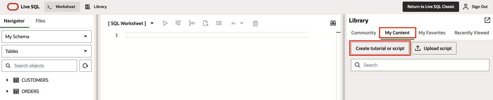
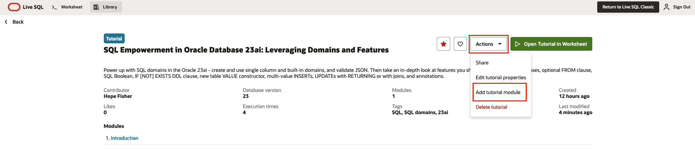
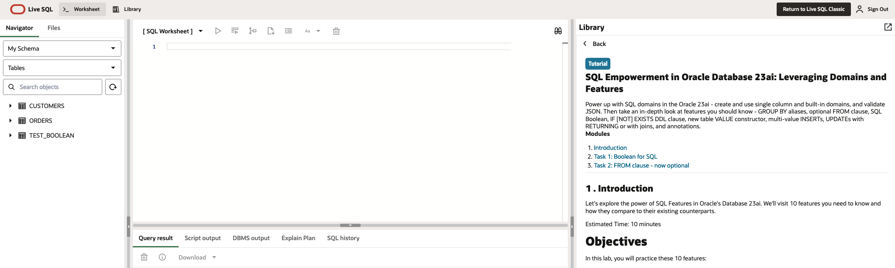

# Create a LiveLab on Live SQL

## Introduction

This lab walks you through the steps to setup a LiveLabs workshop on the Live SQL platform.

### What is Oracle Live SQL?

Live SQL allows instant access to Oracle Database versions 19c and 23ai, letting users learn from a collection of community scripts and tutorials. The user friendly interface facilitates a simplified practice environment for SQL and PL/SQL exercises.

With LiveLabs, there are several options for the user to access instructions.

| Instruction Type | Button Color | Description |
| ---------------- | ------------ | ----------- |
| Run on Your Tenancy | Brown | Opens instructions for the user to run in their own environment, using their own resources as needed |
| Run on LiveLabs Sandbox | Green | Uses Oracle LiveLabs resources in a temporay environment, free to the user |
| Run on Live SQL | Orange | Opens the instructions on the Live SQL platform, more user friendly for SQL and PL/SQL exercises |

In this lab, we'll focus on the orange "Run on Live SQL" option.

### Objectives

* Create a Tutorial in Live SQL
* Add Tasks as Modules
* View and Edit Content
* Publish to LiveLabs

## Task 1: Create a Tutorial
1. Navigate to [Oracle Live SQL](https://livesql.oracle.com/).

2. Select your Oracle database
    * For 23ai, select **Learn and share SQL**
    * For 19c, select **Live SQL Classic**

    

3. Sign in.

4. Navigate to **My Content** -> **Create tutorial or script**
    > Note - this is also available from the library tab, then **My Content** -> **Create tutorial or script**. Navigating from the worksheet or from the library will both open the sidebar form.

    

5. Fill in the form fields. Match the information from your [WMS Workshop Details](https://livelabs.oracle.com/wms).
    | Field | Details |
    | ----- | ------- |
    | Content Type | Tutorial will allow for modules, which allows to create section similar to Labs. A script will only allow one SQL query or Pl/SQL code block |
    | Name | Your workshop name from your WMS Workshop Details |
    | Minimum database version | Options are 19c or 23ai |
    | Description | Short description from your WMS Workshop Details |
    | Tags | Optionally include any product tags |
    | Setup Code Language | Options are SQL or PL/SQL |
    | Setup Code | this section can be left blank for now |

    

6. Click "Create" - This will create your tutorial or script, but only publish privately so it's not available to the public library for other users to browse.
    Your new content will automatically open. You can also navigate to it by selecting the library tab, then "My Content", and select the correct card.

## Task 2: Add Tasks as Modules
1. From your details page, click the actions dropdown. Choose "Add tutorial module" to add your workshop's lab tasks.

    

2. A sidebar form will open. Fill in these to match your workshop. Each module should match with one task, but you'll need one to handle the introduction and details as well.
    * Name - This first module is your introduction, so the name will be "Introduction".
    * Module content - The introductory module should include your introduction, estimated time, and objectives.

3. Now we'll need to add in the actual lab tasks as modules. Adding each task as a module ensures easy navigation for the user. Select "Add tutorial module".
    * Name - match your lab's task titles.
    * Module Content - Enter the instructions for the task.

    

4. Repeat as needed until all tasks are included.

## Task 3: View and Edit Content
1. View your tutorial in the Live SQL worksheet by clicking the green **Open Tutorial in Worksheet** button.

    

2. Your instructions will be on the right panel, with the worksheet in the top center. Review your instructions to ensure they are working and formatted correctly.

    

3. Use this icon in the top right to return to your details page and make edits as needed.

    

4. To edit your Tutorial information (such as Name, Description, Tags, etc.) select **Edit tutorial properties** from the tutorial **Actions** dropdown.

5. To edit modules, hover over the module. You can now click the **Actions** dropdown for that module, and select **Update tutorial module**.

    

6. To reorder the modules, select **Reorder** from the tutorial **Actions** dropdown. Use the arrows next to the modules to move them up or down. Once they are in order, use the same **Actions** dropdown to now select **Save Reorder**.

## Task 4: Publish to LiveLabs
1. Once your instructions are finalized, select **Share** from the tutorial **Actions** dropdown.

2. Follow the prompts to **Copy link**.

    
    

3. Navigate to your [WMS Workshop Details](https://livelabs.oracle.com/wms).

4. Go to the **Publishing** tab. Click the Edit icon to expand your publishing details.
    a. Note: if you do not have an existing publishing entry, you will need to create one using the green **+Publish to LiveLabs** button.

    

5.  Paste in your LiveSQL link to the **Run on LiveSQL URL** field.
    a. Be sure to enable the **Run on LiveSQL Enabled?** slider.

    

6. Click **Save**.
    a. Existing entries will be updated with this option typically within one business day.
    b. New entries will be reviewed before they are published to the LiveLabs platform.

7. This option will now appear as an orange **Run on LiveSQL** option for users, where they can then choose **Open Tutorial in Worksheet**.

Keep in mind that Live SQL does not pull from our GitHub repo like the brown and green button options do.
* Brown or Green button instruction updates - edit the relevant [GitHub](https://github.com/orgs/oracle-livelabs/repositories) markdown files and submit a PR.
* Orage button instruction updates - update the relevant tutorial modules through [Oracle Live SQL](https://livesql.oracle.com/).

## Helpful Links
* [Oracle Live SQL](https://livesql.oracle.com/)
* [Oracle LiveLabs GitHub Repositories](https://github.com/orgs/oracle-livelabs/repositories)
* [New Workshop Step By Step Guide](https://oracle-livelabs.github.io/common/sample-livelabs-templates/create-labs/labs/workshops/livelabs/)

## Acknowledgements

* **Author** - Hope Fisher, Database Product Management
* **Last Updated By/Date** - Hope Fisher, March 2025