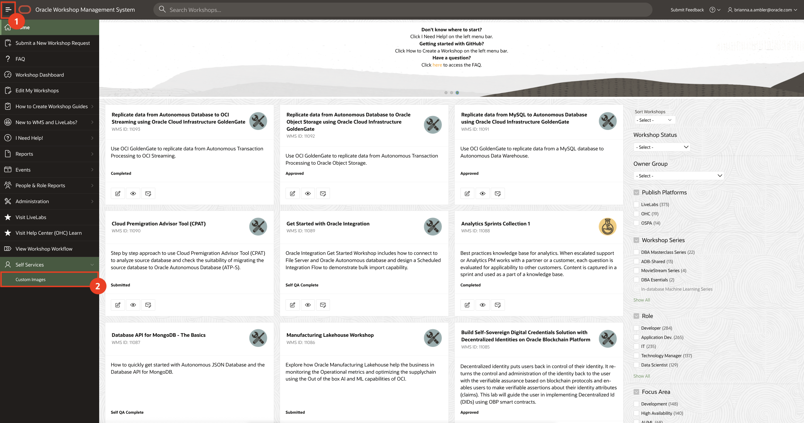
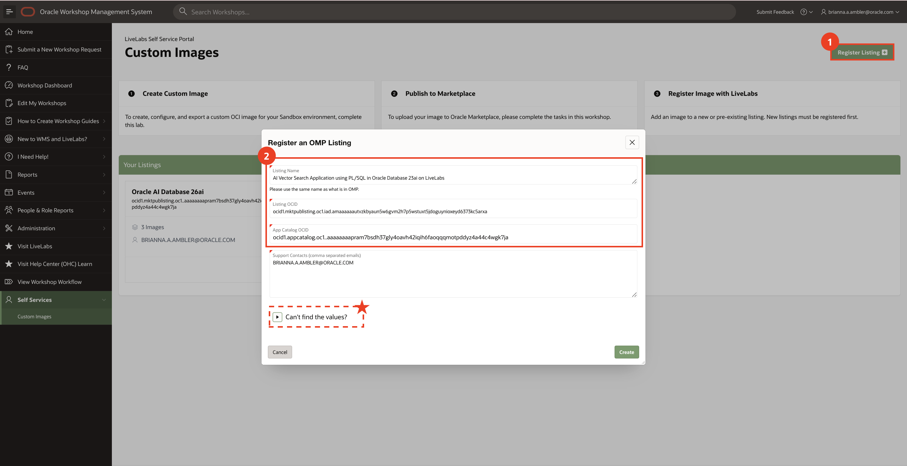
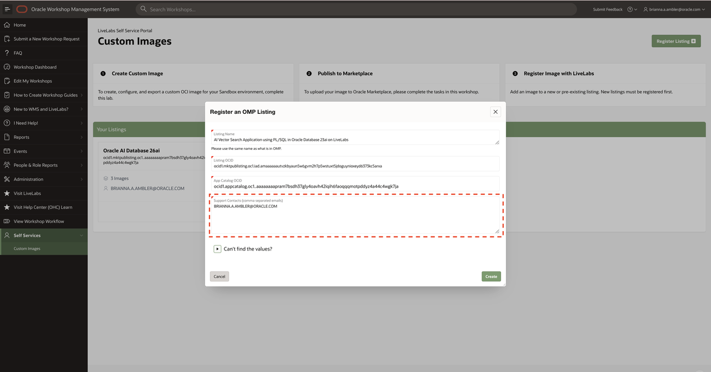
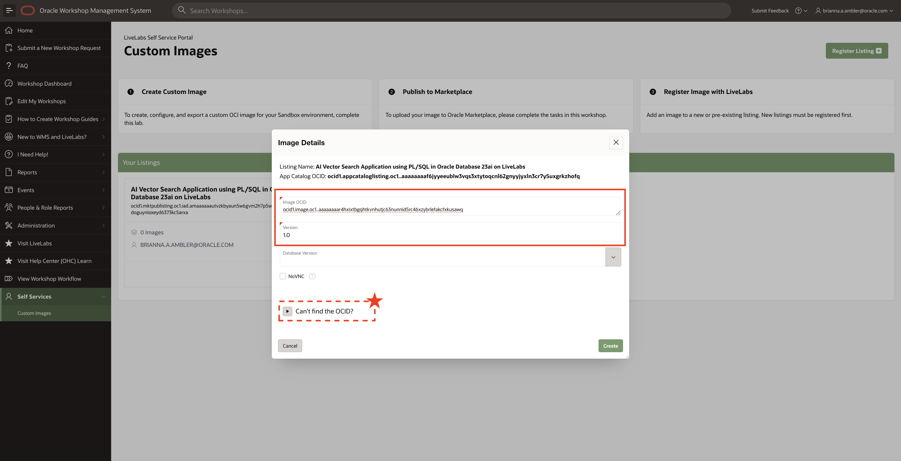
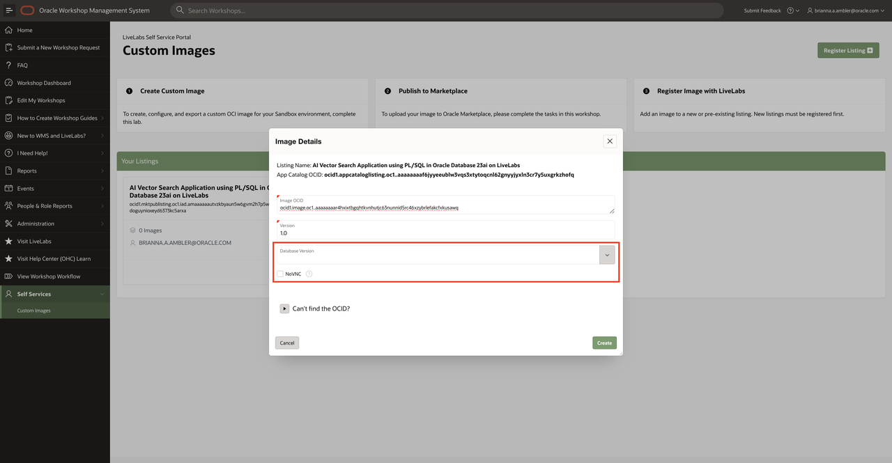
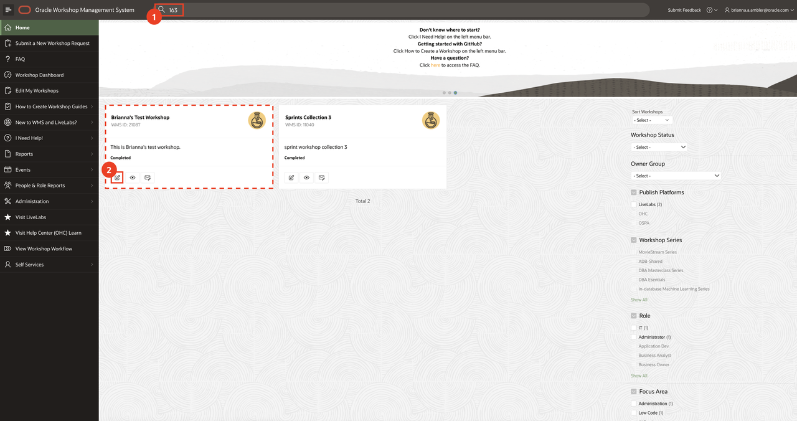
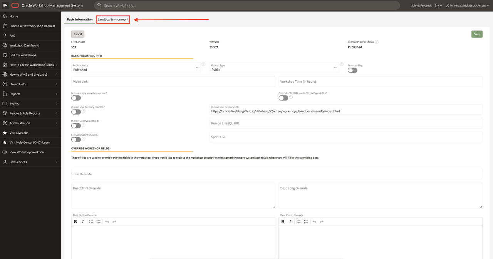
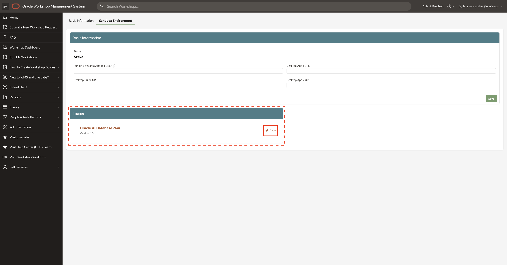
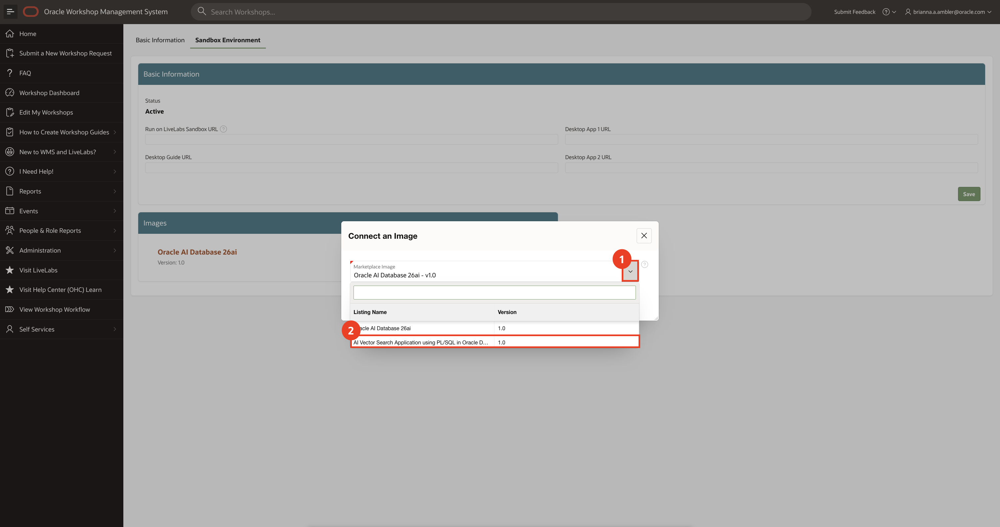

# Add Your Marketplace Listing to Your LiveLab

## Introduction

Yay! You have an image published to Oracle Marketplace. This lab shows you how to update your LiveLab image, accordingly. 
> _**NOTE:** Self-service image updates are only possible for pre-existing Sandbox environments. Otherwise, please refer to our [step-by-step guide](https://oracle-livelabs.github.io/common/sample-livelabs-templates/create-labs/labs/workshops/livelabs/?lab=6-labs-publish) on how to request a new Sandbox Environment._

### Objectives

* Register your Oracle Marketplace listing with Livelabs
* Add the Oracle Marketplace listing to your LiveLab.

## Task 1: Register Your Listing with LiveLabs
1. In your browser, go to the [Workshop Management System ](https://apex.oraclecorp.com/pls/apex/f?p=LIVELABS)(WMS).

2. Navigate to Custom Images in the Self Service portal.

3. Click "Register Listing" and fill in the following information regarding the listing you created in Lab 2. 
* Listing Name (_please be sure to use the listing's name as it is in OMP_)
* Listing OCID
* App Catalog OCID
> TIP: For help finding the correct values, expand the "Can't find the values?" section at the bottom of the form.

4. For others to have user and edit access on the image, please add their emails as a support contact. Be sure to comma-separate the emails.

5. Click "Create".

## Task 2: Add an Image to Your Listing
1. Under "Your Listings", find the listing your image belongs to and press the plus icon.

2. Using information from the image you created in lab 2, fill out the following:
* Image OCID
* Version
> TIP: For help finding the image OCID, expand the "Can't find the OCID?" section at the bottom of the form.

3. If your image uses Oracle Database software, please specify the version. Also, if the image is set up to have remote desktop access, please check the NoVNC box.

4. Click "Create".

## Task 3: Update the Image for Your Sandbox Environment

1. Go to the publishing information page for your workshop.

2. Click the "Publishing" tab. Then, click "Edit" on the LiveLab you wish to update.

3. Click on the "Sandbox Environment" tab.

4. Under images, click "Edit" on the image you'd like to update.

5. Open the drop-down to see all images either owned by you or have you as a support contact. Select the image you'd like to replace the current one.

6. Click "Save".

Your LiveLab is now updated, but don't forget to test it! If there are any issues, please post them in our [Slack Channel](https://oracle.enterprise.slack.com/archives/CTUPZQ5HA).

## Acknowledgements

* **Author** - Brianna Ambler, Database Product Manager
* **Last Updated By/Date** - Brianna Ambler, January
 2026