# Update the Image on Your Sandbox Environment

## Introduction

Yay! You have an image published to Oracle Marketplace. This lab shows you how to update your LiveLab image, accordingly. 
> _**NOTE:** Self-service image **updates** are only possible for pre-existing Sandbox environments. Otherwise, please refer to our [step-by-step guide](https://oracle-livelabs.github.io/common/sample-livelabs-templates/create-labs/labs/workshops/livelabs/?lab=6-labs-publish) on how to request a new Sandbox Environment._

Estimated Time: 15 minutes

### Objectives

* Register your Oracle Marketplace listing with Livelabs
* Add the Oracle Marketplace listing to your LiveLab.

### Prerequisites
* Your listing must be published as private before you can register it in LiveLabs.

## Task 1: Register Your Listing with LiveLabs
 > WARNING: Your listing must be of status 'Published as Private' in OMP before you can register it in LiveLabs. 

1. In your browser, go to the [Workshop Management System ](https://apex.oraclecorp.com/pls/apex/f?p=LIVELABS)(WMS).

2. Navigate to Custom Images in the Self Service portal.
    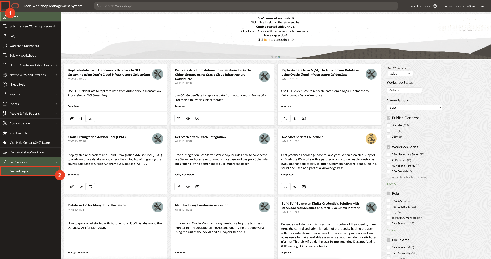

3. Click "Register Listing" and fill in the following information regarding the listing you created in this [lab](https://oracle-livelabs.github.io/common/sample-livelabs-templates/create-labs/labs/workshops/livelabs/?lab=7-labs-create-custom-image-for-marketplace). 
    * Listing Name (_please be sure to use the listing's name as it is in OMP_)
    * Listing OCID
    * App Catalog OCID
    > TIP: For help finding the correct values, expand the "Can't find the values?" section at the bottom of the form.

    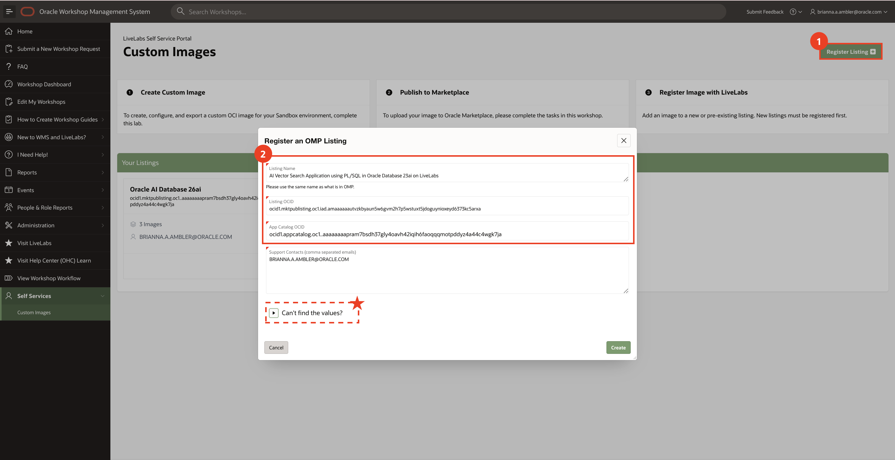

4. For others to have user and edit access on the image, please add their emails as a support contact. Be sure to comma-separate the emails.
    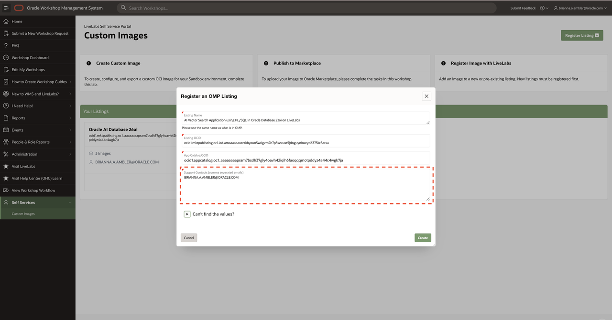

5. Click "Create".

## Task 2: Add an Image to Your Listing
1. Under "Your Listings", find the listing your image belongs to and press the plus icon.
    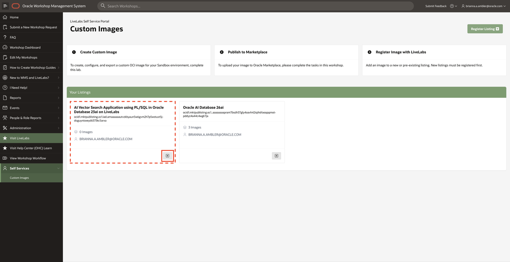

2. Using information from the image you created in this [lab](https://oracle-livelabs.github.io/common/sample-livelabs-templates/create-labs/labs/workshops/livelabs/?lab=7-labs-create-custom-image-for-marketplace), fill out the following:
    * Image OCID
    * Version
    > TIP: For help finding the image OCID, expand the "Can't find the OCID?" section at the bottom of the form.

    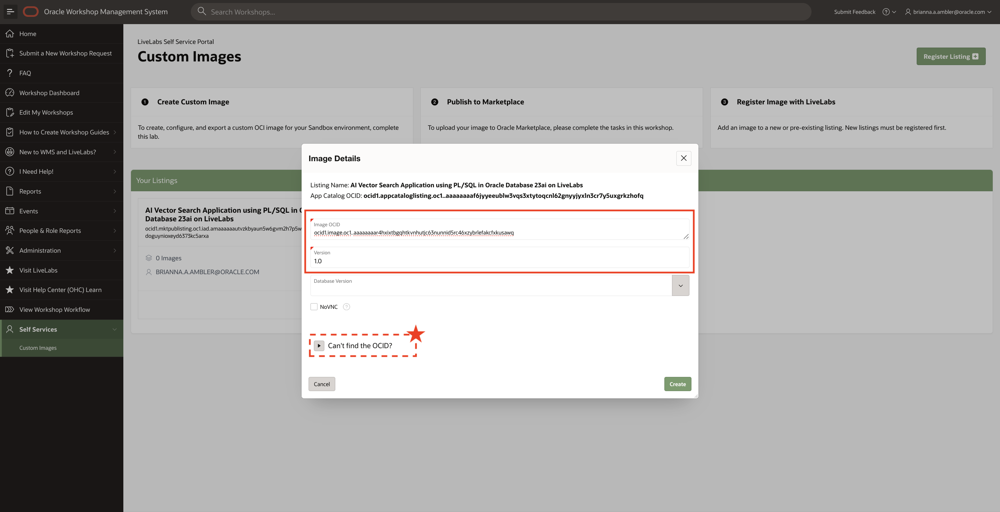

3. If your image uses Oracle Database software, please specify the version. Also, if the image is set up to have remote desktop access, please check the NoVNC box.
    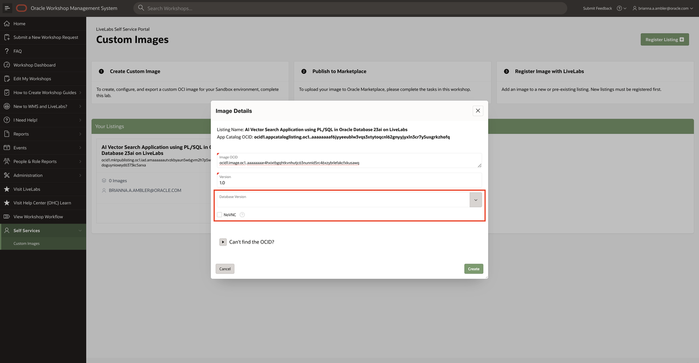

4. Click "Create".

## Task 3A:  Update the NON-TERRAFORM Image for Your Sandbox Environment 

Use this task only if your Sandbox environment is not using a Terraform stack to launch the image. If your Sandbox launches the image from a Terraform stack, the image will not appear on the Sandbox Environment tab. Complete Tasks 1 and 2, then follow Task 3B instead.

1. Go to the publishing information page for your workshop.

    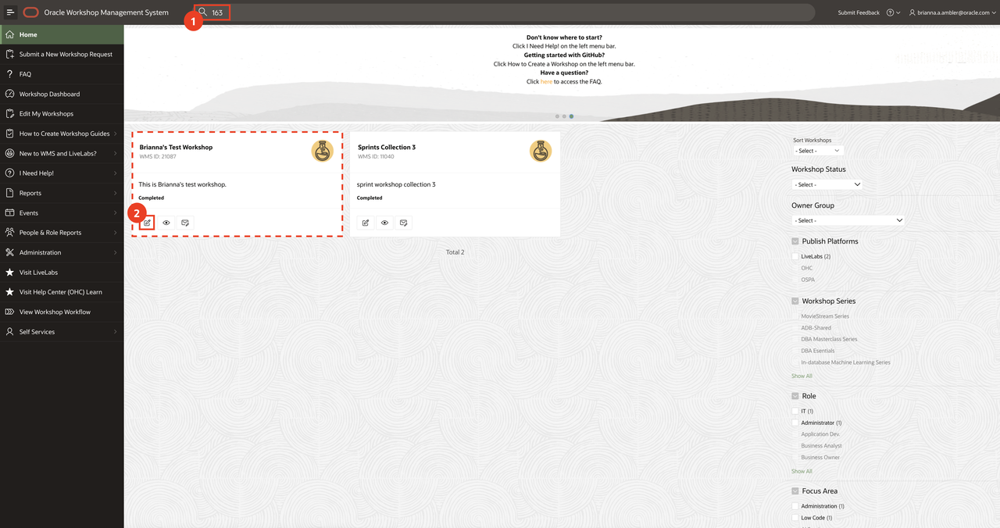

2. Click the "Publishing" tab. Then, click "Edit" on the LiveLab you wish to update.
    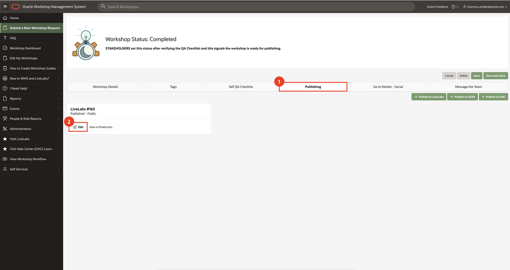
    
3. Click on the "Sandbox Environment" tab.
    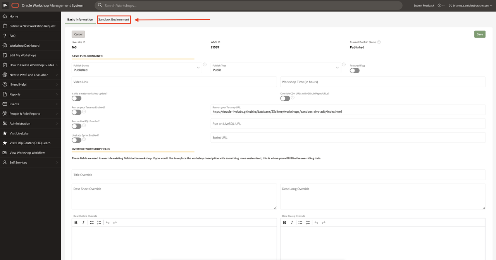

4. Under Images, click "Edit" on the image you'd like to update.
    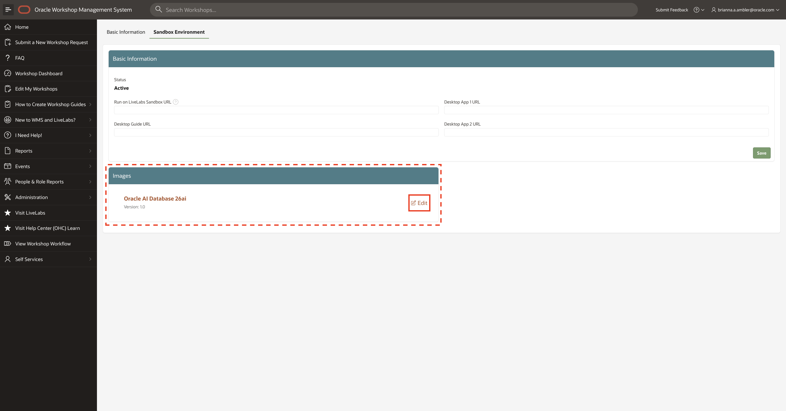

5. Open the drop-down to see all images either owned by you or that have you listed as a support contact. Select the image you'd like to use in place of the current one.
    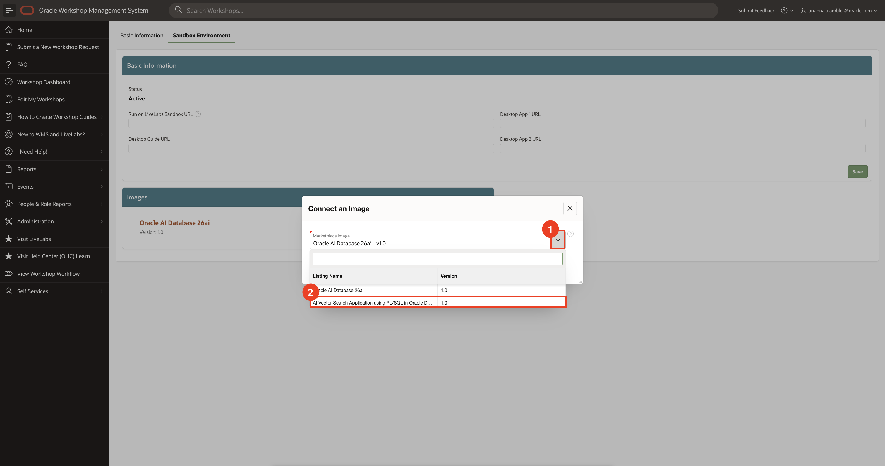

6. Click "Save".

## Task 3B:  Update the TERRAFORM Image for Your Sandbox Environment 

Use this task if your Sandbox environment launches the image from a Terraform stack. Currently, terraform edits must be done by LiveLabs administrators. Please follow the follow the instructions below to request an image update for your terraform stack.

1. Find the Jira ticket for your sandbox or image-update request.

2. In WMS, Locate the ID of the image you want your stack updated to, using the image below as a guide.

    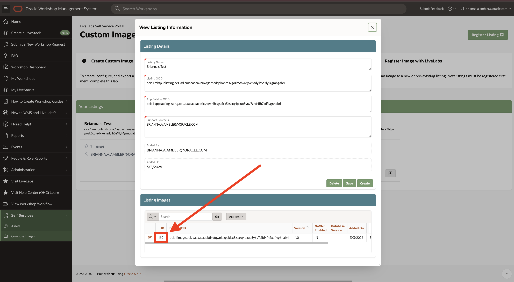

3. Add a comment to your Jira ticket that requests the Sandbox Terraform stack update and includes the new image ID.

    "Please update my terraform stack for LL ID #X to use image ID #X."

4. Wait for the LiveLabs team to reply with confirmation that the Sandbox stack has been updated.

5. Create a new LiveLabs reservation and test that your workshop is using the new image and functioning as expected.

## Acknowledgements

* **Author** - Brianna Ambler, Database Product Manager
* **Last Updated By/Date** - Brianna Ambler, June
 2026
