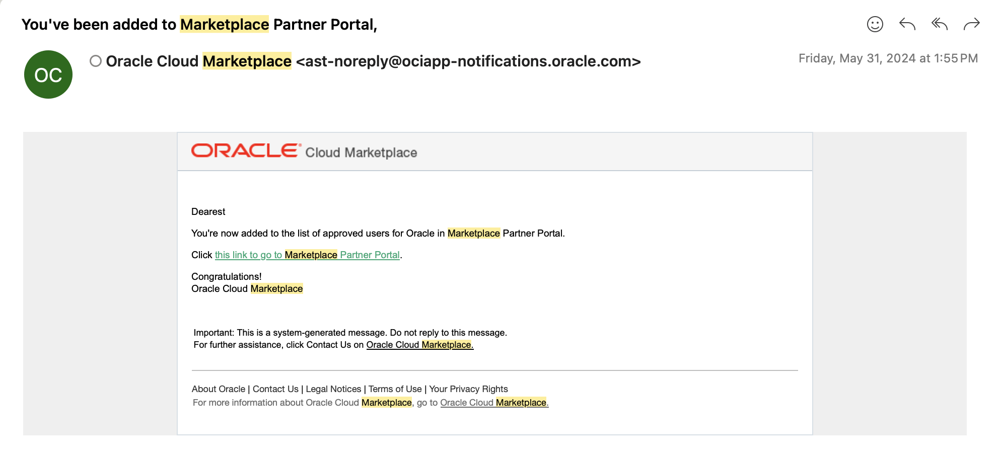

# Get Publisher Access in Oracle Marketplace

Welcome! This quick guide will help you get publisher access on Oracle Marketplace.

## Objectives
- Get publisher access and start posting your offerings.

## Task 1: Get Publisher Access

1. Follow the [instructions provided by OMP](https://cloudmarketplace.oracle.com/marketplace/en_US/partnerLandingPage). If you already have an Oracle tenancy, you only need to complete steps 3 and 5.

2. After registering for an OMP publisher account (step 5), you will receive an approval email shortly. This means you are now able to create listings on Oracle Marketplace!  
   

That's it! Once you're approved, you can begin creating listings. You may now proceed to the next lab.

## Need Help?
- Ask questions in the [Marketplace Slack channel](https://oracle.enterprise.slack.com/archives/CEKCPA98B)
- Check out the [Partner Portal Docs](https://docs.oracle.com/en/cloud/marketplace/partner-portal/index.html)
- Watch [Partner Portal Videos](https://docs.oracle.com/en/cloud/marketplace/partner-portal/videos.html)

## Acknowledgements
* **Author** - Brianna Ambler, Database Product Manager, September 2025
* **Contributors**  - Brianna Ambler, Database Product Manager, September 2025
* **Last Updated By/Date** - Brianna Ambler, Database Product Manager, September 2025