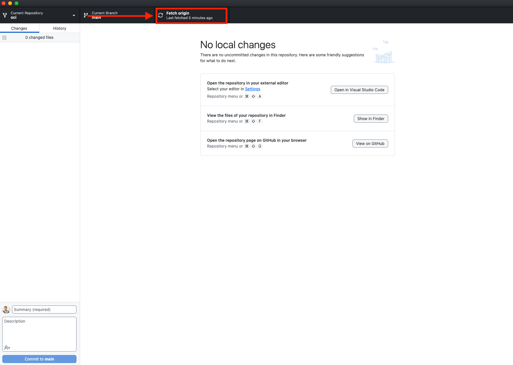
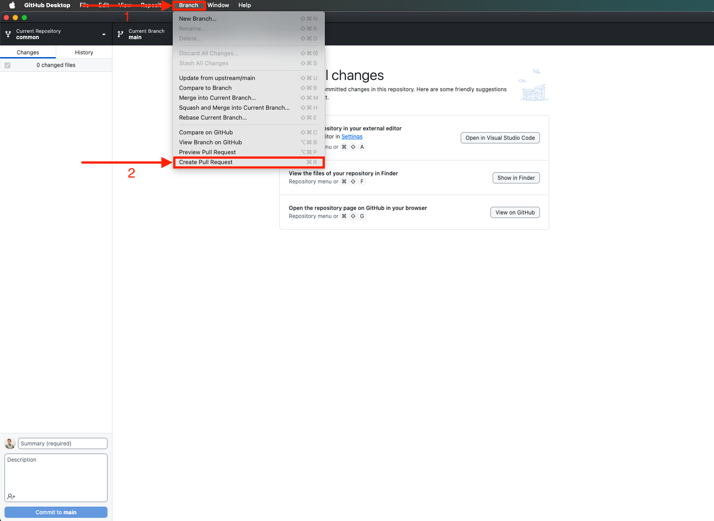
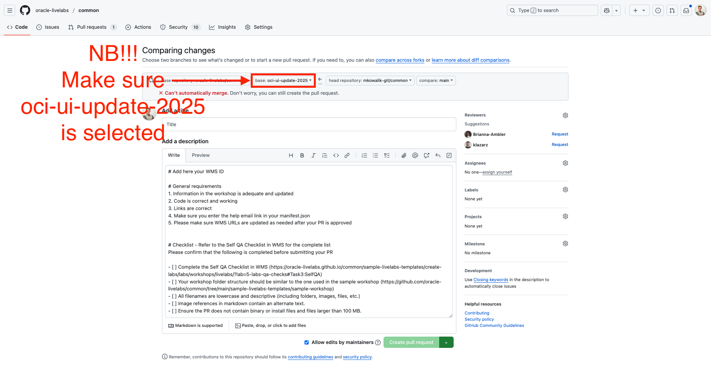

# Maintenance: OCI UI Update 2025

## Introduction

As part of a major UI update, it’s essential to review and update workshops to ensure accuracy. This guide walks you through the process of making changes in GitHub using a feature branch.

By following these steps, you will:
- Check if the content is still relevant and up to date.
- Verify if any workflows have changed.
- Determine whether screenshots need updating.

Using a feature branch allows for a structured and controlled way to make updates without affecting the main branch until the changes are reviewed and approved.

### Objectives

By the end of this guide, you will be able to:

* **Fork and clone a repository** using GitHub UI and GitHub Desktop.
* **Sync with upstream updates** to ensure you are working with the latest version (GitHub Desktop).
* **Make changes using VS Code**, including updating content and modifying screenshots if needed.
* **Push changes** to your feature branch.
* **Open a pull request** using GitHub Desktop and GitHub UI, ensuring the correct branch is selected for review.

> These steps will help you update your workshop effectively while maintaining version control best practices.

## Task 1: Fork and clone repository (GitHub UI + GitHub Desktop)

To begin making changes, you need to **fork** the repository. This creates a personal copy of the repository under your GitHub account, allowing you to make updates without affecting the original project.

Follow the steps in the official documentation to fork and clone the repository:
[How to Fork a Repository](https://oracle-livelabs.github.io/common/sample-livelabs-templates/create-labs/labs/workshops/livelabs/?lab=3-labs-sync-github)

> 📌 **Note:** If you have already completed this step, continue to **Task 2**.

## Task 2: Sync with Upstream Updates (GitHub Desktop)

To ensure you're working with the latest version of the repository, you need to sync your fork with the upstream repository. This helps prevent merge conflicts before final integration.

### Steps to Sync:
1. Open **GitHub Desktop**.
2. Click **Fetch Origin** to check for updates.
3. Go to **Branch > Merge into Current Branch**.
4. Select **main** to pull the latest changes from the upstream repository.
5. Click **Push Origin** to update your fork with the latest changes.

> 📌 **Note:** **Keeping your fork up to date helps avoid merge conflicts later.**

Once your fork is up to date, continue to **Task 3**.

## Task 3: Make Changes Using VS Code

Once your repository is up to date, you can start making edits using **VS Code**.

### Steps to Edit Content:

1. Open **VS Code**.
2. Select **File > Open Folder**, then choose the cloned repository.
3. Make edits to the workshop content as needed.
4. Open the **Source Control Panel** (`Ctrl+Shift+G`) to review your changes.
5. Save your changes.

Once your edits are complete, continue to **Task 4**.

## Task 4: Pushing Changes (GitHub Desktop)

After making edits in VS Code, you need to **commit and push** your changes to your feature branch in GitHub.

### Steps to Push Changes:

1. Open **GitHub Desktop**.
2. Review the list of changes in the **Changes** tab.
3. Add a commit message describing your updates.
4. Click **Commit to main** to save the changes locally.
5. Click **Push Origin** to upload the changes to your GitHub repository.

> 📌 **This step ensures your updates are stored in your GitHub fork.**

Once your changes are pushed, proceed to **Task 5**.

## Task 5: Open a Pull Request (GitHub Desktop + GitHub UI)

After pushing your changes, you need to open a **Pull Request (PR)** to submit your updates for review.

### Steps to Open a Pull Request:

1. Go to **GitHub** and navigate to **Your Fork**.
2. Click on **Pull Requests** > **New Pull Request**.
3. Set the following branch details:
   - **Base Branch:** `ui-update-2025` (from the base repository).
   - **Compare Branch:** `main` (from your forked repository).
4. Add a title using the following format:
   - Workshop###<your workshop> + OCI-UI-UPDATE-2025
   - > Replace `###<your workshop>` with the actual workshop number and title you are updating.
5. Fill in the **description** field with relevant details about your changes.
6. Click **Create Pull Request** to allow review (this prevents merging until approved).
7. If any merge conflicts appear, resolve them before proceeding.
8. Once everything is approved, click **Merge Pull Request**.

> For a visual reference, see:

<!--  -->

<!--  -->

> 📌 **Note:** **This process ensures content is reviewed progressively while avoiding premature merges.**

With this step completed, your changes are now submitted for review! 🚀

## Acknowledgements
* **Author:**
    * Matt Kowalik, Senior Product Manager, Oracle Database Product Management
* **Contributors:**
    * Hope Fisher, Product Manager, Oracle Database Product Management
    * Ramona Magadan, Technical Program Manager, Oracle Database Product Management

* **Reviewed by:**
    * Kevin Lazarz, Senior Manager, Product Management, Oracle Database Product Management

* **Last Updated By/Date:**
    * Matt Kowalik, Senior Product Manager, Oracle Database Product Management, March 2025