# Screen Capture: Essential Best Practices

## Introduction

High-quality screen captures are essential for creating professional workshops, documentation, technical support, and product demonstrations. By mastering the art of the screenshot—prioritizing environment preparation, data privacy, and technical optimization—you can transform simple images into powerful communication tools that minimize risk and maximize clarity. 

This lab outlines some of the best practices for creating Oracle LiveLabs workshops. You will learn to plan, capture, and edit images that maintain the high standards of professionalism, security, and accessibility required for global documentation.

Estimated Time: 20 minutes

### Objectives

* Obtain and use Techsmith Snagit to capture screens
* Review screen captures best practices at a high level
* Resize images in Snagit
* Edit and enhance screen captures
* Redact sensitive information in screen captures
* Use the check unused images tool to list unused and missing screen captures in a lab

### What Do You Need?
* Techsmith Snagit annual subscription which you can order using iProcurement. 
* Learn how to how use Snagit: https://www.techsmith.com/learn/tutorials/snagit/

Snagit's core components are the **Capture Window** (for selecting what to capture – image, video, scrolling, etc.) and the **Snagit Editor** (where you annotate, edit, and organize your captures). You can customize the Toolbar, the Library (for storage), and various Capture Presets and features like AI step capture (if your Snagit version supports that), scrolling capture, and video recording tools. 

The **Capture Window**.

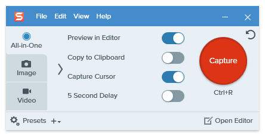

The **Snagit Editor**.

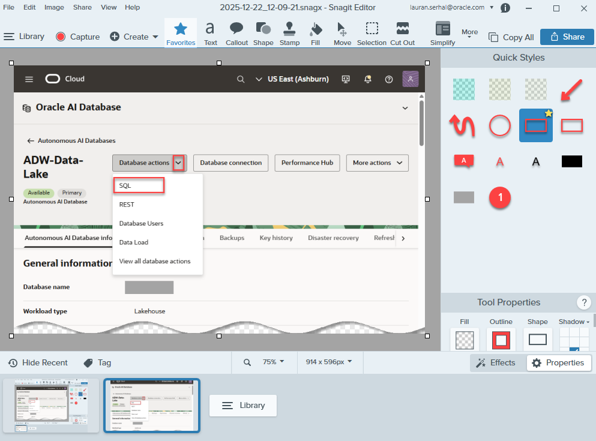

## Task 1: Use screen captures best practices

Here are the best practices steps to follow at a very high level which we will explain below in detail.

**1. Plan Your Screen Captures**    
- **Be Selective:** Only capture screens that add value to your content.
- **Focus on the Result:** For multi-step or complex tasks, prioritize showing the end state instead of every intermediate step.
- **Avoid Redundancy:** Don’t capture every basic or repetitive action; describe simple or repeated navigation steps with text instead.
- **Reuse When Possible:** If you already captured and annotated a screen, reuse it (if you must) rather than capturing and editing again.
- **Text Alternatives:** Use text instructions for repeated or simple navigation steps (such as navigating to ADB or the SQL worksheet).

**2. Prepare Before Capturing**    
- **Resize for Clarity:** Avoid full-screen captures, especially on large/high-resolution monitors. Set captured windows to a maximum width or height of **1280 pixels or less** in line with the new LiveLabs screen captures guidance. Tools such as Snagit enables you to specify dimensions.
- **Clear Your Workspace:** Close unnecessary applications, tabs, and windows. Hide any personal bookmarks or sensitive browser elements to avoid accidental disclosure.
- **Crop to Content:** Capture only the relevant content. You can crop in your capture tool such as Snagit’s **Cut Out** and **Selection** tools to remove distractions and excess white space as needed.

**3. Capture Screens Effectively**
- **Use the Right Tool and Area:** Tools such as Snagit (**Capture > All-in-one or Image options**) let you select only what you need such as a window, scrolling window, panel, dialog box, menu, section and so on.

    **All-in-one** default option:
    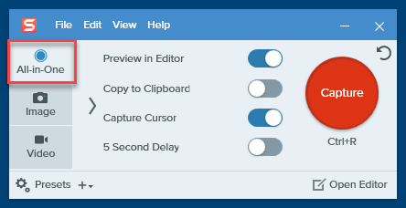

    **Image** option:
    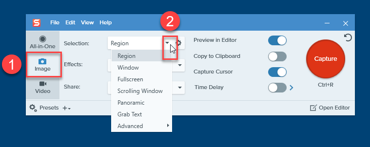

- **Task-Based Images:** Every screen capture should have a clear instructional purpose. Capture with purpose. Only show what is needed for a task. For example, resize and select only the area illustrating the immediate objective.

    For example, to illustrate navigation to the SQL Worksheet, resize your Oracle AI Database page, click and highlight the **Database actions** drop-down list and the SQL option. For the red rectangle line thickness, use 4 pts on laptops or 3 pts on large monitors (we used shadow as well). To crop the rest of the page that is not relevant to the task at hand, we used the **Cut Out** tool in Snagit.

    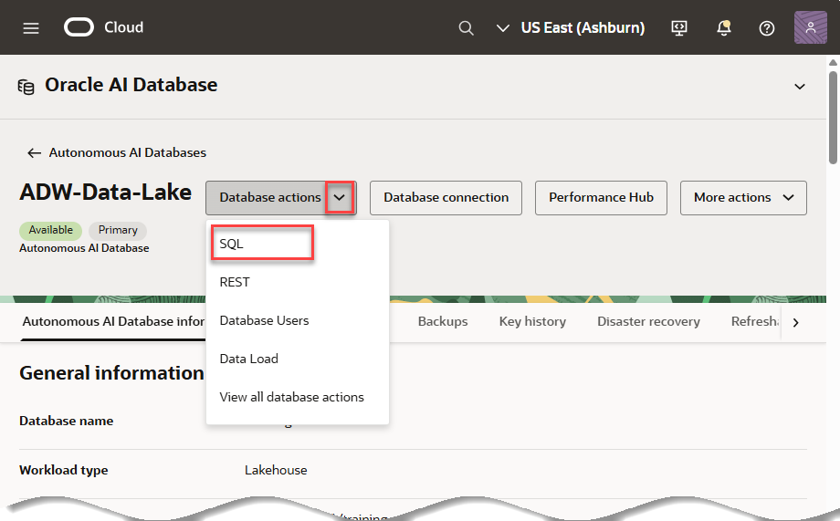

**4. Edit and Enhance**     
- **Use Consistent Markups for Clarity:** Use the same editing software and styles across all content to maintain visual consistency among multiple authors and workshops. We highly recommend that you use Snagit to both capture and edit screens. This promotes consistency across all workshops.

- **Annotate with Purpose:**
    - Use simple shapes (rectangles, arrows, callouts, shapes, and so on) to highlight important elements.
    - Keep annotations simple and avoid overcrowding.
    - Add brief and clear text labels where/if helpful.
    - Check that annotation colors and fonts are high-contrast for accessibility.

    The following screen capture shows some favorite Snagit quick styles that we saved as our favorites. This makes it easier and faster to add consistent styles to the labs in a workshop.

    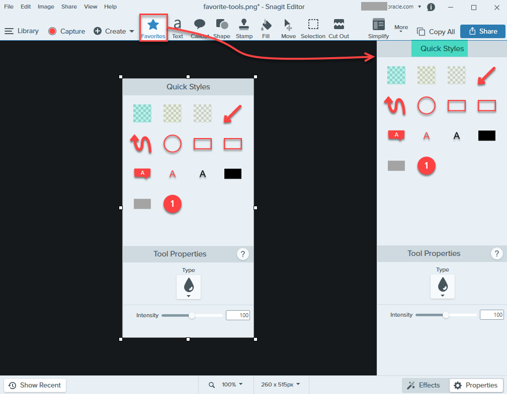

- **Redact Sensitive Information:** As per Oracle’s privacy and security standards, thoroughly remove, cover, and flatten (not blur) personal identifiers, emails, usernames, or sensitive data. This is covered in a later section.
- **Review thoroughly:** Before saving, double-check for clarity, relevance, and privacy compliance.

**5. Save and Share Consistently**

- **Choose the Right File Format:**
    - Use **`PNG`** for UI elements and text-heavy images.
    - Use **`JPEG`** only for photos or images with gradients.
- **Image Quality:** Avoid saving highly compressed or visibly low-quality images.
- **File Naming:** Use clear, standardized, and descriptive filenames such as adb-home-page.png.
- **Accessibility:**  Every image must have descriptive alt text (e.g., “Screen capture showing the Database Actions drop-down list with SQL highlighted”). See current Oracle Accessibility Guidelines, https:oracle.com/corporate/accessibility/, for more on writing alt text.
- **Maintain Consistency:** Ensure similar resolution, annotation styles, and borders throughout your workshop. This helps reinforce a professional and trustworthy experience.

**Quick Checklist**

- Only capture screens relevant to the step or instruction
- Resize windows to 1280px width or less
- Remove all distractions and any personal or sensitive data
- Use tool-consistent and accessible annotation styles
- Review all images for privacy, clarity, and accuracy
- Save images in appropriate formats (PNG for UI, JPEG for photos/gradients)
- Use clear, consistent filenames (e.g., feature-step-action.png) and manage versions
- Add accurate, descriptive alt text for each image
- Follow Oracle’s security, accessibility, and privacy protocols throughout

## Task 2: Resize images to the new max allowed size of 1280 pixels

You can force image resizing in Snagit. Snagit provides several ways to resize images either during capture or after the image has been captured in the Snagit Editor.

### **How to Resize Images in Snagit**

**After Capturing an Image (Snagit Editor)**

>**Note:** For detailed information on how to resize a captured image, see Techsmith blogs and [tutorials](https://www.techsmith.com/learn/tutorials/snagit/) such as [How to Resize an Image or Picture the Right Way](https://www.techsmith.com/blog/how-to-resize-an-image-correctly/).

1. Open your image in Snagit Editor. 

2. To resize your image, go to **Image > Resize Image** from the menu bar; alternatively, click the **Resize Image** box in the **Recent Captures Tray** under the image. The **Resize Image** dialog box is displayed.

3. Before you change the dimensions, enable the **lock** icon if it's not already activated. With the lock activated, Snagit maintains the image’s original proportions (aspect ratio). Now, you can adjust the height or width of your image to the desired dimensions without worrying about stretching or warping it.

    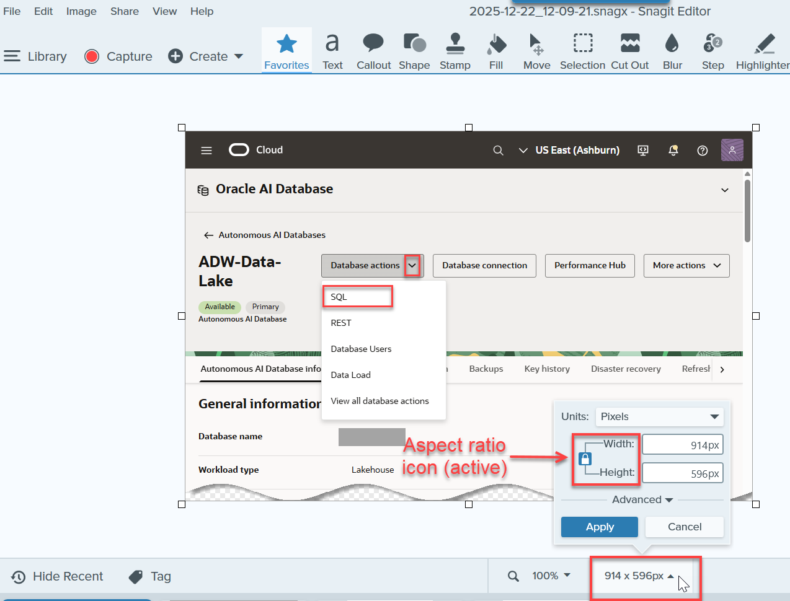

    >**Note:** If the aspect ratio icon is not activated, it would look as follows:

    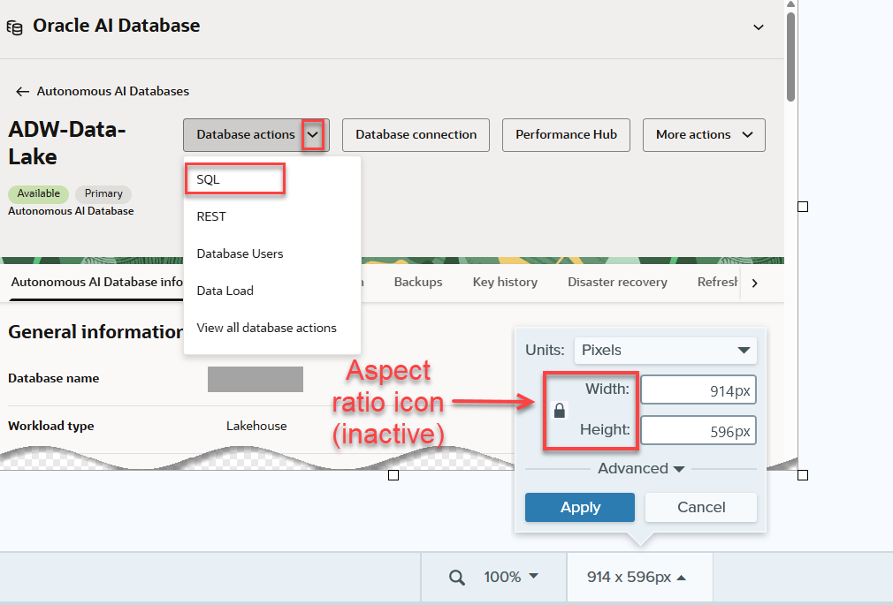

4. In the **Resize Image** dialog box, you can set the new width and height. The available options for dimensions are `pixels` (default), `percent`, or `inches`. Set your dimensions in `pixels`. Since the lock icon is active, you can simply set the Width to **1280 or less**. The height value is automatically resized for you. Generally speaking, dimensions between 600 and 1280 pixels should be a good fit for most screens without compromising quality. As a general rule, we’d suggest aiming for a file size of less than 100KB-200KB or less (a few exceptions are OK). This size tends to provide a good balance between image quality and file size.

    > _**Important:** Make sure that you choose a max size of **1280 pixels** or less as this is the new LiveLabs requirement starting in February 2026. If you don't, your pull request will be blocked until you resize the unconforming images._

5. After you change the image's width, click **Apply** to resize it.

**During Capturing of an Image (Presets)**

Snagit doesn’t resize during capture by default, but you can set up capture **presets** for specific capture dimensions. For detailed information about presets, see [Save Capture Settings as Presets](https://www.techsmith.com/learn/tutorials/snagit/presets/#:~:text=Import%20a%20Preset,Click%20Save).

**Batch Image Resizing**

You can use the batch convert images feature to apply a change to a group of images, such as changing the file format, applying effects, resizing, 
or changing the filenames. This might be a good option to test and use given the new LiveLabs requirements of a maximum image size of 1280 pixels.

>**Note:** The steps for batch image resizing might be different depending on your version of Snagit and the OS that you are using. In our example, we are using Snagit 2022 on a Windows machine.

For detailed information on Batch Convert Images, see [Batch Convert Images](https://www.techsmith.com/learn/tutorials/snagit/batch-convert-images/#:~:text=and%20numbering%20options.-,Click%20Next.,images%20to%20the%20selected%20location.).

## Task 3: Redact sensitive information in screen captures — The right way

Redacting information in a screenshot means making it truly disappear—so it can never be recovered by software, not just hidden from view. Here’s how to do it securely with TechSmith Snagit:

### **Skip Weak Redaction Tricks**
- Don't blur, pixelate, or use transparent overlays. These methods can often be undone.
- Don't use black rectangles or highlights on separate layers unless you flatten the image.

### **Redact Images Automatically Using Snagit Smart Redact Tool**    
Smart Redact is a feature in Snagit that automatically detects and redacts sensitive information such as email addresses, phone numbers, and other identifiable text from your images. 

>_**Note:** Smart Redact is only available in Snagit 2023 and later versions. If you don’t see this option, you might need to update your version. If that is not an option, use the **Redact Manually Using Snagit** information described later in this section._

Here’s how to use **Smart Redact** in Snagit:

**1. Capture or Open an Image:** Capture a screenshot using Snagit, or open an existing image in the Snagit Editor.

**2. Select the Smart Redact Tool:** In the Snagit Editor, look for the **Smart Redact** tool in the toolbar on the right side (or within the “More” tools if you don't see it immediately).

**3. Apply Smart Redact:** Click the **Smart Redact** tool. Snagit will automatically scan the image for recognizable text (like email addresses, phone numbers, etc.) and apply a redaction effect (usually a black bar or box) over these elements.

**4. Review and Adjust:**
- Carefully review the redacted items.
- You can manually adjust or remove a redaction by selecting a box and deleting or resizing it.
- You can also **add additional redactions** by drawing a new redaction box over any region not caught automatically.

**5. Save:** Once you’re satisfied, save your redacted image as usual.

**Notes:**
- Smart Redact is available in Snagit 2023 and newer. If you don’t see the option, you might need to update your version.
- The feature works best with images that have clear, legible text.
- Always verify that all sensitive information has been properly redacted, as automated tools may sometimes miss less obvious data.

**Resources:**  
- For more detailed instructions, visit the [TechSmith Snagit help site](https://support.techsmith.com/hc/en-us/categories/360002219011-Snagit).

### **Redact Manually Using Snagit**
If you have an older version of Snagit, you can manually redact screen captures as follows:

1. Always work on a copy of the original image.
2. For **Extra security**, use Snagit’s **Rectangle Selection**, select the sensitive area, and then press **[Enter]** to delete it. This leaves a blank space.

    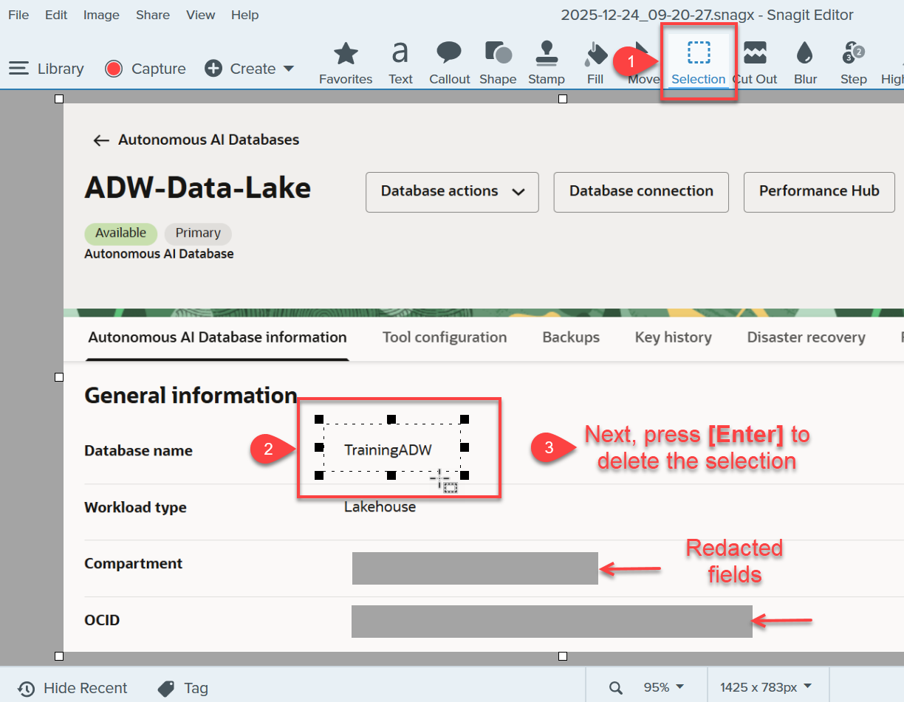

3. Fill the blank space with a solid, opaque color (never transparency). I don’t like black which makes the redaction looks like a government document redacted. I use another color for clarity.

    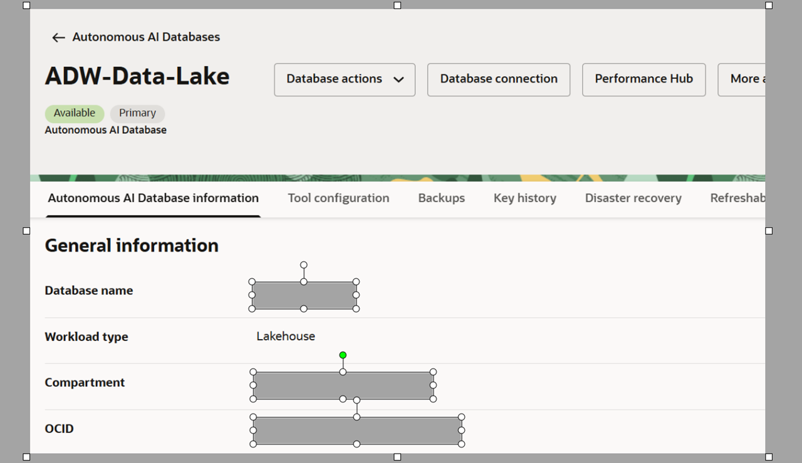

4. Flatten all image layers, **Image > Flatten All**.

    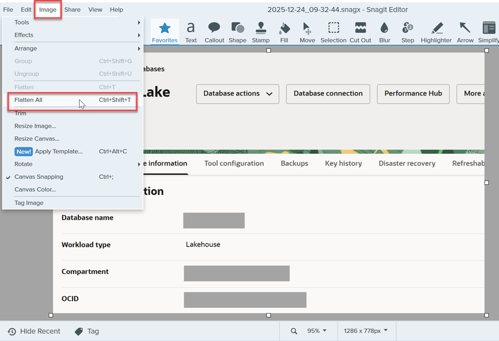

5. Save the edited capture as a new **`.PNG`** file to avoid leaving hidden data.

**Check and Share**
- Review your redacted screen capture to confirm nothing can be restored.
- Only share or store the redacted version.

**Remember:**
For true security, always erase or overwrite sensitive data, flatten the file, and save a new copy. Never rely on any method that just hides information from sight. 
 
## Task 4: Remove unused images from a lab using the Check Unused Images Tool

### About the Check Unused Images Tool

The Check Unused Images (CUI) tool helps you identify unused or missing images from the images folder that is associated with a LiveLabs Markdown file (your lab) that you specify in this tool. 

The tool:

* Lists all extra (unused) images in the `images` folder that is associated with your lab's `.md` file that you specify in this tool. 
* Lists the unused images in the your selected lab on the right-hand side of the page.
* Lists any images that are referenced in the lab `.md` file that you select which are missing from the images folder. 
* List missing images on the left-hand side of the page.

>**Note:** During the development of this lab, we used several of the Snagit tools that we suggested earlier to enhance and optimize the screen captures. Some of the tools that we used: 

- The following styles in the **Cut Out** tool in the Snagit Editor: `Horizontal`, `Vertical`, `Horizontal Wave` to remove extra white space and areas that are not in focus or relevant to the step being discussed. 
- Used the **Selection** tool to remove certain parts of a screen.
- Resized the captured images to a max width size of 1280 (if it was larger) with the aspect ratio (lock icon) automatically active. 
- Added red rectangular shapes to highlight areas on the screen. 
- Added red text to supplement the UI area(s) being discussed. 
- Added red arrows to bring the users focus to what is being discussed. 
- Used the **Selection > Auto-fill** tool to remove personal or irrelevant areas in a Web browser capture.
- Yellow and blue highlighters to highlight parts of the captured screen. 
- The red step tool to show the process on a captured screen. 

### How to Use the Check Unused Images Tool?

To access and use the CUI tool, use the following steps:

1. Navigate to the [Lab Creator Tool](https://oracle-livelabs.github.io/common/tutorial_creator/), and then click the **Check Unused Images** link at the top of the page. 

    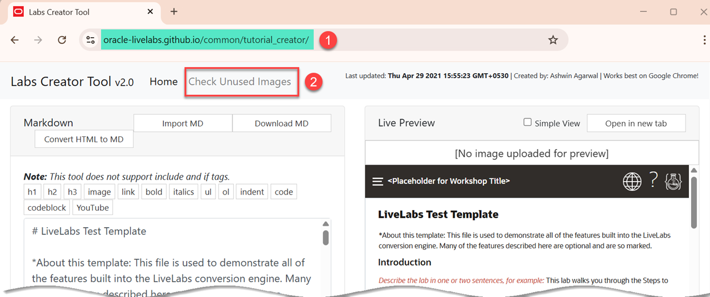

2. The **Check Unused Images** page is displayed. 

    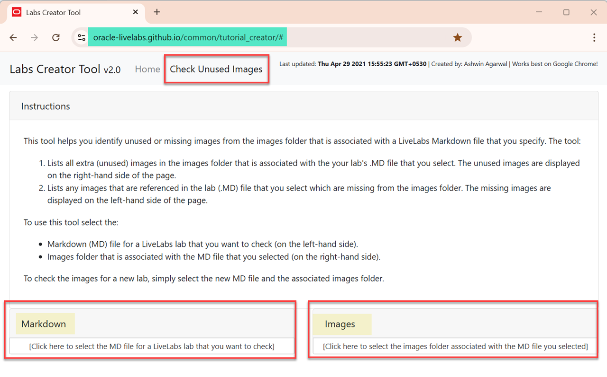

3. In the **Markdown** section, click the **Click here to select the MD file for a LiveLabs lab that you want to check** box. 

    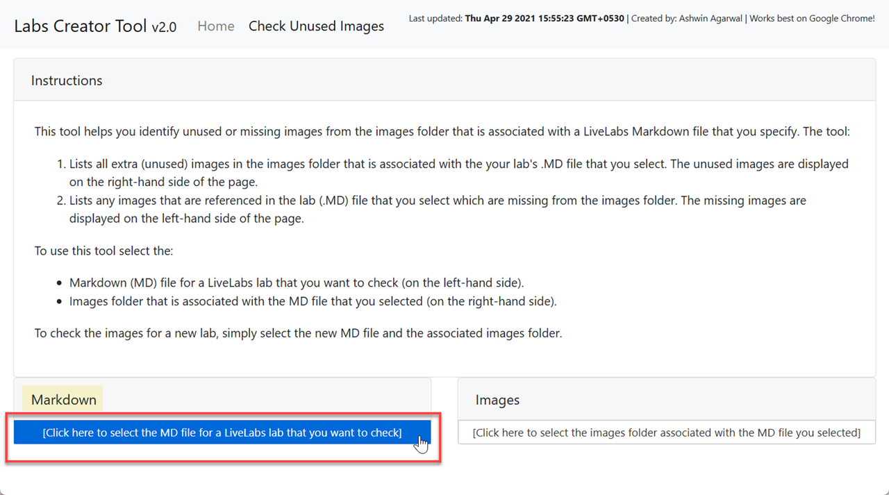

4. In the **Open** dialog box, navigate to the lab that contains the `.md` file that you'd like to check for extra images, and then click **Open**.

    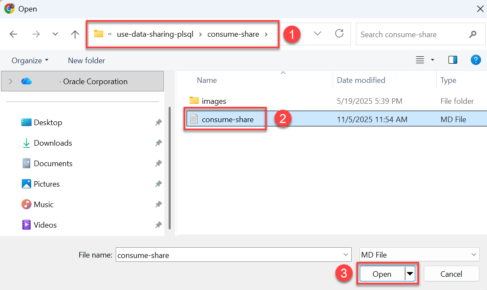

    A message about the number of images that are referenced by your selected `.md` file and that were uploaded is displayed. 

    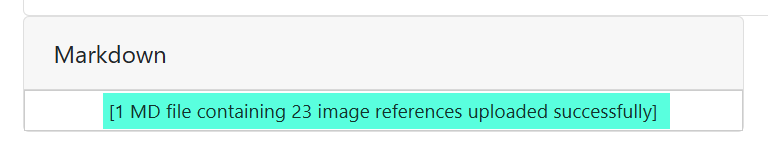

5. In the **Images** section, the click **Click here to select the images folder associated with the MD file you selected** box, and choose the folder associated with your lab's `.md` file. 

    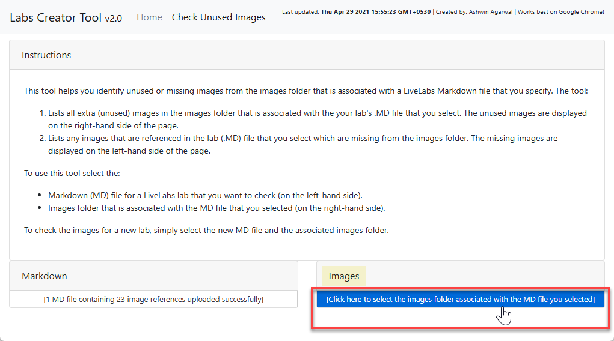

6. In the **Open** dialog box, select the **images** folder that is associated with the `.md` file that you already selected, and then click **Upload**. This will upload all of the image files in the **images** folder.

   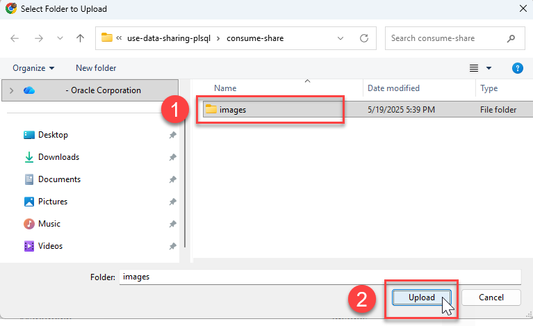

7. A confirmation message box about the number of image files that will be uploaded is displayed. Click **Upload**. 

    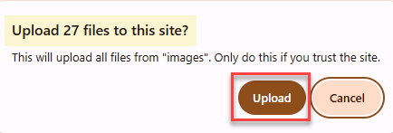

8. The results page displays the following information based on your selections:
    - The markdown file that you selected.
    - Images referenced in the `.md` file but that are missing in the `images` folder. If this applies to your lab, add the missing images to the folder.
    - The number of images in your selected `images` folder. 
    - All images in the `images` folder.
    - Extra images in the `images` folder. If this applies to your lab, simply delete the extra image files. In this example, we have (5) extra images that we need to delete. 

    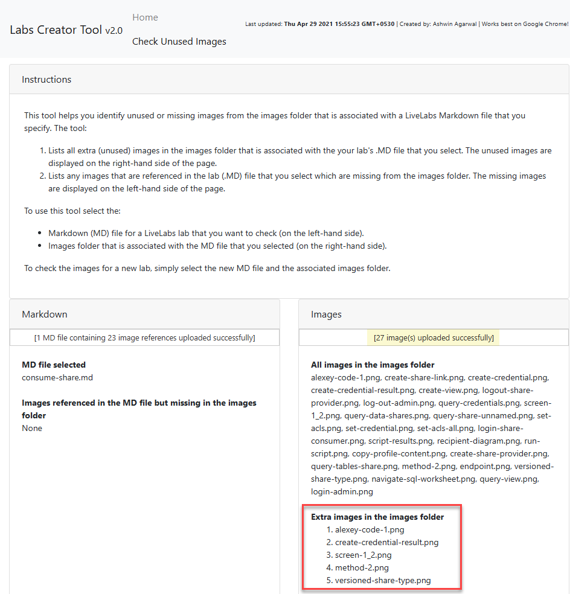

9. Navigate to the lab's `images` folder. Select and delete the extra images. **Important:** In this example, we selected the `create-credential.png` file that is not an extra file and is actually used in the lab so that we can re-test the tool again. 

    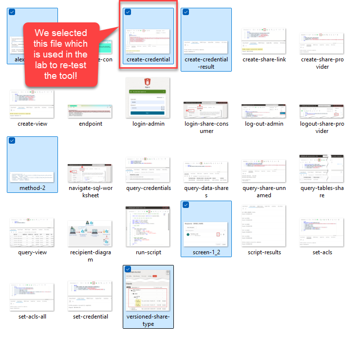

10. Re-run the **Check Unused Images** tool to ensure that you did delete all of the extra images; more importantly, you want to make sure that you didn't delete any file that is needed accidentally. Click the `images` folder. A confirmation message box about the number of image files that will be uploaded is displayed. Click **Upload**. The **Extra images in the images folder** field shows **`None`**; however, the
**Images referenced in the MD file but missing in the images folder** section, shows that the `create-credential.png` file that we deleted on purpose. We'll need to restore this file! 

    

11. In our example, we are using a MS-Windows machine. To restore a deleted file, open the Recycle Bin icon on your desktop. Locate and right-click the deleted file. Select **Restore** from the context menu.

    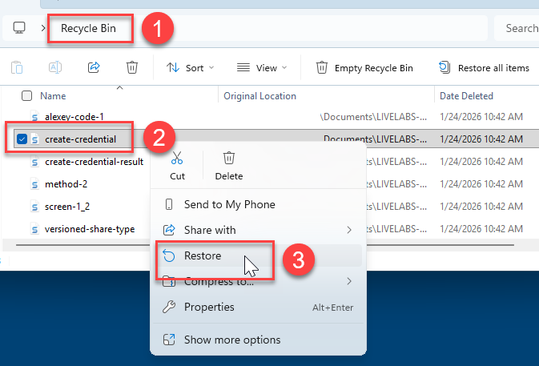

12. Re-run the **Check Unused Images** tool. At last, no extra or missing images! 

    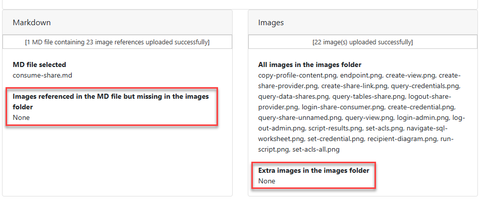

13. It is a good practice to run **Live Server** for lab for which you deleted the extra images to make sure all the images are visible. 

14. When you complete your workshop and before you submit a pull request, it is also a good practice to run this tool on the images of every lab in the workshop to avoid extra image files that are not used. 

**Capture Screens Effectively Summary:**
Good static screen captures should be clear, focused, free of sensitive data, and professionally annotated. 

You may now **proceed to the next lab**.

## Acknowledgements

* **Author:** Lauran Serhal, Consulting User Assistance Developer, Oracle Autonomous Database
* **Contributors:**
    * Kevin Lazarz, Senior Manager, Product Management
    * Ramona Magadan, Technical Program Manager

* **Last Updated By/Date:** Lauran K. Serhal, January 2026