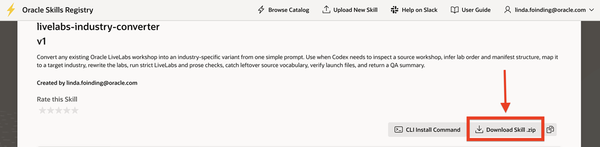

# Get Started with the LiveLabs AI Developer Hub

## Introduction

The **LiveLabs AI Developer Hub** brings together agentic and automation-first workflows that help workshop authors move faster without sacrificing quality. Instead of treating workshop development as a long chain of manual tasks, this hub shows authors how to use reusable tools to plan, draft, revise, illustrate, and refine workshop content with more consistency.

This matters because the biggest delays in workshop delivery usually come from the surrounding authoring work, not just writing markdown. Planning, refactoring, image collection, QA cleanup, and version alignment all take time, and the hub packages those workflows so authors can spend more effort on instructional quality and customer value.

### Objectives

In this lab, you will:

* Find the LiveLabs AI Developer Hub
* Understand why agentic author workflows reduce manual effort
* Find the downloadable skill bundle in the repository
* Use the guided workshop as the best starting point for deeper how-to content

**Estimated Time:** 5 minutes

## Task 1: Access the LiveLabs AI Developer Hub

Perform the following set of steps to access the guided workshop entry point for the **LiveLabs AI Developer Hub**:

1. Open the guided workshop entry point:

    [LiveLabs AI Developer How-To Guide](https://oracle-livelabs.github.io/common/labs/livelabs-ai-developer-hub/workshops/sandbox/)

2. The guide provides a structured path that helps authors move from first use to practical workshop-building workflows quickly:

    * **Lab 1** shows how to create a workshop from source material
    * **Lab 2** shows how to capture workshop-ready screenshots
    * **Lab 3** shows how to add knowledge checks
    * **Lab 4** shows how to convert workshop content into customer outcomes for another industry

## Task 2: Access the LiveLabs AI Developer Hub Repository & Download Skills

Perform the following set of steps to access the LiveLabs AI Developer Hub repository and locate the downloadable skill bundle:

1. Open the [LiveLabs AI Developer Skills Repository](http://skills.oraclecorp.com/) and download the skill zip files required for the training labs:

    - [Livelabs Industry Converter SKill](https://skills.oraclecorp.com/ords/r/skills/lib/skill-detail?p5_skill_name=livelabs-industry-converter)
    - [Webpage Screenshot Pipeline Skill](https://skills.oraclecorp.com/ords/r/skills/lib/skill-detail?p5_skill_name=webpage-screenshot-pipeline)
    - [Livelabs Gamification Skill](https://skills.oraclecorp.com/ords/r/skills/lib/skill-detail?p5_skill_name=livelabs-gamification)
    - [FreeSQL Skill](https://skills.oraclecorp.com/ords/r/skills/lib/skill-detail?p5_skill_name=freesql)
    - [Livelabs Author Skill](https://skills.oraclecorp.com/ords/r/skills/lib/skill-detail?p5_skill_name=livelabs-author)

        

2. Use this repo as your home for author-facing automation workflows. Access downloadable skills and readme documents with ease.

## Task 3: Use the Hub as Your Next Step

Perform the following set of steps to use the hub as the next practical step after this chapter:

1. Start with the guided how-to workshop when you want the quickest working path.

2. Move to the repo `README.md` when you want the high-level view and the underlying structure.

3. Open the packaged zip files when you want to install or share the skills directly.

4. Use the individual skill guides in the repo when you need a narrower workflow instead of the full workshop.

## Learn More

* [LiveLabs AI Developer How-To Guide](https://oracle-livelabs.github.io/common/labs/livelabs-ai-developer-hub/workshops/sandbox/)
* [LiveLabs AI Developer Skill Bundle](http://skills.oraclecorp.com/)

## Acknowledgements

* **Author** - Linda Foinding, Principal Product Manager, Outbound Database Product Management
* **Last Updated By/Date** - Teodor C. Nechita, June 2026
