# LiveStack

## Introduction

LiveLabs LiveStacks help teams move from initial solution exploration to hands-on learning and deployment planning. A LiveStack brings together demos, LiveLabs workshops, deployment assets, and supporting materials around a common industry challenge or business outcome.

LiveStacks are available across Finance, Retail, Healthcare, Media & Entertainment, and Energy & Utilities, with additional industry solutions being published in the coming weeks. You can access LiveStacks directly from LiveLabs to explore content, subscribe for updates, and share solutions with customers and colleagues.

A LiveStack supports the following journey:

1. **Envision** - Showcase potential business outcomes through a LiveStack Demo built around real industry challenges.
2. **Try** - Explore the solution and gain hands-on experience through a LiveLabs Workshop.
3. **Embed** - Deploy and validate the solution in your environment using deployment-ready assets.
4. **Scale** - Extend and adapt the solution from pilot to broader adoption.

LiveStacks also support Oracle-internal content, including briefing materials, supporting assets, and engagement guidance. These internal assets help teams prepare for customer conversations while remaining hidden from external audiences.

Estimated Time: 20 minutes

### Objectives

* Understand how to create a LiveStack in WMS

### What Do You Need?

* Access to the [Workshop Management System](https://livelabs.oracle.com/wms)

## Task 1: Create a LiveStack

1. Go to the [Workshop Management System](https://livelabs.oracle.com/wms).

2. In the left window pane, click 'Create a LiveStack'.

    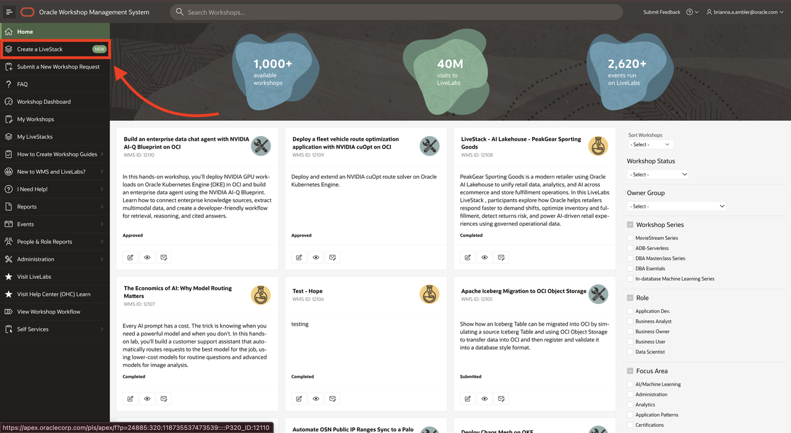

3. Learn more about what a LiveStack is on the landing page. When ready, click 'Create a LiveStack'.

    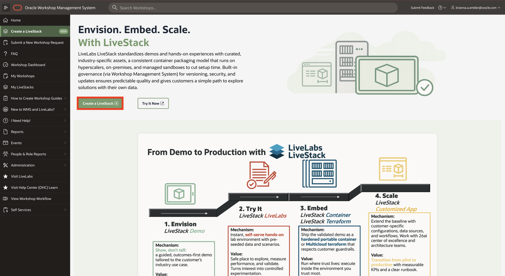

4. Fill out the LiveStack initialization form and click 'Create'.

    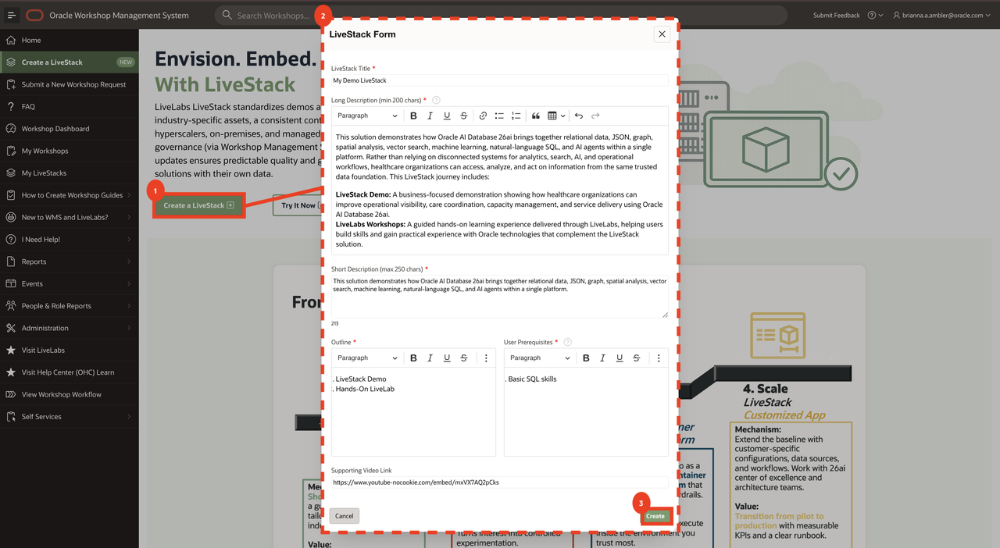

5. You should now land on the LiveStack Details page.

    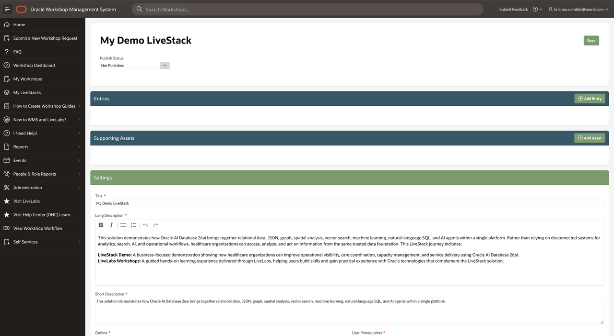

6. You can add both assets and LiveLabs as LiveStack content. You'll see how in the following labs.

> NOTE: You can view all of your LiveStacks under My LiveStacks.

## Task 2: Add LiveLab Entries to Your LiveStack

1. On the LiveStack details page, click 'Add Entry'.

    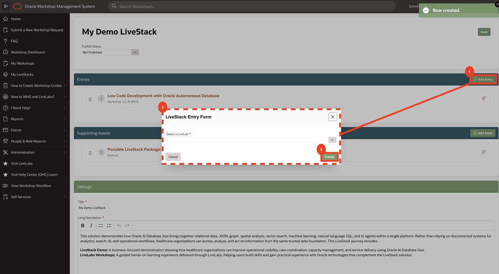

2. Search by LiveLab name or ID to find the one of your choice.

    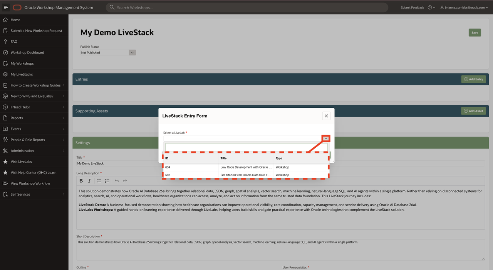

3. Once a LiveLab is selected, you'll see all of its available override fields. 
    * **Run on Sandbox** - This field appears when a LiveLabs has a Sandbox Environment available. If you don't want this LiveLab's option available when accessed via your LiveStack, you can turn it off.
    * **Run on Your Tenancy** - This field appears when a LiveLabs has a Run on Your Tenancy option available. If you don't want this LiveLab's option available when accessed via your LiveStack, you can turn it off.
    * **Title** - Initially filled with the original title, but you can modify this field to rename the LiveLab as desired in your LiveStack.
    * **Position** - This field is used to set the display order of the entries. You can also physically reorder them in the report view by clicking and dragging.

    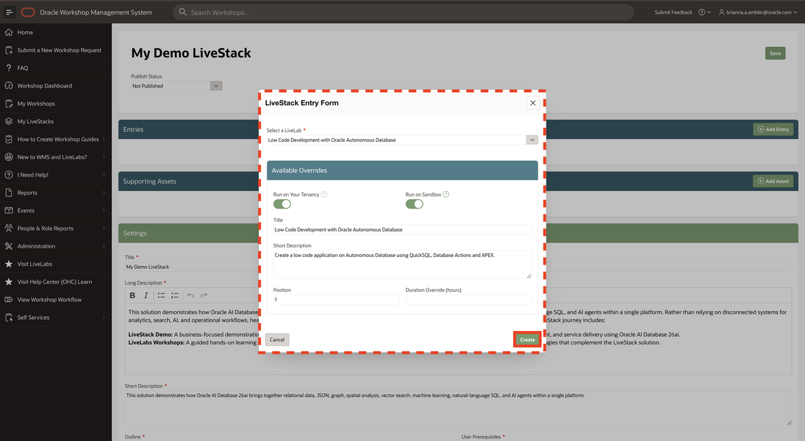

4. Click 'Create' to add the LiveLab to your LiveStack.

> NOTE: All changes made to published LiveStacks reflect immediately in LiveLabs.

## Task 3: Add Assets to Your LiveStack

A LiveStack supports the inclusion of assets related to your LiveStack content, as seen in the example below. This lab explains how to do this.

> NOTE: Assets are created and managed in WMS > Self Services > Assets.

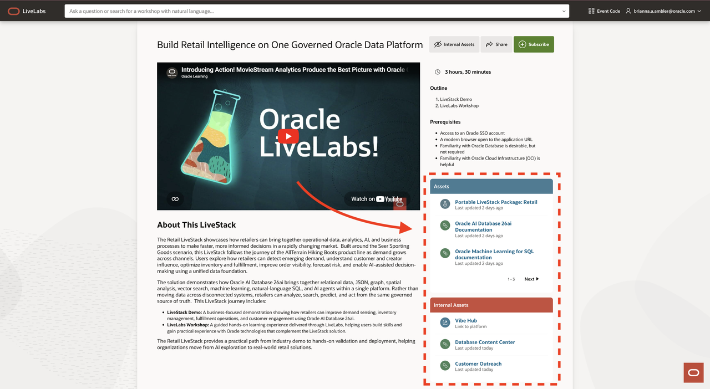

1. On the LiveStack details page, click 'Add Asset'.

    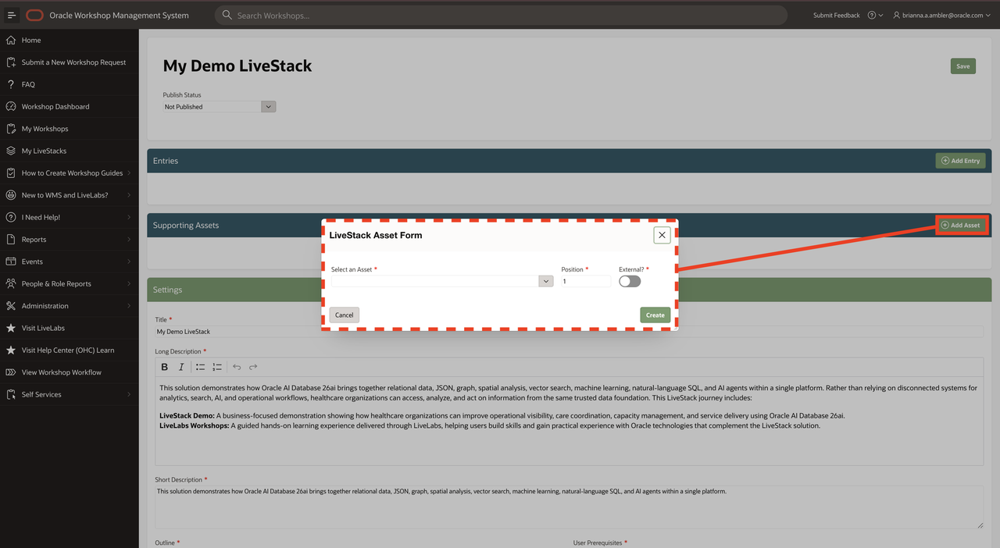

2. Search by asset name or ID to find the asset of your choice.

    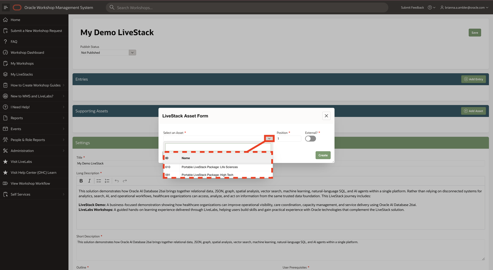

    > NOTE: Only assets created by or shared with you will be listed.

3. To manually order the assets, you can update the position value here or physically reorder them in the report view by clicking and dragging.

    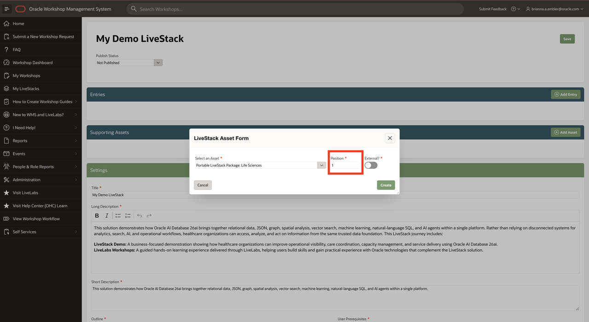

4. The asset can be set to external or internal using the visibility switch. **Internal** assets will only be visible to Oracle employees, whereas **external** assets will be visible to anyone.

    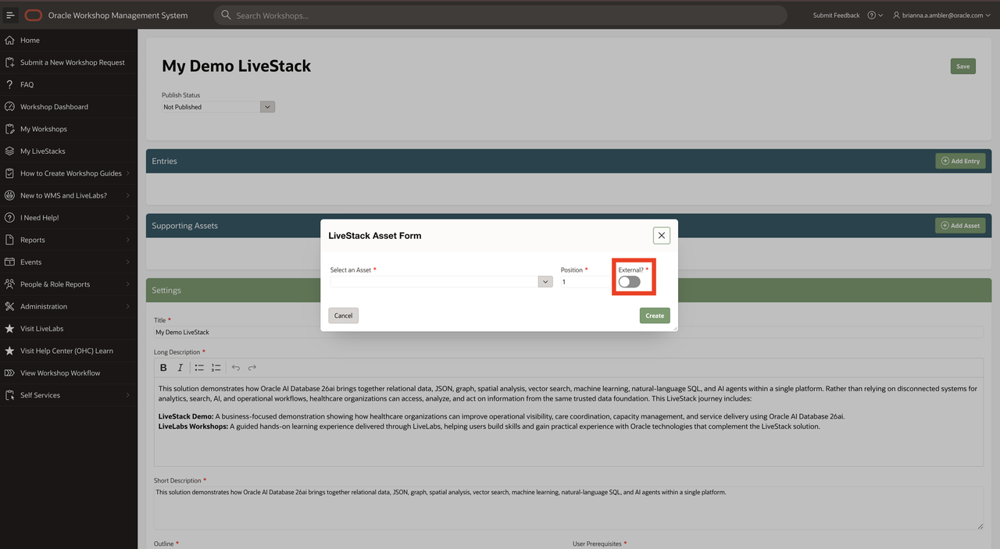

5. Click 'Create' to add the asset to your LiveStack.

> NOTE: All changes made to published LiveStacks reflect immediately in LiveLabs.

## Task 4: Publish Your LiveStack

1. Once you've finalized your LiveStack, you can request publishing by changing it's status to 'Publish Requested' and clicking Save.

    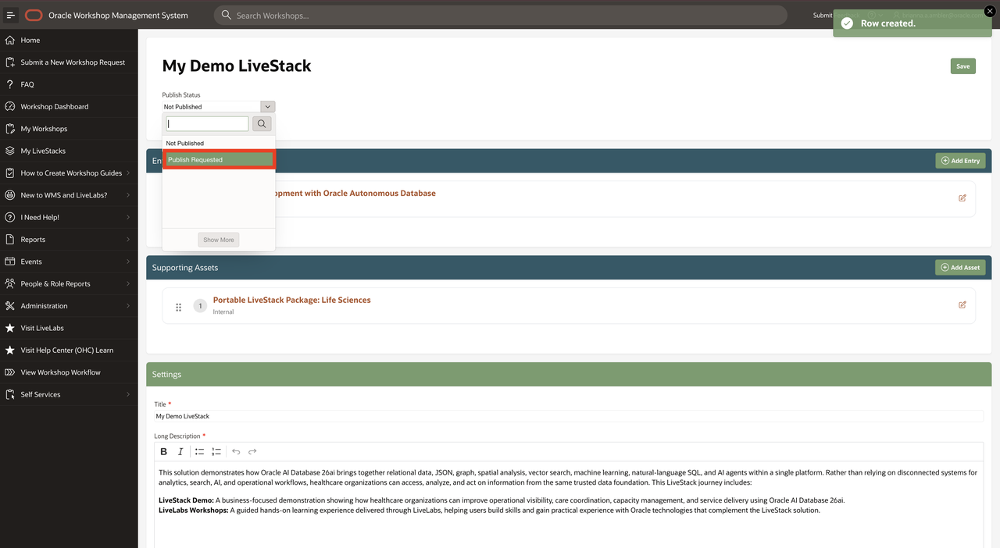

2. The LiveStack council will provide a status update on your request in 2-3 business days. You will receive an email notification.

    **Pending review, you have a LiveStack! 🎉**

## Acknowledgements

* **Author** - Brianna Ambler, Database Product Manager
* **Last Updated By/Date** - Brianna Ambler, Database Product Manager, June 2026
