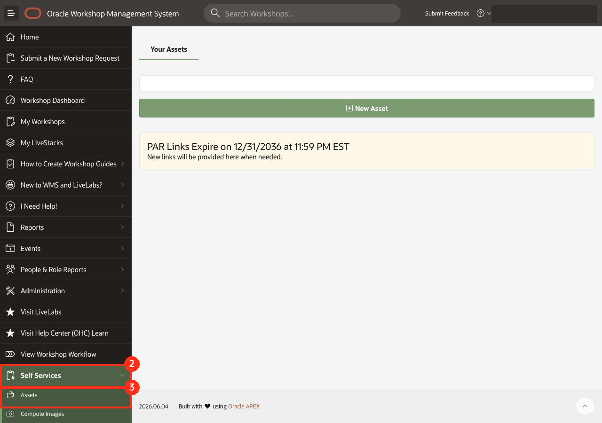
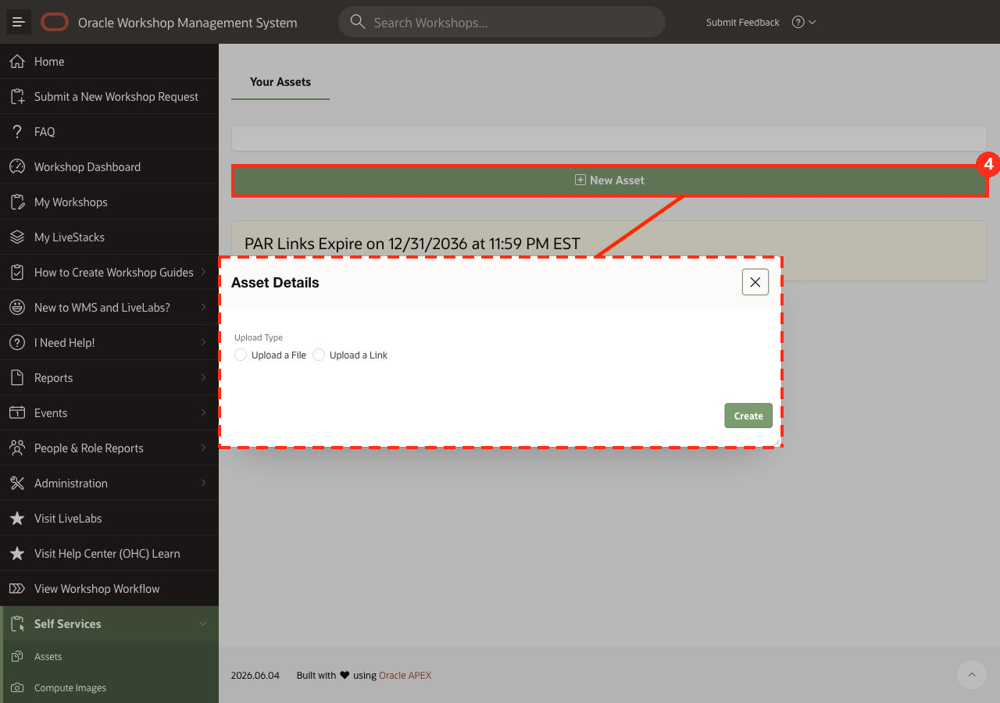
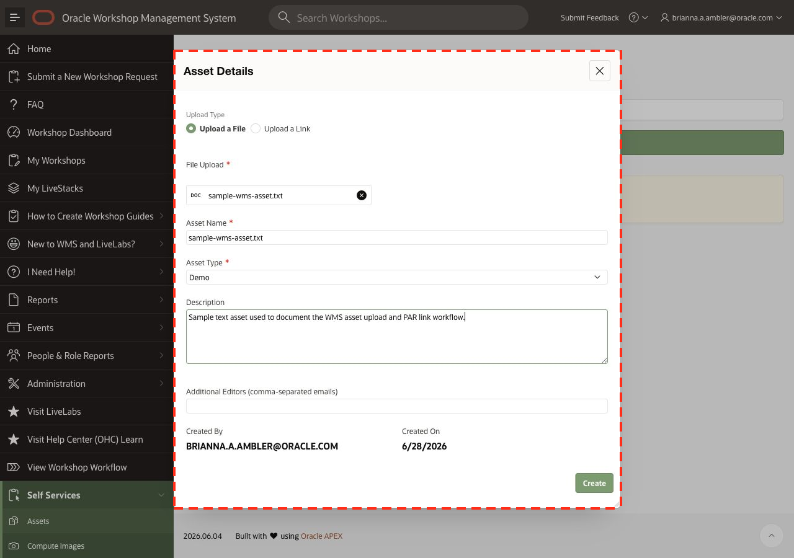
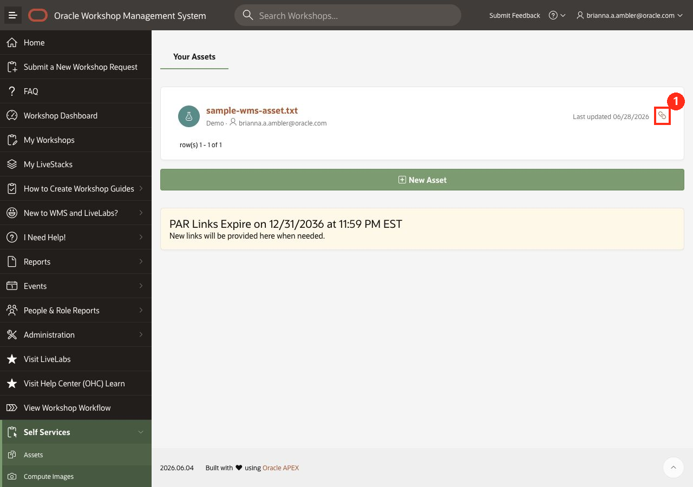
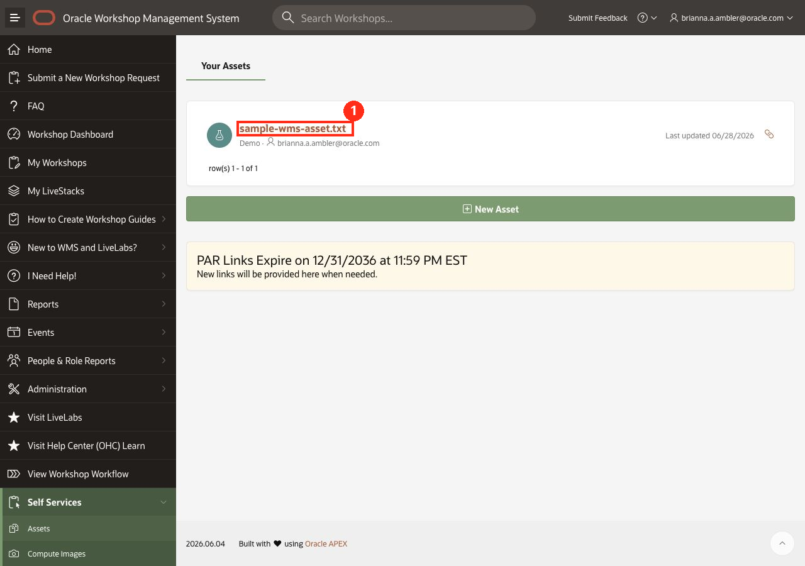
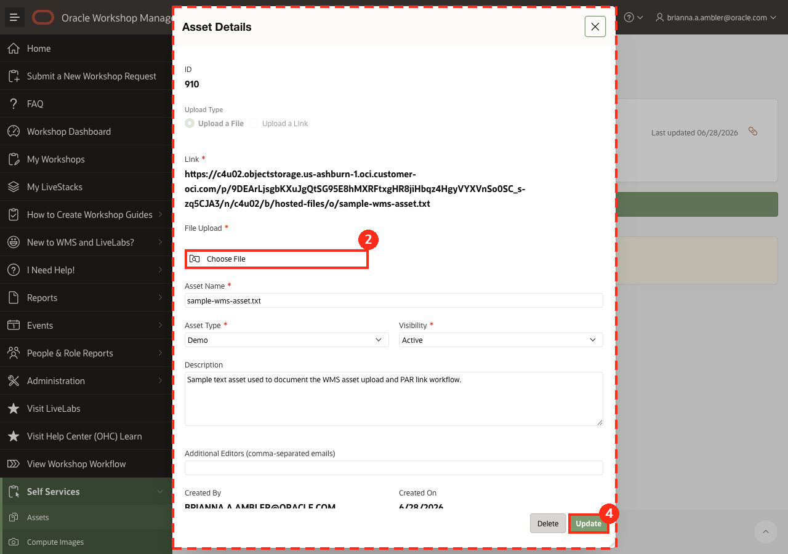
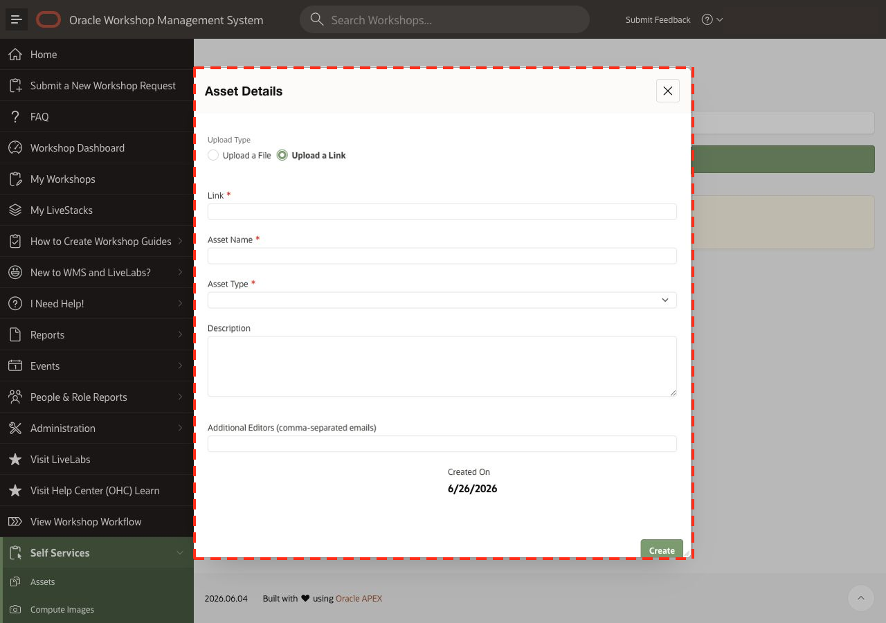

# Create and Manage Assets in WMS

## Introduction

The Workshop Management System (WMS) supports self-service asset management so workshop owners can upload, manage, and share reusable files or external links without opening a support request. Files can be stored in Object Storage and links can be stored in the database. Files uploaded to Object Storage automatically return a ready-to-use, overwriteable PAR link.

Estimated Time: 15 minutes

### Objectives

* Locate the Asset manager in the self-service portal
* Create, update, and manage a file as an asset
* Create, update, and manage a link as an asset

### Prerequisites

* Access to the [Workshop Management System](https://livelabs.oracle.com/wms)
* A file or link to add as a WMS asset

### Common Use Cases

* Update or manage Run on Your Tenancy Terraform stacks
* Store or update Sandbox Environment files
* Share and store reusable LiveLabs files, links, or assets with teammates or project stakeholders
* Add assets to your LiveStack landing page

## Task 1: Launch the Asset Manager

1. Go to the [Workshop Management System](https://livelabs.oracle.com/wms).

2. In the left window pane, expand **Self Services**.

3. Click **Assets**.

    

4. On the Your Assets page, click **New Asset**.

    

5. The Asset Details dialog is now displayed with options to upload a file or upload a link.

## Task 2A: Upload a File 

1. Select **Upload a File**.

2. Click **Choose File**, and then select the file you want to upload.

3. In **Asset Name**, enter a clear name for the asset.

4. In **Asset Type**, select the type that best describes the asset. Available values include:
    * **Demo**
    * **Link**
    * **Terraform Stack**

5. Optionally, enter a **Description** to help understand what the asset contains.

6. Optionally, enter one or more **Additional Editors** as comma-separated email addresses to have these assets appear in their assets list.

7. Click **Create**.

    

8. After the asset is created, it appears in your asset list.

## Task 2B: Access the File PAR Link

Files uploaded to Object Storage automatically return a ready-to-use, overwriteable PAR link. Here's how to access it:

1. Locate the desired file asset in your asset list.

2. Click the link icon to open or copy the generated PAR link.

    

## Task 2C: Overwrite a File Asset

> NOTE: The PAR link remains the same when the file is overwritten. To obtain a new PAR link, create a new asset instead.

1. Click the asset name to open the Asset Details dialog.

    

2. Click **Choose File**, and then select your replacement file.

3. Update the asset name, asset type, visibility, description, or additional editors as needed.

4. Click **Update**.

    

## Task 4: Upload a Link

1. Select **Upload a Link**.

2. In **Link**, enter the URL for the asset.

3. In **Asset Name**, enter a clear name for the asset.

4. In **Asset Type**, select the type that best describes the asset.

5. Optionally, enter a **Description** to help other users understand what the link contains.

6. Optionally, enter one or more **Additional Editors** as comma-separated email addresses.

7. Click **Create**.

    

8. After the asset is created, use the asset anywhere you need to share or manage that reusable link.

## Acknowledgements

* **Author** - Brianna Ambler, Database Product Manager
* **Last Updated By/Date** - Brianna Ambler, Database Product Manager, June 2026
