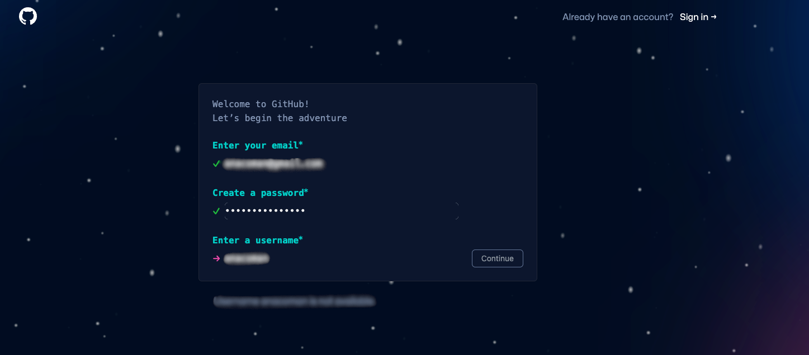
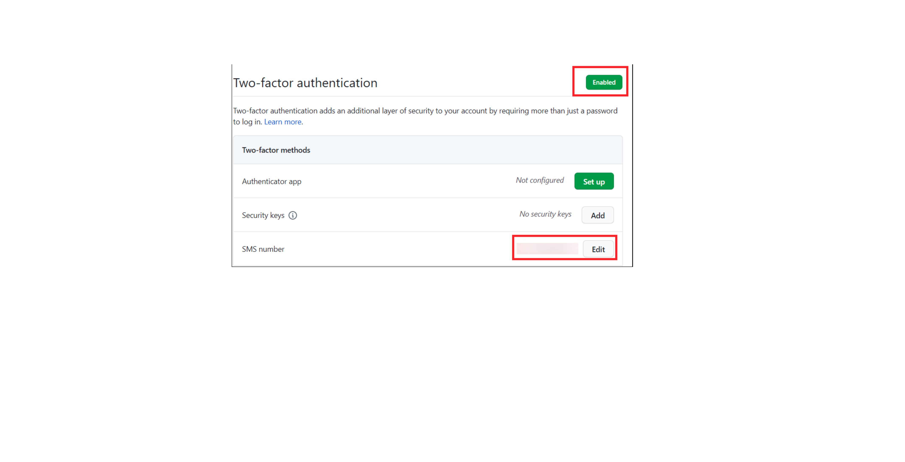

# Set Up GitHub and Install Tools

## Introduction

This lab explains how to configure your environment to develop LiveLabs workshops. You will create a GitHub account, set up the GitHub development environment, and install GitHub Desktop. Oracle LiveLabs Organization is part of Oracle GitHub Organizations—sign up through OIM and register your email account.

Complete these steps once to set up your environment for current and future development.

> **Note:** Oracle recommends using **Visual Studio Code (VS Code)**.

### Objectives

* Configure your environment (one-time setup)
* Create a GitHub account and add it to the Oracle GitHub Organization
* Set up your GitHub environment
* Install GitHub Desktop Client
* Install Visual Studio Code

### What Do You Need?

* Familiarity with HTML or Markdown is helpful but not required

## Task 1: Create and Set Up Your GitHub Account

1. Create a free GitHub account at [GitHub](https://github.com/) if you don't have one.

    

2. Use your Oracle email ID to register. Non-Oracle employees can develop workshops in the oracle-livelabs/partner-solutions repository and sign an Oracle Contributor Agreement.

    > **Note:** Do not create a secondary account. Ensure your GitHub account is associated with your @oracle.com email ID.

3. Go to [GitHub Settings](https://github.com/settings/profile) and configure:
    * Set your Name as it appears on your Aria employee page
    * Add your profile picture

4. Click **Account** to set your username (e.g., achepuri, LauranSerhal).

5. Set up two-factor authentication at [GitHub Security](https://github.com/settings/security).

    

## Task 2: Install GitHub Desktop

GitHub Desktop is a UI client for Windows and Mac that simplifies GitHub operations. It provides a faster, easier alternative to the Git command line.

1. Download and install **GitHub Desktop** from [GitHub Desktop](https://desktop.github.com/).

2. Open **GitHub Desktop** after installation.

    

3. Click **File > Options > Sign in**, enter your GitHub username or email address and password, then click **Sign in**. Enter the authentication code sent to your phone.

    You are now logged in to **GitHub Desktop**.

    

## Task 3: Install Visual Studio Code

1. Visit the [download site](https://code.visualstudio.com/download) and select the file for your operating system.

    

2. Double-click the zip file to expand it.

    

3. Drag VS Code to the Applications folder and double-click to launch.

    

## Task 4: Install Visual Studio Code's Live Server Extension

Live Server is a VS Code extension that provides a local development server with live reloading. It automatically refreshes the browser when you save changes to HTML, CSS, or JavaScript files.

1. Launch VS Code and navigate to the Extensions bar.

    

2. Type "Live Server" into the search bar and select the first entry.

    

3. Click **Install**.

    

## Task 5: (Optional) Helpful Extensions for Visual Studio Code

1. **Set up tab spacing in Markdown files**: For consistent indentation across images, code snippets, and numbered lists, set spaces to tabs (size 4).

    Click on spaces, choose indent with tabs, and select 4 as the configured size.

    

    

    

    

2. **Markdownlint Extension**: Checks Markdown linting and styling. Search for "markdownlint" in the VS Code marketplace and install it.

    

3. **Code Spell Checker Extension**: Checks spelling in files. Search for "code spell checker" and install the English spell checker (the one without a specific language in the title).

    

4. **Delete Trailing Spaces Extension**: Highlights and removes trailing whitespace, which can cause code block and merge conflict issues. Search for "trailing spaces" and install the first result (not the fork).

    

5. **Path Intellisense Extension**: Helps navigate files across different folders in your repository. Search for "path intellisense" and install it.

    

    After typing a backslash in manifest.json, press enter to view or select folders and files.

    

    

You may now **proceed to the next lab**.

## Learn More

* [Download and Install Git for Windows](https://git-scm.com/download/win)
* [Download and Install Git for Mac](https://git-scm.com/download/mac)

## Acknowledgements

* **Last Updated By/Date:** LiveLabs Team, January 2026
