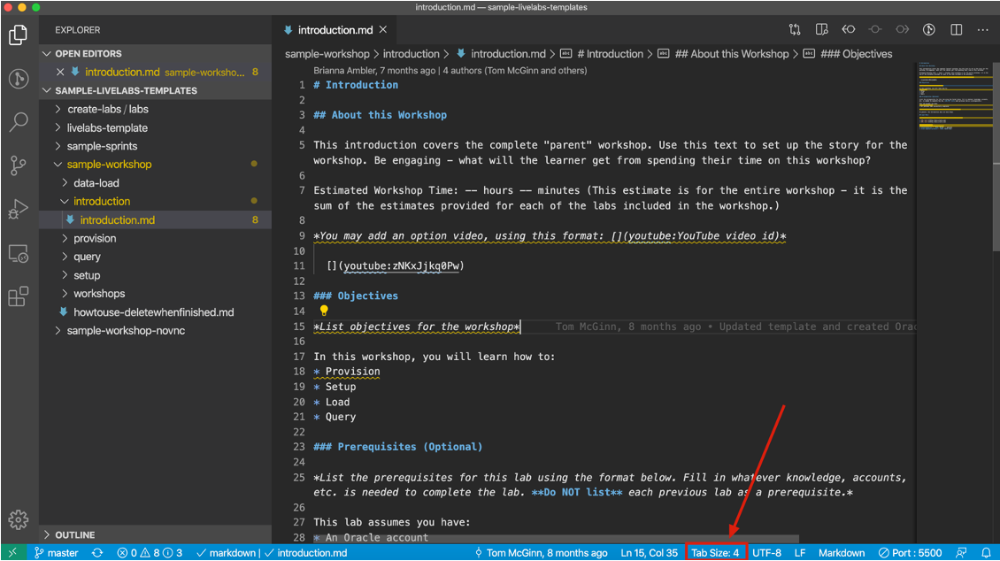
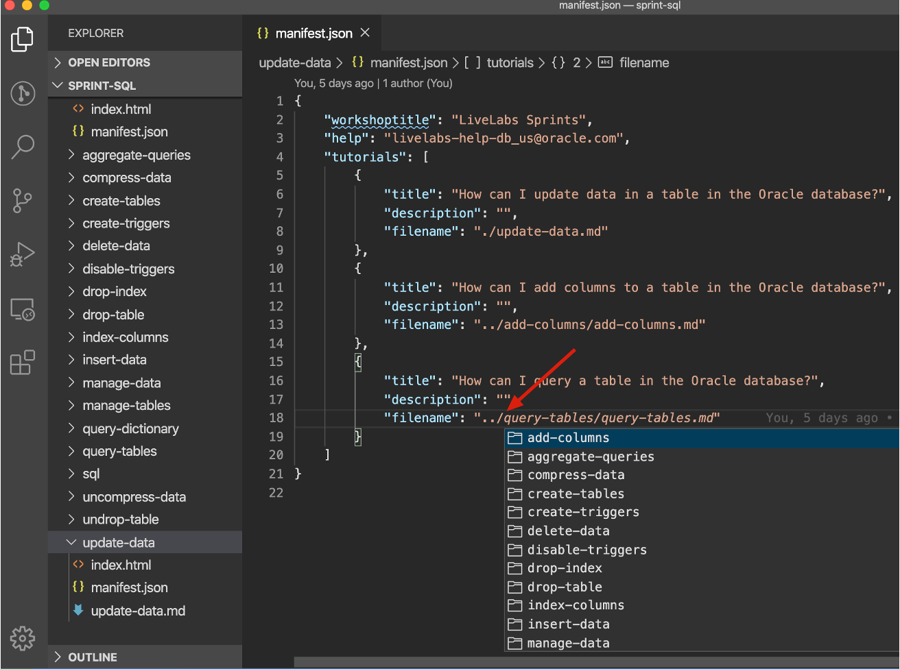

# Set up GitHub and install tools

## Introduction

In this lab, you will learn how to configure your environment to develop LiveLabs workshops. We use the Oracle LiveLabs GitHub organization so you will learn to create a GitHub Account, set up the GitHub development environment, and install GitHub Desktop. Oracle LiveLabs Organization is one of Oracle GitHub Organizations and we encourage you to sign up through OIM and register your email account.

These steps need to be completed once to setup your environment for current and future development.

> **Note:** Oracle recommends using **Visual Studio Code (VSCode)**.

### Objectives

* Configure your environment - one time setup.
* Create a GitHub account and add it to the Oracle GitHub Organization.
* Set up your GitHub environment.
* Install GitHub Desktop Client (recommended for User Assistance Developers).
* Install Visual Studio.

### What Do You Need?

* Familiarity with HTML and/or Markdown is helpful but not required

## Task 1: Create and set up your GitHub account

In this Task, you will create and set up your GitHub account.

1. Create a free GitHub Account here: [GitHub Web UI](https://github.com/) if you don't have one.
    

2.  If this is a new account, use your Oracle email ID to register. If you are not an Oracle Employee you can develop a workshop in oracle-livelabs/partner-solutions repository and sign an Oracle Contributor Agreement.

    > **Note:** Do not create a secondary new account to join GitHub. Ensure that your GitHub account is associated with your @oracle.com email ID.

3. Go to [GitHub Settings](https://github.com/settings/profile) and configure the following:
    *   Set your Name as it appears on your Aria employee page.
    *   Add your Profile Picture.

4. Click **Account** to add your user name in the **Enter a user name** dialog. For example, achepuri, LauranSerhal, and so on.

5. Set up a 2 Factor Authentication here: [GitHub Security](https://github.com/settings/security).

    

## Task 2: Install GitHub Desktop

The GitHub Desktop application is a UI client for Windows and Mac that simplifies the complex set of GitHub command line arguments. GitHub Desktop is a fast and easy way to contribute to projects and it simplifies your development workflow. It is much easier than using the Git command line.

To set up the GitHub Development Environment and install **GitHub Desktop**:

1. Download and install **GitHub Desktop** from [GitHub Desktop](https://desktop.github.com/).

2. When the software is successfully installed, open the **GitHub Desktop**.

  

3. Click **File > Options > Sign in**, enter your GitHub **Username** or **email address**, **Password**, and then click **Sign in**. You will receive an authentication code sent to your cell phone. Enter this code in the **Authentication code** field in the **Sign in** dialog box.

  You are now logged in to **GitHub Desktop**.

  

## Task 3: Install Visual Studio Code

To install Visual Studio Code:

1. Visit the [download](https://code.visualstudio.com/download) site and select the zip file for your operating system. In this case, we chose Mac OS.
  
3. Double-click the zip file to expand it. The VS Code application will then show in your downloads folder in Finder.
  
4. Drag it to the Applications folder and double-click it to launch the text editor.
  

## Task 4: Install Visual Studio Code's Live Server Extension

Live Server is an extension for Visual Studio Code (VS Code) that provides a local development server with live reloading functionality. When you're developing a web application or a website, you typically need to constantly refresh the browser to see the changes you've made to your code. Live Server automates this process by automatically refreshing the browser whenever you save changes to your HTML, CSS, or JavaScript files.

1. Launch VS Code and navigate to the Extensions bar.
  
2. Type "Live Server" into the search bar and select the first entry, "Live Server 5.6.1".
  
3. Click "Install".
  

## Task 5: (Optional) Helpful resources and extensions for Visual Studio Code

1. Set up tab spacing in Markdown files in Visual Studio Code - To have a fixed indentation and consistency in all the markdown files among the images, code snippets, and between the numbers in each task with the line starting, you need to set spaces to tabs (size 4).

  To set spaces to tabs size 4, click on spaces, choose indent with tabs, and select 4 as configured size, which sets the tab spacing to 4.

    

    

    

    

2. Install Markdownlint Extension in Visual Studio Code - This extension is helpful to check markdown files linting and styling in VS Code. This extension has a library of rules to encourage standards and consistency for markdown files.

  To install this extension, search for markdownlint in the VS Code marketplace, select the first one and click on Install to install it.

    

3. Install Code Spell Checker Extension in Visual Studio Code - This extension is helpful to check spellings in the files.

  Search for the code spell checker in the VS Code marketplace, select the first one that doesn’t specify any language in the title, which is the English spell checker, and install it.

  

4. Install Delete Trailing Spaces Extension in Visual Studio Code - Trailing space is all whitespace(s) located at the end of a line, without any other characters following it. This extension is helpful to resolve code blocks, copy and paste issues, and sometimes merge conflicts.

  To highlight trailing spaces, in the VS Code marketplace, search for trailing spaces and select the first trailing spaces, not the one with a fork, and click on Install. Once the extension is installed, you can see that whitespace(s) are highlighted in red to delete them.

  

5. Install Path Intellisense Extension in Visual Studio Code - since repositories in the Oracle LiveLabs GitHub project have many files, you may want to access files in different folders of your workshop or sometimes in a different directory. To know the file, you are pointing to in the manifest.json file, you can use the path Intellisense extension.

  To install this extension, search for path intellisense in VS Code marketplace, select the first extension and install it.

  

  Use Path Intellisense Extension in manifest.json file - After typing the backslash, hit enter to view or choose the folder(s) or file(s)

  

  

This concludes this lab. You may now **proceed to the next lab**.

## Want to Learn More?

* [Download and Install Git for Windows](https://git-scm.com/download/win)
* [Download and Install Git for Mac](https://git-scm.com/download/mac)

## Acknowledgements

* **Authors:**
    * Anuradha Chepuri, Consulting User Assistance Developer, Oracle GoldenGate
    * Lauran Serhal, Consulting User Assistance Developer, Oracle Database and Big Data
* **Contributors:**
    * Kay Malcolm, Vice President, Database Product Management
    * Madhusudhan Rao, Principal Product Manager, Database
    * Aslam Khan, Senior Manager, ODI, OGG, EDQ

* **Last Updated By/Date:**
    * Ana Coman, Technical Program Manager, Oracle Database Product Management, April 2024
