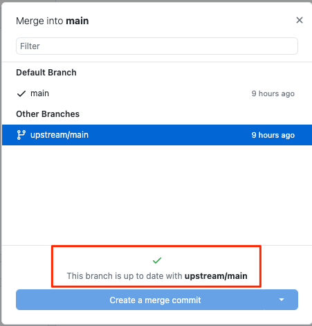
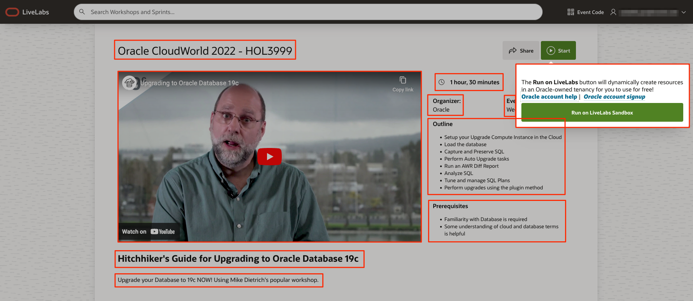
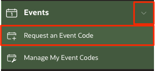
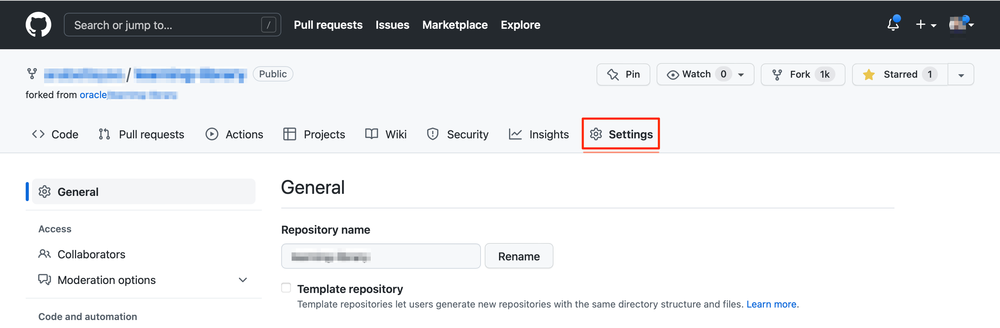
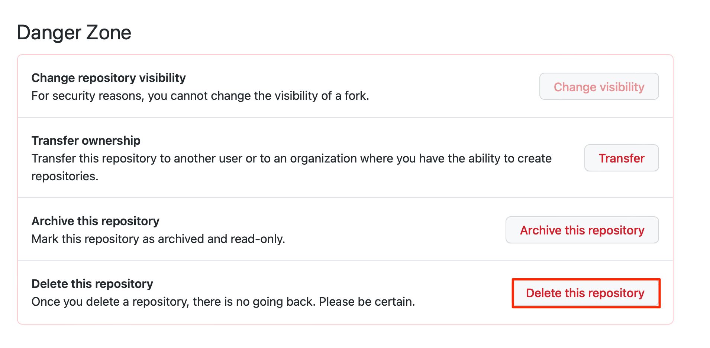

# Stay in sync with GitHub environment

## Introduction

Oracle LiveLabs has a set folder structure that you will need to follow for developing your workshops. The folder structure is only part of the development since the workshop content is contained in the Markdown files and images that you write and edit as your workshop development. You can use your preferred editor to author and edit your Markdown (.md) content for rendering the Workshop output.

> **Note:** Oracle recommends using **Visual Studio Code (VSCode)**. If you are currently using **Atom** - it is being retired, and you should move to use VSCode.

### Objectives

* Clone and fork Oracle LiveLabs GitHub repositories.
* Understand the **Oracle LiveLabs** folder structure.
* Familiarize yourself with the components of the workshop and the lab folders.
* Learn about the tools that are available to develop and host your content.
* Learn how to merge content.


## Task 1: Fork repositories of the oracle-livelabs organization on your GitHub account

  We create workshops and labs in the repositories of the **oracle-livelabs** organization. You must fork a repository to create a duplicate personal copy of the repository on your GitHub account. You own the forked (stage) repository, and you can edit its contents without affecting the parent (production) repository.

  For example, if a user named arabellayao forks the **database** repository in the **oracle-livelabs** project, a duplicate repository [arabellayao/database](https://github.com/arabellayao/database) is created.
  
  You should also fork the [common repository](https://github.com/orgs/oracle-livelabs/common). Even though you will not be changing files here, you can use the common/images that are available and the sample workshops you will be using for templates are contained here.

  After your workshop is approved by the council group, you first need to identify **which one repository among the [24 repositories](https://github.com/orgs/oracle-livelabs/repositories) you want to create your workshop in**. That decision depends on what product your workshop is about, or which council your workshop belongs to. For example, if your workshop is about GoldenGate, you should create your workshop in the [oracle-livelabs/goldengate](https://github.com/oracle-livelabs/goldengate) repository. Click [here](https://github.com/orgs/oracle-livelabs/repositories) to see the complete list of the repositories, and select one repository that fits your workshop.

  If you are not sure which repository to put your workshop in or do not see a repository that fits your workshop, please contact your council group or contact our LiveLabs team. We can give you some suggestions, and even create a new repository for you if necessary.

  For example, I want to create a workshop about GoldenGate, so I select the [oracle-livelabs/goldengate](https://github.com/oracle-livelabs/goldengate) repository. Next, I **only** need to fork the **goldengate** repository. The following steps walk you through forking the **goldengate** repository, but the steps are the same if you are forking any other repositories in the oracle-livelabs GitHub project.

1. Log in to the [GitHub Web UI](http://github.com), using your GitHub account.

2. Navigate to the [Oracle Livelabs GitHub project](https://github.com/oracle-livelabs).

3. Click **Repositories** to review the existing repositories. Select one repository that fits your workshop and click that repository.

  

4. Here, I am using the **goldengate** repository as an example, but the process is the same for other repositories. Click **Fork**.

  

5. Under **Owner**, expand the dropdown list and select your username. You can accept the **Repository name** as it is. Click **Create fork**.

  

6. Then, user arabellayao has forked the **goldengate** repository.

  

In the next Task, you will clone this forked repository.

## Task 2: Clone the forked repository
A clone is a copy of your forked repository that lives on your local computer instead of on [GitHub Web UI](http://github.com). When you clone your forked repository, you can edit the files in your preferred editor, recommended **Visual Studio Code**, and use the **GitHub Desktop** client to keep track of your changes without having to be online.

>**Note:** Make sure you are performing the following steps **off VPN**. When performing clones and fetching origin you should not be on VPN, but editing and other steps such as pull request it does not matter.

To clone the forked repository:
1. Open your **GitHub Desktop** application and log in using your GitHub account.

2. Click **File > Clone repository** to display the **Clone a Repository** dialog box.

    

3. Select your repository such as **your account/repo** from **Your Repositories**. In this example, select **arabellayao/goldengate**. Under **Local Path**, select the local path on your machine where the repository is going to be cloned (copied). This is where the repository files get copied to your local file system. Click **Clone**.
    >**Note:** If you cannot find the repo you just forked, click the **refresh** button.

    

4. The cloning process may take several minutes, depending on how big the repository is.

  

5. When asked how you plan to use the fork, select **To contribute to the parent project**. Click **Continue**.

  

6. The repository files (in this case, **goldengate**) appear in the local path you just specified. You can now start working on your labs and workshops! Be sure to also clone **common**.

  

  > **Note:** The local cloned repository is connected to the remote fork version. You can push your local clone changes to the remote fork version when you are online to keep them in sync.

  When you make a clone, you can create your project folder, edit the files in your preferred editor, recommended **Visual Studio Code**, and use **GitHub Desktop** to keep track of your changes without having to be online.

  The repository you cloned is still connected to the remote version (your fork) so that you can push your local changes to the remote to keep them synced when you're online.

7. You can also use Github Desktop to synchronize the changes that you have made in your local file system to the forked content on your GitHub repo.

  

## Task 3: Merge content from Git before you start editing your content
  Every day before you start editing your content, ensure to do a Merge in **GitHub Desktop**.
  Merging synchronizes the content in your cloned repository with the latest content on the **upstream/main** repository and ensures that you have the most recent versions of the templates and other workshops/labs.

  >**Note**: If you don't do that, you may get merge conflicts later when you commit your changes, which can be complex to fix.

  To merge content:
  1. Start your **GitHub Desktop** client.

  2. If you have multiple Oracle LiveLabs repositories, first switch to the repository that you will work on. Expand the dropdown list of **Current Repository**. Click the repository that you want to sync. In this case, I select the *em-omc* repository as an example, but the following process is the same for syncing other repositories.
  

  3. Make sure you perform the following steps **off VPN**. Otherwise, your GitHub Desktop may be stuck.

  4. Click **Fetch origin**.
  

  5. Select **Branch > Merge into Current Branch...** to display the **Merge into main** window.

    

  6. Under the **Default Branch**, the main branch is selected by default. This indicates the local clone on your PC.
    

  7. Scroll down the **Merge into main** window, select **upstream/main** (this is your production repository which is oracle-livelabs/repository), and then click **Create a merge commit**. In this example, this will merge 1 commit by other people from the **upstream/main** into the clone on the local PC.

    

  8. When the merge is completed, a **"Successfully merged upstream/main into main"** message is displayed. To push the new commits from the local clone to your forked location, click **Push origin**. If you get an *Authentication failed* error, refer to the Troubleshooting section at the end of this lab.

    

    >**Note**: To determine if your clone is up-to-date with **upstream/main** (production), repeat Steps 4 to 7. If both repositories are synchronized, then the following message is displayed: "This branch is up to date with **upstream/main**".

    

  In the **GitHub Desktop** UI, notice that the **Push origin** is replaced by **Fetch origin** after the push origin operation is completed.  The local clone and fork repositories are now synchronized with the main repository.

  

## Task 4: Folder structure of the Oracle LiveLabs

  The following image shows a folder structure of the **sample-workshop** that is opened in the **Visual Studio Code** Editor. Inside each repository in [Oracle LiveLabs](https://github.com/oracle-livelabs), there is a **sample-livelabs-templates**  folder. You can see this structure at the following URL [https://github.com/oracle-livelabs/common/tree/main/sample-livelabs-templates/sample-workshop](https://github.com/oracle-livelabs/common/tree/main/sample-livelabs-templates/sample-workshop). You can get started with workshop development by copying this sample workshop folder.

  

## Task 5: Understand the components of the workshop and lab folders
The following describes the components of the above example:
    * The root folder of this example is the name of the workshop, **sample-workshop**. Direct links to the workshop files will be coming soon.

  > **Note:** You will be creating your project folder anywhere within your cloned repository. If you have not done so, please look into the [Oracle LiveLabs GitHub organization](https://github.com/oracle-livelabs) to see different repositories and decide on a repository for your workshop. If no existing repository fits your workshop, please contact our LiveLabs team. (See more details about this back in Task 1.)

  * Each lab has its own folder, for example, **data-load**, **introduction**, **provision**, etc., each containing:
      * a **files** folder (optional) that contains the files used in this lab.
      * an **images** folder that contains the screenshots used in this lab.
      * a **.md** file that contains this lab's content.
  * The **workshops** folder contains the **desktop**, **sandbox** (previously livelabs), and/or **tenancy** (previously freetier) folder, each containing:
      * an `index.html` file, which is executed when it is accessed by a browser. You can copy this file from the *sample-workshop* folder and use it without changes.
      * a `manifest.json` file defines the structure of the workshop that the `index.html` file renders. You can copy this file from the *sample-workshop* folder, but you need to customize it for your workshop.
      * a `README.md` file (optional), which contains the summary of the entire workshop. You can view it from your git repository.

      The following screenshot shows a sample `manifest.json` file that is opened in the **Visual Studio Code** Editor.

      >**Note:** Ensure that the appropriate stakeholder email is listed by ***help***. If the *include* and *variables* do not apply to your workshop, you should remove them, to ensure your workshop can render properly.

      

## Task 6: Commit your changes in your clone
When you create, delete, or modify assets in your clone (local copy), you should commit (save) those changes to your clone, and then push those changes from your clone to your fork. Then these changes get saved to your forked repository.

>**Note:** Make sure you are performing the following steps **off VPN**.

To commit your changes:
1. Start your **GitHub Desktop** client.

2. In the **Summary (required)** text box on the left (next to your picture), enter a summary of your changes. You can optionally add a more detailed description of your changes in the **Description** text box.

  

3. Click **Commit to main**. This saves your changes in your local clone. **Fetch origin** changes to **Push origin**.

4. Click **Push origin** (it should have an upward arrow with a number). This pushes the updated content from your clone into the origin of this clone, that is, your fork.

  

## Task 7: Set up GitHub pages for your fork to test your content

After you upload the content from your clone to your fork, request your review team members to review this content by providing them with access to **your GitHub Pages site URL** (or the URL of your forked repository).

>**Note:** You should perform the following actions in your forked GitHub repository (e.g. [https://github.com/arabellayao/em-omc](https://github.com/arabellayao/em-omc)), instead of the production repository (e.g. [https://github.com/oracle-livelabs/em-omc](https://github.com/oracle-livelabs/em-omc)).

The GitHub Web UI has a feature called **Set Up GitHub Pages for Your Fork** to Test Your Content. This feature performs a dynamic conversion of the Markdown files (.md files you have developed using your Atom Editor) to HTML. You can preview your workshop and labs on your forked repository and provide this URL to your reviewers.

To publish your GitHub Pages site:
1. Log in to [GitHub Web UI](http://github.com) using your GitHub account credentials, and then click your fork's link in the **Repositories** section to display your fork.

  

2. Click **Settings**.

   

3. On the left menu, click **Pages**.

  

4. Under **Branch**, select **main** (if it's not already selected) from the drop-down list. Click **Save**.

  

<!-- 5. Optional: Under **Theme Chooser**, click **Change Theme** and select a theme of your choice. -->

5. This may take a few minutes to complete. After the GitHub Pages are enabled, the message under **GitHub Pages** changes to **Your site  is published at https://arabellayao.github.io/em-omc/**
  

## Task 8: Access your workshop on GitHub

After your pull request is complete, wait a few minutes and perform the steps below. Github pages take approximately 5 minutes for the pages to be copied.

1. This workshop for example is located in the link below.

    ```
   https://github.com/arabellayao/em-omc/blob/main/enterprise-manager/emcc/workshops/freetier/index.html
    ```

3. The published version becomes:

    ```
    https://arabellayao.github.io/em-omc/enterprise-manager/emcc/workshops/freetier/index.html
    ```

## (Optional) Task 9: Customize your Workshop for Events

This task walks you through the steps to customize a workshop for events and create an event code.

### What is Event Code?

An Event code is a fully customizable way to run a customized set of focused labs for your target audience. We now fully support hidden workshops for Oracle sales/PM and marketing purposes. The hidden workshops won’t be accessible to the general audience, and cannot be indexed by search engines. The user must log in with Oracle SSO and have the event code to proceed.

If for an event, you want to add additional labs, remove some labs, have a different version of a lab, or change the workshop's meta info (including its title, description, outline, prerequisites, workshop time, promotion video, etc.) you can do that via an event code, without affecting the workshop already in production. PMs and Sales at Oracle have widely used event codes for big events like Oracle CloudWorld, as well as smaller events like training sessions, both internally and externally.

The following screenshot shows the landing page of an event code. Any information squared in red can be customized.



If you are the **workshop team** of the workshop that you want to create an event for, you can change the workshop title, add additional labs, remove labs, and/or have a different version of a lab for the event by performing Steps 1 - 6.

>**Note**: Steps 1 - 6 are optional - only if you want to customize the workshop content for your events. If you only want to customize the workshop's meta info, you can go directly to Step 7.

1.  Depending on which repo your workshop is in, merge content from GitHub by following Lab 3: Stay in sync with GitHub environment -> **Task 3: Merge content from Git before you start editing your content**.

2.  Go to Visual Studio Code, under the **workshops** folder, where you can see a **freetier/tenancy** folder and/or a **livelabs/sandbox** folder, create a new folder and give it a descriptive name (lowercase) for the event (e.g. cloudworld, training, event, etc.)

3.  Then, copy the *index.html* and *manifest.json* from the **freetier/tenancy** or **livelabs/sandbox** folder, depending on where the new version of the workshop will run.

4. Now, in the new *manifest.json* file under the event folder, you can edit the workshop title, add labs, remove labs, or replace labs.

5. You can also create new Markdown files under lab folders to have a different version of labs, and then have the manifest.json file point to the new Markdown files.

6. Finally, push your changes and create a pull request to one of the oracle-livelabs GitHub repos. After your pull request is approved and merged, you can proceed to Step 7.

7. Go to the Workshop Management System (WMS). Expand **Events**, then click **Request an Event Code**. Watch this [**video**](https://otube.oracle.com/media/t/1_vuoemxyl) to learn how to request an event code. If you perform Steps 1 - 6, then you need to click **Edit Workshop Links** and put the customized links (for example, links ending with *workshops/events/index.html*).

  
  

8. After the event, if you as the event organizers want to know about the event's registration information, you can contact the LiveLabs team. We can share the number of attendees, their emails' domain names (but not their email address), and when they request the event codes, etc.

## Troubleshooting

### Issue 1: Commits Behind oracle:main
  

1. Follow the steps in Task 1: Get the Latest Updates from Production.

### Issue 2: Clone failed
  

  1. Execute the following commands to make sure .gitconfig is updated:

    ```
    <copy> git config --global core.longpaths true </copy>
    ```

    ```
    <copy> git config --global core.ignorecase false </copy>
    ```

### Issue 3: GitHub Merge Conflicts
GitHub merge conflicts happen when you and some other contributors are changing the same content in the oracle-livelabs repositories. Merge conflicts prevent you from pushing your changes to your GitHub repository.
  

1. When you fetch origin and merge changes into your current branch (as in Task 1), you may encounter merge conflicts, as shown in the screenshot above. In the screenshot, you have 3 files that have merge conflicts.

2. Since you are changing the same content as other people, you need to manually decide which version of changes you want to keep. Open your text editor. Go to the files that have conflicts. Conflicts are highlighted by your text editor, and you will choose to use either your changes or other people's changes.
  

3. After you resolve all the conflicts and save your changes, your GitHub Desktop should look like the screenshot below. There will be a green checkmark beside each file, indicating there are no conflicts. Enter the **Summary** and click **Commit to main**. After the commit finishes, you can click **Push origin**, and your changes are pushed to your GitHub repository.
  

4. To confirm, press refresh on your personal GitHub repo on the web, you should have no commits *behind* now, only *ahead*.

  

### Issue 4: Cannot Use GitHub Desktop to Pull Changes from Production
If you have not updated your local GitHub repo with GitHub repo in oracle-livelabs for a long time, and you are too many commits behind the oracle-livelabs:main, you may not get the latest changes from production using GitHub Desktop. It is simply because there are too commits to merge. In that case, you can use git commands to perform the same actions.

*Git commands are not as straightforward as GitHub Desktop, so feel free to reach out to our team for help in the Slack channel, and our team is there to help you.*

>**Note:** Make sure you are performing the following actions **off VPN**.

1. Navigate to your local GitHub repository or your workshop folder in your terminal or VScode.

2. Make sure you have Git installed.

3. Run the command to see if the *origin* is pointing to your repo, and *upstream* to the repo in Oracle LiveLabs.

    ```
    <copy>
    git remote -v
    </copy>
    ```

4. If yes, only then run these below commands to sync your repo:

  Fetch the latest changes from the repo in the Oracle LiveLabs GitHub project

    ```
    <copy>
    git fetch upstream
    </copy>
    ```

  Merge the changes from the repo in Oracle LiveLabs to your local repo
    ```
    <copy>
    git merge upstream/main -m "Sync with main"
    </copy>
    ```

    Push the locally updated version (merged changes in your local repository from the repo in Oracle LiveLabs) to your staging repo (on the browser)

    ```
    <copy>
    git push origin main
    </copy>
    ```

5. If there are any conflicts run the command to view the conflicting flies. You can also use GitHub Desktop to see the conflicting files.

    ```
    <copy>
    git diff --name-only --diff-filter=U
    </copy>
    ```

  Navigate to the conflicting files and resolve the conflicts by choosing the incoming changes or current changes.
  Once conflicts are resolved, commit the changes in your GitHub desktop and push them.

### Issue 5: Mess up GitHub Repo and Want to Delete the Repo

>**Note:** Do this only if necessary.

In the worst case, if you cannot resolve issues in your local or staging repo, and want to delete your entire repository, follow the below steps:

1. Open up a browser. Go to your repository (your fork). Click **Settings**.

  

2. Scroll down and click **Delete this repository**.

  

3. Enter &lt;your\_github\_user\_name&gt;/&lt;repo\_name&gt;.

4. Click the **I understand the consequences, delete this repository** button.

  This deletes the entire repo in your local/laptop. Follow the labs in this guide to set up your repo again.

### Issue 6: Authentication error

  

First, make sure that you are logged into your GitHub account in GitHub Desktop. If it still does not solve the error, try the following steps.

If you have already created an SSH key in your local computer and added the key to your GitHub account, you can go directly to Step 5.

1. If you have not generated SSH keys in your local computer, first follow the *(Optional) Lab 5: Generate SSH keys* on the left to generate SSH keys in your local computer.

2. Now you have your public and private SSH keys. Go to your GitHub account in a browser. Click the arrow next to your profile picture on the upper right, and click **Settings**. Click **SSH and GPG keys**. If you have not added any SSH keys to your GitHub account, you will not see any SSH keys displayed. Then click **New SSH key**.
  

3. For **Title**, give your SSH key a name. In the **Key** field, copy and paste your public SSH key. Then, click **Add SSH key**.
  

4. After the SSH key is added, you can see it under SSH keys on your GitHub page.
  

5. Open up your terminal. Go to where *you cloned your GitHub repository* (which may be different from the example below). In this case, I am using the **em-omc** repository as an example, but the process is the same for other repositories.

    ```
    user@user-mac ~ % cd Documents/oracle-livelabs/em-omc
    user@user-mac em-omc %
    ```
6. Run the ssh-agent command.

    ```
    user@user-mac em-omc % <copy> ssh-agent -s </copy>
    SSH_AUTH_SOCK=/var/folders/sl/pt8rm4rd4tl_f8yyd8n6jd640000gn/T//ssh-vkOzi3x2qhp7/agent.82390; export SSH_AUTH_SOCK;
    SSH_AGENT_PID=82391; export SSH_AGENT_PID;
    echo Agent pid 82391;
    ```

7. Run the ssh-add command. Append your private SSH key after the ssh-add. Yours may be different from what is shown below.
    ```
    user@user-mac em-omc % <copy> ssh-add ~/.ssh/sshkey </copy>
    Identity added: /Users/user/.ssh/sshkey (user@user-mac)
    ```

8. Finally, go back to **GitHub Desktop** UI, and click **Push origin**. This should solve the authentication issue, and you can continue the lab.
  

### Issue 7: GitHub Desktop is stuck

1. First make sure that you are off VPN.

2. Re-open the GitHub desktop.

### Issue 8: GitHub Desktop does not reflect the repo I work on

If you have multiple Oracle LiveLabs repositories, you need to switch to the repository that you will work on in GitHub Desktop. Expand the dropdown list of **Current Repository**, and click the repository that you need.

  


## Acknowledgements
* **Author:**
    * Michelle Malcher, Senior Manager, Oracle Database Product Management
* **Contributors:**
    * Lauran Serhal, Principal User Assistance Developer, Oracle Database and Big Data User Assistance
    * Anuradha Chepuri, Principal User Assistance Developer, Oracle GoldenGate
    * Arabella Yao, Product Manager, Database Product Management

* **Reviewed by:**
    * Aslam Khan, Senior User Assistance Manager, ODI, OGG, EDQ
    * Kay Malcolm, Database Product Management
    * Arabella Yao, Database Product Management
    * Andres Quintana
    * Brianna Ambler

* **Last Updated By/Date:** Arabella Yao, Dec 2022