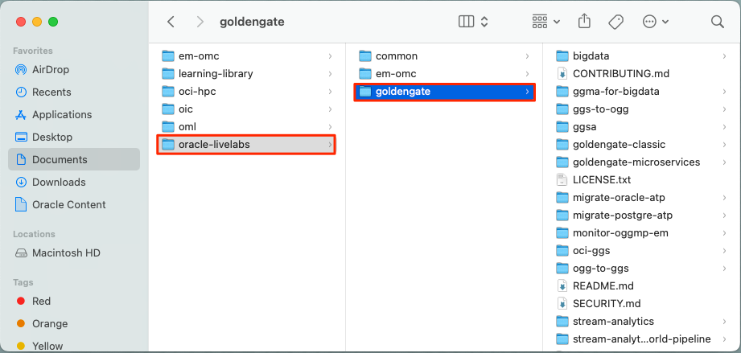
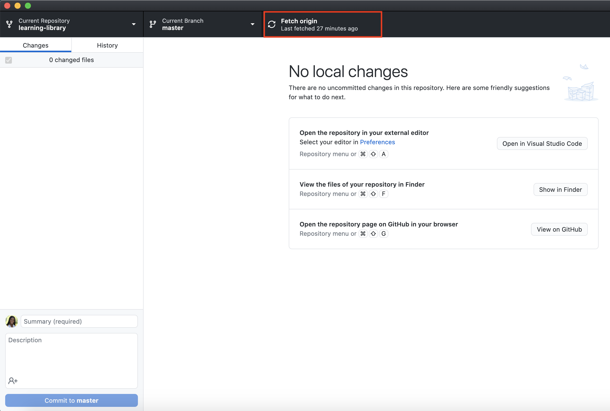

# Stay in Sync with GitHub Environment

## Introduction

Oracle LiveLabs requires a specific folder structure for workshop development. Workshop content consists of Markdown files and images that you write and edit. Use your preferred editor to author Markdown (.md) content.

### Objectives

* Clone and fork Oracle LiveLabs GitHub repositories
* Understand the **Oracle LiveLabs** folder structure
* Learn the components of workshop and lab folders
* Use tools to develop and host content
* Merge content from the main repository


## Task 1: Fork Repositories from the oracle-livelabs Organization

Workshops and labs are created in the **oracle-livelabs** organization repositories. Fork a repository to create a personal copy on your GitHub account. You own the forked repository and can edit it without affecting the main (production) repository.

For example, if janedoe forks the **database** repository, a duplicate [janedoe/database](https://github.com/janedoe/database) is created.

Also fork the [common repository](https://github.com/oracle-livelabs/common) to access common images and sample workshop templates.

After council approval, identify which repository fits your workshop among the [available repositories](https://github.com/orgs/oracle-livelabs/repositories). Choose based on your product or council. For example, GoldenGate workshops belong in [oracle-livelabs/goldengate](https://github.com/oracle-livelabs/goldengate).

If unsure which repository to use, contact your council group or the LiveLabs team.

The following steps demonstrate forking the **goldengate** repository, but the process is the same for any repository.

1. Log in to the [GitHub Web UI](http://github.com), using your GitHub account.

2. Navigate to the [Oracle Livelabs GitHub organization](https://github.com/oracle-livelabs).

3. Click **Repositories** to review the existing repositories. Select one repository that fits your workshop and click that repository.

  

4. Here, I am using the **goldengate** repository as an example, but the process is the same for other repositories. Click **Fork**.

  

5. Under **Owner**, expand the dropdown list and select your username. You can accept the **Repository name** as it is. Click **Create fork**.

  

6. Then, user has forked the **goldengate** repository.

  

In the next Task, you will clone this forked repository.

## Task 2: Clone the Forked Repository

A clone is a copy of your forked repository on your local computer. Edit files in your preferred editor (recommended: **Visual Studio Code**) and use **GitHub Desktop** to track changes offline.

To clone the forked repository:
1. Open your **GitHub Desktop** application and log in using your GitHub account.

2. Click **File > Clone repository** to display the **Clone a Repository** dialog box.

    

3. Select your repository such as **your account/repo** from **Your Repositories**. In this example, select **username/goldengate**. Under **Local Path**, select the local path on your machine where the repository is going to be cloned (copied). This is where the repository files get copied to your local file system. Click **Clone**.
    >**Note:** If you cannot find the repo you just forked, click the **refresh** button.

    

4. The cloning process may take several minutes, depending on how big the repository is.

  

5. When asked how you plan to use the fork, select **To contribute to the parent project**. Click **Continue**.

  

6. The repository files (in this case, **goldengate**) appear in the local path you just specified. You can now start working on your labs and workshops! Be sure to also clone **common**.

  

  > **Note:** The local cloned repository is connected to the remote fork version. You can push your local clone changes to the remote fork version when you are online to keep them in sync.

  When you make a clone, you can create your project folder, edit the files in your preferred editor, recommended **Visual Studio Code**, and use **GitHub Desktop** to keep track of your changes without having to be online.

  The repository you cloned is still connected to the remote version (your fork) so that you can push your local changes to the remote to keep them synced when you're online.

7. You can also use Github Desktop to synchronize the changes that you have made in your local file system to the forked content on your GitHub repo.

  

## Task 3: Merge Content from Git Before Editing

Before editing content each day, merge in **GitHub Desktop**. Merging synchronizes your clone with the latest content from **upstream/main**, ensuring you have the most recent templates and workshops.

> **Note:** Skipping this step can cause merge conflicts when you commit changes.

To merge content:
  1. Start your **GitHub Desktop** client.

  2. If you have multiple Oracle LiveLabs repositories, first switch to the repository that you will work on. Expand the dropdown list of **Current Repository**. Click the repository that you want to sync. In this case, I select the *em-omc* repository as an example, but the following process is the same for syncing other repositories.
  

  3. Click **Fetch origin**.
  

  4. Select **Branch > Merge into Current Branch...** to display the **Merge into main** window.

    

  5. Under the **Default Branch**, the main branch is selected by default. This indicates the local clone on your PC.
    

  6. Scroll down the **Merge into main** window, select **upstream/main** (this is your production repository which is oracle-livelabs/repository), and then click **Create a merge commit**. In this example, this will merge 1 commit by other people from the **upstream/main** into the clone on the local PC.

    

  7. When the merge is completed, a **"Successfully merged upstream/main into main"** message is displayed. To push the new commits from the local clone to your forked location, click **Push origin**. If you get an *Authentication failed* error, refer to the Troubleshooting section at the end of this lab.

    

    >**Note**: To determine if your clone is up-to-date with **upstream/main** (production), repeat Steps 4 to 7. If both repositories are synchronized, then the following message is displayed: "This branch is up to date with **upstream/main**".

    

  In the **GitHub Desktop** UI, notice that the **Push origin** is replaced by **Fetch origin** after the push origin operation is completed.  The local clone and fork repositories are now synchronized with the main repository.

  

## Task 4: Oracle LiveLabs Folder Structure

The following image shows the **sample-workshop** folder structure in Visual Studio Code. Each repository in [Oracle LiveLabs](https://github.com/oracle-livelabs) contains a **sample-livelabs-templates** folder. View the structure at [sample-workshop](https://github.com/oracle-livelabs/common/tree/main/sample-livelabs-templates/sample-workshop). Copy this folder to start workshop development.

  

## Task 5: Understand Workshop and Lab Folder Components

The root folder is the workshop name (e.g., **sample-workshop**).

> **Note:** Create your project folder within your cloned repository. Review the [Oracle LiveLabs GitHub organization](https://github.com/oracle-livelabs) to select a repository. Contact the LiveLabs team if no existing repository fits your workshop.

  * Each lab has its own folder, for example, **data-load**, **introduction**, **provision**, etc., each containing:
      * a **files** folder (optional) that contains the files used in this lab.
      * an **images** folder that contains the screenshots used in this lab.
      * a **.md** file that contains this lab's content.
  * The **workshops** folder contains the **desktop**, **sandbox** (previously livelabs), and/or **tenancy** (previously freetier) folder, each containing:
      * an `index.html` file, which is executed when it is accessed by a browser. You can copy this file from the *sample-workshop* folder and use it without changes.
      * a `manifest.json` file defines the structure of the workshop that the `index.html` file renders. You can copy this file from the *sample-workshop* folder, but you need to customize it for your workshop.
      * a `README.md` file (optional), which contains the summary of the entire workshop. You can view it from your git repository.

      The following screenshot shows a sample `manifest.json` file that is opened in the **Visual Studio Code** Editor.

      >**Note:** Ensure that the appropriate stakeholder email is listed by ***help***. If the *include* and *variables* do not apply to your workshop, you should remove them, to ensure your workshop can render properly.

      

## Task 6: Commit Your Changes

When you create, delete, or modify assets in your clone, commit (save) those changes and push them to your fork.

To commit your changes:
1. Start your **GitHub Desktop** client.

2. In the **Summary (required)** text box on the left (next to your picture), enter a summary of your changes. You can optionally add a more detailed description of your changes in the **Description** text box.

  

3. Click **Commit to main**. This saves your changes in your local clone. **Fetch origin** changes to **Push origin**.

4. Click **Push origin** (it should have an upward arrow with a number). This pushes the updated content from your clone into the origin of this clone, that is, your fork.

  

## Task 7: Set Up GitHub Pages for Your Fork

After uploading content to your fork, share your **GitHub Pages site URL** with reviewers.

> **Note:** Perform these actions in your forked repository (e.g., https://github.com/janedoe/em-omc), not the production repository.

GitHub Pages converts your Markdown files to HTML for preview. Share this URL with reviewers.

To publish your GitHub Pages site:
1. Log in to [GitHub Web UI](http://github.com) using your GitHub account credentials, and then click your fork's link in the **Repositories** section to display your fork.

  

2. Click **Settings**.

   

3. On the left menu, click **Pages**.

  

4. Under **Branch**, select **main** (if it's not already selected) from the drop-down list. Click **Save**.

  

<!-- 5. Optional: Under **Theme Chooser**, click **Change Theme** and select a theme of your choice. -->

5. This may take a few minutes to complete. After the GitHub Pages are enabled, the message under **GitHub Pages** changes to **Your site  is published at https://janedoe.github.io/em-omc/**
  

## Task 8: Access Your Workshop on GitHub

After pushing committed changes to GitHub, GitHub Pages may take several minutes to process the changes.

1. This workshop for example is located in the link below.

    ```
   https://github.com/user/em-omc/blob/main/enterprise-manager/emcc/workshops/freetier/index.html
    ```

3. The published version becomes:

    ```
    https://user.github.io/em-omc/enterprise-manager/emcc/workshops/freetier/index.html
    ```

## (Optional) Task 9: Customize Your Workshop for Events

This task explains how to customize a workshop for events and create an event code.

### What Is an Event Code?

An event code provides a customized set of labs for your target audience. Hidden workshops are accessible only to users with Oracle SSO and the event code—they are not indexed by search engines.

Use event codes to add, remove, or modify labs, or change workshop metadata (title, description, outline, prerequisites, time, video) without affecting the production workshop. Oracle PMs and Sales use event codes for events of all sizes.

The following screenshot shows the landing page of an event code. Any information squared in red can be customized.


If you are the **workshop team** of the workshop that you want to create an event for, you can change the workshop title, add additional labs, remove labs, and/or have a different version of a lab for the event by performing Steps 1 - 6.

>**Note**: Steps 1 - 6 are optional - only if you want to customize the workshop content for your events. If you only want to customize the workshop's meta info, you can go directly to Step 7.

1.  Depending on which repo your workshop is in, merge content from GitHub by following Lab 3: Stay in sync with GitHub environment -> **Task 3: Merge content from Git before you start editing your content**.

2.  Go to Visual Studio Code, under the **workshops** folder, where you can see a **freetier/tenancy** folder and/or a **livelabs/sandbox** folder, create a new folder and give it a descriptive name (lowercase) for the event (e.g. cloudworld, training, event, etc.)

3.  Then, copy the *index.html* and *manifest.json* from the **freetier/tenancy** or **livelabs/sandbox** folder, depending on where the new version of the workshop will run.

4. Now, in the new *manifest.json* file under the event folder, you can edit the workshop title, add labs, remove labs, or replace labs.

5. You can also create new Markdown files under lab folders to have a different version of labs, and then have the manifest.json file point to the new Markdown files.

6. Finally, push your changes and create a pull request to one of the oracle-livelabs GitHub repos. After your pull request is approved and merged, you can proceed to Step 7.

7. Go to the Workshop Management System (WMS). Expand **Events**, then click **Request an Event Code**. Watch this [**video**](https://livelabs.oracle.com/create-event) to learn how to request an event code. If you perform Steps 1 - 6, then you need to click **Edit Workshop Links** and put the customized links (for example, links ending with *workshops/events/index.html*).

  

8. After the event, if you as the event organizers want to know about the event's registration information, you can contact the LiveLabs team. We can share the number of attendees, their emails' domain names (but not their email address), and when they request the event codes, etc.

## Task 10: Revert a Commit in GitHub Desktop

1. Open **GitHub Desktop**, select your repository, and go to **History**.

    

2. Right-click the commit to revert and click **Revert Changes in Commit**.

    

## Troubleshooting

### Issue 1: Commits Behind oracle:main

  

Follow the steps in Task 3 to merge content from upstream/main.

### Issue 2: Clone Failed

  

Execute the following commands to update .gitconfig:

    ```
    <copy> git config --global core.longpaths true </copy>
    ```

    ```
    <copy> git config --global core.ignorecase false </copy>
    ```

### Issue 3: GitHub Merge Conflicts

Merge conflicts occur when multiple contributors change the same content. Conflicts prevent you from pushing changes.

  

1. When merging (as in Task 3), you may encounter conflicts. The screenshot shows 3 files with conflicts.

2. Manually decide which changes to keep. Open conflicting files in your editor—conflicts are highlighted. Choose your changes or the other version.

    

3. After resolving conflicts and saving, GitHub Desktop shows a green checkmark beside each file. Enter a **Summary** and click **Commit to main**, then **Push origin**.

    

4. Refresh your GitHub repo in the browser. You should have no commits *behind*, only *ahead*.

    

### Issue 4: Cannot Pull Changes from Production via GitHub Desktop

If your local repo is significantly behind oracle-livelabs:main, GitHub Desktop may fail to merge due to too many commits. Use git commands instead.

Contact the LiveLabs team in Slack for help with git commands.

> **Note:** Perform these actions **off VPN**.

1. Find below some instructions of Git Bash

2. Make sure you have Git installed.

3. Run the command to see if the *origin* is pointing to your repo, and *upstream* to the repo in Oracle LiveLabs.

    ```
    <copy>
    git remote -v
    </copy>
    ```

4. If yes, only then run these below commands to sync your repo:

  Fetch the latest changes from the repo in the Oracle LiveLabs GitHub project

    ```
    <copy>
    git fetch upstream
    </copy>
    ```

  Merge the changes from the repo in Oracle LiveLabs to your local repo
    ```
    <copy>
    git merge upstream/main -m "Sync with main"
    </copy>
    ```

    Push the locally updated version (merged changes in your local repository from the repo in Oracle LiveLabs) to your staging repo (on the browser)

    ```
    <copy>
    git push origin main
    </copy>
    ```

5. If there are any conflicts run the command to view the conflicting flies. You can also use GitHub Desktop to see the conflicting files.

    ```
    <copy>
    git diff --name-only --diff-filter=U
    </copy>
    ```

  Navigate to the conflicting files and resolve the conflicts by choosing the incoming changes or current changes.
  Once conflicts are resolved, commit the changes in your GitHub desktop and push them.

### Issue 5: Delete and Recreate Your Repository

If you cannot resolve issues in your local or staging repo, delete the entire repository and start over:

1. Open up a browser. Go to your repository (your fork). Click **Settings**.

  

2. Scroll down and click **Delete this repository**.

  

3. Enter &lt;your\_github\_user\_name&gt;/&lt;repo\_name&gt;.

4. Click the **I understand the consequences, delete this repository** button.

  This deletes the entire repo in your local/laptop. Follow the labs in this guide to set up your repo again.

### Issue 6: Authentication Error

  

First, verify you are logged into GitHub in GitHub Desktop. If the error persists, try the following steps.

If you already have an SSH key added to your GitHub account, skip to Step 5.

1. If you have not generated SSH keys in your local computer, first follow the *(Optional) Lab 5: Generate SSH keys* on the left to generate SSH keys in your local computer.

2. Now you have your public and private SSH keys. Go to your GitHub account in a browser. Click the arrow next to your profile picture on the upper right, and click **Settings**. Click **SSH and GPG keys**. If you have not added any SSH keys to your GitHub account, you will not see any SSH keys displayed. Then click **New SSH key**.
  

3. For **Title**, give your SSH key a name. In the **Key** field, copy and paste your public SSH key. Then, click **Add SSH key**.
  

4. After the SSH key is added, you can see it under SSH keys on your GitHub page.
  

5. Open up your terminal. Go to where *you cloned your GitHub repository* (which may be different from the example below). In this case, I am using the **em-omc** repository as an example, but the process is the same for other repositories.

    ```
    user@user-mac ~ % cd Documents/oracle-livelabs/em-omc
    user@user-mac em-omc %
    ```
6. Run the ssh-agent command.

    ```
    user@user-mac em-omc % <copy> ssh-agent -s </copy>
    SSH_AUTH_SOCK=/var/folders/sl/pt8rm4rd4tl_f8yyd8n6jd640000gn/T//ssh-vkOzi3x2qhp7/agent.82390; export SSH_AUTH_SOCK;
    SSH_AGENT_PID=82391; export SSH_AGENT_PID;
    echo Agent pid 82391;
    ```

7. Run the ssh-add command. Append your private SSH key after the ssh-add. Yours may be different from what is shown below.
    ```
    user@user-mac em-omc % <copy> ssh-add ~/.ssh/sshkey </copy>
    Identity added: /Users/user/.ssh/sshkey (user@user-mac)
    ```

8. Finally, go back to **GitHub Desktop** UI, and click **Push origin**. This should solve the authentication issue, and you can continue the lab.
  


### Issue 7: GitHub Desktop Does Not Reflect the Correct Repository

If you have multiple repositories, switch to the correct one in GitHub Desktop. Expand the **Current Repository** dropdown and select the repository you need.

  


## Acknowledgements

* **Last Updated By/Date:** LiveLabs Team, January 2026