# Use GitHub Desktop to Commit to the GitHub Repository

## Introduction

As a best practice, merge your library everyday or whenever you start your GitHub Desktop application. *Merge* pulls all the commits (changes) from the [upstream/master repository (production)](https://github.com/oracle/learning-library), into your local filesystem clone (local machine). This keeps your local clone up-to-date with other people's work (commits) from the upstream/master. Next, you push the updated content from your clone into the origin of your clone, that is, your fork, to synchronize your clone with your fork. Merging also avoids the long time it could take to complete if you don't do that often.

### Objectives

* Commit your changes
* Request for a review
* Test your content
* Create a Pull Request to upload your content to master

### What Do You Need?
* Git Environment Setup
* GitHub Desktop client

This lab assumes that you have successfully completed **Lab 3: Use a Text Editor to Develop Markdown Content** in the **Contents** menu on the right.

Watch this video below on how to self QA your workshop.
[](youtube:8tirP-hibsk)

## Task 1: Get Latest Updates from Production

Before you develop you should ensure you have the latest content from production to ensure you are developing off the latest code set.

1. Go to your personal github repo on the web and determine if your personal repo is behind the master.  If it is, perform the following steps to sync.  This should be done before you commit.

  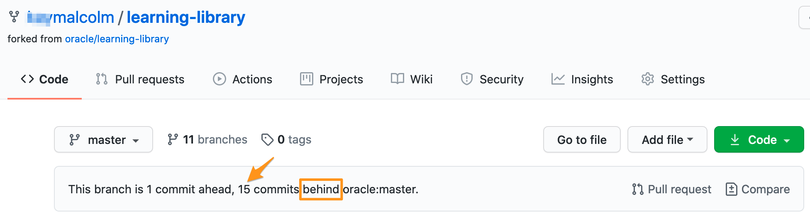

2. Start your **GitHub Desktop** client.  Go to **Branch** -> **Merge into Current Branch**.

  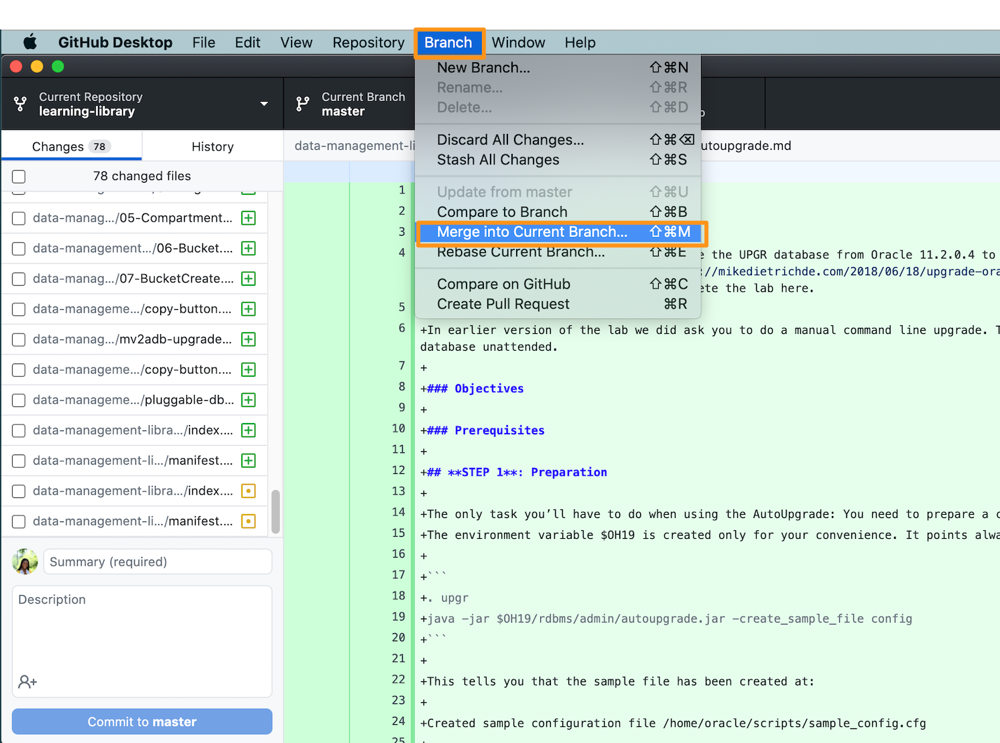

3. Select the branch upstream/master (there may be a number of branches, search until you see *upstream/master*). Press the **merge upstream/master into master** button.

  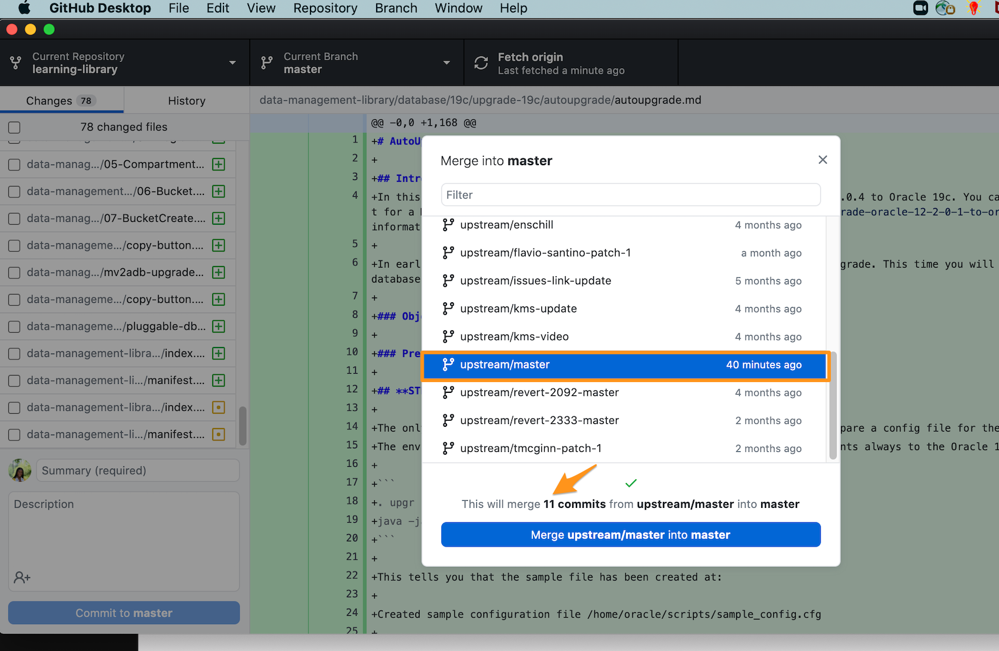

4. Finally, select **Push Origin**
  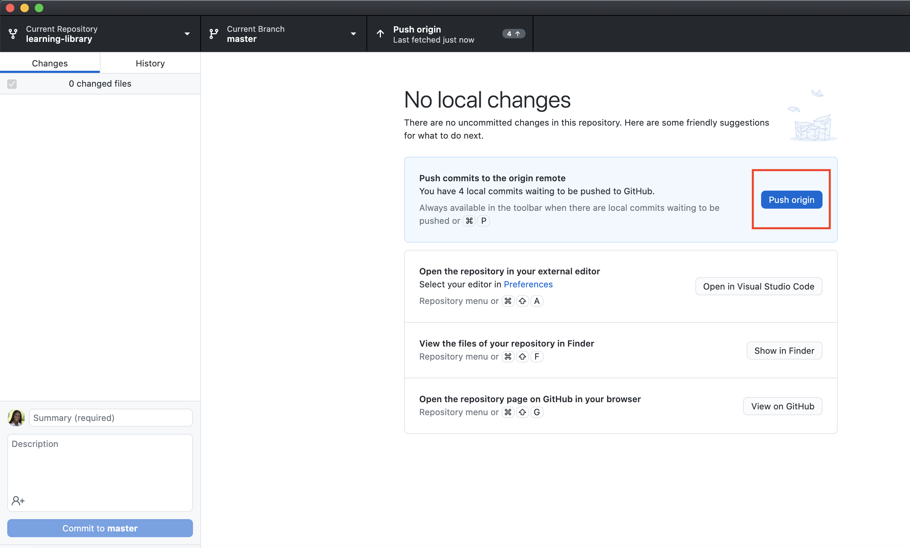

5. To confirm, press refresh on your personal github repo on the web, you should have no commits *behind* now, only *ahead*.

  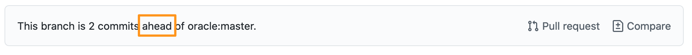


## Task 2: Commit your Changes in your Clone
When you create, delete, or modify assets in your clone (local copy), you should commit (save) those changes to your clone, and then push those changes from your clone to your fork. Then these changes get saved to your forked learning-library repository.

To commit your changes:
1. Start your **GitHub Desktop** client.
2. In the **Summary (required)** text box on the left (next to your picture), enter a summary of your changes. You can optionally add a more detailed description of your changes in the **Description** text box.

  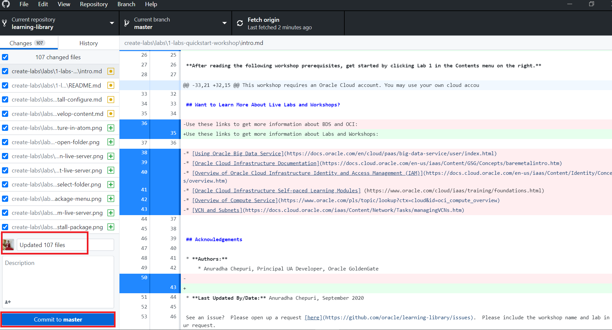

3. Click **Commit to master**. This saves your changes in your local clone. **Fetch Origin** changes to **Push Origin**.

4. Click **Push origin** (it should have an upward arrow with a number). This pushes the updated content from your clone into the origin of this clone, that is, your fork.

  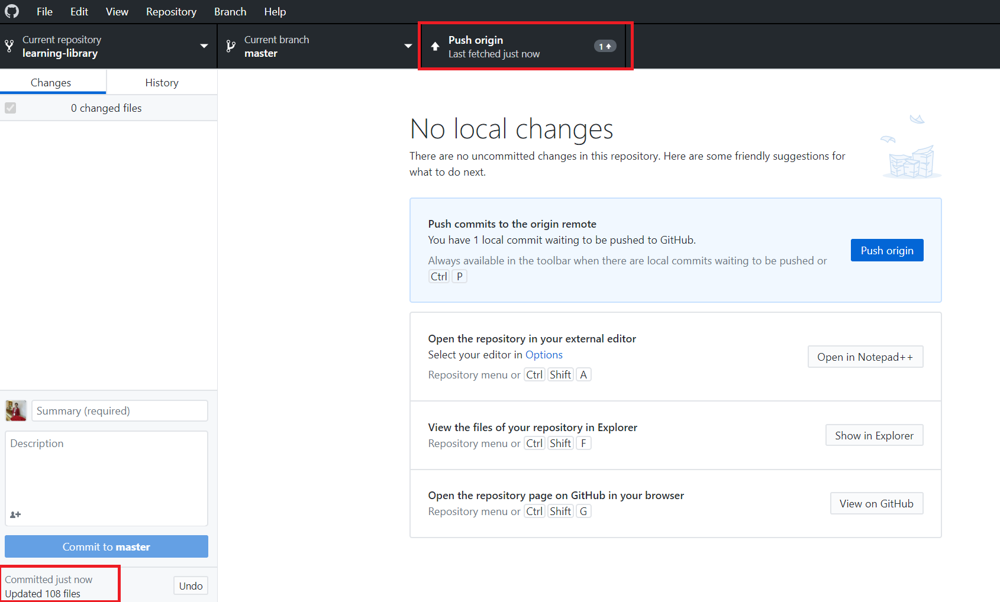


## Task 3: Set Up GitHub Pages for your Fork to Test your Content

After you upload the content from your clone to your fork, request your review team members to review this content by providing them with access to your GitHub Pages site URL (or the URL of your forked repository).

The GitHub Web UI has a feature called as **Set Up GitHub Pages for Your Fork** to Test Your Content. This feature performs a dynamic conversion of the Markdown files (.md files you have developed using your Atom Editor) to HTML. You can preview your workshop and labs on your forked repository and provide this URL to your reviewers.

To publish your GitHub Pages site:
1. Login to [GitHub Web UI](http://github.com) using your GitHub account credentials, and then click your fork's link in the **Repositories** section to display your fork.

  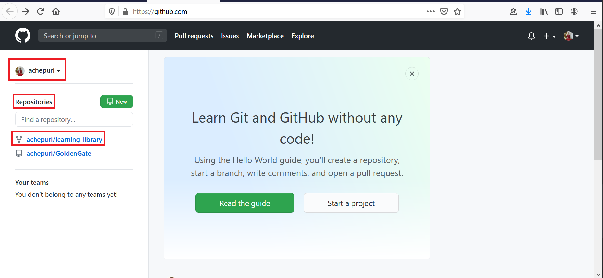

2. Click **Settings**.

   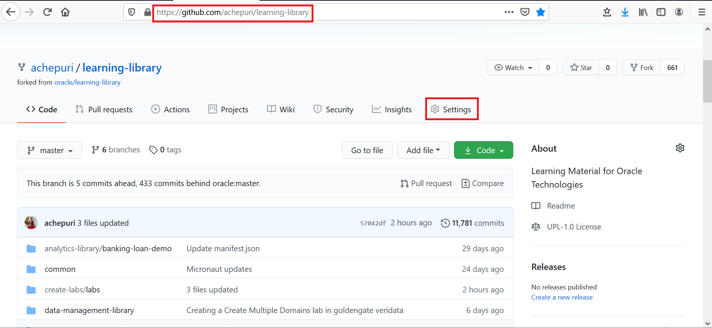

3. Click **Options** and scroll down to the **GitHub Pages** section.

  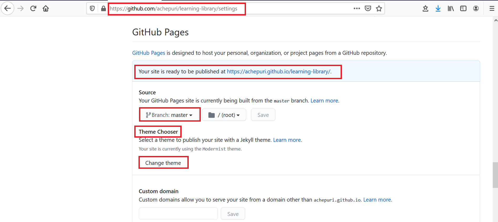

4. Under **Source**, select **main** (if it's not already selected) from the drop-down list.
5. Under **Theme Chooser**, click **Change Theme** and select a theme of your choice.

  This may take a few minutes to complete. After the GitHub Pages are enabled, the message under **GitHub Pages** changes to **Your site  is published at https://achepuri.github.io/adb** (adb is one of the possible repos under oracle-livelabs)
  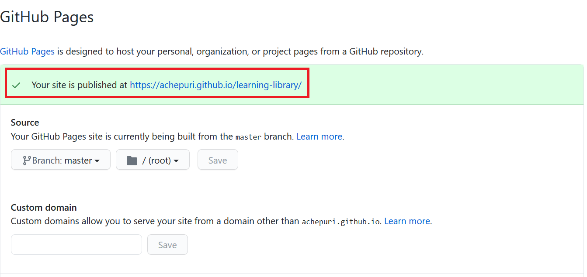

## Task 4: Sharing your Workshop for Review
After you have successfully set up your GitHub pages, you can share your workshop for review.
To share and view your workshop:
1. In the browser, enter the URL of your GitHub Pages [https://malcherm.github.io/adb/](https://malcherm.github.io/adb/).
2. Append the URL with the details of your workshop.
    The complete URL will look similar to this: [https://malcherm.github.io/common/sample-livelabs-templates/create-labs/labs/workshops/freetier/](https://malcherm.github.io/common/sample-livelabs-templates/create-labs/labs/workshops/freetier/), which can be shared for review.

## Task 5: Create a Pull Request to Upload Your Content to the Master Repository

The **Pull Request** is a request that you send to the repository owners and code owners of the **oracle-livelabs/adb** repository (adb being just one of the possible repos) to approve and host your content on production **(upstream/main)** repository).

Note:  *Before executing a PR, make sure you have run Task 1 above and that your personal github repo on the web is not behind.  Failure to do so will result in conflicts.  You cannot issue a pull request without syncing first.  PRs will not be approved without your WMS ID (Workshop ID)*

> **Note:** The owners can approve your request, ask for more information if required, or reject your request if your content does not meet the standards for Oracle GitHub.

To create a Pull Request:
1. In the **GitHub Desktop** client, select **Branch > Create pull request** to display a browser interface.

  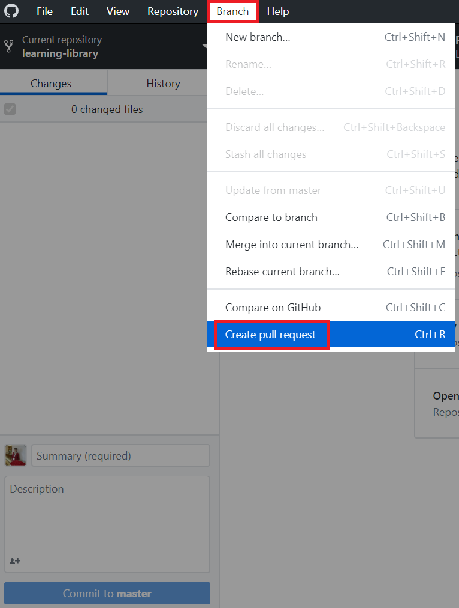

2. Click **Create pull request** to display an **Open a pull request** page.

  

3. Enter the title for the pull request, **include your WMS ID** (you can find that by visiting the [WMS](http://bit.ly/oraclewms)) in the title.  PRs will not be approved without this ID.
4. Click **Create pull request**.
    
  A status page is displayed indicating that you have created a pull request along with the request number (for example, #1770), that it is pending review, and that merging is blocked.

  When your pull request is approved, the page gets updated with information about your commits being approved and merged into the **upstream/main** repository (production).

  When the pull request is approved and merged into the **upstream/main** repository, two emails are sent to the e-mail account associated with your GitHub account.

  > **Note:**
    * The first email notifies you that your pull request was approved (or rejected).
    * If your pull request was approved, then the second email notifies you that your pull request was merged into the **upstream/main** repository.  

  Your committed content is now visible to the public on the learning-library (upstream/master or production) repository.

## Task 6: Access your workshop in Object Storage

After your pull request is complete, a daily job will copy over the github repo to object storage. It is from object storage that the html pages will be rendered.

1.  Replace your GitHub pages site from Step 3 -> #5 with object storage.  This will take you to the full path of your workshop.  

2. This workshop for example is located in the link below.

    ```
    https://objectstorage.us-phoenix-1.oraclecloud.com/p/SJgQwcGUvQ4LqtQ9xGsxRcgoSN19Wip9vSdk-D_lBzi7bhDP6eG1zMBl0I21Qvaz/n/c4u02/b/common/o/sample-livelabs-templates/create-labs/labs/workshops/freetier
    ```

3. The published version becomes:

    ```
    https://objectstorage.us-phoenix-1.oraclecloud.com/p/SJgQwcGUvQ4LqtQ9xGsxRcgoSN19Wip9vSdk-D_lBzi7bhDP6eG1zMBl0I21Qvaz/n/c4u02/b/common/o/sample-livelabs-templates/create-labs/labs/workshops/freetier
    ```

## Task 7: Change your status
Now that your workshop is in the learning library, set your workshop status in WMS to the appropriate status: **In Development** or **Self QA**.
1. Go to the WMS (Oracle employees only - [bit.ly/oraclelivelabs](https://bit.ly/oraclelivelabs)) and click **Edit My Workshops**.

  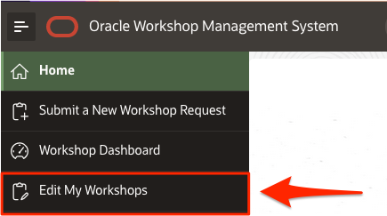

2.  Go to the row for your workshop and click the **WMS ID** of your workshop.
    >**Note:** If your workshop is already in production, you will need to contact livelabs-admin_us@oracle.com to edit it.

    

3.  On the *Workshop Details* page, update your **Workshop Status**. If you are finished and ready to QA, change the status to **Self QA**. If you still have some work to do, change the status to **In Development**.

  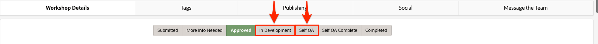

## Task 8: Self QA
You have finish developing your workshop. In order to publish your workshop, you still need to perform self QA on the workshop.

1.  On the *Workshop Details* page, ensure **Workshop Title** matches the workshop title in development, and **Short Description**, **Long Description**, **Workshop Outline**, and **Workshop Prerequisites** are all up-to-date. Click **?** beside each field to see its details.

  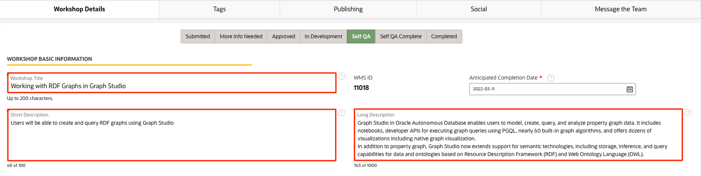
  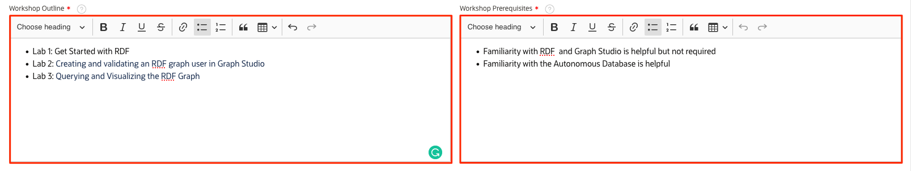

2.  If your workshop has been added to oracle/learning-library GitHub repo (your pull request has been merged), scroll down and update the **Production GitHub/GitLab URL**. Update it to the new oracle.github.io address you identified in Task 6. Update the **Development GithHub/GitLab URL** to your personal github page address.
  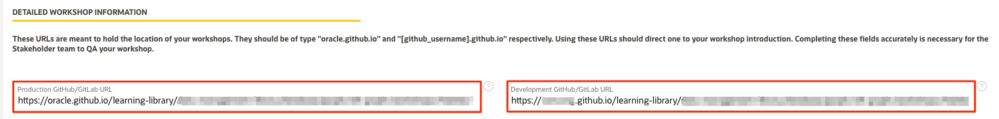

3. Click the **Tags** tab. Make sure you have selected correct tags for **Level**, **Role**, **Focus Area**, and **Product**. Click **Save**. Tags help people find your workshop in LiveLabs.
	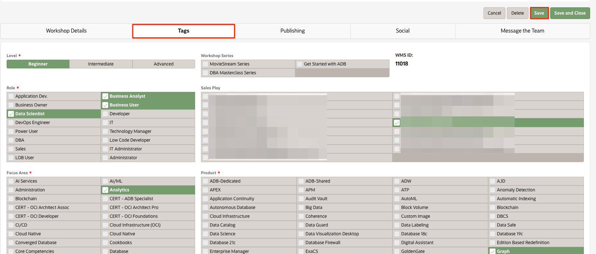

4.  If you have changed your Status to **Self QA**, you will receive a **Self QA form** from your *stakeholder* (livelabs-help-xx_us@oracle.com) of your workshop. You can also download the [document](https://objectstorage.us-ashburn-1.oraclecloud.com/p/MKKRgodQ0WIIgL_R3QCgCRWCg30g22bXgxCdMk3YeKClB1238ZJXdau_Jsri0nzP/n/c4u04/b/qa-form/o/QA.docx) here. Check your workshop against the form and fill it out. Update your workshop and create a new pull request if necessary for the workshop to follow LiveLabs standards.

  Workshop teams and stakeholders can watch this video below on how to self QA or verify the QA of a workshop.
  [](youtube:8tirP-hibsk)

5. After you finish Self QA, and your changes are reflected in oracle.github.io page, set your **Workshop Status** to **Self QA Complete** in WMS.
  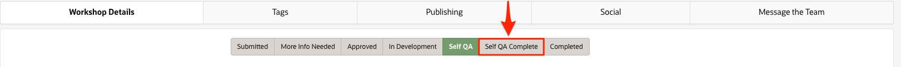

6. Then, email your completed Self QA document to your stakeholder email address. Stakeholder is who sent you the Self QA form. You can also find your stakeholder by going into WMS and looking at your *Workshop Details* page.

7. Your stakeholders will verify the QA within 2 business days. They will reach out to you via WMS if there are more changes needed. Otherwise, they will move the workshop into **Completed** status. If you have not heard back from your stakeholder 2 business days after you submit the Self QA form, please message them via WMS. While you are waiting to hear back from your stakeholder, you can go to Task 9 and request publishing.

  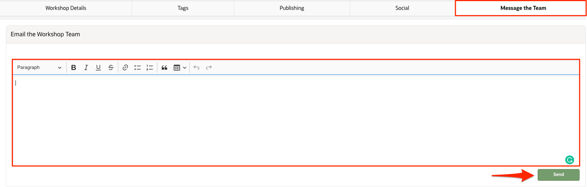

8. Questions?  Go to your workshop and find your stakeholder email address, and contact them.  You can also ask in the #workshops-authors-help Slack channel.

  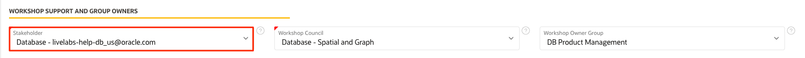

## Task 9: Request Publishing

Workshops authors can watch this [video 0:00 - 8:20](https://otube.oracle.com/playlist/dedicated/201649953/1_23j991jo/1_97hh00t6) on how to request publishing.

1.  Click **Publishing** tab, then **+ Publish to LiveLabs**.

	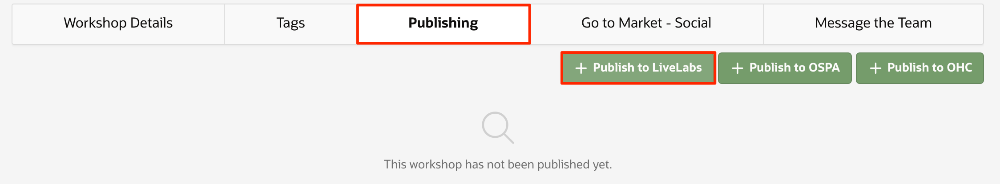

2. Fill out publishing information, including **Publish Type** and **Workshop Time**. Click **?** beside the Publishing Type to see different types of publishing. Turn on approriate tenancies for your workshop: **Paid Tier Enabled?**, and/or **Green Button Enabled?**, and fill out appropriate **URL**s. Click **Create** to submit your publishing request. Our LiveLabs team will either approve your publishing request, or ask you for more information within 2 business days.

    - Always Free On? - Turn off this button. This button will be deleted soon.

    - Free Tier On? - Turn off this button. This button will be deleted soon.

    - Paid Tier On? - Can this workshop be done in a customer tenancy?

    - Green Button On? - Can this workshop be done in a registered LiveLabs tenancy, a.k.a Green Button? With Green Button, users can run the workshop in pre-provisioned environements. Users have to complete the workshop in a specified limited amount of time. After their reservations expire, any instances they create will be destroyed. However, users can extend their reservations up to 4 times. You can contact us via WMS to request a Green Button for your workshop. Green Button can also be added after your workshop has already been in production.

    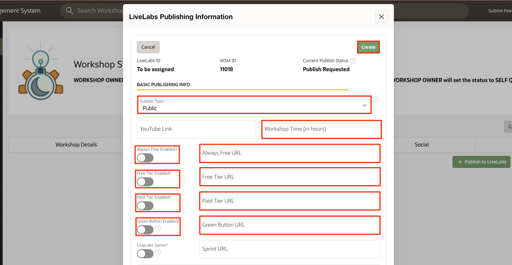

3. Click **Save**.

4. When your workshop is in **Completed** status, and we have approved your publishing request, your workshop will be published automatically within 1 business day.

You may now **proceed to the next lab**.

## **Appendix**: Troubleshooting Tips
### Issue: Commits Behind oracle-livelabes:main
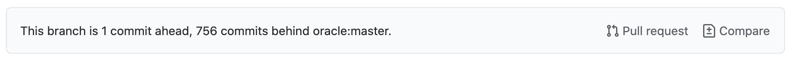

1. To fix this, in Github Desktop select **Fetch Origin**
  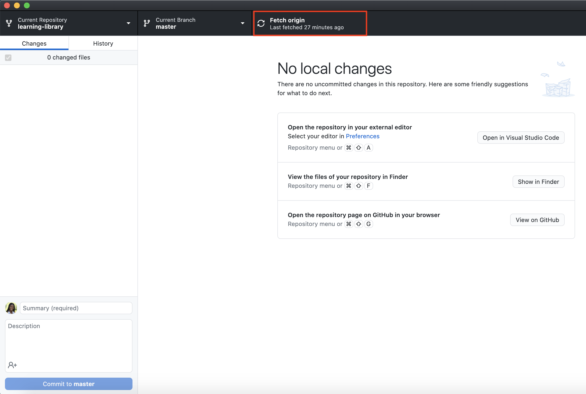

2. Next, select **Branch -> Merge into Current Branch**
  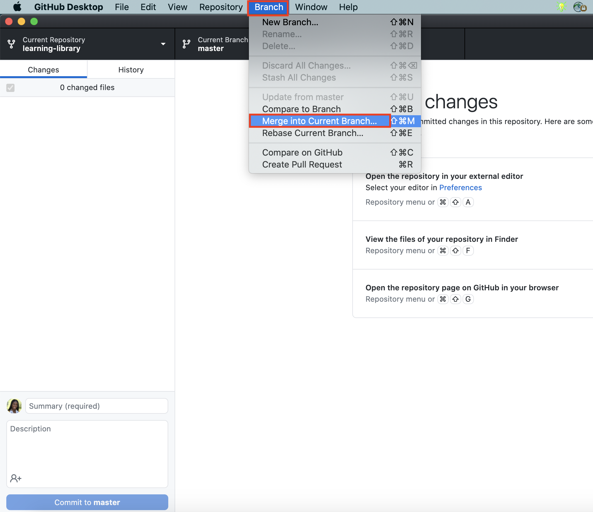

3. Then, click **Upstream/Main -> Merge Upstream/Main into Main**
  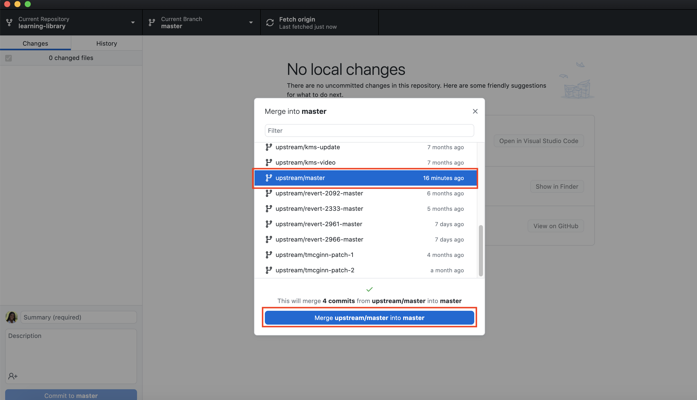

4. Finally, select **Push Origin**
  

4. To confirm, press refresh on your personal github repo on the web, you should have no commits *behind* now, only *ahead*.

  

### Issue: Clone failed
  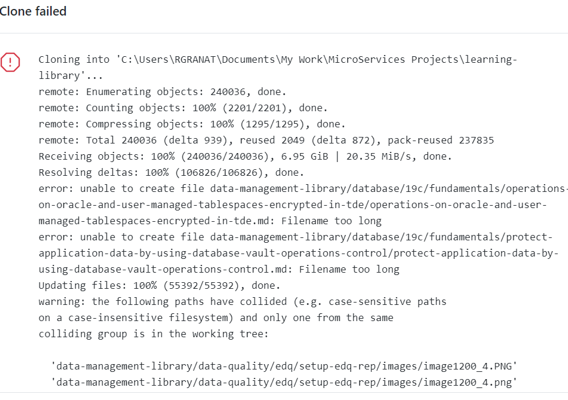

  1. Execute the following commands to make sure .gitconfig is updated:

    ```
    <copy> git config --global core.longpaths true </copy>
    ```

    ```
    <copy> git config --global core.ignorecase false </copy>
    ```

### Issue: GitHub Merge Conflicts
GitHub merge conflicts happen when you and some other contributors are changing the same content in the learning-library. Merge conflicts prevent you from pushing your changes to your learning-library GitHub repository.
  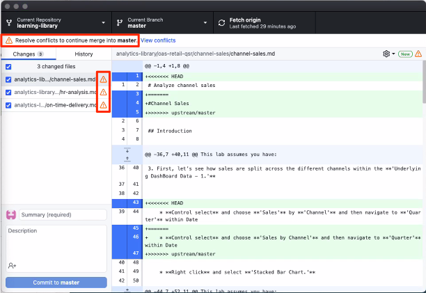

1. When you fetch origin and merge changes into your current branch (as in Task 1), you may encounter merge conflicts, as shown in the screenshot above. In the screenshot, you have 3 files that have merge conflicts.

2. Since you are changing the same content as other people, you need to manually decide which version of changes you want to keep. Open your text editor. Go to the files that have conflicts. Conflicts are highlighted by your text editor, and you will choose to use either your changes or other people's changes.
  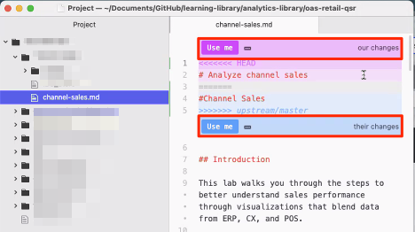

3. After you resolve all the conflicts and save your changes, you GitHub Desktop should look like the screenshot below. There will be a green checkmark beside each file, indicating there are no conflicts. Enter the **Summary** and click **Commit to main**. After commit finishes, you can click **Push origin**, and your changes are pushed to your GitHub repository.
  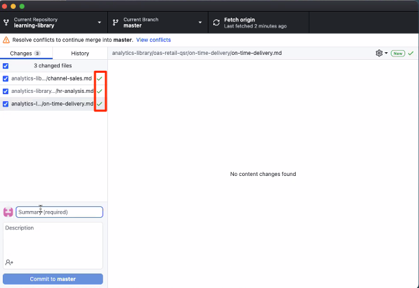

4. To confirm, press refresh on your personal github repo on the web, you should have no commits *behind* now, only *ahead*.

  

This concludes this lab. You may now **proceed to the next lab**.

## Want to Learn More?

* [Using GitHub Desktop to merge, commit and make pull requests](https://otube.oracle.com/media/t/1_bxj0cfqf)

## Acknowledgements

* **Author:**
    * Anuradha Chepuri, Principal User Assistance Developer, Oracle GoldenGate
* **Contributors:**
    * Lauran Serhal, Principal User Assistance Developer, Oracle Database and Big Data User Assistance
    * Aslam Khan, Senior User Assistance Manager, ODI, OGG, EDQ
    * Kamryn Vinson, Product Manager, Database
    * Arabella Yao, Product Manager, Database
    * Madhusudhan Rao, Product Manager, Database

* **Last Updated By/Date:** Michelle Malcher, June 2022
