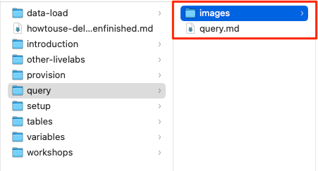
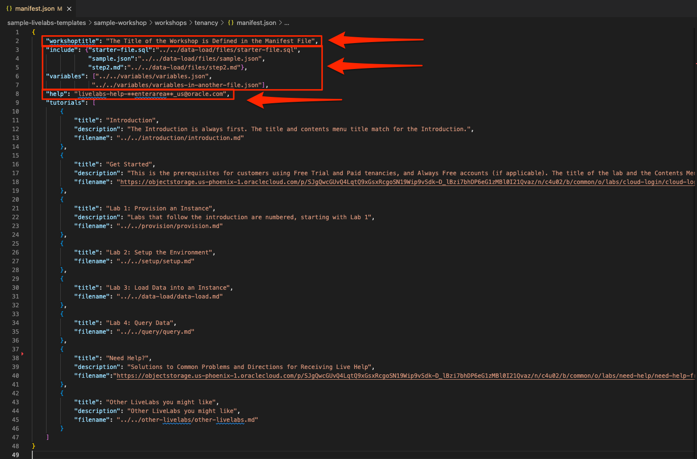
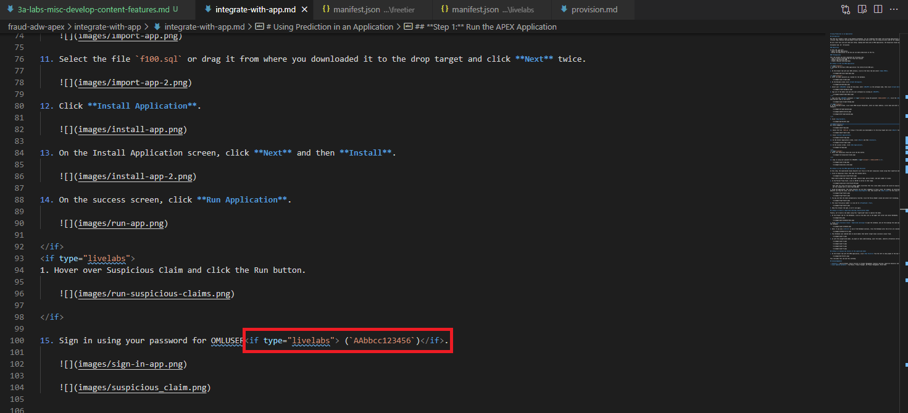
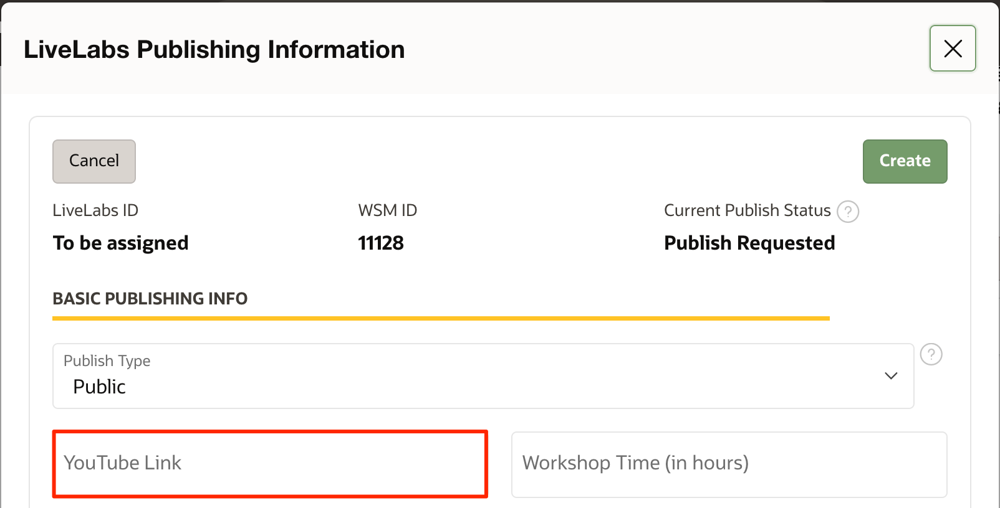
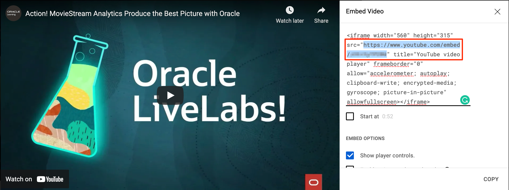
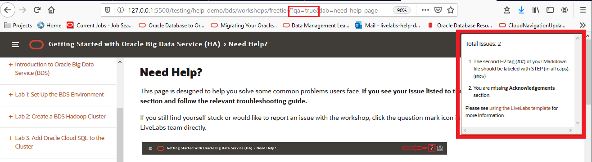

# Develop Markdown content

## Introduction

Using VSCode or another editor of your choice, the Markdown files need to be edited based on your workshop content. As you learned in the previous lab, there are templates that are provided to get you started.

> **Note:** Oracle recommends using **Visual Studio Code (VSCode)**. If you are currently using **Atom** - it is being retired, and you should move to use VSCode.

**Helpful tips from your LiveLabs Team**
[Video walking markdown editing](youtube:rOj5APIO-XU)

### Objectives

* Create workshop and lab content.
* Link to absolute path images
* Use conditional formatting
* Add videos and scale images
* Use the LintChecker
* **IMPORTANT!** Case sensitivity

### What Do You Need?
* An IDE, such as Visual Studio Code.

## Task 1: Create your labs and workshop content
Leverage the content from the **[sample-livelabs-templates/sample-workshop](https://github.com/oracle-livelabs/common/tree/main/sample-livelabs-templates/sample-workshop)** folder to start creating lab and workshop content for your project. Fork and clone the **[oracle-livelabs/common repository](https://github.com/oracle-livelabs/common/)** to get the sample-workshop folder on your local computer, by following Task 1 and Task 2 of this workshop.

> **Note:** Ensure to update your clone from the **upstream/main** repository (detailed in **Task 3**) regularly whenever we are working on the markdown files.

To create your lab and workshop content:
1. Open your cloned repository (where you want to put your workshop, not the common repository) using Windows Explorer (Windows) or Finder (Mac).

2. Create your workshop folder anywhere in your cloned repository. If a folder already exists for the workshop, then you can create your subfolders within that.

4. In your cloned *common* repository, Go to **sample-livelabs-templates/sample-workshop**. This has a few lab folders, such as **provision**, **query**, etc. Every lab folder contains the following: a **files** folder, an **images** folder, and the respective `.md` file. You can use **Live Server** (see in Task 6) to open up **sample-workshop/workshops/tenancy/index.html** to see how a workshop will show up in production, and play with it.

5. Copy any lab folder (except the folder named `workshops`), such as the **query** folder, to your project folder. In your project folder, rename the folder **query** and the respective `.md` file within it as per your requirement.  Based on the sample **query** folder, you can create and rename as many labs (folders) and the respective `.md` files as per your requirement.

      >**Note:** The **files** folder within every sample lab folder is currently not required and is reserved for future use. You can remove it if you don't need it.

      
      After you copy the sample folder to your project folder, you can delete your copy of the **files** folder from your project folder.
      Your lab will look similar to this example:
      

6. Similarly, copy the **workshops** folder along with its contents from **sample-livelabs-templates/sample-workshop** to your project folder.

7. To edit a `.md` file of your lab, you click **File > Open**.
  

8. Navigate to your project folder and click **Open** to open your project folder.
  

  The project folder along with the labs and **workshops** folder will then be displayed in your text editor.
    

9. Select the `.md` file you want to edit, for example, select the `data-load/data-load.md` file and edit your lab content. Similarly, edit the `.md` files of the rest of your labs.
    

10. If you want to add images in your lab, then include them within the **images** folder. You can insert images in the respective `.md` file.

11. Similarly to edit your workshop content, expand the **workshops/tenancy** (if you are creating a workshop running on users' tenancies), **workshops/sandbox** (if you are creating a sandbox/green button workshop), and/or **workshops/desktop** (if you are creating a noVNC workshop) folder in your text editor. Edit the `manifest.json` to list the labs you have added to your workshop (or plan to add) and update the title of the workshop. The `manifest.json` is like your book map file in SDL.

  Besides the list of labs, also update the `workshoptitle` field, and update the `help` field to point to the workshop's stakeholders group email. If the `include` and `variables` field do not apply to your workshop, please remove them, otherwise, your workshop will not render properly.

  

12. If you want to add an introduction to your workshop, then navigate to **sample-livelabs-templates/sample-workshop** and copy the `introduction` folder to your project folder. You can rename the introduction folder if you would want to.

13. You can also create a `README.md` file within **workshops/tenancy**, **workshops/sandbox**, and/or **workshops/desktop**, and update the `README.md` with a summary of your workshop. Note that the `README.md` file is optional for your workshop.

## Task 2: Use common labs and images

1. Some labs can be shared by many LiveLabs workshops, so we put together a list of [common labs](https://github.com/oracle-livelabs/common/tree/main/labs), including "Generate SSH Key," "Register an Oracle Cloud account," "Need Help," etc. for easier workshop development. You can leverage the [common labs](https://github.com/oracle-livelabs/common/tree/main/labs) located in the **[oracle-livelabs/common repository](https://github.com/oracle-livelabs/common/)**.

2. To use a common lab, you need to use an absolute link to the lab in your workshop's manifest.json file. For example, if you want to use the "Generate SSH Key" common lab located in [https://github.com/oracle-livelabs/common/blob/main/**labs/generate-ssh-key-cloud-shell/generate-ssh-keys-cloud-shell.md**](https://github.com/oracle-livelabs/common/blob/main/labs/generate-ssh-key-cloud-shell/generate-ssh-keys-cloud-shell.md), you should use this link in the manifest.json file: [https://oracle-livelabs.github.io/common/**labs/generate-ssh-key-local/generate-ssh-keys-local.md**](https://oracle-livelabs.github.io/common/labs/generate-ssh-key-local/generate-ssh-keys-local.md).

Leverage LiveLabs [Markdown Cheat Sheet](https://objectstorage.us-ashburn-1.oraclecloud.com/p/MKKRgodQ0WIIgL_R3QCgCRWCg30g22bXgxCdMk3YeKClB1238ZJXdau_Jsri0nzP/n/c4u04/b/qa-form/o/LiveLabs_MD_Cheat_Sheet.pdf)

## Task 3: Security

1. Blur all personal information (IP addresses, intranet URLs, email addresses, OCIDs, usernames, and passwords) from images.
  

2. Every image must have a description: ![DESC] (…/…/name.png “ “)

  

3. Do not use any IP addresses, intranet URLs (for example links to a Confluence page), email addresses, OCIDs, usernames, or passwords in the text. Do not provide a demo password.

## Task 4: Link to absolute path images
Rather than pointing to images within your lab folder or workshop directory with a relative path, you can just as easily point your images to URLs. This comes in handy if you use [common images](https://github.com/oracle-livelabs/common/tree/main/images), or reuse an image a lot, the code you write to display it in markdown will always be the same no matter where the image is in relation to markdown. Using absolute image paths is also handy if you need to keep an image updated, as changing the destination file image will affect every instance where you pointed an image to it. This is also useful when you want to *point to an image in a different repository* (you don't need to clone or fork that repository). This is the same concept and implementation as using absolute paths for common labs in your manifest.json files.

*For screenshots of OCI menu navigation, use the images with absolute links*

1. Here is an example of what the image code block looks like for pointing to a local image using relative pathing.

  ``````

2. To use an image with an absolute path, just replace the path with an URL. In this case, I am pointing to a common image located in the **oracle-livelabs/common** repository.

    ```
    <copy>
    
    </copy>
    ```

  Here is how the image path above shows up in production:
  

3. You can find all common images in the [oracle-livelabs/common](https://github.com/oracle-livelabs/common/tree/main/images) GitHub repository. For example, if an image is located in **images/console/home-page.png** in the **common** repository, then the link you should use is https://oracle-livelabs.github.io/common/**images/console/home-page.png**.

  


## Task 5: Use conditional formatting
If your workshop supports multiple instance types, but the bulk of the content stays the same, then conditional formatting can save you a lot of work. Most commonly, if you have differences between the "Free Tier" and "LiveLabs" (Green button) versions such as provisioning a database instance in Free Tier and just checking that it's created properly for LiveLabs, then conditional formatting will allow your workshop to use a singular markdown for both. This will save you immense effort and prevent accidental oversights if you need to update your workshop in the future since you won't have to maintain a duplicate markdown.

  1. Conditional formatting is using the "if" conditional to choose what to display in your markdown, based on an additional attribute "type" you attach to a lab element in your manifest.json file. Take a look at this example to understand the components involved in making conditional formatting work.

  

  On line 71, you can see the conditional is **if type="freetier"** and the closing **/if** on line 92. That means line 71-92 is only rendered if the type is freetier, and lines 93-98 is only rendered if the type is livelabs.

  

  On lines 21 and 27, you can see that we added the attribute "type" to the lab element. In this instance, this manifest.json is for the free tier version of the workshop so when a customer launches the workshop through a free tier button on the workshop's landing page, lab 2 and lab 3 will always have the **"freetier"** type attached to it.

  

  On lines 12, 17, and 23, you can see the same thing except that the type is "livelabs" for this file. The actual word doesn't matter, as long as the "type" in the manifest.json and the "type" in the markdown matches, the contents of the markdown conditional will be displayed.

2. You may have noticed that the numbering of the substeps within a step that uses conditional formatting may get out of line. Don't worry, as long as you use a number greater than 0, markdown will automatically number them sequentially when it gets rendered on a webpage. Also, note that conditional formatting can be used in-line if needed, you don't **HAVE TO** envelope content in a neat code block... though it's recommended to keep things organized and easy to read.

  

## Task 6: Link within a workshop (Hotlinks)
Sometimes you may want to link to something within your lab or workshop.  Most commonly, this is used in pages to link from the introduction or objectives to a specific section in the lab. This section in particular is hot-linked from the introduction to driving home that point. We'll take a look at the "Need Help?" lab to demonstrate how to incorporate this in your workshop.

1. First, take a look at the format of the hotlink. It's the same as when you construct a regular hyperlink, except that you preface the URL section with a **#** and then you use a seemingly condensed version of the section name you want to link to.

  

2. The condensed version of the section name is derived from the title of the section, without any spaces and most punctuations. This is the **name** attribute of the section (**division** in this case, and most cases). To view this and ensure your hotlink is correct... right-click on the element you want to link to and select **Inspect Element** and find the **"Name"** attribute.

  

## Task 7: Add and embed a Video

Adding videos is very similar to adding images. We most commonly see videos added in the introductions for labs to familiarize the audience with the product before they dive into the workshop.

1. Take a look at this example of a video linked in the introduction of a workshop.

  

  Markdown does the work of embedding the video for you, all you need to provide is a video hosting site (YouTube highly recommended) and the video link address.

2. The video link address is the characters you'll find at the end of the URL for the video you want to link.

  
  
We also recommend workshop teams provide a video if available, for a better customer experience. This video will be displayed on this workshop's LiveLabs landing page as shown on the screenshot below.


The video can be from [Oracle Video Hub](https://videohub.oracle.com/) (recommended) or from [YouTube](https://www.youtube.com/). Oracle Video Hub is the public video platform of Oracle. Videos uploaded to Oracle Video Hub help us get better analytics on video usage. If your team does not have a YouTube account, you can reach out to the LiveLabs team and ask us to upload the video for you.

Option 1: To embed a video from Oracle Video Hub:

1. On the Oracle Video Hub page of the video, click **Share**.
    
2. Click **Embed**.
    
3. Copy the src link from `https` to `flashvars[streamerType]=auto` as shown on the screenshot below.
    
4. Paste the link to the **YouTube Link** section on the publishing entry. Click **Create** or **Save**.
    

Option 2: To embed a video from Youtube:
1. On the Youtube page of the video, click **SHARE**.
    
2. Click **Embed**.
    
3. Copy the src link (without double quotes) highlighted on the screenshot below.
    
4. Paste the link to the **YouTube Link** section on the publishing entry. Click **Create** or **Save**.
    

## Task 8: Scale an image
Without using image scaling, all the screenshots you take for your workshop will be of different sizes (unless you're a master of making pixel-perfect crops). To remedy this, we HIGHLY recommend you to stick with a scaling and use it throughout your workshop. This will make all the images scale to the same width (if possible) and contribute to a more consistent and polished feel. You can override the default image scaling by applying these manual controls below. **We highly recommend you use #4's format by default.**

1. This is a demo image with no image sizing applied:

    ```
    
    ```

  

2. Use this format to scale the image size in relation to the amount of lab page space available. This example uses 50% of the page width and auto height:

    ```
    
    ```

  

3. Use this format for an absolute width and auto-scaled height. This example uses 500 pixels for width:

    ```
    
    ```

  

4. Lastly, **this is the format we recommend for all your images** if you don't need a particular scaling to drive emphasis on a subject. It auto-scaled to around ~3/4ths of the page width and its definition is maintained by the LiveLabs team so we can adjust the scaling platform-wide if needed:

    ```
    
    ```

  

5. As a final note, it's in your best interest to take as large of a picture as you can and then scale it down using the parameters above. LiveLabs allows the magnification of images so if you have a larger base image, the audience will have more clarity.

## Task 9: Use the LintChecker
The LintChecker is a great javascript function for QAing that you should take advantage of. It is especially handy in catching some of the more easily overlooked errors such as indentation and syntax errors.

1. To enable the LintChecker, just tack on **?qa=true** to the URL. You can do this from the github.io webpage or through LiveServer in your chosen IDE.

  

  A box will pop up with any errors that the LintChecker caught. Keep in mind that these are not an exhaustive list of errors, they are only the ones that the function has been programmed to catch.  Also keep in mind that even though it lists something as an "error", if it was done intentionally by you, you can by all means just ignore it.


## Task 10: Case Sensitivity

**THIS IS IMPORTANT.** The majority of us use Windows and macOS which are **Case Insensitive** systems. This means that Windows and macOS consider "OrAcLe.PnG" to be the same as "oracle.png" or "Oracle.PNG" for file structure. GitHub and GitHub pages are **Case Sensitive**, and **do** make that distinction.

1. This means that, for example, if you had an image file that you tested locally (on LiveServer for your IDE on your local Windows or macOS machine) for a markdown called "case-sensitive.png", it would display just fine if you used "case-sensitive.png" or "case-sensitive.PNG" as the image link.  But if you viewed it up on GitHub pages at [this link](https://oracle-livelabs.github.io/common/sample-livelabs-templates/create-labs/labs/workshops/freetier/index.html?lab=3a-labs-misc-develop-content-features), only the "case-sensitive.png" image link would be displayed since it matches the image file name perfectly (case sensitive) and it could not find the image link for "case-sensitive.PNG" and so it cannot display it.

  

  

  Do you see one or two images above?

  If you are viewing this page via LiveServer from your IDE (on a case insensitive operating system), you should see **two** images.

  If you are viewing this page on github.io, you should only see **one** image.

2. If you do run into a Case Sensitivity error on Windows or macOS, you cannot simply fix it by renaming it DIRECTLY with the correct case... because the system will not recognize that you are trying to rename it. You have to either rename that item to something else entirely and then rename it back with the correct case... or you can use **"git mv"** as described [in this article](https://stackoverflow.com/questions/11183788/in-a-git-repository-how-to-properly-rename-a-directory) for more complicated fixes that involve entire directories.


**Reminder** Download this handy [Cheatsheet](https://objectstorage.us-ashburn-1.oraclecloud.com/p/Qfg5WZ_O9yDet7NlaJPT76s9o_Yy0VVQ3LDh34c0HTrietIqqKq-m9zukdqiRymL/n/c4u04/b/livelabsfiles/o/LiveLabs_MD_Cheat_Sheet.pdf), which has more information about using Markdown syntax for LiveLabs development.

You may now **proceed to the next lab**.


## Acknowledgements
* **Author:**
    * Michelle Malcher, Senior Manager, Oracle Database Product Management
* **Contributors:**
    * Lauran Serhal, Principal User Assistance Developer, Oracle Database and Big Data User Assistance
    * Anuradha Chepuri, Principal User Assistance Developer, Oracle GoldenGate

* **Reviewed by:**
    * Aslam Khan, Senior User Assistance Manager, ODI, OGG, EDQ
    * Kay Malcolm, Database Product Management
    * Arabella Yao, Database Product Management
    * Andres Quintana
    * Brianna Ambler

* **Last Updated By/Date:** Michelle Malcher, August 2022
