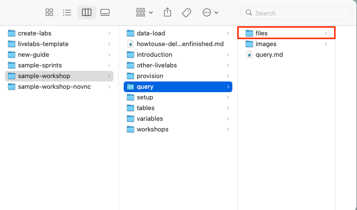
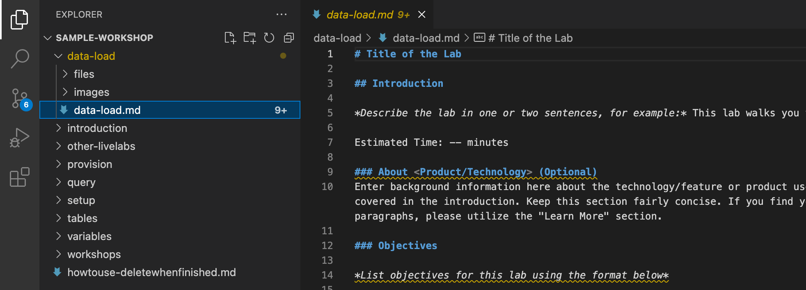
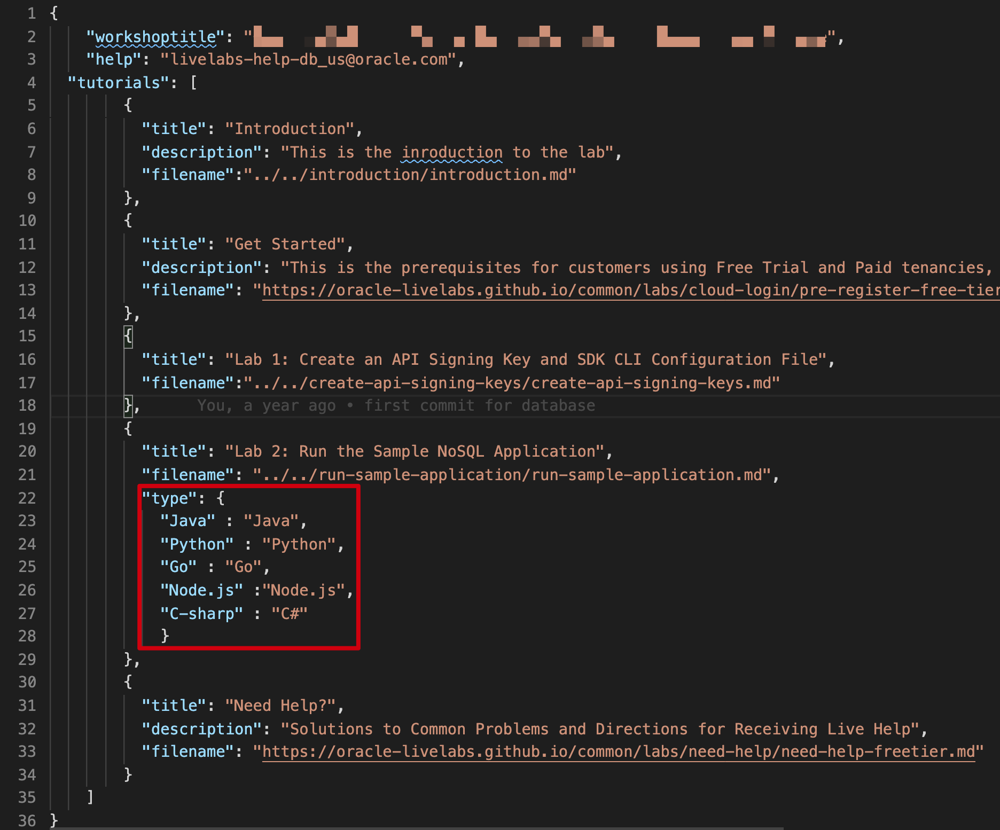
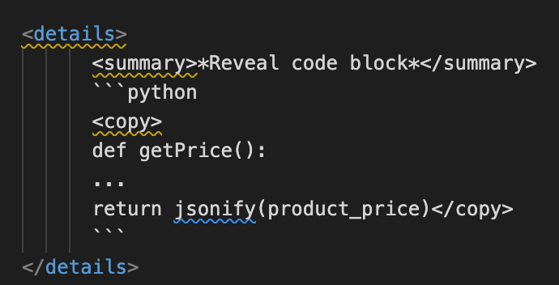

# Develop Markdown content

## Introduction

To optimize your workflow while developing workshop content, we recommend using VSCode as your editor. VSCode allows you to efficiently edit Markdown files using the optional tasks below. As demonstrated in the previous lab, Task 1 provides templates that give you a solid foundation to start editing. Tasks 2 to 15 (optional) streamline your content development and enhance productivity.

> **Note:** For a comprehensive workshop development experience, we recommend using the sample workshop folder provided in Task 1, while tasks 2 to 15 are optional.

<!-- **Helpful tips from your LiveLabs Team**
[Video walking through markdown editing](youtube:rOj5APIU-XU) -->

### Objectives

* Create workshop and lab content
* Link to absolute path images
* Use conditional formatting
* Add videos and scale images
* Use the LintChecker
* Use auto-estimated time calculation
* **IMPORTANT!** Case sensitivity

### What Do You Need?
* An IDE, such as Visual Studio Code.


## Task 1: Create Your Labs and Workshop Content
Use the content from the **[sample-livelabs-templates/sample-workshop](https://github.com/oracle-livelabs/common/tree/main/sample-livelabs-templates/sample-workshop)** folder to start creating lab and workshop content for your project. Fork and clone the **[oracle-livelabs/common repository](https://github.com/oracle-livelabs/common/)** to get the sample-workshop folder on your local computer by following Task 1 and Task 2 of this workshop.

> **Note:** Update your clone from the **upstream/main** repository (detailed in **Task 3**) regularly when working on markdown files.

To create your lab and workshop content:
1. Open your cloned repository (where you want to put your workshop, not the common repository) using Windows Explorer (Windows) or Finder (Mac).

2. Create your workshop folder anywhere in your cloned repository. If a folder already exists for the workshop, then you can create your subfolders within that.

4. In your cloned *common* repository, go to **sample-livelabs-templates/sample-workshop**. This has a few lab folders, such as **provision**, **query**, etc. Every lab folder contains a **files** folder, an **images** folder, and the respective `.md` file. You can use **Live Server** (see Task 6) to open **sample-workshop/workshops/tenancy/index.html** to see how a workshop appears in production.

5. Copy any lab folder (except the folder named `workshops`), such as the **query** folder, to your project folder. In your project folder, rename the **query** folder and the respective `.md` file within it as needed. Based on the sample **query** folder, you can create and rename as many labs (folders) and `.md` files as needed.

      >**Note:** The **files** folder within every sample lab folder is currently not required and is reserved for future use. You can remove it if you don't need it.

      
      After you copy the sample folder to your project folder, you can delete your copy of the **files** folder from your project folder.
      Your lab will look similar to this example:
      

6. Similarly, copy the **workshops** folder along with its contents from **sample-livelabs-templates/sample-workshop** to your project folder.

7. To edit a `.md` file of your lab, you click **File > Open**.
  

8. Navigate to your project folder and click **Open** to open your project folder.
  

  The project folder along with the labs and **workshops** folder will then be displayed in your text editor.
    

9. Select the `.md` file you want to edit, for example, select the `data-load/data-load.md` file and edit your lab content. Edit the `.md` files of the rest of your labs in the same way.
    

10. To add images in your lab, include them within the **images** folder. You can insert images in the respective `.md` file.

11. To edit your workshop content, expand the **workshops/tenancy** (if you are creating a workshop running on users' tenancies), **workshops/sandbox** (if you are creating a sandbox/green button workshop), and/or **workshops/desktop** (if you are creating a noVNC workshop) folder in your text editor. Edit the `manifest.json` to list the labs you have added to your workshop (or plan to add) and update the workshop title. The `manifest.json` is like your book map file in SDL.

  Besides the list of labs, also update the `workshoptitle` field and the `help` field to point to the workshop's stakeholders group email. If the `include` and `variables` fields do not apply to your workshop, remove them, otherwise your workshop will not render properly.

  

12. To add an introduction to your workshop, navigate to **sample-livelabs-templates/sample-workshop** and copy the `introduction` folder to your project folder. You can rename the introduction folder if needed.

13. You can also create a `README.md` file within **workshops/tenancy**, **workshops/sandbox**, and/or **workshops/desktop**, and update the `README.md` with a summary of your workshop. The `README.md` file is optional for your workshop.

## Task 2: Use Common Labs and Images

1. Some labs can be shared by many LiveLabs workshops, so we put together a list of [common labs](https://github.com/oracle-livelabs/common/tree/main/labs), including "Generate SSH Key," "Register an Oracle Cloud account," "Need Help," etc. for easier workshop development. You can use the [common labs](https://github.com/oracle-livelabs/common/tree/main/labs) located in the **[oracle-livelabs/common repository](https://github.com/oracle-livelabs/common/)**.

2. To use a common lab, you need to use an absolute link to the lab in your workshop's manifest.json file. For example, to use the "Generate SSH Key" common lab located in [https://github.com/oracle-livelabs/common/blob/main/**labs/generate-ssh-key-cloud-shell/generate-ssh-keys-cloud-shell.md**](https://github.com/oracle-livelabs/common/blob/main/labs/generate-ssh-key-cloud-shell/generate-ssh-keys-cloud-shell.md), use this link in the manifest.json file: [https://oracle-livelabs.github.io/common/**labs/generate-ssh-key-local/generate-ssh-keys-local.md**](https://oracle-livelabs.github.io/common/labs/generate-ssh-key-local/generate-ssh-keys-local.md).

Use the LiveLabs [Markdown Cheat Sheet](https://c4u04.objectstorage.us-ashburn-1.oci.customer-oci.com/p/EcTjWk2IuZPZeNnD_fYMcgUhdNDIDA6rt9gaFj_WZMiL7VvxPBNMY60837hu5hga/n/c4u04/b/livelabsfiles/o/LiveLabs_MD_Cheat_Sheet.pdf)

## Task 3: Don'ts

1. Mandatory requirements (Check links, code snippets, help email address, grammar issues)
2. Ensure all filenames are lowercase and markdown filenames and directories match
3. Pay attention to lab sections (each lab has a title (#), Introduction (##), Objectives (###), Prerequisites (###), Acknowledgements (##))
4. Third-party URL shorteners like bit.ly and tiny.url are no longer permitted in LiveLabs content because they can obscure the destination link, making it easier for malicious sites to go undetected. Using clickable URLs formatted in markdown is a better option. This approach enhances the visual appeal of your content and conceals long, non-memorable URLs in a safer and more transparent way. See the example in **Task 5**.

## Task 4: Security

1. Blur all personal information (IP addresses, intranet URLs, email addresses, OCIDs, usernames, and passwords) from images.
  

2. Every image must have a description: ![DESC] (…/…/name.png “ “)

  

3. Do not use any IP addresses, intranet URLs (for example links to a Confluence page), email addresses, OCIDs, usernames, or passwords in the text. Do not provide a demo password.

## Task 5: Formatting of URLs

Markdown simplifies adding hyperlinks (clickable links) to your text. You can create a hyperlink using the following syntax:

```
<copy>
[Link Text](https://www.example.com)
</copy>
```

a. **Link Text**:

* This is the text that users will see and click on.
* It should describe the content or destination of the link clearly.
* For example, instead of writing something vague like "Click Here," use something more informative like "[View our latest post](https://www.example.com)".

b. **URL**:

* This is the actual web address you want the link to point to.
* You must include the full URL, starting with https:// or http://.
* If the link is broken, the markdown won’t produce an error, but users will be taken to a non-functioning page.

## Task 6: Link to Absolute Path Images

Rather than pointing to images within your lab folder or workshop directory with a relative path, you can point your images to URLs. This is useful if you use [common images](https://github.com/oracle-livelabs/common/tree/main/images) or reuse an image frequently—the code you write to display it in markdown will always be the same regardless of the image location. Using absolute image paths is also useful if you need to keep an image updated, as changing the destination file image will affect every instance where you pointed an image to it. This is also useful when you want to *point to an image in a different repository* (you don't need to clone or fork that repository). This is the same concept and implementation as using absolute paths for common labs in your manifest.json files.

*For screenshots of OCI menu navigation, use images with absolute links*

1. Here is an example of what the image code block looks like for pointing to a local image using relative pathing.

  ``````

2. To use an image with an absolute path, just replace the path with an URL. In this case, I am pointing to a common image located in the **oracle-livelabs/common** repository.

    ```
    <copy>
    
    </copy>
    ```

  Here is how the image path above shows up in production:
  

3. You can find all common images in the [oracle-livelabs/common](https://github.com/oracle-livelabs/common/tree/main/images) GitHub repository. For example, if an image is located in **images/console/home-page.png** in the **common** repository, then the link you should use is https://oracle-livelabs.github.io/common/images/console/home-page.png.

  

## Task 7: Use Conditional Formatting

If your workshop supports multiple instance types but the bulk of the content stays the same, conditional formatting can save you work. For example, if you have differences between the "Free Tier" and "LiveLabs" (Green button) versions such as provisioning a database instance in Free Tier and checking that it's created properly for LiveLabs, conditional formatting will allow your workshop to use a single markdown for both. This will save you effort and prevent accidental oversights when you need to update your workshop in the future since you won't have to maintain duplicate markdown.

  1. Conditional formatting uses the "if" conditional to choose what to display in your markdown, based on an additional attribute "type" you attach to a lab element in your manifest.json file. Review this example to understand the components involved in making conditional formatting work.

  

  On line 71, you can see the conditional is **if type="freetier"** and the closing **/if** on line 92. That means line 71-92 is only rendered if the type is freetier, and lines 93-98 is only rendered if the type is livelabs.

  

  On lines 21 and 27, you can see that we added the attribute "type" to the lab element. In this instance, this manifest.json is for the free tier version of the workshop so when a customer launches the workshop through a free tier button on the workshop's landing page, lab 2 and lab 3 will always have the **"freetier"** type attached to it.

  

  On lines 12, 17, and 23, you can see the same thing except that the type is "livelabs" for this file. The actual word doesn't matter, as long as the "type" in the manifest.json and the "type" in the markdown matches, the contents of the markdown conditional will be displayed.

2. You may have noticed that the numbering of the substeps within a step that uses conditional formatting may get out of line. Don't worry—as long as you use a number greater than 0, markdown will automatically number them sequentially when it renders on a webpage. Note that conditional formatting can be used in-line if needed. You don't **HAVE TO** envelope content in a neat code block, though it's recommended to keep things organized and easy to read.

  

3. **Conditional Formatting Tabs** - Conditional formatting can also showcase distinct content based on various programming languages. You can follow the steps below to achieve this by incorporating either a single task or multiple tasks, depending on your needs.

  Determine the specific programming languages for which you want to display different content. Create if blocks in a task, or multiple tasks if necessary, for each programming language you identified. Include the relevant instructions and content specific to each language.

  In the manifest.json file, add the attribute "type" in the corresponding lab section and reference all the programming language elements in your manifest.json file. This association allows the system to identify and display the appropriate content based on the programming language selected.

  The following example screenshot demonstrates the implementation of blocks for Java and Python programming languages on lines 69 and 78, respectively. Each if block contains the necessary steps specific to each programming language.

  

  To ensure proper integration, the respective lab section in the manifest.json file should include the "type" attribute, referencing all the programming languages mentioned in the lab's markdown file. In the provided example, "java" and "python" are included along with other programming languages.

  

  To validate these modifications, use LiveServer to test. Tabs will be generated for each language, enabling users to switch between them. When selecting a specific tab, language-specific instructions will be displayed in the associated task(s). This interactive approach enhances the user experience by providing relevant instructions based on the selected programming language.

  

## Task 8: Link Within a Workshop (Hotlinks)

Sometimes you may want to link to something within your lab or workshop. Most commonly, this is used in pages to link from the introduction or objectives to a specific section in the lab. This section in particular is hot-linked from the introduction to drive home that point. We'll look at the "Need Help?" lab to demonstrate how to incorporate this in your workshop.

1. First, review the format of the hotlink. It's the same as when you construct a regular hyperlink, except that you preface the URL section with a **#** and then you use a condensed version of the section name you want to link to.

  

2. The condensed version of the section name is derived from the title of the section, without any spaces and most punctuation. This is the **name** attribute of the section (**division** in this case, and most cases). To view this and ensure your hotlink is correct, right-click on the element you want to link to and select **Inspect Element** and find the **"Name"** attribute.

  


## Task 9: Scale an Image

Without using image scaling, all the screenshots you take for your workshop will be of different sizes (unless you're a master of making pixel-perfect crops). To remedy this, we recommend you stick with a scaling and use it throughout your workshop. This will make all the images scale to the same width (if possible) and contribute to a more consistent and polished feel. You can override the default image scaling by applying these manual controls below. **We recommend you use #4's format by default.**

1. This is a demo image with no image sizing applied:

    ```
    
    ```

  

2. Use this format to scale the image size in relation to the amount of lab page space available. This example uses 50% of the page width and auto height:

    ```
    
    ```

  

3. Use this format for an absolute width and auto-scaled height. This example uses 500 pixels for width:

    ```
    
    ```

  

4. Lastly, **this is the format we recommend for all your images** if you don't need a particular scaling to drive emphasis on a subject. It auto-scaled to around ~3/4ths of the page width and its definition is maintained by the LiveLabs team so we can adjust the scaling platform-wide if needed:

    ```
    
    ```

  

5. As a final note, it's in your best interest to take as large of a picture as you can and then scale it down using the parameters above. LiveLabs allows the magnification of images, so if you have a larger base image, the audience will have more clarity.

## Task 10: Add and Embed a Video

Adding videos is very similar to adding images. We most commonly see videos added in the introductions for labs to familiarize the audience with the product before they dive into the workshop.
LiveLabs supports embedding videos from [YouTube](https://www.youtube.com) or [Oracle Video Hub](https://videohub.oracle.com).

### Embedding a Video from Oracle Video Hub (Recommended)

1. Review this example of a video hosted on Oracle Video Hub in this lab.

  

  Markdown does the work of embedding the video for you. All you need to provide is a video hosting site and the video link address.

2. You can find the video identifier code in the URL (in this example, the code is **1_yido2qmq**).

  *Please note:* Oracle Video Hub identifiers are usually prefixed with either `0_` or `1_` followed by a unique code.

  

### Embedding a Video from YouTube

1. Review this example of a video linked in the introduction of a workshop.

  

  Markdown does the work of embedding the video for you. All you need to provide is a video hosting site and the video link address.

2. The video link address is the characters you'll find at the end of the URL for the video you want to link.

  

## Task 11: Scale a Video

Without using video scaling, all the videos you embed will have small as the default size for your workshop. You can override the default video scaling by applying these manual controls below.

### Resizing a Video from Video Hub (Recommended)

1. This is a video with no video sizing applied or the default video size. **This is the format we recommend for all your videos** if you don't need a particular scaling to drive emphasis on a subject.

	```
	[Oracle Video Hub video with no sizing](videohub:1_2ubr9fo8)
	```

  	[Demo video with no sizing.](videohub:1_yido2qmq)

2. To scale the video size to small which is also the default video size, use this format.

	```
	[Oracle Video Hub video scaled to small size, default video size](videohub:1_2ubr9fo8:small)
	```

  	[Video hosted on Oracle Video Hub](videohub:1_yido2qmq:small)

3. Use this format to scale the video size to medium.

	```
	[Oracle Video Hub video scaled to medium size](videohub:1_yido2qmq:medium)
	```

  	[Video hosted on Oracle Video Hub](videohub:1_yido2qmq:medium)

4. To scale the video size to large in relation to the amount of lab page space available, use this format.

	```
	[Oracle Video Hub video scaled to large size](videohub:1_yido2qmq:large)
	```

	[Video hosted on Oracle Video Hub](videohub:1_yido2qmq:large)

### Resizing a Video from YouTube

1. This is a video with no video sizing applied or the default video size. **This is the format we recommend for all your videos** if you don't need particular scaling to emphasize a subject.

	```
	[YouTube video with no sizing](youtube:lHriX403Oz4)
	```

	[Demo video with no sizing.](youtube:lHriX403Oz4)

2. To scale the video size to small which is also the default video size, use this format.

	```
	[YouTube video scaled to small size, default video size](youtube:lHriX403Oz4:small)
	```

	[Video hosted on YouTube](youtube:lHriX403Oz4:small)

3. Use this format to scale the video size to medium.

	```
	[YouTube video scaled to medium size](youtube:lHriX403Oz4:medium)
	```

	[Video hosted on YouTube](youtube:lHriX403Oz4:medium)

4. To scale the video size to large in relation to the amount of lab page space available, use this format.

	```
	[YouTube video scaled to large size](youtube:lHriX403Oz4:large)
	```

	[Video hosted on YouTube](youtube:lHriX403Oz4:large)

## Task 12: Tables

You can define a table in Markdown just like so:

```
| Tables        |      Are      |  Cool |
| ------------- | :-----------: | ----: |
| **col 3 is**  | right-aligned | $1600 |
| col 2 is      |  *centered*   |   $12 |
| zebra stripes | ~~are neat~~  |    $1 |
```
The result looks like this:

| Tables        |      Are      |  Cool |
| ------------- | :-----------: | ----: |
| **col 3 is**  | right-aligned | $1600 |
| col 2 is      |  *centered*   |   $12 |
| zebra stripes | ~~are neat~~  |    $1 |

You can see that there is a default table caption provided which is by default a concatenation of the workshop title and the lab title.

If you don't like the default, you can also provide your own table title by adding the below the table definition:

```
{: title="My table title"}
```

The complete markdown looks like this:

```
| Tables        |      Are      |  Cool |
| ------------- | :-----------: | ----: |
| **col 3 is**  | right-aligned | $1600 |
| col 2 is      |  *centered*   |   $12 |
| zebra stripes | ~~are neat~~  |    $1 |
{: title="My table title"}
```

Now our table looks like this:

| Tables        |      Are      |  Cool |
| ------------- | :-----------: | ----: |
| **col 3 is**  | right-aligned | $1600 |
| col 2 is      |  *centered*   |   $12 |
| zebra stripes | ~~are neat~~  |    $1 |
{: title="My table title"}

As you can see, the numbering is added automatically.

Isn't that cool?

You can also refer to the [LiveLabs Markdown Cheatsheet](https://c4u04.objectstorage.us-ashburn-1.oci.customer-oci.com/p/EcTjWk2IuZPZeNnD_fYMcgUhdNDIDA6rt9gaFj_WZMiL7VvxPBNMY60837hu5hga/n/c4u04/b/livelabsfiles/o/labfiles/LiveLabs_MD_Cheat_Sheet.pdf)

## Task 13: Variables

You can specify variables in another file and refer to them in your markdown.

1. Add the following to your manifest.json in the top section:

```
   "variables": ["../../variables/variables.json",
                 "../../variables/variables-in-another-file.json"],
```

2. Specify the variables in the .json file like this:

*Example: variables.json*
```
{
    "var1": "Variable 1 value",
    "var2": "Variable 2 value",
    "random_name": "LiveLabs rocks!",
    "number_of_ocpu_paid": "24"
    "number_of_ocpu_always_free": "2"
 }
 ```

You can also add multiple files that specify variables (see the example in Task 1).

 *Example: variables_in_another_file.json*
```
{
    "var11": "Variable 1 value but yet different",
    "var22": "Variable 2 value is different",
    "random_name2": "LiveLabs rocks & rules!",``
    "name_of_database": "My-Database-Name-is-the-best",
    "magic": "What is 2*2?"
 }
 ```

3. Now, you can refer to those variables using the following syntax (**Please note that you can see the syntax only in markdown**):

[](var:var1)

or

[](var:magic)

### Examples

(Check the markdown to see the syntax - the bold text is the value of the variable)

- Do you know math? This is **[](var:magic)**

- How many OCPUs do I need to run this service in my paid tenancy? You need **[](var:number_of_ocpu_paid)**

- But what if am using 'Always free'? Then you need **[](var:number_of_ocpu_always_free)**

- What is the best name for my database? It is **[](var:name_of_database)**

- Here you can find more info: **[](var:doc_link)**

## Task 14: Use the LintChecker

The LintChecker is a useful javascript function for QA that you should use. It is especially handy in catching easily overlooked errors such as indentation and syntax errors.

1. To enable the LintChecker, add **?qa=true** to the URL. You can do this from the github.io webpage or through LiveServer in your chosen IDE.

  

  A box will pop up with any errors that the LintChecker caught. Keep in mind that these are not an exhaustive list of errors—they are only the ones that the function has been programmed to catch. Also keep in mind that even though it lists something as an "error," if it was done intentionally by you, you can ignore it.

## Task 15: Case Sensitivity

**THIS IS IMPORTANT.** Most of us use Windows and macOS, which are **Case Insensitive** systems. This means that Windows and macOS consider "OrAcLe.PnG" to be the same as "oracle.png" or "Oracle.PNG" for file structure. GitHub and GitHub pages are **Case Sensitive** and **do** make that distinction.

1. For example, if you had an image file that you tested locally (on LiveServer for your IDE on your local Windows or macOS machine) for a markdown called "case-sensitive.png", it would display fine if you used "case-sensitive.png" or "case-sensitive.PNG" as the image link. But if you viewed it on GitHub pages at [this link](https://oracle-livelabs.github.io/common/sample-livelabs-templates/create-labs/labs/workshops/freetier/index.html?lab=3a-labs-misc-develop-content-features), only the "case-sensitive.png" image link would be displayed since it matches the image file name perfectly (case sensitive), and it could not find the image link for "case-sensitive.PNG" and so it cannot display it.

  

  

  Do you see one or two images above?

   If you are viewing this page on github.io, you should only see **one** image. Even with the same name, the case sensitivity does not allow you to see the second image.

2. If you run into a Case Sensitivity error on Windows or macOS, you cannot fix it by renaming it directly with the correct case because the system will not recognize that you are trying to rename it. You have to either rename that item to something else entirely and then rename it back with the correct case, or you can use **"git mv"** as described [in this article](https://stackoverflow.com/questions/11183788/in-a-git-repository-how-to-properly-rename-a-directory) for more complicated fixes that involve entire directories.

## Task 16: Code Snippets

1. If you include code snippets in your workshop instruction, use the following syntax for code to distinguish it from other instructions.

    

    ```
    some code
    ```

2. If you want users to copy this code snippet, you can add the *copy* tag around the code.

  

    ```
    <copy>
    some code
    </copy>
    ```

3. If you specify the language of the code, Markdown can recognize the syntax and highlight certain information.

    

    ```json
    {
      "firstName": "John",
      "lastName": "Smith",
      "age": 25
    }

    ```
    
    ```java
    System.out.println("Hello World");
    ```

4. If you do not want anything highlighted in your code snippet, simply add the `text` tag.

    
    ```text
    {
      "firstName": "John",
      "lastName": "Smith",
      "age": 25
    }
    ```

5. You can hide and reveal a code snippet, to challenge the users first, but still provide them with support when they get stumped.

  
  <details>
        <summary>*Reveal code block*</summary>
        ```python
        <copy>
        def getPrice():
        ...
        return jsonify(product_price)</copy>
        ```
  </details>

**Reminder** Download this handy [Cheatsheet](https://c4u04.objectstorage.us-ashburn-1.oci.customer-oci.com/p/EcTjWk2IuZPZeNnD_fYMcgUhdNDIDA6rt9gaFj_WZMiL7VvxPBNMY60837hu5hga/n/c4u04/b/livelabsfiles/o/LiveLabs_MD_Cheat_Sheet.pdf), which has more information about using Markdown syntax for LiveLabs development.

## Task 17: Strikethrough

With this feature, you can cross out text or words in a paragraph by adding two tildes before and after the word or text in a paragraph.

1. Use this format to cross out a word - *`~~strikethrough~~`* transforms to *~~strikethrough~~*.

2. To cross out text or a sentence in a paragraph, use this format.

  *`~~An example of Strikethrough.~~`* transforms to *~~An example of Strikethrough.~~*

## Task 18: Clickable Links

1. The old pattern of making a URL clickable required markdown formatting. For example, you needed to have this format in markdown to make the links clickable.

  *`Please visit [https://livelabs.oracle.com](https://livelabs.oracle.com)`* or *`Please visit <https://livelabs.oracle.com>`* transforms to Please visit [https://livelabs.oracle.com](https://livelabs.oracle.com)

2. With the new pattern, type the URL (including https://) and the engine automatically creates a clickable URL.

  *`Please visit https://livelabs.oracle.com`* transforms to Please visit https://livelabs.oracle.com

3. The old formatting still works and is required to achieve the formatting below with alternative text in markdown format.

  *`Please visit [LiveLabs](https://developer.oracle.com)`* transforms to Please visit [LiveLabs](https://developer.oracle.com).

4. The URLs open in a new tab in the browser. The same applies to email addresses.

## Task 19: Building Blocks

Building Blocks enhance both workshop development and customer experience. This step focuses on how authors can use Building Blocks and Tasks to accelerate their workshop development in your repo.

1. You can view the sample building block [here](https://github.com/oracle-livelabs/common/blob/main/building-blocks/blocks/adb/provision/provision-console.md) and sample task [here](https://github.com/oracle-livelabs/common/blob/main/building-blocks/tasks/adb/provision-body.md)

2. You can view more building blocks and tasks by navigating to the [building-blocks](https://github.com/oracle-livelabs/common/tree/main/building-blocks) folder in the common repo.

3. To leverage pre-built building blocks for your repository, check out this [how to create building block guide](https://github.com/oracle-livelabs/common/blob/main/building-blocks/how-to-author-with-blocks/how-to-author-with-blocks.md) to begin building for your repo.

## Task 20: Use LiveServer Extension

If you have installed the LiveServer extension in your VSCode by following the steps in Lab 2 Task 4, you can use Live Server to open your workshop's HTML file and dynamically view and test your changes.

1. In the "workshops" folder of your workshop project, locate either your "tenancy" or "sandbox" folder. Right-click on the index.html file within the chosen folder. From the context menu, select **Open with Live Server**.

  

2. This action will launch a local server, and your default web browser will open, displaying your workshop.

  

3. With the workshop now open in your browser, you can modify your files as needed. Save the changes you make to the files. To see the changes reflected in real-time, reload the page in your browser. Live Server ensures that any modifications you make to the files are immediately visible.

## Task 21: Auto-Estimated Time

The framework can automatically calculate the estimated reading time for your lab based on its content. This saves you from manually estimating and keeps the time accurate as your content changes.

1. To enable automatic time calculation, use `X` (uppercase or lowercase) as the placeholder value:

    ```
    <copy>
    Estimated Time: X
    </copy>
    ```

    or

    ```
    <copy>
    Estimated Time: x
    </copy>
    ```

2. The framework calculates reading time using the following formula:

    | Content Type | Reading Speed |
    | --- | --- |
    | Regular text | 225 words/minute |
    | Code blocks | 200 words/minute (10% slower) |
    | Images | 12 seconds each |
    | Hands-on adjustment | +10% added to total |

3. The final result is rounded up to the next 5-minute increment, with a minimum of 5 minutes:

    | Calculated Time | Displayed Time |
    | --- | --- |
    | 3 minutes | 5 minutes |
    | 11 minutes | 15 minutes |
    | 18 minutes | 20 minutes |
    | 22 minutes | 25 minutes |

4. If you prefer to set a specific time manually, simply provide the actual value. The framework will not replace explicit values:

    ```
    Estimated Time: 25 minutes
    ```

    > **Note:** Use the `X` placeholder when you want the time to automatically update as your content changes. Use an explicit value when you need precise control over the displayed time.

You may now **proceed to the next lab**.

## Acknowledgements

* **Last Updated By/Date:** LiveLabs Team, January 2026