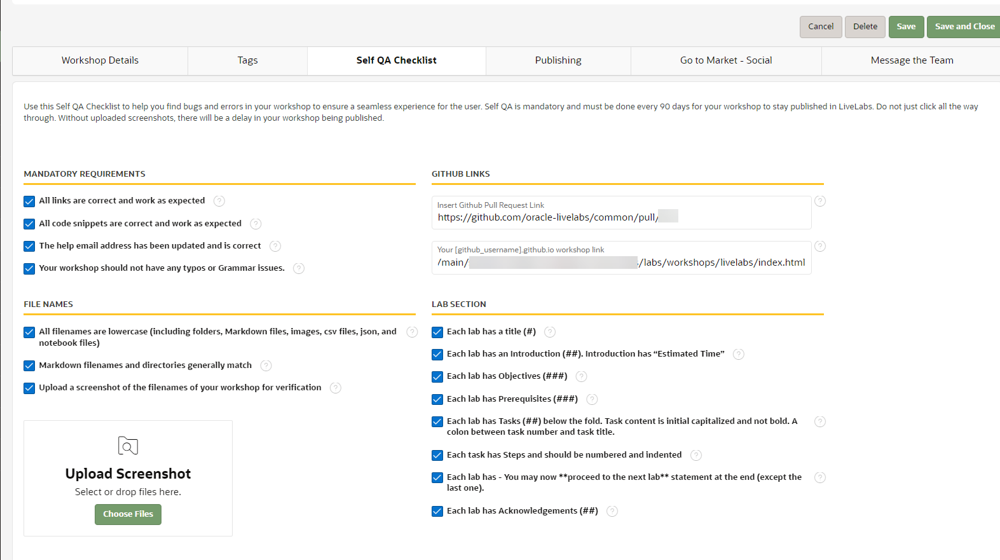

# QA Checks and Steps

## Introduction

Quality checks and reviews ensure users enjoy workshops and experience Oracle technologies at their best. QA steps enforce LiveLabs standards and verify checks completed throughout workshop development.

Estimated Time: x

### Objectives

* Request a review
* Test your content

### What Do You Need?

* Git Environment Setup
* GitHub Desktop client

This lab assumes you completed **Lab 4: Develop Markdown and Content** in the **Contents** menu on the right.

## Task 1: Share Your Workshop for Review

After you set up your GitHub pages, share your workshop for review.

To share and view your workshop:
1. In the browser, enter your GitHub Pages URL. For example, to share a workshop in the *em-omc* folder for review, the GitHub Pages URL is
[https://username.github.io/em-omc/](https://arabellayao.github.io/em-omc/). Replace *em-omc* with your workshop repository.

2. Append the URL with your workshop details.
    The complete URL will look like this: [https://username.github.io/em-omc/enterprise-manager/emcc/workshops/freetier/index.html](https://.github.io/em-omc/enterprise-manager/emcc/workshops/freetier/index.html), which you can share for review.

## Task 2: Change Your Status

Now that your workshop is in the repositories inside the Oracle LiveLabs GitHub project, set your workshop status in WMS to **In Development** or **Self QA**.

1. Go to the WMS (Oracle employees only - [bit.ly/oraclelivelabs](https://bit.ly/oraclelivelabs)) and click **Edit My Workshops**.

  

2. Go to the row for your workshop and click the **WMS ID**.
    >**Note:** If your workshop is already in production, contact livelabs-admin_us@oracle.com to edit it.

    

3. On the *Workshop Details* page, update your **Workshop Status**. If you are finished and ready to QA, change the status to **Self QA**. If you still have work to do, change the status to **In Development**.

  

## Task 3: Self QA

You have finished developing your workshop. To publish it, perform Self QA.

1. On the *Workshop Details* page, ensure **Workshop Title** matches the workshop title in development, and verify **Short Description**, **Long Description**, **Workshop Outline**, and **Workshop Prerequisites** are current. Click **?** beside each field to see details.

  
  

2. Update **Development GitHub/GitLab URL** to your personal GitHub page address, which you identified in Task 4. After your workshop has been added to oracle-livelabs/repository (your pull request has been merged), update the **Production GitHub/GitLab URL**. Construct the Production URL by replacing your username in the **Development GitHub/GitLab URL** with **oracle-livelabs**.

3. Click the **Tags** tab. Select the correct tags for **Level**, **Role**, **Focus Area**, and **Product**. Click **Save**. Tags help people find your workshop in LiveLabs.

  

4. If you changed your Status to **Self QA** or your workshop status is **Quarterly QA**, click the **Self QA Checklist** tab and check your workshop against the form. Update your workshop and create a new pull request if necessary to follow LiveLabs standards. After creating the Pull Request, return to this tab and insert the link to your PR in *Insert Github Pull Request Link* field and the workshop link from your personal Github in *Your [github_username].github.io workshop link* field.

  
  

5. You *MUST* check all boxes on the form, upload the images, update the pull request link if you created one (optional), and click **Save** to save checklist changes before updating your workshop status to Self QA Complete. Otherwise, you will receive a warning and cannot update your workshop status to Self QA Complete.

  

6. After you finish Self QA and your changes appear on the oracle.github.io page, set your **Workshop Status** to **Self QA Complete** in WMS.

  

7. Confirm you performed Self QA by clicking **Yes, I certify** and then click **Save** to save your workshop status to Self QA Complete.

  

  After saving your workshop status to Self QA Complete, your Self QA Checklist tab will grey out with the QA History section populated in the checklist tab and last QA date and person email updated on the workshop details tab.

  
  
  

8. Your stakeholders will verify the QA. They will reach out via WMS if more changes are needed. Otherwise, they will move the workshop to **Completed** status. If you have not heard back from your stakeholders 2 business days after submitting the Self QA form, message them via WMS. While waiting to hear back, you can go to Lab 6 Task 2 and request publishing.

  

9. Questions? Go to your workshop and find your stakeholder email address, and contact them. You can also ask in the #workshops-authors-help Slack channel.

  

## Task 4: Quarterly QA

For workshops in **Completed** or **Quarterly QA Complete** status with Published - Public or Published - Event entries, the workshop team must perform Quarterly QA every 90 days to ensure customers benefit from up-to-date information.

> **Note:** Maintaining several workshops and running QA can be time-consuming. We suggest a two-phased approach to ensure critical items are addressed regularly.
  - **Lite QA:** Review the workshop at a high level for screenshots, links, and instructions to ensure it is current and uses the latest version. Make minor changes if necessary to keep content updated.
  - **In-depth QA:** Run through the workshop end-to-end to ensure it works as expected since publication. Update workshop if necessary.
  - **Example:** If there are ten workshops to QA, in the first quarter, perform lite QA reviews for the first 1-5 (or a selection) workshops and in-depth QA for the following 5-10 workshops. In the next quarter, perform in-depth QA for the first 1-5 workshops and lite QA for the following 5-10 workshops. This approach allows you to manage more workshops while ensuring thorough quality assessment efficiently.

1. The workshop status will automatically update to Quarterly QA after 90 days from your last QA. When the status updates to Quarterly QA, the workshop team will receive an email with instructions to perform Quarterly QA.

    

2. At this point, the workshop team has 10 days to perform Quarterly QA.

3. The workshop team must follow the instructions in the Quarterly QA email and perform QA against the Self QA Checklist as in Task 3 step 4 within 10 days (your last QA date plus 100 days). After performing QA and updating your workshop, create a pull request if necessary with all changes.

4. You *MUST* check all boxes on the Self QA Checklist form, upload the images, and update the pull request link if you created one (optional).

  
  

5. Click **Save** and confirm **Push to LiveLabs** to save checklist changes before updating your workshop status to Quarterly QA Complete.

  

  Otherwise, you will receive this warning while updating your workshop status to Quarterly QA Complete and cannot save your workshop status to Quarterly QA Complete.

  

6. After saving checklist changes, set your **Workshop Status** to **Quarterly QA Complete**.

  

7. Confirm you performed Quarterly QA by clicking **Yes, I certify**.

  

8. Click **Save** button and then click **Push to LiveLabs**. You have now updated your workshop status to Quarter QA Complete and completed the QA.

  

  After saving your workshop status to Quarterly QA Complete, your Self QA Checklist tab will grey out with the QA History section populated in the checklist tab and last QA date and person email updated on the workshop details tab.

  
  
  

9. If the workshop team does not perform Quarter QA within the given time period, LiveLabs publishers will disable the workshop in WMS—the published entry will be pulled from production. This is a disable, not a delete. Your workshop will remain in the WMS catalog and you can return it to production after completing Quarterly QA.

  
  

10. Questions? Go to your workshop and find your stakeholder email address, and contact them. You can also ask in the #workshops-authors-help Slack channel.

  

## Acknowledgements

* **Last Updated By/Date:** LiveLabs Team, January 2026
