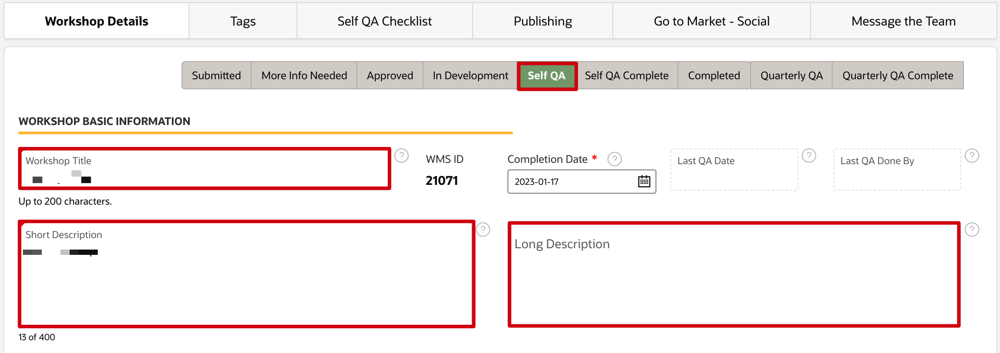
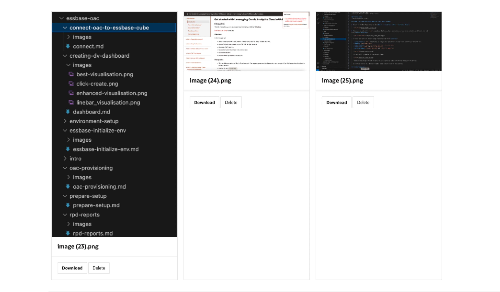
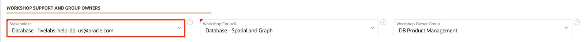

# QA checks and steps

## Introduction

Quality checks and review of your workshop are to ensure the users enjoy the workshops and provide the best experience with the Oracle technologies. Some of the QA steps are to ensure the LiveLabs standards, and hopefully most of these checks have been done throughout the development of the workshop.

### Objectives

* Request for a review
* Test your content

### What Do You Need?

* Git Environment Setup
* GitHub Desktop client

This lab assumes that you have completed **Lab 4: Develop Markdown and content** in the **Contents** menu on the right.

Watch this video below on how to self-QA your workshop.

## Task 1: Share your workshop for review

After you have successfully set up your GitHub pages, you can share your workshop for review.
To share and view your workshop:
1. In the browser, enter the URL of your GitHub Pages. For example, if I want to share a workshop in the *em-omc* folder for review, the GitHub Pages URL is [https://arabellayao.github.io/em-omc/](https://arabellayao.github.io/em-omc/). Please replace *em-omc* with the repository of your workshop.

2. Append the URL with the details of your workshop.
    The complete URL will look similar to this: [https://arabellayao.github.io/em-omc/enterprise-manager/emcc/workshops/freetier/index.html](https://arabellayao.github.io/em-omc/enterprise-manager/emcc/workshops/freetier/index.html), which can be shared for review.

## Task 2: Change your status

Now that your workshop is in the repositories inside the Oracle LiveLabs GitHub project, set your workshop status in WMS to the appropriate status: **In Development** or **Self QA**.

1. Go to the WMS (Oracle employees only - [bit.ly/oraclelivelabs](https://bit.ly/oraclelivelabs)) and click **Edit My Workshops**.

  

2.  Go to the row for your workshop and click the **WMS ID** of your workshop.
    >**Note:** If your workshop is already in production, you will need to contact livelabs-admin_us@oracle.com to edit it.

    

3.  On the *Workshop Details* page, update your **Workshop Status**. If you are finished and ready to QA, change the status to **Self QA**. If you still have some work to do, change the status to **In Development**.

  

## Task 3: Self QA

You have finished developing your workshop. To publish your workshop, you still need to perform Self QA on the workshop.

1.  On the *Workshop Details* page, ensure **Workshop Title** matches the workshop title in development, and **Short Description**, **Long Description**, **Workshop Outline**, and **Workshop Prerequisites** are all up-to-date. Click **?** beside each field to see its details.

  
  

2.  Update **Development GitHub/GitLab URL** to your personal GitHub page address, which we identified at Task 4. After your workshop has been added to oracle-livelabs/repository (your pull request has been merged), update the **Production GitHub/GitLab URL**. You need to construct the Production URL by replacing your username in the **Development GitHub/GitLab URL** with **oracle-livelabs**.

3. Click the **Tags** tab. Make sure you have selected the correct tags for **Level**, **Role**, **Focus Area**, and **Product**. Click **Save**. Tags help people find your workshop in LiveLabs.

  

4.  If you have changed your Status to **Self QA** or your workshop status is in **Quarterly QA**, click on the **Self QA Checklist** tab and check your workshop against the form. Update your workshop and create a new pull request if necessary for the workshop to follow LiveLabs standards.

  
  

  Workshop teams and stakeholders can watch this video below on how to self QA or verify the QA of a workshop.
  

5. You *MUST* check all the boxes on the form, upload the images, update the pull request link if you created one (optional) and click **Save** to save the checklist changes before you update your workshop status to Self QA Complete; otherwise, you will get warning and will not be able to update your workshop status to Self QA Complete.

  

6. After you finish Self QA, and your changes are reflected on the oracle.github.io page, set your **Workshop Status** to **Self QA Complete** in WMS.

  

7. Confirm you have performed Self QA by clicking **Yes, I certify** and then click **Save** to save your workshop status to Self QA Complete.

  

  After saving your workshop status to Self QA Complete, you Self QA Checklist tab will grey out with the QA History section populated in the checklist tab and last QA date and person email updated on the workshop details tab.

  
  
  

8. Your stakeholders will verify the QA within 2 business days. They will reach out to you via WMS if there are more changes needed. Otherwise, they will move the workshop into **Completed** status. If you have not heard back from your stakeholders 2 business days after you submit the Self QA form, please message them via WMS. While you are waiting to hear back from your stakeholder, you can go to Lab 6 Task 2 and request publishing.

  

9. Questions?  Go to your workshop and find your stakeholder email address, and contact them.  You can also ask in the #workshops-authors-help Slack channel.

  

## Task 4: Quarterly QA

For the workshop in **Completed** or **Quarterly QA Complete** status and have Published - Public or Published - Event entries, we want to ensure that customers benefit from workshops that contain up-to-date information. So, the workshop team needs to perform Quarterly QA of the workshop every 90 days.

> **Note:** Maintaining several workshops and running through the QA can be time consuming. We are suggesting a two-phased approach to make sure critical items are addressed regularly.
  - **Lite QA:** Review the workshop on a high level for screenshots, links, and instructions to ensure the workshop is current and is using the latest version. Make any minor changes, if necessary, to keep the content updated.
  - **In-depth QA:** Run through the workshop end-to-end to ensure it is working as expected since it was published. Update workshop if necessary
  - **Example:** If there are ten workshops to QA, in the first quarter, you can perform lite QA reviews for the first 1-5 (or a selection) workshops and in-depth QA for the following 5-10 workshops. Subsequently, in the following quarter, you can perform in-depth QA for the first 1-5 workshops and lite QA for the following 5-10 workshops. This approach will allow you to manage more workshops while ensuring thorough quality assessment efficiently.

1. The workshop status will automatically update to Quarterly QA after 90 days from the time you have last performed QA of your workshop. When the status is updated to Quarterly QA, the workshop team will receive an email with instructions to perform Quarterly QA of the workshop.

    

2. At this point, the workshop team will have 10 days to perform the Quarterly QA of the workshop.

3. The workshop team needs to follow the instructions in the Quarterly QA email and perform the QA of the workshop against the Self QA Checklist as in Task 3 step 4 of this lab in 10 days (i.e your last QA date plus 100 days). Once you have performed QA and updated your workshop, create a pull request if necessary with all your changes.

4. You *MUST* check all the boxes on the Self QA Checklist form, upload the images and update the pull request link if you created one (optional).

  
  

5. Click **Save** and confirm **Push to LiveLabs** to save your checklist changes before you update your workshop status to Quarterly QA Complete.

  

  Otherwise, you will get this warning while updating your workshop status to Quarterly QA Complete and you will not be able to save your workshop status to Quarterly QA Complete.

  

6. After saving the checklist changes, then set your **Workshop Status** to **Quarterly QA Complete**.

  

7. Confirm you have performed Quarterly QA by clicking **Yes, I certify**.

  

8. Click **Save** button and then click **Push to LiveLabs**. Now, you have updated your workshop status to Quarter QA Complete and have completed the QA of the workshop.

  

  After saving your workshop status to Quarterly QA Complete, you Self QA Checklist tab will grey out with the QA History section populated in the checklist tab and last QA date and person email updated on the workshop details tab.

  
  
  

9. If the workshop team does not perform the Quarter QA within the given time period, the LiveLabs publishers will disable the workshop in WMS i.e the published entry of the workshop will be pulled off from production. This is a disable, not a delete. So, your workshop will remain in the WMS catalog and you can bring back to production after completing the Quarterly QA of the workshop.

  
  

10. Questions? Go to your workshop and find your stakeholder email address, and contact them. You can also ask in the #workshops-authors-help Slack channel.

  

## Acknowledgements

* **Author:**
   * Michelle Malcher, Senior Manager, Oracle Database Product Management
* **Contributors:**
    * Lauran Serhal, Principal User Assistance Developer, Oracle Database and Big Data User Assistance
    * Anuradha Chepuri, Principal User Assistance Developer, Oracle GoldenGate
    * Aslam Khan, Senior User Assistance Manager, ODI, OGG, EDQ
    * Kamryn Vinson, Product Manager, Database
    * Anoosha Pilli, Product Manager, Database
    * Arabella Yao, Product Manager, Database
    * Madhusudhan Rao, Product Manager, Database

* **Last Updated By/Date:** Anoosha Pilli, February 2023
