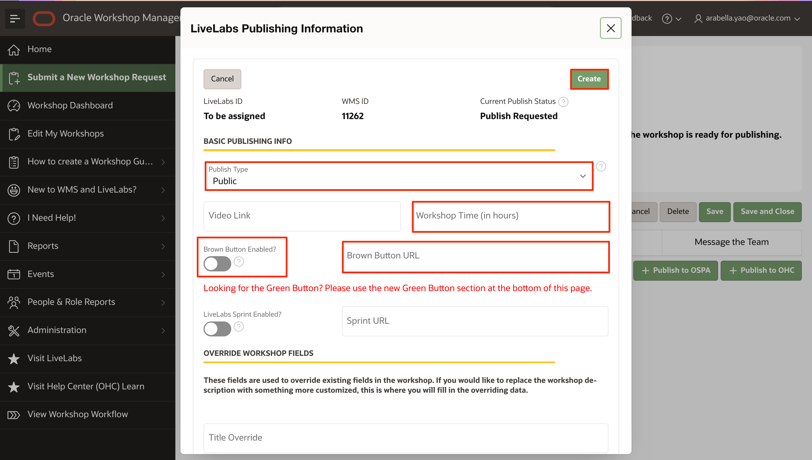

# Publish your workshop

## Introduction

After you have completed self QA and your workshop has been reviewed, it is time to publish your workshop to LiveLabs Production. There are two areas that need to be completed to do this. First is in GitHub, and this is done by a Pull Request to merge your files with the oracle-livelabs main - production repository. Second is in WMS to complete the **Publish** tab details to allow for the completion of the update of LiveLabs production to showcase your workshop. 

### Objectives

* Commit your changes
* Create a Pull Request to upload your content to the main branch
* Update WMS and add publish request

### What Do You Need?
* Git Environment Setup
* GitHub Desktop client

This lab assumes that you have completed **Lab 5: QA checks and steps** in the **Contents** menu on the right, and have a **Self QA Complete** status in WMS.

## Task 1: Create a pull request to upload your content to the Main Repository

After you complete QA and made any other needed updates to your files, you are ready to merge your files and folders to the Oracle LiveLabs production repositories.

The **Pull Request** is a request that you send to the repository owners and code owners of the **oracle-livelabs/repository** to approve and host your content on the production **(upstream/main)** repository.

Note:  *Before executing a PR, make sure you that your personal GitHub repo on the web is not behind (See Lab 3 **Maintain GitHub environment** and troubleshooting steps for merge conflicts).  Failure to do so will result in conflicts.  You cannot issue a pull request without syncing first.  PRs will not be approved without your WMS ID (Workshop ID)*

> **Note:** The owners can approve your request, ask for more information if required, or reject your request if your content does not meet the standards for Oracle LiveLabs.

To create a Pull Request:
1. In the **GitHub Desktop** client, select **Branch > Create Pull Request** to display a browser interface.

  

2. Click **Create pull request** to display an **Open a pull request** page.

  

3. Enter the title for the pull request, **include your WMS ID** (you can find that by visiting the [WMS](http://bit.ly/oraclewms)) in the title.  PRs will not be approved without this ID.
4. Click **Create pull request**.
    
  A status page is displayed indicating that you have created a pull request along with the request number (for example, #1770), that it is pending review, and that merging is blocked.

  When your pull request is approved, the page gets updated with information about your commits being approved and merged into the **upstream/main** repository (production).

  When the pull request is approved and merged into the **upstream/main** repository, two emails are sent to the e-mail account associated with your GitHub account.

   > **Note:**

   * The first email notifies you that your pull request was approved (or rejected).
   * If your pull request was approved, then the second email notifies you that your pull request was merged into the **upstream/main** repository.

  Your committed content is now visible to the public on the upstream/main or production repository: oracle-livelabs/&lt;repository&gt;.

## Task 2: Request publishing

1.  Click the **Publishing** tab, then **+ Publish to LiveLabs**.

  

2. Fill out publishing information, including **Publish Type** and **Workshop Time**. Click **?** beside the Publishing Type to see different types of publishing. Turn on appropriate tenancies for your workshop: **Paid Tier Enabled?**, and/or **Green Button Enabled?**, and fill out appropriate **URL**s. Click **Create** to submit your publishing request. Our LiveLabs team will either approve your publishing request or ask you for more information within 2 business days.

    - Always Free On? - Turn off this button. This button will be deleted soon.

    - Free Tier On? - Turn off this button. This button will be deleted soon.

    - Paid Tier On? - Can this workshop be done in a customer tenancy?

    - Green Button On? - Can this workshop be done in a registered LiveLabs tenancy, a.k.a Green Button? If you want to know more about the green button, or request one for your workshop, please see *Task 3: Request the Green Button* below.

    

3. Click **Create** or **Save**.

4. When your workshop is in **Completed** status, and we have approved your publishing request, your workshop will be published automatically within 1 business day.

## (Optional) Task 3: Request the Green Button

After you enable the green button for your workshop, users can run the workshop in pre-provisioned environments (a.k.a. sandbox), so they don't need to register OCI Free Tier accounts. Users have to complete the workshop in a specified limited amount of time (they can extend their reservations up to 4 times). After their reservations expire, any instances they create will be destroyed.

The green button is a great choice if you want users to try some not available in OCI Free Tier for free, or if the workshop setup is long and time-consuming and you want customers to skip the setup and dive directly into products and services. Note that not all services are available or can be provisioned in the green button environment.

The green Button can also be added after your workshop has already been in production.

1. Go to WMS and find your workshop. Click the **Publishing** tab, then click **Edit** in the LiveLabs publishing entry (if available), or click **+ Publish to LiveLabs** (if you do not have a LiveLabs publishing entry already).

	
	

2. Turn on the **Green Button Enabled?** button. This will trigger a notification to our LiveLabs team.
	

3. Scroll down and fill out the **Green Button Questionnaire** to the best of your knowledge.
	

4. Click **Create** or **Save**.

5. You need to create a green button version of your workshop since the setup, instructions, and screenshots will be different for green button users. Refer to Lab 2 - Lab 4 to develop your workshop. Note that you should update the *workshops/sandbox/index.html* (or *workshops/livelabs/index.html*) and the *workshops/sandbox/manifest.json* (or *workshops/livelabs/manifest.json*), and all necessary lab files.

6. Our LiveLabs team will work with you to set up and test the green button for your workshop. The time varies depending on what services and products the workshop showcases, and if we have any existing green buttons similar. If you have any questions, please reach out to *livelabs-help-db_us@oracle.com*.

7. After the green button is ready, make sure you QA the workshop. Then, the green button will be ready for use in production.
	

Congratulations on completing the Step by Step workshop to create your workshop in LiveLabs.

## **Appendix**: Troubleshooting Tips
### Issue 1: GitHub Merge Conflicts
GitHub merge conflicts happen when you and some other contributors are changing the same content in the oracle-livelabs repositories. Merge conflicts prevent you from pushing your changes to your GitHub repository.
  

1. When you fetch origin and merge changes into your current branch (as in Task 1), you may encounter merge conflicts, as shown in the screenshot above. In the screenshot, you have 3 files that have merge conflicts.

2. Since you are changing the same content as other people, you need to manually decide which version of changes you want to keep. Open your text editor. Go to the files that have conflicts. Conflicts are highlighted by your text editor, and you will choose to use either your changes or other people's changes.
  

3. After you resolve all the conflicts and save your changes, your GitHub Desktop should look like the screenshot below. There will be a green checkmark beside each file, indicating there are no conflicts. Enter the **Summary** and click **Commit to main**. After the commit finishes, you can click **Push origin**, and your changes are pushed to your GitHub repository.
  

4. To confirm, press refresh on your personal GitHub repo on the web, you should have no commits *behind* now, only *ahead*.

  

## Acknowledgements

* **Author:**
    * Anuradha Chepuri, Principal User Assistance Developer, Oracle GoldenGate
* **Contributors:**
    * Lauran Serhal, Principal User Assistance Developer, Oracle Database and Big Data User Assistance
    * Aslam Khan, Senior User Assistance Manager, ODI, OGG, EDQ
    * Kamryn Vinson, Product Manager, Database
    * Anoosha Pilli, Product Manager, Database
    * Arabella Yao, Product Manager, Database
    * Madhusudhan Rao, Product Manager, Database

* **Last Updated By/Date:** Arabella Yao, August 2022
