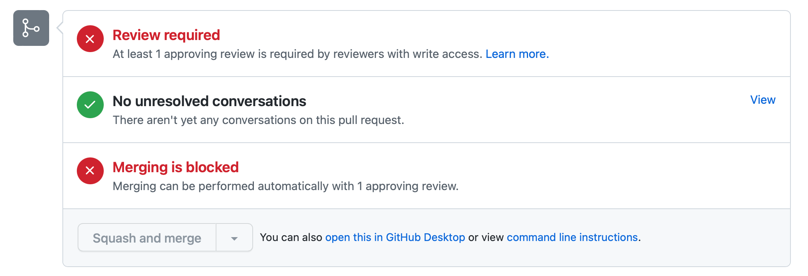
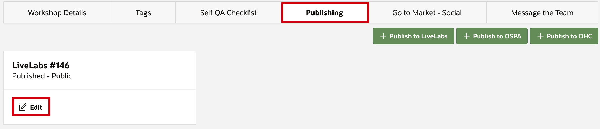
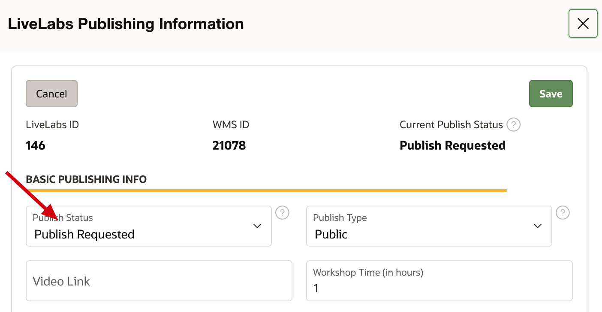

# Publish your workshop

## Introduction

After you have completed self QA and your workshop has been reviewed, it is time to publish your workshop to LiveLabs Production. There are two areas that need to be completed to do this. First is in GitHub, and this is done by a Pull Request to merge your files with the oracle-livelabs main - production repository. Second is in WMS to complete the **Publish** tab details to allow for the completion of the update of LiveLabs production to showcase your workshop.

### Objectives

* Commit your changes
* Create a Pull Request to upload your content to the main branch
* Update WMS and add publish request

### What Do You Need?
* Git Environment Setup
* GitHub Desktop client

This lab assumes that you have completed **Lab 5: QA checks and steps** in the **Contents** menu on the right, and have a **Self QA Complete** status in WMS.

## Task 1: Create a pull request to upload your content to the Main Repository

After you complete QA and make any other needed updates to your files, you are ready to merge your files and folders to the Oracle LiveLabs production repositories.

The **Pull Request** is a request that you send to the repository owners and code owners of the **oracle-livelabs/repository** to approve and host your content on the production **(oracle-livelabs:main)** repository.

Note:  *Before executing a PR, make sure you that your personal GitHub repo on the web is not behind (See Lab 3 **Maintain GitHub environment** and troubleshooting steps for merge conflicts).  Failure to do so will result in conflicts.  You cannot issue a pull request without syncing first.  PRs will not be approved without your WMS ID (Workshop ID)*

> **Note:** The LiveLabs admin team will review your PR within 1 business day. We will approve your request, ask for more information if required, or reject your request if your content does not meet the standards for Oracle LiveLabs.

To create a Pull Request:
1. In the **GitHub Desktop** client, select **Branch > Create Pull Request** to display a browser interface.

  

2. Click **Create pull request** to display an **Open a pull request** page.

  

3. Enter the title for the pull request, **include your WMS ID** (you can find that by visiting the WMS) in the title.  PRs will not be approved without this ID. Check your pull request against the **General requirements** and the short **Checklist**. Refer to the [QA document](https://objectstorage.us-ashburn-1.oraclecloud.com/p/MKKRgodQ0WIIgL_R3QCgCRWCg30g22bXgxCdMk3YeKClB1238ZJXdau_Jsri0nzP/n/c4u04/b/qa-form/o/QA.docx) for the complete list. If your pull request satisfies all the requirements, less time will be spent on back-and-forth communications, and your changes will be in production as soon as possible. Add **x** in the brackets to check that item on the checklist. You can also put the reasons for pull request on this section.

  
  

4. Click **Create pull request**.
    
  A status page is displayed indicating that you have created a pull request along with the request number (for example, #1770), that it is pending review, and that merging is blocked.
  

5. On the status page, check 1) your branch does not have merge conflicts; 2) your branch is up-to-date. If your PR has any of those two issues, our LiveLabs team will not approve or merge your PR.

    

    To solve merge conflicts, go to *Lab 3 -> Task 3: Merge content from Git before you start editing your content* and *Lab 6 -> Appendix -> Issue 1: GitHub Merge Conflicts*.

    To make sure your branch is up-to-date, go to *Lab 3 -> Task 3: Merge content from Git before you start editing your content*.

6. When your pull request is approved, the page gets updated with information about your commits being approved and merged into the **oracle-livelabs:main** repository (production).
  

    When the pull request is approved and merged into the **oracle-livelabs:main** repository, two emails are sent to the e-mail account associated with your GitHub account.

    > **Note:**

    * The first email notifies you that your pull request was approved (or rejected).
    * If your pull request was approved, then the second email notifies you that your pull request was merged into the **oracle-livelabs:main** repository.

    Your committed content is now visible to the public on the oracle-livelabs:main or production repository: oracle-livelabs/&lt;repository&gt;.

7. We may request some changes to your pull request. You need to make those changes as soon as possible. As long as your PR is still open, you don't need to create a new PR - new commits will be added automatically. You do need to make sure that your branch is still up-to-date with the main branch.

## Task 2: Request publishing

1.  Click the **Publishing** tab, then **+ Publish to LiveLabs**.

  

2. Fill out publishing information, including **Publish Type** and **Workshop Time**. Click **?** beside the Publishing Type to see different types of publishing. Turn on appropriate buttons for your workshop: **Brown Button Enabled?**, or **LiveLabs Sprint Enabled?**, and fill out appropriate **URL**s.

    - Brown Button Enabled? - Can this workshop be done in a customer tenancy?

    - LiveLabs Sprint Enabled? - See **Additional optional labs: Develop LiveLabs Sprints** on the left menu for more information.

    

If you want to request a green button (or a sandbox environment) for your workshop, please see **(Optional) Task 3: Request the Green Button** below for more information.

3. Embed a video on the LiveLabs homepage for the workshop from Oracle Video Hub.
    
    **Option 1:** Embed video from Oracle Video Hub (Recommended):
    - On the Oracle Video Hub page of the video, click **Share**:
      
    - Click **Embed**
      
    - Copy the src link from 'https' to 'lashvars[streamerType]=auto' as shown on the screenshot below.
      
    - Past the link to the **Video Link** section on the publishing entry.
      

    **Option 2:** Embed video from YouTube:
    - On the Youtube page of the video, click **SHARE**.
      
    - Click **Embed**.
      
    - Copy the src link (without double quotes) highlighted on the screenshot below.
      

4. Click **Create** or **Save**.

5. When your workshop is in **Completed** status, and we have approved your publishing request, your workshop will be published automatically within 1 business day.

## (Optional) Task 3: Request the Green Button

This walks you through requesting a Green Button for your workshop to run in LiveLabs Sandbox:
[Video walking Green Button - LiveLabs Sandbox Request](https://otube.oracle.com/media/LiveLabsA+Green+Button+Lite/1_85wokrec)

After you enable the green button for your workshop, users can run the workshop in pre-provisioned environments (a.k.a. sandbox), so they don't need to register OCI Free Tier accounts. Users have to complete the workshop in a specified limited amount of time (they can extend their reservations up to 4 times). Any resources created by the user during their reservation time will be destroyed after the reservation expires.

The green button is a great choice if you want users to try some features unavailable in OCI Free Tier for free or if the workshop setup is long and time-consuming and you want customers to skip the setup and dive directly into products and services. Note that not all services are available or can be provisioned in the green button environment.

The green button can also be added to your workshop even after it is in production.

1. You need to create a green button version of your workshop since the setup, instructions, and screenshots will differ for green button users. Refer to Lab 2 - Lab 4 to develop your workshop. Note that you should update the *workshops/sandbox/index.html* (or *workshops/livelabs/index.html*) and the *workshops/sandbox/manifest.json* (or *workshops/livelabs/manifest.json*) and all necessary lab files before the green button is live in production.

2. Go to WMS and find your workshop to request the green button. Click the **Publishing** tab, then click **Edit** for the LiveLabs publishing entry you wish to request green button (if available) or click **+ Publish to LiveLabs** (if you do not have a LiveLabs publishing entry already).

	
	

3. Scroll down to the **Request a Green Button section** and populate your workshop's GitHub LiveLabs/Sandbox URL.

	

4. We offer two options to create a Green Button in LiveLabs.

  	- Green Button Lite: A Green Button Lite is a quick and easy way to set up a green button for your workshop. This option *DOES NOT* create any resources for the user but allows them to create them in an isolated environment in one of our LiveLabs tenancies. A Green Button Lite is created automatically and will be ready within 1 business day!

  		The following resources are offered in a Green Button Lite:
		- ATP
		- AJD
		- ADW
		- Standard Flex E4 Compute Instance
		- VCN
		- Cloud Shell

   	- Regular Green button: A regular Green Button can provision resources for the user but can take 1-3 weeks to develop, depending on the workshop's complexity.

5. To request a **Green Button Lite**,

	1. click on  **Green Button Lite** button.

		

	2. Then click **OK** on the Green Button Lite popup.

		

	3. Fill out the Green Button Lite form with the options below. Specify if you would like the USER of your workshop to be able to spin up one of the noted resources. This *does not create* any resources on the users behalf. This merely allows the user to create it themselves (except for the VCN option, that option -- if checked -- will automatically provision a VCN for the user).

		

	4. After filling out the form, scroll up to the top of the LiveLabs Publishing Information form and click **Save** to save the changes.

		

	5. The Green Button for your workshop will be created for your workshop automatically and will be live in production within 1 business day. Email us at livelabs-help-db_us@oracle.com if you have any questions/issues with the green button.

		

	6. Be sure to test the workshop instructions against the green button setup and update them if necessary.

    Please proceed with the below steps if you would like to request a regular green button.

5. To request a regular green button or update an existing Green Button,

	1.  Click the **Green Button** button.

		

	2. Click **OK** on the Green Button popup.

		

	3. Scroll down the Request a Green Button section to view the Green Button Request instructions. Click the **Open Jira Ticket** button to open a Jira Ticket in the LiveLabs Project. You will now be directed to the Jira platform. Click on **Log In** if needed to sign into Jira.

		

	4. In the Jira tab, in the **Create Issue** form, fill out the **Summary** in this format in the form: **[GB] WMS ID: (insert WMS ID) LL ID: (insert LiveLabs ID) (insert Title)** if you are requesting a new green button. If you would like to update an existing Green Button, at the beginning of your description, explain what needs to change about your current green button.

	5. Copy all the content in the sections: **Basic Questions, Policies, Image and Marketplace Questions, and Additional Information** from the WMS Green Button Information form and paste it into the **Description** field of the Jira ticket.

		

	6. Complete the questionnaire in the Jira ticket to your knowledge. Be sure to fill out all the relevant details in the description. Ignore other fields in the Jira ticket and click **Create**.

	7. 	In WMS, scroll up to the top of the LiveLabs Publishing Information form and click **Save** to save the changes.

		

	>**Note:** LiveLabs cannot handle all OCI resources for green buttons so each request will be evaluated on a case-by-case basis. Also, depending on the green button's complexity, on what services and products the workshop showcases, and if we have any existing similar green buttons, the completion time for a green button can range from 1-3 weeks. The LiveLabs team will reach out through Jira with any further questions. If you have any questions, please reach out to *livelabs-help-db_us@oracle.com*.

	8. After creating the green button setup for your workshop, the LiveLabs team will create a demo environment for you to test the green button setup and share the demo environment link with you. Be sure to test the green button setup and update the workshop instructions as necessary.

	9. Confirm with the LiveLabs team through the WMS messaging system or by emailing to *livelabs-help-db_us@oracle.com* mailbox that you have tested the green button setup and share your concerns if needed. If the green button setup is working as expected, let them know that the setup is working as expected, you have updated the workshop instructions accordingly, and the green button can be moved to production. Also, share the workshop livelabs/sandbox instructions link for the LiveLabs team to populate while moving the green button to production.

	10. After receiving the confirmation email, the LiveLabs team will move the green button to production in 1-2 business days, turn on the green button in the WMS publishing entry, and  populate the workshop URL. The LiveLabs team will keep you posted once the workshop is published.

		

Congratulations on completing the Step by Step workshop to create your workshop in LiveLabs.

## (Optional) Task 4: Re-publish your workshop

For the workshops that are in Quarterly QA status with a last qa date of more than 105 days and wish to update workshop publishing entry with *Publish status - Published and Publish type - Private/Disabled* to *Publish Status - Published and Publish type - Public/Event*, please follow these steps to request republishing of your workshop in production.

1. Perform all the steps in **Lab 5** especially *Lab 5 Task 4*. Ensure you have completed the self QA checklist and updated your workshop status to Quarterly QA Complete.

2. After that, update your publishing entry **Publish type** to either *Public/Event* based on your requirement and click **Save**.

  

3. Confirm your changes by clicking the **Push to LiveLabs** button.

  

4. Click on the Publishing tab and view the Publish status of your publishing entry. Publish status will be updated to **Publish Requested** automatically.

  

5. The LiveLabs publishing team will review the request in 1-2 business days and update the publishing entry publish status to **Publish Approved** if everything looks good. If there are any changes, the LiveLabs publishers will share the feedback using the WMS messaging system, asking the workshop team to make changes to the workshop. The workshop team will make the requested changes to the workshop and may create a Pull request if needed. After the changes are made, the workshop team will update the LiveLabs publishers using the WMS messaging system.

6. After LiveLabs publishers have updated the workshop publishing status to Publish Approved, the workshop will be pushed to production within a day.

## Appendix: Troubleshooting Tips

### Issue 1: GitHub Merge Conflicts
GitHub merge conflicts happen when you and some other contributors are changing the same content in the oracle-livelabs repositories. Merge conflicts prevent you from pushing your changes to your GitHub repository.
  

1. When you fetch origin and merge changes into your current branch (as in Task 1), you may encounter merge conflicts, as shown in the screenshot above. In the screenshot, you have 3 files that have merge conflicts.

2. Since you are changing the same content as other people, you need to manually decide which version of changes you want to keep. Open your text editor. Go to the files that have conflicts. Conflicts are highlighted by your text editor, and you will choose to use either your changes or other people's changes.
  

3. After you resolve all the conflicts and save your changes, your GitHub Desktop should look like the screenshot below. There will be a green checkmark beside each file, indicating there are no conflicts. Enter the **Summary** and click **Commit to main**. After the commit finishes, you can click **Push origin**, and your changes are pushed to your GitHub repository.
  

4. To confirm, press refresh on your personal GitHub repo on the web, you should have no commits *behind* now, only *ahead*.

  

## Acknowledgements

* **Author:**
    * Anuradha Chepuri, Principal User Assistance Developer, Oracle GoldenGate
* **Contributors:**
    * Lauran Serhal, Principal User Assistance Developer, Oracle Database and Big Data User Assistance
    * Aslam Khan, Senior User Assistance Manager, ODI, OGG, EDQ
    * Kamryn Vinson, Product Manager, Database
    * Anoosha Pilli, Product Manager, Database
    * Arabella Yao, Product Manager, Database
    * Madhusudhan Rao, Product Manager, Database

* **Last Updated By/Date:** Arabella Yao, September 2022