# Create Custom OCI Compute Image for Marketplace Publishing

## Introduction
This lab will show you how to prepare a host for custom image capture and create the custom image that meets stringent OCI marketplace requirements.

### Objectives
- Perform cleanup tasks to get the image in the desired state for custom image capture
- Create Custom Image

### Prerequisites
This lab assumes you have:
- An Oracle Enterprise Linux (OEL) that meets requirement for marketplace publishing

## Task 1: Cleanup Instance for Image Capture   

1. **Outside of your remote desktop connection!** Connect to your instance via SSH as user *opc*. 

2. Copy and run the following to cleanup the instance.

    ```
    <copy>
    cd /tmp
    wget -q https://objectstorage.us-ashburn-1.oraclecloud.com/p/hzy0xAZy0sLOIuzargHjyWykBnjf9TmLwup-QsjL13t4h2z41T642JfplesXCR6l/n/c4u02/b/hosted_workshops/o/stacks/livelabs-image-cleanup.zip -O /tmp/livelabs-image-cleanup.zip
    unzip -qo livelabs-image-cleanup.zip 
    chmod +x livelabs-image-cleanup.sh
    sudo /tmp/livelabs-image-cleanup.sh
    </copy>
    ```

## Task 2: Create Custom Image   

Your instance at this point is ready for clean capture. Proceed to OCI console to perform the next steps

1. Launch your browser to OCI console, then navigate to *"Compute > Instances"*

    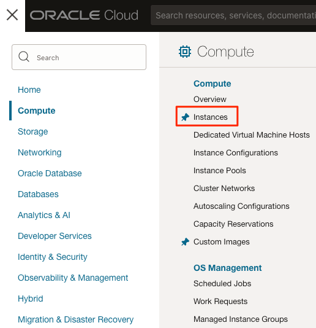

2. Select the instance on which you just performed the prior cleanup steps. Make sure to select the right compartment

    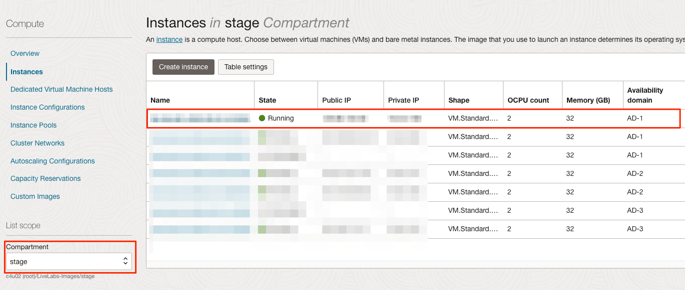

3. Click on *"More Actions"* and select *"Create Custom Image"*

    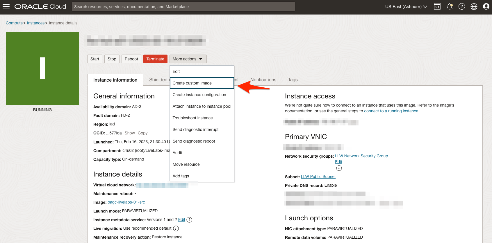

4. Enter a name for the image and click *"Create Custom Image"*

    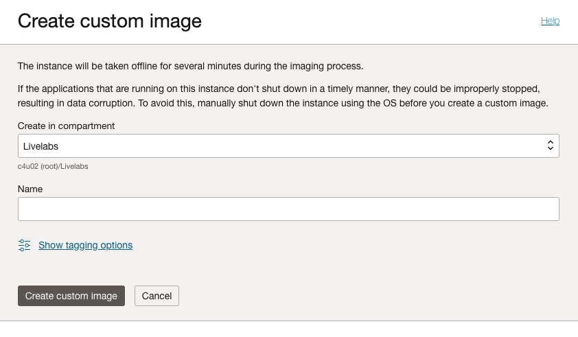

5. Edit image details and select all shapes except *BM.Standard.A1.160* and *VM.Standard.A1.Flex*

    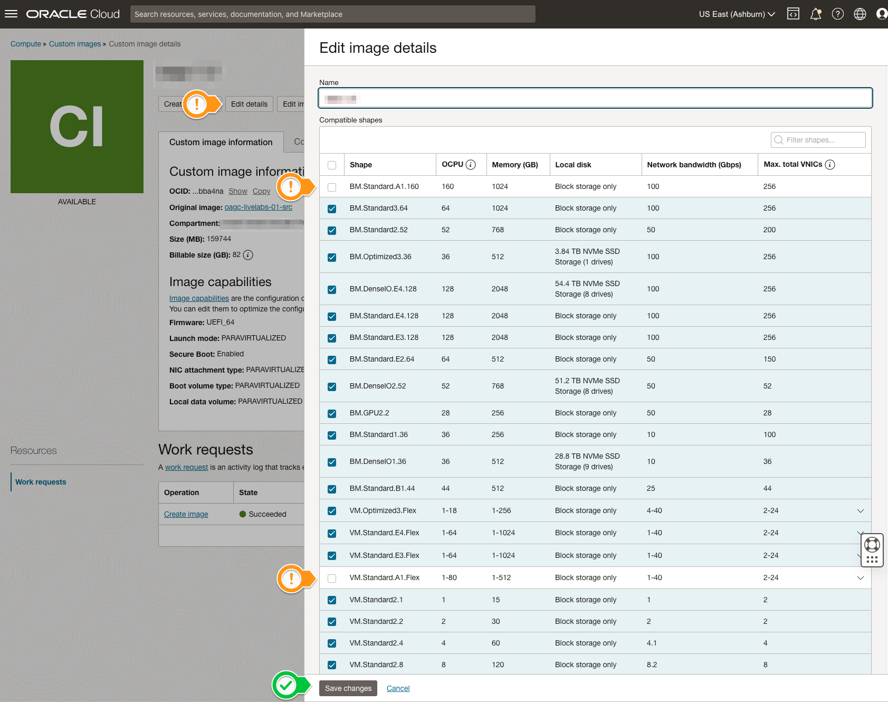

## Task 3: Test Custom Image   

1. Download the sample ORM stack zip archive

    - [ll-orm-mkplc-freetier.zip](https://objectstorage.us-ashburn-1.oraclecloud.com/p/D0dAdNNBbmxXM8UJyt13DU8nzLEXBXOCdf-BgrMFquLMsIVJtnSDAJVBpvGM_2Jb/n/c4u02/b/hosted_workshops/o/stacks/ll-orm-mkplc-freetier.zip)

2. Unzip it locally on your computer to *ll-orm-mkplc-freetier*.
3. Delete the downloaded file *ll-orm-mkplc-freetier.zip*.
4. Copy the OCID of the new image

    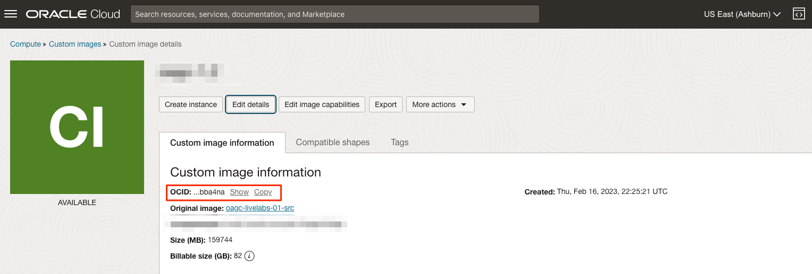

5. Navigate to *ll-orm-mkplc-freetier* and open the file *variables.tf*

6. Update the default value for each of the 5 variables shown below

    - **`instance_image_id`** - Enter the new image OCID copied above *(Required)*
    - **`novnc_delay_sec`** - Adjust the delay (in seconds by appending s to the number. e.g. 600s) to wait for all processes to start post boot before the desktop URL is presented to the user *(optional)*
    - **`desktop_guide_url`** - Enter the desktop guide URL for your workshop. It should end with `".../workshop/desktop"`. *(Required)*
    - **`desktop_app1_url`** - Enter your first desktop webapp URL if applicable, unset by setting to `""`, or just keep unchanged *(optional)*
    - **`desktop_app2_url`** - Enter your second desktop webapp URL if applicable, unset by setting to `""`, or just keep unchanged *(optional)*

    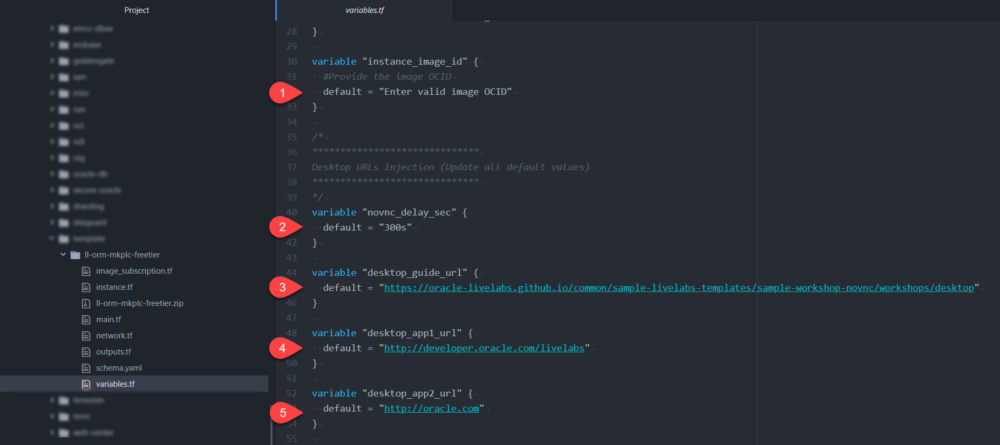

7. Save *variables.tf*
8. Repackage the entire content of *ll-orm-mkplc-freetier* as  *ll-orm-mkplc-freetier.zip*

    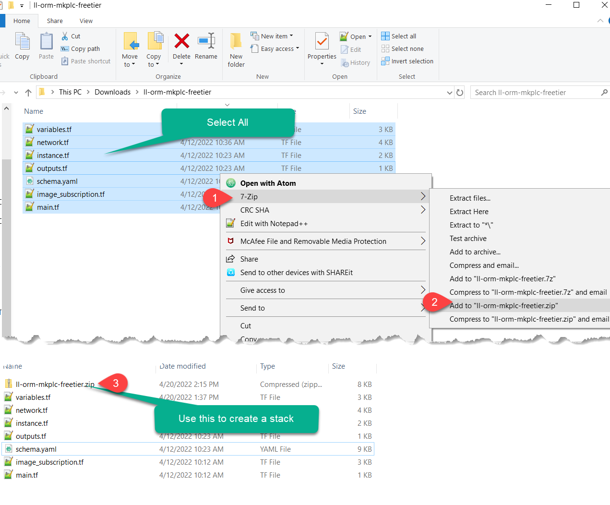

9. Using the new zip file above, navigate to "*Developer Services > Stacks*" and create a test instance with Oracle Resources Manager (ORM).

    *Notes:* For more details on how to provision with ORM, refer to [setup-compute](https://oracle-livelabs.github.io/common/sample-livelabs-templates/sample-workshop-novnc/workshops/tenancy/?lab=setup-compute-novnc-ssh) lab guide.

10. After successful instance creation, get the remote desktop URL and logon to validate

    

11. Launch a browser session and navigate to the copied URL to validate

    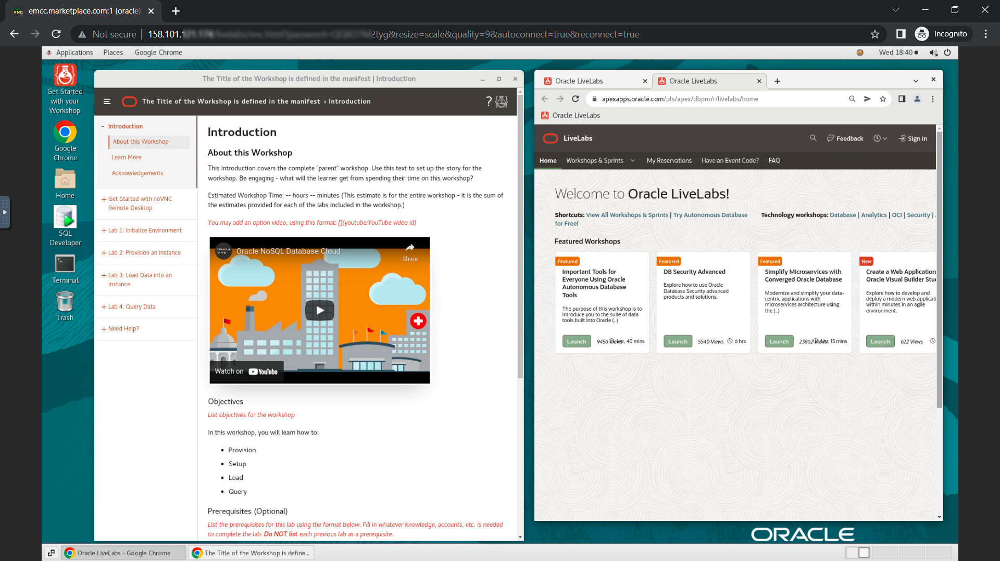

    *Notes:* If the setup was successful you should see two sample Google-chrome browser windows preloaded.

## Task 4: Share with LiveLabs Team
1. Export the custom image to an Object Storage Standard bucket (Do not an Archive bucket)

    - Select *Export to an Object Storage bucket* unless you have a remote bucket URL with the right permissions to accept your export
    - Update the image name field
    - Set format to *Oracle Cloud Infrastructure file with QCOW2 image and OCI metadata (.oci)*
    - Click *Export image*

    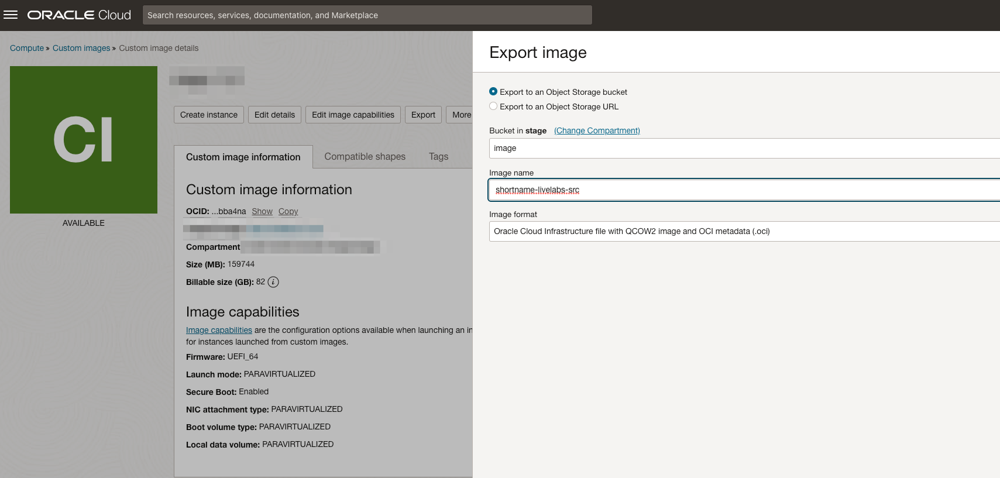

2. Navigate to the bucket, select the exported object, and Create a pre-authenticated URL

    - Set the expiration to a year ahead or at least 1 month ahead

    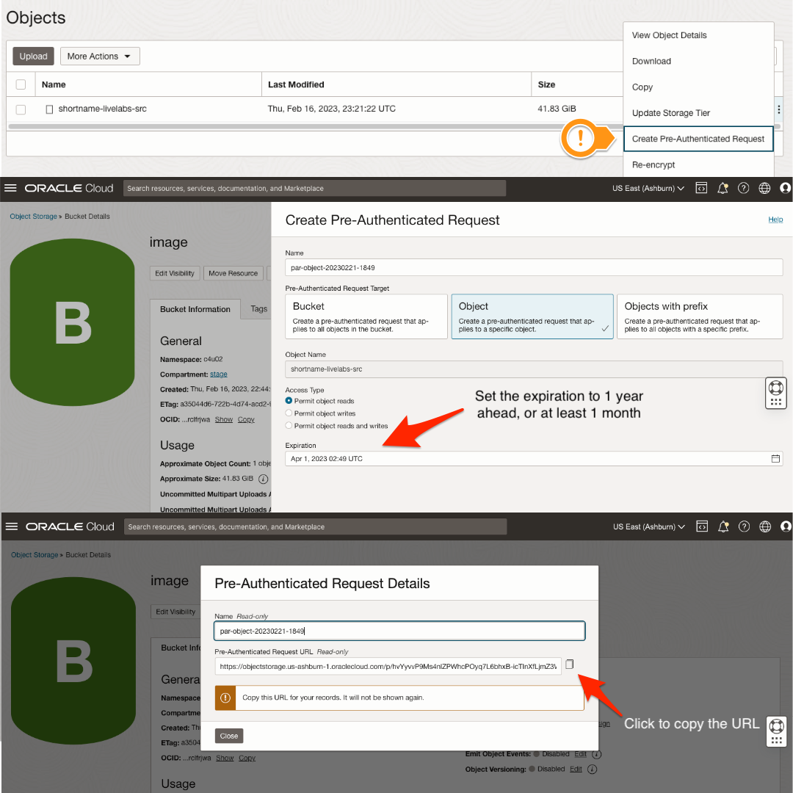

3. Navigate to the **Publishing** Tab in the [WMS](https://bit.ly/oraclewms).

    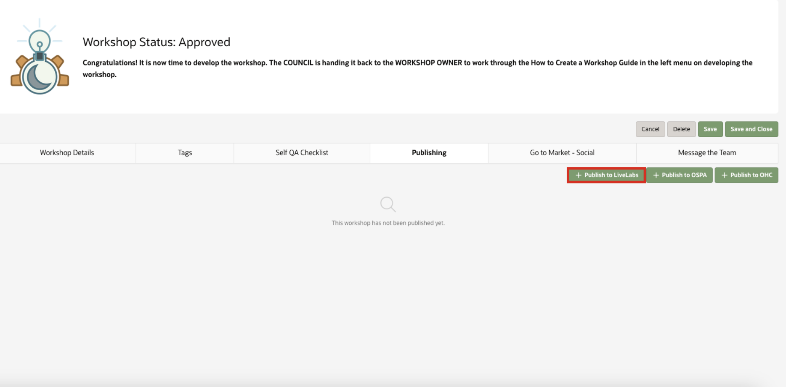

    Press the button **Publish to LiveLabs**, and the information you need to complete about your workshop will appear.

    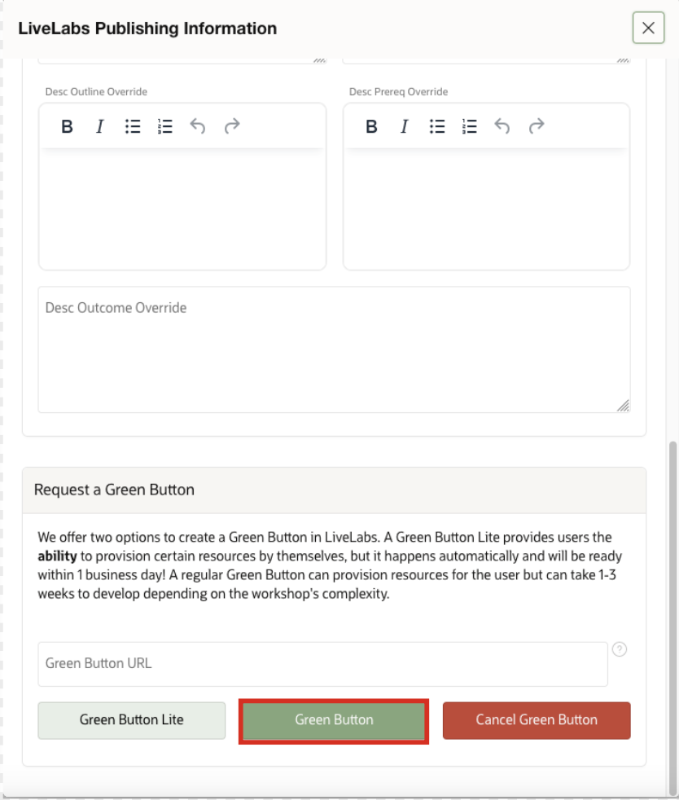

    Then you need to scroll down, and you'll see the button **Open Jira Ticket" where it will be redirected to Jira, and here you need to complete the ticket.

    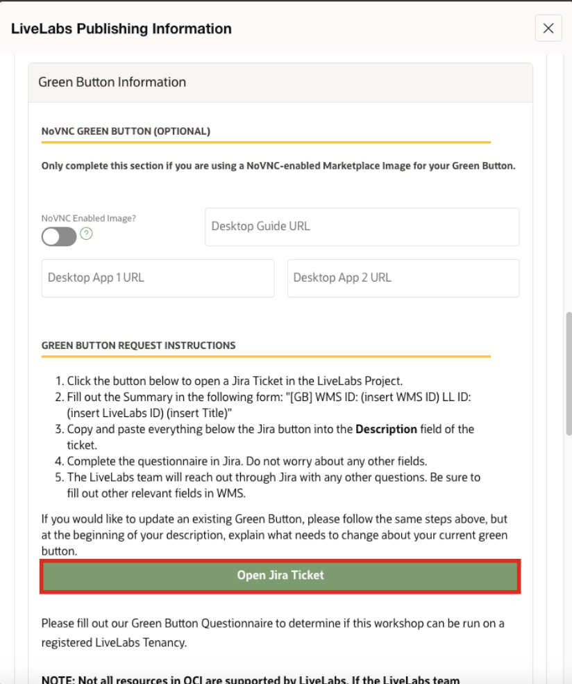

4. Next, please wait for our LiveLabs team to validate the image and publish it to marketplace. We will provide the ORM stack needed for brown button (run on customers' tenancies) provisioning and set up the green button (LiveLabs sandbox tenancy).

## Learn More
* [Oracle Cloud Marketplace Partner Portal Documentation](https://docs.oracle.com/en/cloud/marketplace/partner-portal/index.html)
* [Oracle Cloud Marketplace Partner Portal Videos](https://docs.oracle.com/en/cloud/marketplace/partner-portal/videos.html)


## Acknowledgements
* **Author** - Rene Fontcha, Master Principal Solution Architect, February 2021
* **Contributors**  -
* **Last Updated By/Date** - Ana Coman, Database Product Management, July 2024
