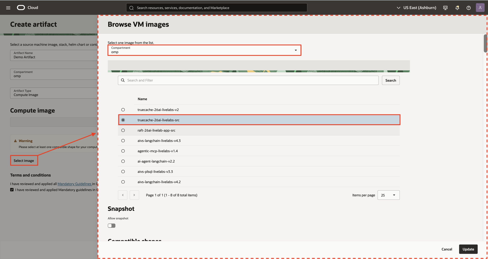
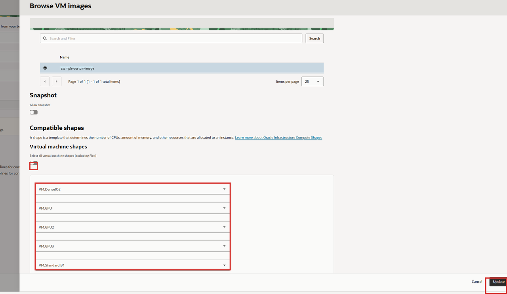
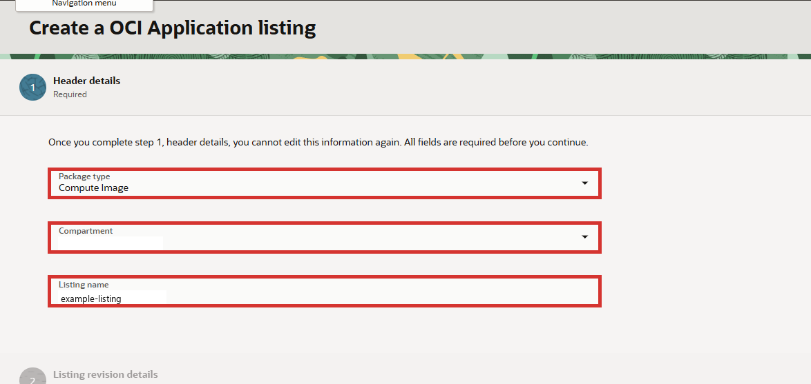
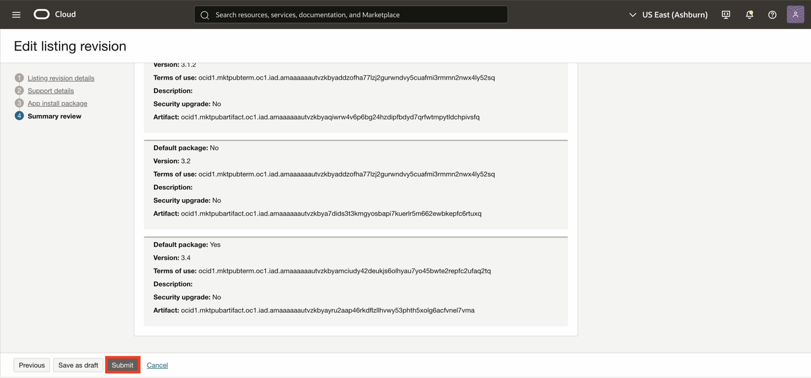

# Publish Your Image to Oracle Marketplace

## Introduction

Estimated Time: 1 hour

This lab shows you how to publish a LiveLabs custom compute image to Oracle Marketplace by using Marketplace Publisher in the OCI Console. Use the same OCI tenancy and compartment for the Marketplace Publisher resources, the custom compute image, and the listing package.

### Objectives

In this lab, you will:

* Confirm Marketplace Publisher access and required OCI policies.
* Create or select Marketplace terms of use.
* Create a compute image artifact.
* Create a new OCI application listing or update an existing listing revision.
* Publish the approved listing revision to Oracle Marketplace.

## Task 1: Get Publisher Access

1. Confirm that your organization has Oracle Marketplace Publisher access. Start from the [Oracle Marketplace partner page](https://marketplace.oracle.com/partnerHome) if you need to request or verify publisher access.

2. Confirm that you have an OCI tenancy that Marketplace Publisher can use. Marketplace Publisher now runs in the OCI Console, so you must be able to sign in to that tenancy and work in the target compartment.

3. Ask a tenancy administrator to add the required Marketplace Publisher IAM policies. At minimum, your publisher group needs access to manage Marketplace Publisher resources, and the Marketplace service must be able to read the image resources used by the listing. See the current [Marketplace Publisher IAM policy documentation](https://docs.oracle.com/en-us/iaas/Content/Marketplace/publisher-iam-policy.htm).

4. After receiving email approval, sign in to the OCI Console and open **Marketplace**. Under **Publisher**, confirm that you can access **Terms**, **Artifacts**, **Listings**, and **Listing revisions**.

    

## Task 2: Add Terms of Use

> **Note:** You only need one Terms of Use per tenancy. Reuse the active terms when you create or update listing packages.

1. Sign in to the OCI Console using a tenancy with Marketplace Publisher access. Open the navigation menu and select **Marketplace**. Under **Publisher**, select **Terms**.

    

2. Select **Create Terms of Use**.

    

3. Select the compartment, enter a descriptive terms name, and create the terms resource.

4. Open the terms resource and add a terms version. Upload the current [Oracle Standard Terms and Restrictions PDF](https://c4u04.objectstorage.us-ashburn-1.oci.customer-oci.com/p/n9OHqZrPlUZh6UtSMnnI3yq7IJecJweZ5pDjiBFqiPbOLtIjuebugDo28-KJ6geD/n/c4u04/b/livelabsfiles/o/Oracle%20Standard%20Terms%20and%20Restrictions.pdf).

    

5. Activate the terms version.

    

For more information, see the [Marketplace Publisher terms documentation](https://docs.oracle.com/en-us/iaas/Content/Marketplace/Tasks/create-terms.htm).

## Task 3: Create an Artifact

1. Sign in to the OCI Console using a tenancy with Marketplace Publisher access. Open the navigation menu and select **Marketplace**. Under **Publisher**, select **Artifacts**.

    

2. Select **Create Artifact**.

    

3. Give your artifact a descriptive name, select a compartment, and set the artifact type to 'Compute Image'.
    > **NOTE:** Your artifact <u>must</u> be created in the same compartment as your listing. 
    

4. Click **Select Image**. Choose the compartment that contains the custom image, and then select the image that you want to publish.
    

5. Select all shapes compatible with your image. Then, click 'Update'.
    

6. Review the mandatory guidelines, select the agreement checkbox, and select **Create artifact**.

    

The artifact becomes available after Marketplace Publisher finishes processing it. Processing time depends on the image size. To add the artifact to a new listing, continue to Task 4A. To add it to an existing listing, continue to Task 4B.

For more information, see the [Marketplace Publisher artifact documentation](https://docs.oracle.com/en-us/iaas/Content/Marketplace/Tasks/create-artifact.htm).

## Task 4A: Create a New Listing

1. In the OCI Console, open **Marketplace**. Under **Publisher**, select **Listings**.

    

2. Click **Create Listing**.
    

3. Select **OCI Application Listing**.
    

4. Fill out the header details. 
    > **NOTE:** Be sure to set the package type to **Compute Image** and use the same compartment as your artifact.

    

5. Include the required Marketplace content:

    * **Headline:** A short description of the image and its purpose
    * **Categories:** The relevant OCI category
    * **Price:** Free
    * **Listing icon:** Use the approved [LiveLabs icon](https://c4u02.objectstorage.us-ashburn-1.oci.customer-oci.com/p/XAQk2BxQiEcsptJLV7VxZXyNTNYIsIvIbq_0XYg1gg7wxVDbk3YKroi6R63sX0dz/n/c4u02/b/hosted-files-internal/o/livelabs-icon.png)
    * **Short description and detailed description:** Explain what the image contains and when to use it
    * **Market availability:** Select the markets where the listing should be available
    * **Version details:** Enter the image or workshop version and release date
    * **Configure URLs:** Add a LiveLabs workshop, training, or documentation URL when available

6. Complete **Support details**.

    Include [LiveLabs](https://livelabs.oracle.com) as a support link and select English as a supported language.

    

7. Complete **App install package**.

    Add the artifact that you created in Task 3, select the terms of use from Task 2, enter a package version, and mark the package as the default package when this image should be the default deployment option.

    

8. Review the summary, accept the required terms, and submit the listing revision for review.

    

For more information, see the [OCI application listing documentation](https://docs.oracle.com/en-us/iaas/Content/Marketplace/Tasks/creating-oci-application-listing.htm).

## Task 4B: Modify an Existing Listing

1. In the OCI Console, open **Marketplace**. Under **Publisher**, select **Listings**.

    

2. Open the listing that you want to update, and then open the listing revision that should receive the new compute image.

    

3. If the current listing revision is already published or submitted, create a new revision by cloning or versioning the listing. Wait for the new editable revision to appear on the **Listing revisions** page.

    

4. Open the editable revision and select **Edit** from the actions menu.

    

5. In **App install package**, add the new artifact. Select the terms of use, enter the package version, and choose whether the new package should be the default package.

    > **Note:** A listing can have only one default package at a time.

    

6. Review the details and create or save the revision.

    

7. Open the revision and submit it for Marketplace review. The status changes to pending review.

    
    

> **Note:** Marketplace review can take up to a week. After the status changes to approved, continue to Task 5.

For more information, see the [listing revision editing documentation](https://docs.oracle.com/en-us/iaas/Content/Marketplace/Tasks/edit-listing.htm).

## Task 5: Publish Your Listing

1. Open the approved listing revision.

2. Choose the publishing option that matches the intended audience:

    * Select **Publish** for a public Marketplace listing.
    * Select **Publish as Private** for a private listing, and enter the allowed tenancy OCID or comma-separated tenancy OCIDs that should be able to access the listing.

    > **Important:** Do not leave the allowed tenancies field blank when publishing a private listing. Current Marketplace Publisher documentation requires tenancy OCIDs for private publishing.

    

3. Select the final publish action and monitor the listing revision until publishing completes.

Publishing can take 1 to 3 business days. If publishing takes longer or you have Oracle Marketplace questions, post in the [Marketplace Slack channel](https://oracle.enterprise.slack.com/archives/CEKCPA98B).

For more information, see the [Marketplace Publisher publishing documentation](https://docs.oracle.com/en-us/iaas/Content/Marketplace/Tasks/publish-listing.htm).

## Need Help?

* Ask questions in the [Marketplace Slack channel](https://oracle.enterprise.slack.com/archives/CEKCPA98B).
* Review the [OCI Marketplace Publisher documentation](https://docs.oracle.com/en-us/iaas/Content/Marketplace/partner-portal-overview.htm).
* Review the [Marketplace Publisher IAM policy documentation](https://docs.oracle.com/en-us/iaas/Content/Marketplace/publisher-iam-policy.htm).

## Acknowledgements

* **Author** - Brianna Ambler, Database Product Manager
* **Contributors** - Brianna Ambler, Database Product Manager
* **Last Updated By/Date** - Marco Luchian, June 2026
