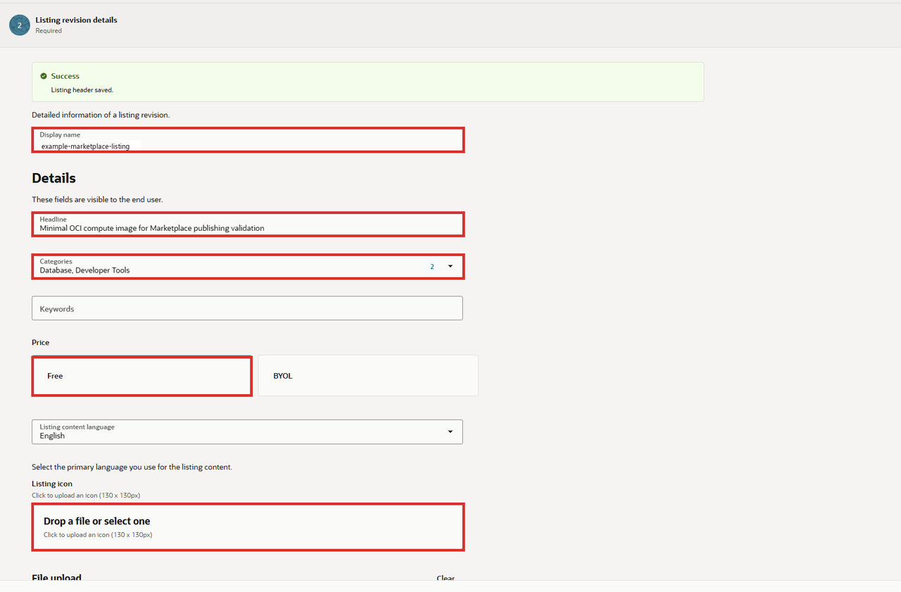
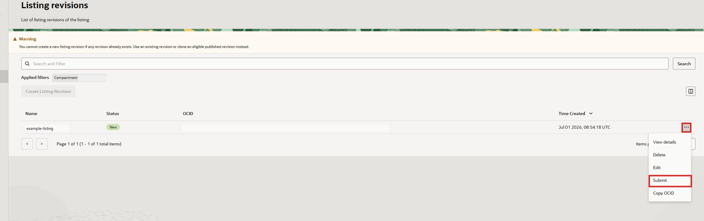
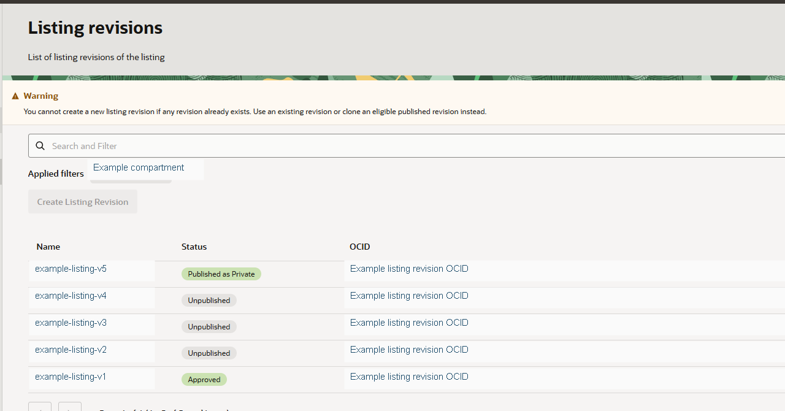
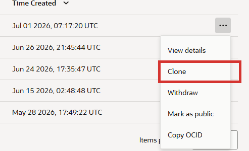
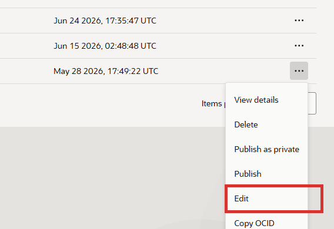
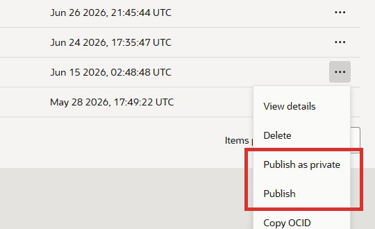
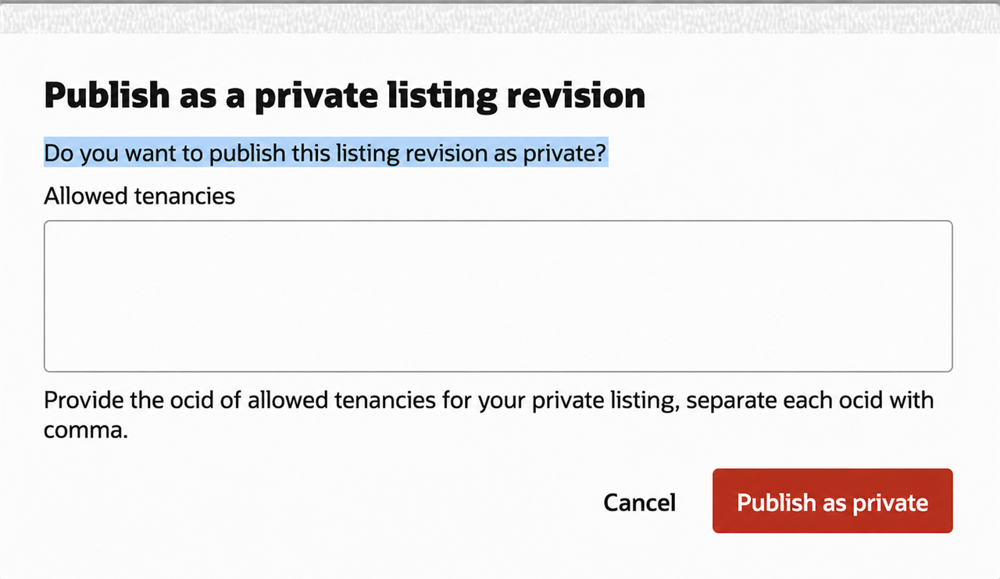

# Publish Your Image to Oracle Marketplace

## Introduction

Estimated Time: 1 hour

This lab shows you how to publish a LiveLabs custom compute image to Oracle Marketplace by using Marketplace Publisher in the OCI Console. Use the same OCI tenancy and compartment for the Marketplace Publisher resources, the custom compute image, and the listing package.

### Objectives

In this lab, you will:

* Confirm Marketplace Publisher access and required OCI policies.
* Create or select Marketplace terms of use.
* Create a compute image artifact.
* Create a new OCI application listing or update an existing listing revision.
* Publish the approved listing revision to Oracle Marketplace.

## Task 1: Get Publisher Access

1. Confirm that your organization has Oracle Marketplace Publisher access. Start from the [Oracle Marketplace partner page](https://marketplace.oracle.com/partnerHome) if you need to request or verify publisher access.

2. Confirm that you have an OCI tenancy that Marketplace Publisher can use. Marketplace Publisher now runs in the OCI Console, so you must be able to sign in to that tenancy and work in the target compartment.

3. Ask a tenancy administrator to add the required Marketplace Publisher IAM policies. At minimum, your publisher group needs access to manage Marketplace Publisher resources, and the Marketplace service must be able to read the image resources used by the listing.

    See the current [Marketplace Publisher IAM policy documentation](https://docs.oracle.com/en-us/iaas/Content/Marketplace/publisher-iam-policy.htm).

4. After approval, sign in to the OCI Console and open **Marketplace**. Under **Publisher**, confirm that you can access **Terms**, **Artifacts**, **Listings**, and **Listing revisions**.

    

After you have publisher access and the required policies, continue to Task 2.

## Task 2: Add Terms of Use

> **Note:** Create the terms of use once per tenancy and compartment. Reuse the active terms when you create or update listing packages.

1. Sign in to the OCI Console using a tenancy with Marketplace Publisher access. Open the navigation menu and select **Marketplace**. Under **Publisher**, select **Terms**.

2. Select **Create Terms of Use**.

    

3. Select the compartment, enter a descriptive terms name, and create the terms resource.

4. Open the terms resource and add a terms version. Upload the current [Oracle Standard Terms and Restrictions PDF](https://c4u04.objectstorage.us-ashburn-1.oci.customer-oci.com/p/n9OHqZrPlUZh6UtSMnnI3yq7IJecJweZ5pDjiBFqiPbOLtIjuebugDo28-KJ6geD/n/c4u04/b/livelabsfiles/o/Oracle%20Standard%20Terms%20and%20Restrictions.pdf), or use the legal-approved replacement supplied by the LiveLabs team.

    

5. After you add the version, confirm that the term version is available. If the status shows **Not Available**, open the row actions menu and select **Activate**.

    A term version must be active before it appears in the **Terms of use** selector when you add a listing package.

    

For more information, see the [Marketplace Publisher terms documentation](https://docs.oracle.com/en-us/iaas/Content/Marketplace/Tasks/create-terms.htm).

## Task 3: Create an Artifact

1. Sign in to the OCI Console using a tenancy with Marketplace Publisher access. Open the navigation menu and select **Marketplace**. Under **Publisher**, select **Artifacts**.

2. Select **Create Artifact**.

    

3. Enter a descriptive artifact name, select the target compartment, and set **Artifact type** to **Compute Image**.

    > **Note:** Create the artifact in the same compartment that you use for the listing.

    

4. Select **Select Image**. Choose the compartment that contains the custom image, select the image that you want to publish, select the compatible shapes, and then select **Update**.

    

5. Review the mandatory guidelines, select the agreement checkbox, and select **Create artifact**.

6. Wait for the artifact status to become **Available**. If the artifact does not appear in the listing package selector, return to **Artifacts** and confirm that processing has finished.

    

Marketplace Publisher processing time depends on the image size. To add the artifact to a new listing, continue to Task 4A. To add it to an existing listing, continue to Task 4B.

For more information, see the [Marketplace Publisher artifact documentation](https://docs.oracle.com/en-us/iaas/Content/Marketplace/Tasks/create-artifact.htm).

## Task 4A: Create a New Listing

1. In the OCI Console, open **Marketplace**. Under **Publisher**, select **Listings**.

2. Select **Create Listing**.

    

3. Select **OCI Application Listing** as the listing type.

    

4. Complete **Header details**.

    Use these values for a LiveLabs compute image listing:

    * **Package type:** Compute Image
    * **Compartment:** The same compartment that contains your artifact
    * **Listing name:** A descriptive internal name for the listing

    

5. Complete **Listing revision details**.

    Include the required Marketplace content:

    * **Headline:** A short description of the image and its purpose
    * **Categories:** The relevant OCI category
    * **Price:** Free
    * **Listing icon:** Use the approved [LiveLabs icon](https://cloudmarketplace.oracle.com/marketplace/content?contentId=95549453)
    * **Short description and detailed description:** Explain what the image contains and when to use it
    * **Market availability:** Select the markets where the listing should be available
    * **Version details:** Enter the image or workshop version and release date
    * **Configure URLs:** Add a LiveLabs workshop, training, or documentation URL when available

    

6. Complete **Support details**.

    Include [LiveLabs](https://livelabs.oracle.com) as a support link and select English as a supported language.

    

7. Complete **App install package**.

    Add the artifact that you created in Task 3, select the terms of use from Task 2, enter a package version, and mark the package as the default package when this image should be the default deployment option.

    The **Terms of use** menu only shows active term versions. The **Artifact** menu only shows artifacts that are available and in the same compartment as the listing.

    

8. Review the summary, accept the required terms, and create the listing revision.

    

9. On the **Listing revisions** page, open the row actions menu and select **Submit**.

    

For more information, see the [OCI application listing documentation](https://docs.oracle.com/en-us/iaas/Content/Marketplace/Tasks/creating-oci-application-listing.htm).

## Task 4B: Modify an Existing Listing

1. In the OCI Console, open **Marketplace**. Under **Publisher**, select **Listings**.

    

2. Open the listing that you want to update and review its revisions. The available actions depend on the revision status.

    

3. To update a revision that is already published, including one that is **Published as Private**, open its row actions menu and select **Clone**. Confirm the action and wait for the cloned revision to appear with the **New** status.

    

4. Open the row actions menu for an editable revision and select **Edit**. For example, an **Approved** revision can expose the **Edit** action. If **Edit** is not available, use an eligible published revision and create an editable clone as described in the previous step.

    

5. In **App install package**, add the new artifact. Select the terms of use, enter the package version, and choose whether the new package should be the default package.

    > **Note:** A listing can have only one default package at a time.

    

6. Review the details and save the revision.

    

7. On the **Listing revisions** page, open the row actions menu for the updated revision and select **Submit**. Confirm that you reviewed the mandatory listing guidelines, submit the revision, and wait for its status to change to **Pending review**.

    

> **Note:** Marketplace review can take up to a week. After the status changes to approved, continue to Task 5.

For more information, see the [listing revision editing documentation](https://docs.oracle.com/en-us/iaas/Content/Marketplace/Tasks/edit-listing.htm).

## Task 5: Publish Your Listing

1. On the **Listing revisions** page, locate the revision that Oracle approved for publication. A revision that is ready to publish can show **Approved** or **Unpublished**, depending on its publication history.

2. Open the row actions menu and select **Publish as Private**.

    

3. The **Publish as a private listing revision** confirmation dialog opens.

4. Leave the **Allowed tenancies** field blank, then select **Publish as Private**.

    

5. Monitor the listing revision until its status changes to **Published as Private**.

Publishing can take 1 to 3 business days. If publishing takes longer or you have Oracle Marketplace questions, post in the [Marketplace Slack channel](https://oracle.enterprise.slack.com/archives/CEKCPA98B).

For more information, see the [Marketplace Publisher publishing documentation](https://docs.oracle.com/en-us/iaas/Content/Marketplace/Tasks/publish-listing.htm).

## Need Help?

* Ask questions in the [Marketplace Slack channel](https://oracle.enterprise.slack.com/archives/CEKCPA98B).
* Review the [OCI Marketplace Publisher documentation](https://docs.oracle.com/en-us/iaas/Content/Marketplace/partner-portal-overview.htm).
* Review the [Marketplace Publisher IAM policy documentation](https://docs.oracle.com/en-us/iaas/Content/Marketplace/publisher-iam-policy.htm).

## Acknowledgements

* **Author** - Brianna Ambler, Database Product Manager
* **Contributors** - Brianna Ambler, Database Product Manager
* **Last Updated By/Date** - Oracle LiveLabs Team, July 2026
