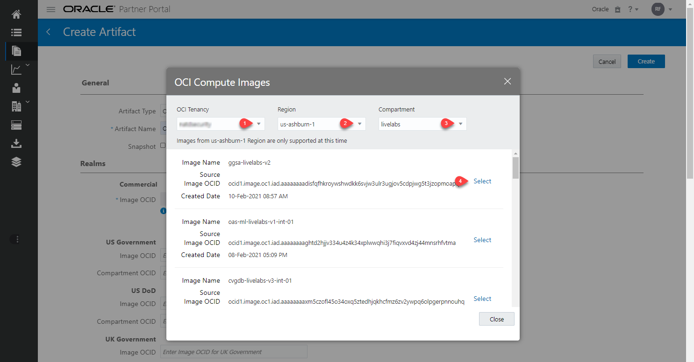
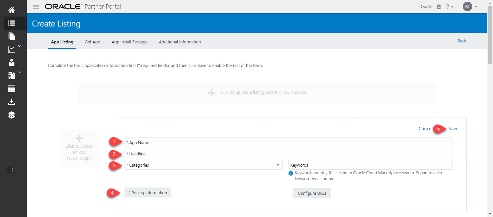
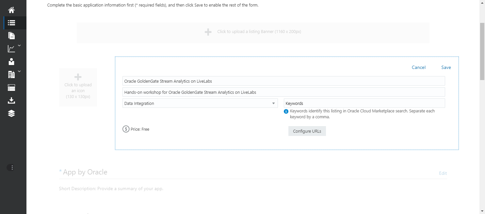
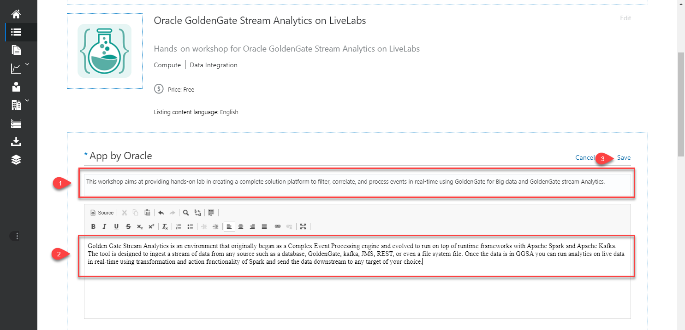
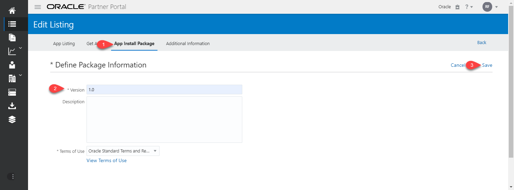
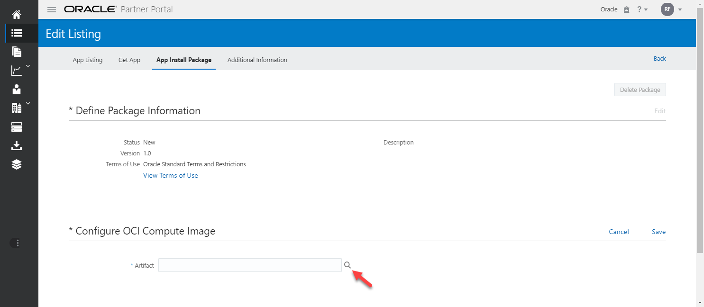
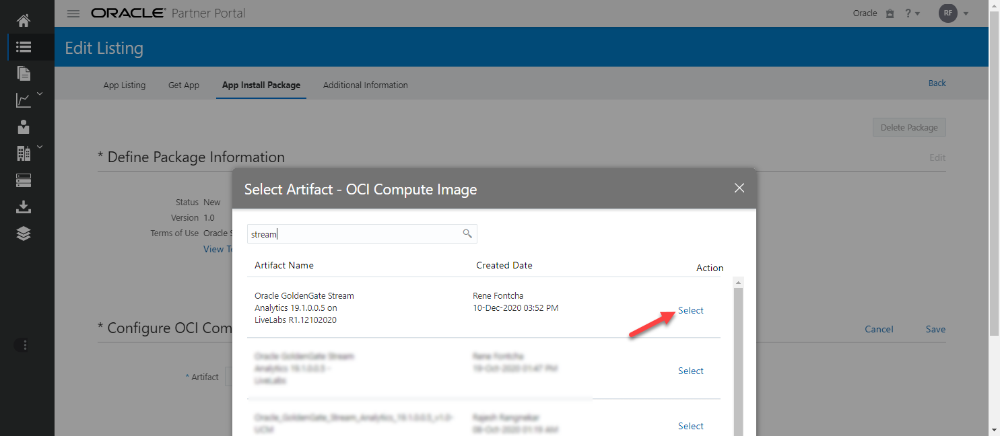
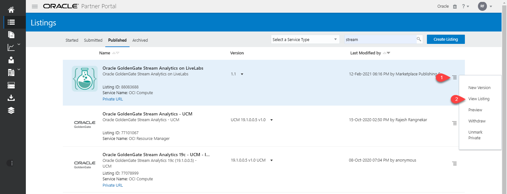

# Publish Custom Image to OCI Marketplace

## Introduction
This lab will show you how to create an OCI marketplace compute based artifact from your custom image, and use it to create a private listing on marketplace exclusively dedicated to your LiveLabs workshop.

### Objectives
- Create Marketplace Artifacts
- Create Marketplace Listing

### Prerequisites
This lab assumes:
- The custom image to be used was created as prescribed in [Creating Compute Images for Marketplace](https://oracle-livelabs.github.io/common/sample-livelabs-templates/create-labs/labs/workshops/compute/?lab=6-labs-setup-graphical-remote-desktop)

## Task 1: Create Marketplace Artifacts   
At this point, it's assumed that the test instance created in the previous lab has been successfully validated and can be submitted to OCI marketplace. This also assume that you have the required access for OCI Partner Portal. Proceed to OCI console to perform the next steps

1. Launch your browser to OCI Marketplace Partner Portal, then navigate to *"Compute > Instances"*

    ```
    URL: <copy>https://partner.cloudmarketplace.oracle.com/partner/index.html</copy>
    ```

2. Click on the 3rd icon on the left to access the Artifacts section

    

3. Click on *"Create Artifacts"*

    

4. Select *"OCI Compute Image"* from the dropdown, fill in the name, click on the search icon to lookup the custom image you created in the prior step, and click *"Create"*

    

5. Select the tenant, region, and compartment where your custom image was created, and select that image. It's assumed here that your tenant has been properly configured for marketplace integration. If not, click **"?"** at the upper right-hand corner to access the help page.

    

6. Scroll-down and check to confirm to confirm as indicated

    

7. Scroll-up and click *"Create"*  

    

8. Monitor creation progress.   

    

    *Note:* It can take 5 hours or more for the process to complete successfully. Upon completion you will receive an email notification. In case of failure, reach out to *#oci_marketplace_users* Slack channel

9. Confirm successful creation when status changes to *"Available"*

    

## Task 2: Create Marketplace Listing   
1. Click on the 2nd icon on the top left to access the Listings section

    

2. Select *"OCI Application Listing"* and Click *"Create"*  

    

3. Fill in the details as indicated for *"App Name"*, *"Headline"*, and *"Categories"*, Click on *"Pricing Information"* and Select **Free**, then Click on *"Save"*

    
    

4. Download and save [LiveLabs icon](https://cloudmarketplace.oracle.com/marketplace/content?contentId=95549453) to your local drive, then Click on *"Click to upload an icon"*, select the downloaded file, and click *"Upload"*

    
    
    
    

5. On the section labelled **"App by Oracle"**, Click on *"Edit"* and fill in the short and long descriptions

    
    

6. Scroll down to the section labelled **"Markets"**, Click on *"Edit"* and select all markets listed.

    

7. Click on  **"App Install Package"** tab, provide a version name/ID, and Click on *"Save"* to create the version

    

8. Scroll-down to the **"Configure OCI Compute Image"** section and Click on *"Edit"*

    

9. Click on the search icon, select the artifact you created in the previous step, click on *"Save"*, then click on the **"App Listing"** tab

    
    
    

10. Click on *"Submit"*

    

11. Provide a comment indicating the private listing nature, select the checkmark to confirm as shown, Click on *"Submit"*

    ```
    <copy>To be listed privately and exclusively for LiveLabs Workshops Platform</copy>
    ```

    

12. Review and Click on *"OK"*

    

13. The Listing is now submitted and pending approval by the Marketplace Team. Once approved the three dots ***(...)*** next to your listing icon will change to a green checkmark

    

14. Once the listing has been approved, click on the hamburger menu on the far right and select *"Publish as Private"*

    

15. It will take a few hours for the listing to be propagated to all OCI regions. An email notification will be sent out to you and the private URL will be listed as shown below.

    

16. Review your published listing by clicking on the hamburger menu, the selecting *"View Listing"*

    
    

17. With the image fully published and Available in all OCI regions, click on **"App Install Package"** tab, select the appropriate version, and collect the 3 key details needed for creating ORM stacks or to support a *"green button"* image configuration in LiveLabs Management System.

  - Listing Version
  - Listing OCID
  - Image OCID

    
    

18. Share the 3 key details from above (Listing Version, Listing OCID, and Image OCID) in a comment on the JIRA ticket foryour G
**This concludes this lab.**

## Learn More
* [Oracle Cloud Marketplace Partner Portal Documentation](https://docs.oracle.com/en/cloud/marketplace/partner-portal/index.html)
* [Oracle Cloud Marketplace Partner Portal Videos](https://docs.oracle.com/en/cloud/marketplace/partner-portal/videos.html)


## Acknowledgements
* **Author** - Rene Fontcha, LiveLabs Platform Lead, NA Technology, February 2021
* **Contributors** - - -
* **Last Updated By/Date** - Rene Fontcha, LiveLabs Platform Lead, NA Technology, June 2022
