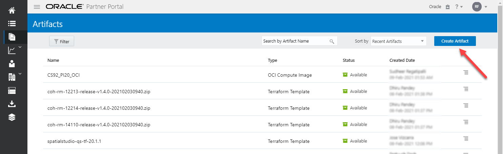
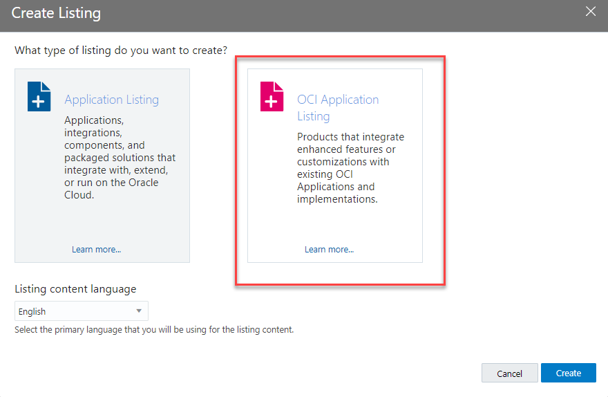

# Publish Your Image to Oracle Marketplace

Welcome! This quick guide will help you publish your custom image to Oracle Marketplace. As of November 21st, all Oracle Marketplace listings will need to be created via the OCI console. Please note that all objects must be on the same tenancy used for publishing to OMP.

## Objectives
- Get publisher access to Oracle Marketplace.
- Publish your listing to Oracle Marketplace.

## Task 1: Get Publisher Access

1. Follow these [instructions provided by OMP](https://cloudmarketplace.oracle.com/marketplace/en_US/partnerLandingPage). If you already have an Oracle tenancy, you only need to complete steps 3 and 5.

2. After registering for an OMP publisher account (step 5), you will receive an approval email shortly. This means you are now able to create listings on Oracle Marketplace!  
   

Once you're approved, you can begin creating listings! See task 2 for further instructions.

## Task 2: Add Terms of Use
> **NOTE:** You will only need to do this step once per tenancy.

1. Login to the OCI console using a tenancy with OMP publisher access and go to 'Terms'.

2. Click 'Create Terms of Use'.

3. For the terms you created, add a term version with this [term attachment](https://c4u04.objectstorage.us-ashburn-1.oci.customer-oci.com/p/n9OHqZrPlUZh6UtSMnnI3yq7IJecJweZ5pDjiBFqiPbOLtIjuebugDo28-KJ6geD/n/c4u04/b/livelabsfiles/o/Oracle%20Standard%20Terms%20and%20Restrictions.pdf).

4. Activate the terms.

## Task 3: Create an Artifact

1. Login to the OCI console using a tenancy with OMP publisher access and go to 'Artifacts'.

2. Click 'Create Artifact'.

3. Give your artifact a descriptive name, select a compartment, and set the artifact type to 'Compute Image'.
> **NOTE:** Your artifact must be created in the same compartment as your listing. 

4. Select your compute image and its compatible shapes.

5. Check the agreement box and select 'Create'.

Your artifact will be available in a few hours, depending on the size of your image. If you want to add this artifact to an existing listing go to Task 4B, otherwise go to Task 4A.

> For more information on creating artifacts please see the [OMP documentation](https://docs.oracle.com/en-us/iaas/Content/Marketplace/Tasks/create-artifact.htm).

## Task 4A: Create a New Listing
1. Login to the OCI console using a tenancy with OMP publisher access and go to 'Listings'.

2. Create an OCI Application Listing.

3. Fill out the header details. 
> **NOTE:** Be sure to set the package type to 'Compute Image' and use the same compartment as your artifact.

4. Fill out the listing revision details.
Be sure to set the following:
   - **Price:** Free
   - **Listing Icon:** [LiveLabs Icon](https://cloudmarketplace.oracle.com/marketplace/content?contentId=95549453) 
   - **Descriptions:** Provide a complete description.
   - **Market Availability:** All markets.

5. Fill out the support details.
>**NOTE:** Be sure to include [LiveLabs](https://livelabs.oracle.com) as a support link and include English as a supported language.

6. Fill out the artifact details and click 'Next'.
>**NOTE:** Be sure to set this package as the default package and add the artifact you created in Task 3.

 
7. Review the details and submit the listing.
>**NOTE:** Be sure to agree to the terms.

> For more information on creating listings please see the [OMP documentation](https://docs.oracle.com/en-us/iaas/Content/Marketplace/Tasks/creating-oci-application-listing.htm).

## Task 4B: Modify an Existing Listing
1. Login to the OCI console using a tenancy with OMP publisher access and go to 'Listings'.

2. Click on a listing and the revision you'd like to modify/clone.

3. Clone the listing.
>**NOTE:** The clone may take a few minutes to appear on the Listing Revisions page.

4. Edit the clone.

5. Navigate to the App Install Package screen and add the new artifact to the listing.
>**NOTE:** Be sure to make this the default package, if desired. Remember, there can only be one default package at a time.

6. Review the details and create the revision.

7. Click on the revision just created, and submit it for review by OMP. The status will now be pending review.

>**NOTE:** This review can take up to a week to be approved. Once the status changes to approved, proceed to task 5 for publishing.

## Task 5: Publish Your Listing

1. Once your listing revision is in the approved status, publish it as private.
> **NOTE:** Be sure to leave the allowed tenancies field blank.

> For more information on publishing listings please see the [OMP documentation](https://docs.oracle.com/en-us/iaas/Content/Marketplace/Tasks/publish-listing.htm).

For questions specifically about Oracle Marketplace, please post your inquiries in their [help channel](https://oracle.enterprise.slack.com/archives/CEKCPA98B).

## Need Help?
- Ask questions in the [Marketplace Slack channel](https://oracle.enterprise.slack.com/archives/CEKCPA98B)
- Check out the [Partner Portal Docs](https://docs.oracle.com/en/cloud/marketplace/partner-portal/index.html)
- Watch [Partner Portal Videos](https://docs.oracle.com/en/cloud/marketplace/partner-portal/videos.html)

## Acknowledgements
* **Author** - Brianna Ambler, Database Product Manager
* **Contributors**  - Brianna Ambler, Database Product Manager
* **Last Updated By/Date** - Brianna Ambler, Database Product Manager, December 2025