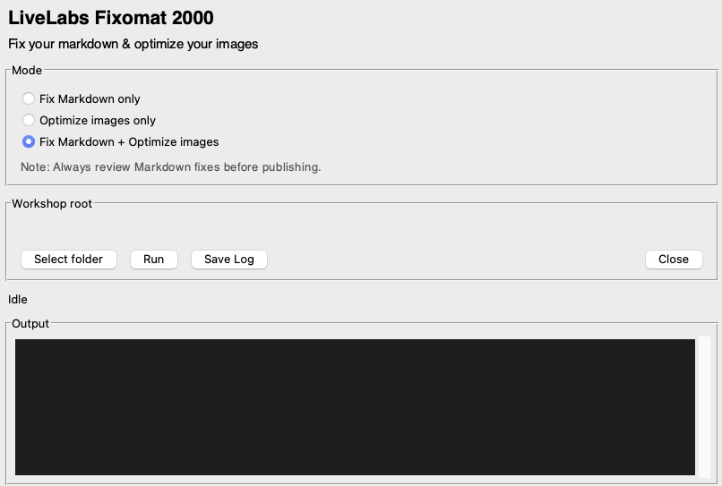

# Fixomat User Manual

## Introduction

Fixomat is a cross-platform utility for LiveLabs content maintenance. It combines Markdown auto-fixing and image optimization in one UI so authors can clean workshop files from a single tool.

**Use Fixomat to accelerate workshop cleanup before publishing: it can fix common Markdown issues and resize oversized screenshots to LiveLabs limits.**

Estimated Time: x

### About Fixomat

Fixomat supports three modes:
* Fix Markdown only
* Optimize images only
* Run both in sequence

Markdown mode applies built-in fixes and reports remaining manual issues. Images mode resizes large JPEG/PNG files and can use `oxipng` for extra PNG compression.

### Objectives

In this lab, you will:
* Install Fixomat on macOS or Windows
* Launch Fixomat and select a workshop folder
* Run Markdown and image cleanup modes
* Review logs and follow up on any manual items

### Prerequisites

This lab assumes you have:
* A copy of the Fixomat application package for your operating system
* A workshop folder containing Markdown files and/or images

## Task 1: Install Fixomat

### macOS (Arm)

**One-line installation** — Open Terminal and run:

```
<copy>
/bin/bash -c "$(curl -fsSL https://raw.githubusercontent.com/oracle-livelabs/common/main/sample-livelabs-templates/create-labs/labs/fixomat/install-macos.sh)"
</copy>
```

### Windows (x64)

**One-line installation**

1. Open PowerShell and run:

    ```
    <copy>
    $tmp="$env:TEMP\Fixomat"; $dest="$env:LOCALAPPDATA\Programs\LiveLabs Fixomat 2000"; $lnk="$env:APPDATA\Microsoft\Windows\Start Menu\Programs\LiveLabs Fixomat 2000.lnk"; $zip="$tmp\fixomat.zip"; $url="https://c4u04.objectstorage.us-ashburn-1.oci.customer-oci.com/p/EcTjWk2IuZPZeNnD_fYMcgUhdNDIDA6rt9gaFj_WZMiL7VvxPBNMY60837hu5hga/n/c4u04/b/livelabsfiles/o/fixomat/Fixomat-Windows.zip"; New-Item -ItemType Directory -Force -Path $tmp | Out-Null; Invoke-WebRequest -Uri $url -OutFile $zip; Expand-Archive -Path $zip -DestinationPath $tmp -Force; $exe=Get-ChildItem -Path $tmp -Recurse -File -Filter "*.exe" | Where-Object { $_.Name -eq "LiveLabs Fixomat 2000.exe" -or $_.Name -match "Fixomat" } | Select-Object -First 1; if (-not $exe) { throw "Could not locate a Fixomat executable in extracted files." }; New-Item -ItemType Directory -Force -Path $dest | Out-Null; Copy-Item -Path "$($exe.Directory.FullName)\*" -Destination $dest -Recurse -Force; $target=Join-Path $dest $exe.Name; $ws=(New-Object -ComObject WScript.Shell).CreateShortcut($lnk); $ws.TargetPath=$target; $ws.WorkingDirectory=$dest; $ws.Description="LiveLabs Fixomat 2000 - LiveLabs Markdown and image fixer"; $ws.IconLocation="$target,0"; $ws.Save(); Remove-Item -Path $tmp -Recurse -Force; Write-Host "LiveLabs Fixomat 2000 installed. Search 'LiveLabs Fixomat 2000' in Start Menu."
    </copy>
    ```

2. Search for **LiveLabs Fixomat 2000** in the Start Menu, or find the exe at `%LOCALAPPDATA%\Programs\LiveLabs Fixomat 2000\LiveLabs Fixomat 2000.exe`.

## Task 2: Launch Fixomat

1. Launch **LiveLabs Fixomat 2000** from your operating system.

    **Windows:**
    Search for `LiveLabs Fixomat 2000` in the Start Menu, or run the executable from `%LOCALAPPDATA%\Programs\LiveLabs Fixomat 2000`.

    **macOS:**
    Open **Applications** and launch `LiveLabs Fixomat 2000.app`.

2. Confirm the main Fixomat window opens with mode selection, folder picker, and output console.

## Task 3: Run Fixomat on a Workshop




1. Click **Select folder** and choose your workshop root directory.

2. Choose one mode:

    * `Fix Markdown only` for Markdown cleanup
    * `Optimize images only` for image resizing/compression
    * `Fix Markdown + Optimize images` to run both

3. Click **Run**.

4. Wait for completion and review the summary.

    > Note: Markdown output may include `MANUAL` findings that still require human review.

5. Optionally click **Save Log** to export the full run output to `fixomat.log`.

## Task 4: Interpret Output and Follow Up

1. Review Markdown results:

    * `FIXED` lines indicate changes applied automatically
    * `MANUAL` lines indicate issues that require editing

2. Review image results in summary fields:

    | Field | Description |
    | --- | --- |
    | Resized | Number of images resized to max dimension |
    | Optimized | Number of PNG images optimized without resizing |
    | Skipped | Number of images that needed no changes |
    | Failed | Number of image files that could not be processed |
    | Before | Total image size before processing |
    | After | Total image size after processing |
    | Saved | Total space saved |

3. Re-run Fixomat after manual edits if required.

## FAQ

### macOS: The app is blocked by security settings

If macOS warns that the app cannot be verified, open **System Settings > Privacy & Security** and allow the app to run.

### Windows: SmartScreen warning appears

If Microsoft Defender SmartScreen appears, click **More info**, then **Run anyway**.

## Acknowledgements

* **Last Updated By/Date:** LiveLabs Team, March 2026
