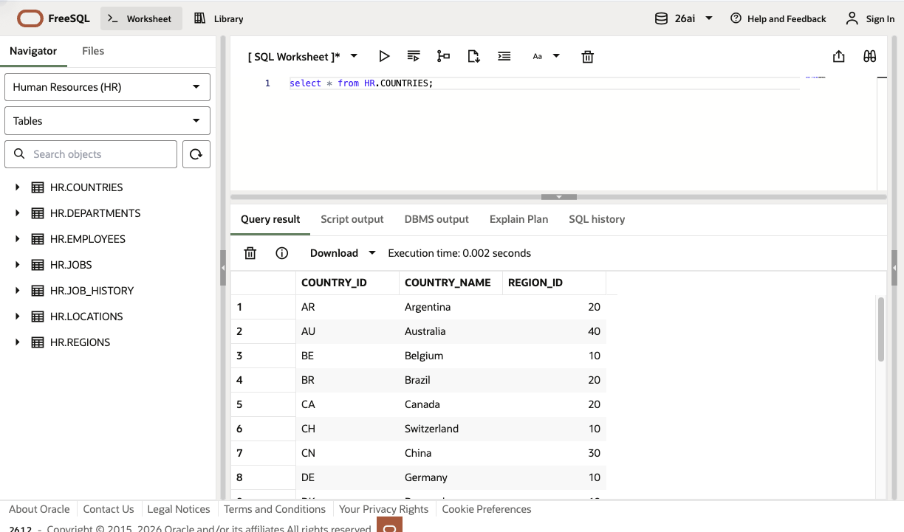
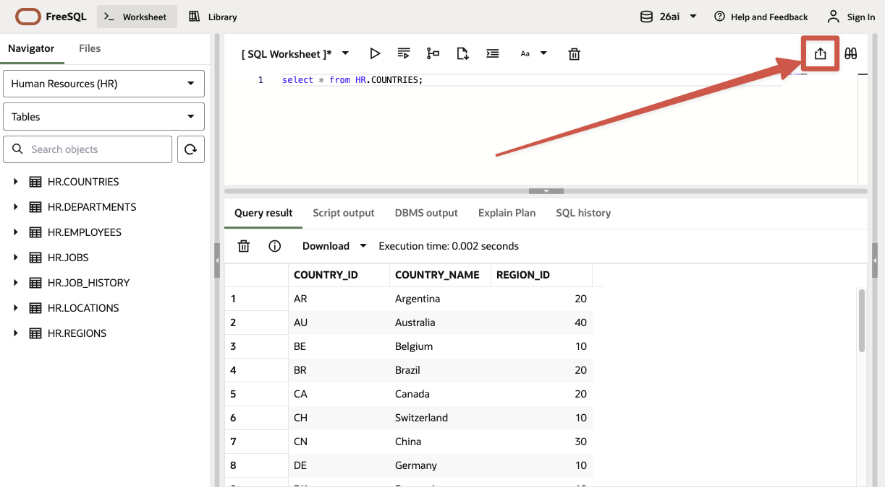
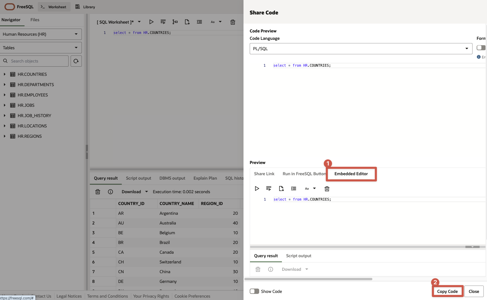
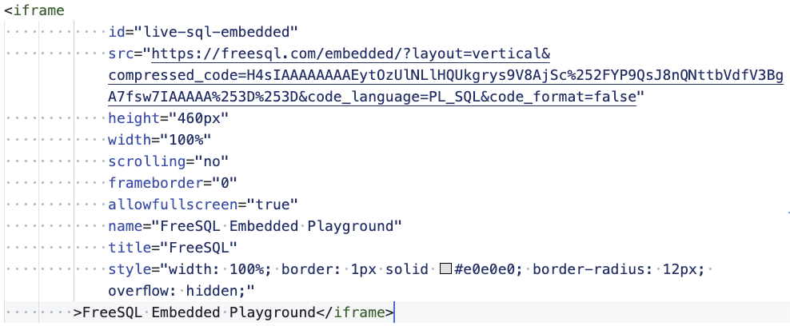

# Embed SQL Developer using freesql.com

## Introduction

You can embed live FreeSQL editors directly inside a LiveLab markdown file. This lets learners run SQL inline while they read each task.

Estimated Time: 10 minutes

### Objectives

In this lab, you will:

- Add a FreeSQL embedded editor to markdown
- Understand which iframe fields are required vs optional
- Verify the expected runtime behavior in LiveLabs

## Task 1: Create your SQL or PL/SQL code on freesql.com

1. Create a SQL or PL/SQL script on freesql.com

    

2. Open the Share menu

    

3. Select Embedding and Copy Code

    

## Task 2: Paste the code in your LiveLabs Markdown

1. Next, you will paste the code into your markdown file. The screenshot below shows a sample of what you should see in your markdown file:

    

    As a result, the freesql editor is embedded like this:

    <iframe
            id="live-sql-embedded"
            src="https://freesql.com/embedded/?layout=vertical&compressed_code=H4sIAAAAAAAAEytOzUlNLlHQUkgrys9V8AjSc%252FYP9QsJ8nQNttbVdfV3BgA7fsw7IAAAAA%253D%253D&code_language=PL_SQL&code_format=false"
            height="460px"
            width="100%"
            scrolling="no"
            frameborder="0"
            allowfullscreen="true"
            name="FreeSQL Embedded Playground"
            title="FreeSQL"
            style="width: 100%; border: 1px solid #e0e0e0; border-radius: 12px; overflow: hidden;"
        >FreeSQL Embedded Playground</iframe>

## Task 3: Validate Runtime Behavior

After rendering your lab page, verify the embed behavior.

1. Open the lab in a browser and navigate to the section with the FreeSQL iframe.

2. Confirm visual and load behavior:

    - The editor appears with a light gray border
    - The editor occupies the full available content width
    - The embed loads when near the viewport (lazy behavior)

## FAQ

### Can I use the same snippet in multiple labs?
Yes.

### Can I also use snippets to create tables and modify data?
Yes. To run SQL that changes database state, such as CREATE, INSERT, UPDATE, or DELETE, the user must log in to FreeSQL. FreeSQL prompts the user to sign in the first time the user runs a snippet that performs one of those operations.

### Do I need to update all iframe attributes for each new snippet?

No. Do not change any attributes. The will be our Redwood design.

### Why does the editor height look different from 460px?

Redwood overrides apply responsive height behavior to provide enough room for editor and results.

## Acknowledgements

* **Author** - LiveLabs Team
* **Last Updated By/Date** - LiveLabs Team, March 2026
