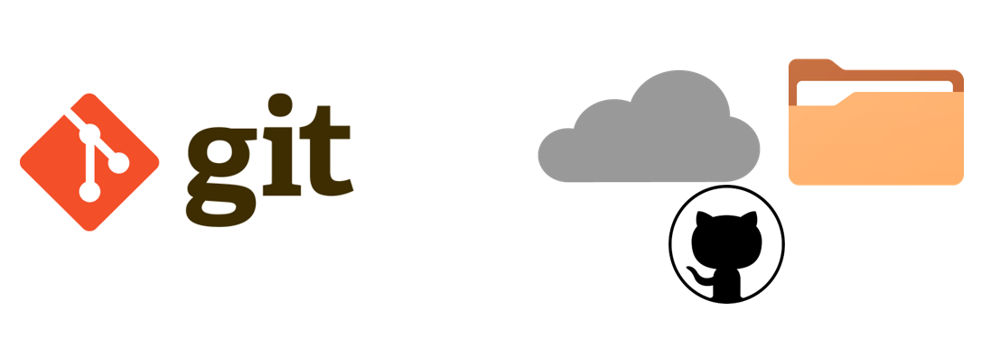
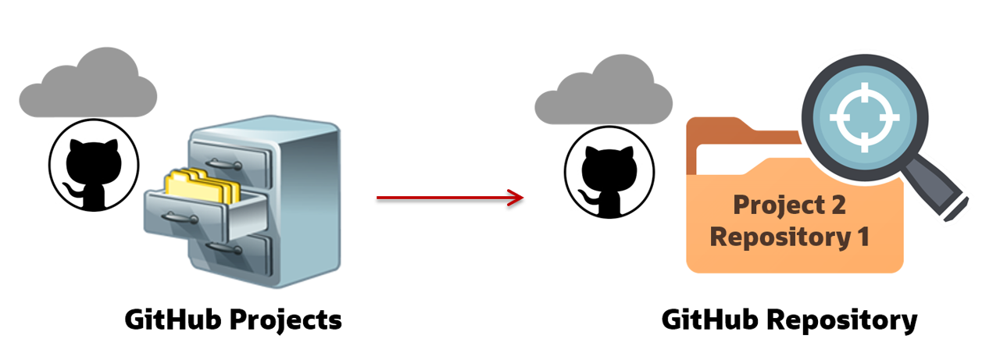
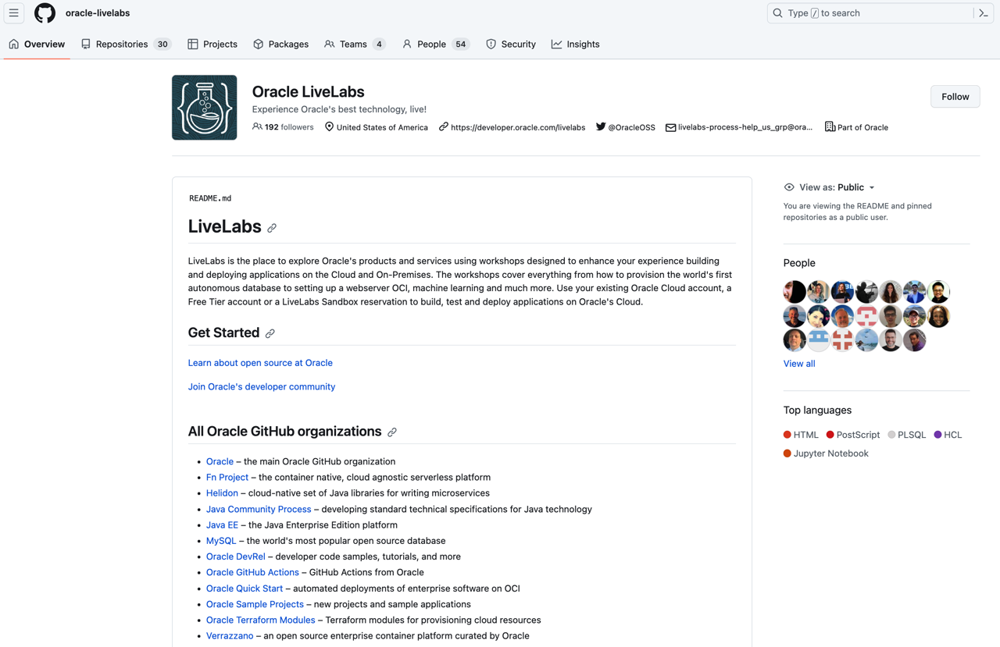
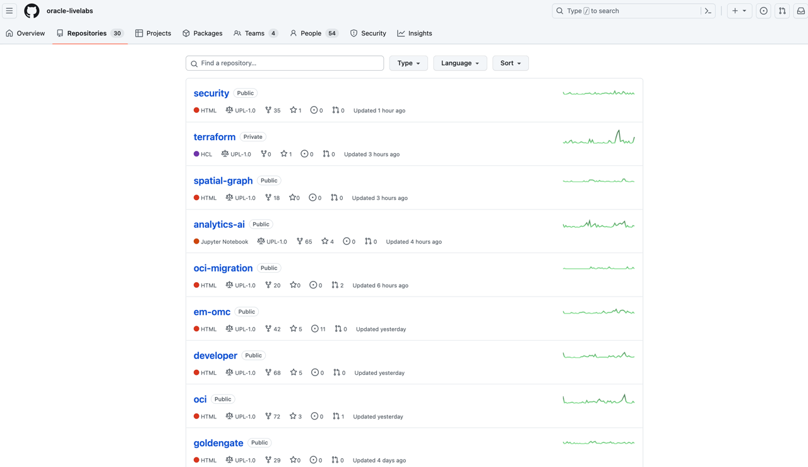

# Introduction to Oracle LiveLabs GitHub Project Repository

## What is GitHub?

GitHub is a cloud-based version control system designed for software developers.
  * At the core of GitHub is Git, an open source version control system that manages file versions and tracks the changes made by the members of a repository.
  * The Hub is a cloud-based repository that manages storage of the files and provides a folder structure.
  

### **GitHub Projects and Repositories**

GitHub is organized by projects. Each project has its own repository (commonly referred to as repo) that is accessed through a unique URL. As of January 2020, there were more than 190 million repositories on GitHub.

In the following simplified example, the three-drawer filing cabinet represents three GitHub projects (one drawer per project). Each project can contain one or more repositories, represented by folders in the example. In this example, project 2 (second drawer) has three repositories (folders) and we are viewing one of those repositories.

  

### **Oracle LiveLabs GitHub Project Repository**

Oracle LiveLabs has its own GitHub project that has 30 active repositories. This is separate from the Oracle GitHub project that has another 305 repositories with several code samples and architectures. The **oracle-livelabs** repository is where authors push their completed markdown and image files for their LiveLabs workshops. The repositories in **oracle-livelabs** match up with the council groups and products.

+ You can access the **oracle-livelabs** GitHub project using the following URL:

  [https://oracle.com/livelabs](https://oracle.com/livelabs)

  

+ You can access all the **oracle-livelabs** GitHub project repositories using the following URL:
  [https://github.com/orgs/oracle-livelabs/repositories](https://github.com/orgs/oracle-livelabs/repositories)

  

## Want to learn more about GitHub?

* [Get started with GitHub](https://docs.github.com/en/get-started)

## Acknowledgements

* **Authors:**
    * Anuradha Chepuri, Principal User Assistance Developer, Oracle GoldenGate
    * Lauran Serhal, Principal User Assistance Developer, Oracle Database and Big Data
* **Contributors:**
    * Aslam Khan, Senior User Assistance Manager, ODI, OGG, EDQ
    * Arabella Yao, Product Manager, Database Product Management
* **Last Updated By/Date:**
    * Anoosha Pilli, October 2023
