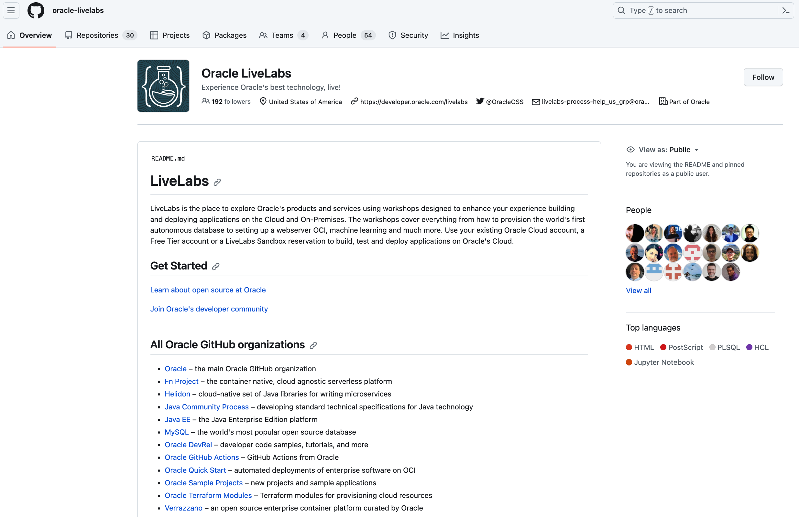
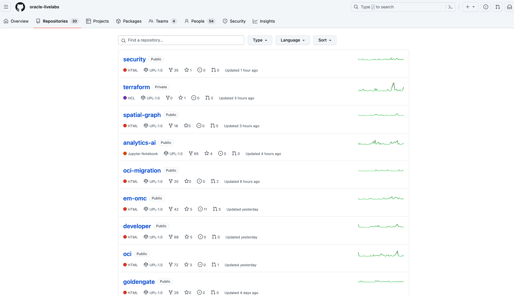

# Introduction to Oracle LiveLabs GitHub Project Repository

## What Is GitHub?

GitHub is a cloud-based version control system for software developers.

* **Git** is the open-source version control system that manages file versions and tracks changes made by repository members.
* **Hub** is the cloud-based repository that stores files and provides folder structure.

  

### **GitHub Projects and Repositories**

GitHub organizes content by projects. Each project has its own repository (repo) accessed through a unique URL.

In the following example, the three-drawer filing cabinet represents three GitHub projects (one drawer per project). Each project contains one or more repositories, represented by folders. Project 2 (second drawer) has three repositories, and we are viewing one of them.

  

### **Oracle LiveLabs GitHub Project Repository**

Oracle LiveLabs has its own GitHub project with multiple active repositories, separate from the main Oracle GitHub project. Authors push their completed Markdown and image files for LiveLabs workshops to the **oracle-livelabs** repository. Repositories in **oracle-livelabs** correspond to council groups and products.

+ Access the **oracle-livelabs** GitHub project: [https://github.com/oracle-livelabs](https://github.com/oracle-livelabs)

  

+ View all **oracle-livelabs** repositories: [https://github.com/orgs/oracle-livelabs/repositories](https://github.com/orgs/oracle-livelabs/repositories)

  

## Learn More

* [Get Started with GitHub](https://docs.github.com/en/get-started)

## Acknowledgements

* **Last Updated By/Date:** LiveLabs Team, January 2026
