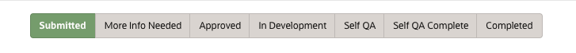
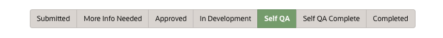
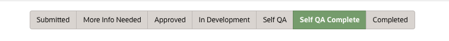
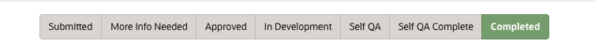

# Need to understand the status in WMS?

## WMS workflow - status

For a workshop to go from an idea to a LiveLabs workshop in production, it has to go through the following phases or statuses in WMS. You can refer to this section to see your current and next steps.

1. After the workshop team submits the workshop request (see details in Lab 1 -> Task 1), the workshop is in *Submitted* status. The workshop's *council* group will review the workshop within 2-3 business days. Council will either approve the workshop and move it to *Approved*, or ask the workshop team for more information and move it to *More Info Needed*.

This is the status you are currently at if you worked through the first couple steps of this lab. When you hit save on the information you provided as details about your new workshop, it saves it in submitted status. Which means it is ready for the council to review and either approve your workshop or ask for more details. The council does receive an automated email message alerting them to this submission as well as having this appear on their dashboard in WMS for newly submitted workshops.

>**Note:** If workshop teams have not heard back from the council for more than 3 business days, please follow up with your council group. To find your council members, go to WMS, under **People & Role Reports**, select **Workshop Council Members**, and you can find your council members.

   

1. Council asks workshop team for *more information*. The workshop team will respond to the council via the **Message the Team** tab in WMS to get the workshop approved.

If something is unclear or more details are needed to understand the workshop, the council will ask for more information before continuing. This is to validate the use case make sure that what is being highlighted is clear or could be just wanting more details to how this is going to be accomplished.
  

3. Council *approves* the workshop. Now, the workshop team can start developing the workshop. Refer to the notification email to see your action items. Congratulations - you will receive an email notifying of this approval and the next steps.
  

4. Workshop team will move the workshop to *In Development* when they start workshop development. Now it is time to work through the development of the content. The next couple of labs will tell you how to get started.
  

5. After development, the workshop team will move the workshop status to *Self QA*. Follow Lab 4 to self-QA the workshop. After Self QA, the workshop team will move the workshop status to *Self QA Complete* and send the completed Self QA form to the stakeholders. Again, when the status is moved into *Self QA Complete* automated email messages are sent to the stakeholders and appears on their dashboard in WMS for completed workshops.
  

  Workshop authors can watch the video below on how to self-QA your workshop. Stakeholders can also watch the video below to learn how to verify the QA of a workshop.
  

6. The workshop's *stakeholders* will verify the QA within 2 business days. They will either send workshop team issues to fix, or move the workshop to *Completed* status, meaning the workshop is ready for production.
  

7. The workshop is *completed* and is ready for publishing! Workshop teams will submit a publishing request, and the LiveLabs team will approve it. Steps to complete publishing are in Lab 5. After the publishing request is approved, the workshop will be live in LiveLabs automatically within a business day.
  

### **What's Next?**

Now that you know all about Oracle LiveLabs GitHub project repository and LiveLabs workshop development workflow, you are all set to begin the labs! Click **Lab 1: Submit new workshop in WMS** in the Contents menu to get stated.

## Want to learn more about LiveLabs workshops?

* [Oracle LiveLabs](https://apexapps.oracle.com/pls/apex/f?p=133:1)
* [Get started with GitHub](https://docs.github.com/en/get-started)

## Acknowledgements

* **Authors:**
    * Michelle Malcher, Senior Manager, Oracle Database Product Management
* **Contributors:**
    * Anuradha Chepuri, Principal User Assistance Developer, Oracle GoldenGate
    * Lauran Serhal, Principal User Assistance Developer, Oracle Database and Big Data
    * Aslam Khan, Senior User Assistance Manager, ODI, OGG, EDQ
    * Arabella Yao, Product Manager, Database Product Management
* **Last Updated By/Date:**
    * Michelle Malcher, August 2022
