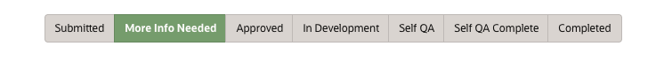
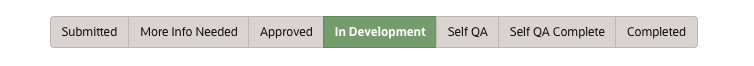
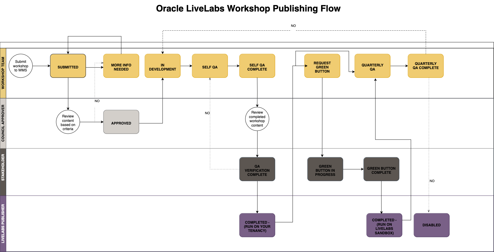

# Understanding WMS Status Workflow

## WMS Workflow - Status

A workshop progresses through several phases (statuses) in WMS before reaching production. Refer to this section to understand your current status and next steps.

1. After submitting the workshop request (see Lab 1, Task 1), the workshop enters *Submitted* status. The workshop's *council* group reviews submissions within 2-3 business days and either approves the workshop or requests more information.

    When you save your workshop details, it enters *Submitted* status and is ready for council review. The council receives an automated email notification and sees the submission on their WMS dashboard.

    To find your council members, go to WMS, select **People & Role Reports** > **Workshop Council Members**.

    

2. Council requests *more information*. The workshop team responds via the **Message the Team** tab in WMS.

    If the workshop needs clarification, the council requests more information before continuing. This validates the use case and ensures the workshop goals are clear.

    

3. Council *approves* the workshop. The workshop team can now start development. The notification email contains action items.

    

4. The workshop team moves the workshop to *In Development* when starting development. The next labs explain how to begin.

    

5. After development, the workshop team moves the status to *Self QA*. Follow Lab 6 to self-QA the workshop. Then move to *Self QA Complete* and send the completed Self QA form to stakeholders. Automated emails notify stakeholders when this status is set.

    

6. The workshop's *stakeholders* verify QA within 2 business days. They either return issues to fix or move the workshop to *Completed* status, indicating the workshop is ready for production.

    

7. The workshop is *completed* and ready for publishing. Submit a publishing request (see Lab 7), and the LiveLabs team will approve it. After approval, the workshop goes live within one business day.

    

    See the LiveLabs Workshop Management Flow:

    

### **What's Next?**

You now understand the Oracle LiveLabs GitHub project repository and workshop development workflow. Click **Lab 1: Submit new workshop in WMS** in the Contents menu to begin.

## Learn More

* [Oracle LiveLabs](https://livelabs.oracle.com)
* [Get Started with GitHub](https://docs.github.com/en/get-started)

## Acknowledgements

* **Last Updated By/Date:** LiveLabs Team, January 2026
