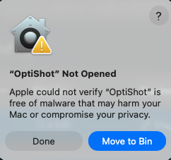

# OptiShot User Manual

## Introduction

OptiShot is a cross-platform image optimization tool that resizes and compresses JPEG and PNG images recursively within a directory. It provides a simple graphical interface for users who prefer not to use the command line.

**Use OptiShot to ensure workshop screenshots comply with LiveLabs standards: images must not exceed 1,280 px in width or height.**

Estimated Time: 5 minutes

### About OptiShot

OptiShot automatically processes all images in a selected folder and its subfolders. JPEG images are resized and compressed with high quality settings (92% quality). PNG images are resized and optimized using oxipng for maximum compression without quality loss.

### Objectives

In this lab, you will:
* Launch OptiShot on Windows or macOS
* Select a folder containing images to optimize
* Understand the processing output and results
* Use command-line options for advanced control

### Prerequisites

This lab assumes you have:
* OptiShot application installed on your computer
* A folder containing JPEG or PNG images to optimize

## Task 0: Install OptiShot

### macOS (Arm Only)

**One-line installation** — Open Terminal and run:

```
<copy>
/bin/bash -c "$(curl -fsSL https://raw.githubusercontent.com/oracle-livelabs/common/main/sample-livelabs-templates/create-labs/labs/optishot/install-macos.sh)"
</copy>
```

This downloads and installs OptiShot to `/Applications`. After installation, find **OptiShot.app** in your Applications folder.

<details>
<summary>Alternative: Manual installation</summary>

1. Open Terminal and run:

    ```
    <copy>
    curl -fsSL -o /tmp/OptiShot.zip "https://c4u04.objectstorage.us-ashburn-1.oci.customer-oci.com/p/EcTjWk2IuZPZeNnD_fYMcgUhdNDIDA6rt9gaFj_WZMiL7VvxPBNMY60837hu5hga/n/c4u04/b/livelabsfiles/o/optishot/OptiShot-MacOS-arm.zip" && unzip -o /tmp/OptiShot.zip -d /tmp && cp -R /tmp/OptiShot/OptiShot.app /Applications/ && rm -rf /tmp/OptiShot.zip /tmp/OptiShot && echo "OptiShot installed to /Applications"
    </copy>
    ```

2. Find **OptiShot.app** in your Applications folder.
</details>


### Windows (x64)

**One-line installation** — Open PowerShell (as Administrator) and run:

```
<copy>
Set-ExecutionPolicy Bypass -Scope Process -Force; iex ((New-Object System.Net.WebClient).DownloadString('https://raw.githubusercontent.com/oracle-livelabs/common/main/sample-livelabs-templates/create-labs/labs/optishot/install-windows.ps1'))
</copy>
```

This downloads and installs OptiShot to your user's Programs folder and creates a Start Menu shortcut. Search for **OptiShot** in the Start Menu to launch.

<details>
<summary>Alternative: Manual installation</summary>

1. Open PowerShell and run:

    ```
    <copy>
    $tmp="$env:TEMP\OptiShot"; New-Item -ItemType Directory -Force -Path $tmp | Out-Null; Invoke-WebRequest -Uri "https://c4u04.objectstorage.us-ashburn-1.oci.customer-oci.com/p/EcTjWk2IuZPZeNnD_fYMcgUhdNDIDA6rt9gaFj_WZMiL7VvxPBNMY60837hu5hga/n/c4u04/b/livelabsfiles/o/optishot/OptiShot-Windows.zip" -OutFile "$tmp\OptiShot.zip"; Expand-Archive -Path "$tmp\OptiShot.zip" -DestinationPath "$tmp" -Force; $dest="$env:LOCALAPPDATA\Programs\OptiShot"; New-Item -ItemType Directory -Force -Path $dest | Out-Null; Copy-Item -Path "$tmp\OptiShot\*" -Destination $dest -Recurse -Force; Remove-Item -Path $tmp -Recurse -Force; Write-Host "OptiShot installed to $dest"
    </copy>
    ```

2. Find **OptiShot.exe** at `%LOCALAPPDATA%\Programs\OptiShot\OptiShot.exe`.
</details>


## Task 1: Launch OptiShot

Launch the OptiShot application on your operating system.

1. **Windows**: Search for **OptiShot** in the Start Menu, or navigate to `%LOCALAPPDATA%\Programs\OptiShot` and double-click **OptiShot.exe**.

2. **macOS**: Open **Applications** in Finder and double-click **OptiShot.app**, or use Spotlight (Cmd+Space) and search for "OptiShot".

3. The folder picker dialog appears automatically.

> **Note:** If the app does not start or you get a security warning, see the FAQ at the end of this document.

## Task 2: Select a Folder to Process

Choose the folder containing the images you want to optimize.

1. In the folder picker dialog, navigate to the folder containing your images.

2. Select the folder and click **Select Folder** (Windows) or **Open** (macOS).

   > **Note:** OptiShot processes all images recursively, including images in subfolders. The `.git` directory is automatically excluded.

3. The status window will appear showing the processing progress.

## Task 3: Understanding the Output

The status window displays real-time information about the image processing.

1. The output shows each image being processed:

    ```
    Found 25 images. Processing with 4 parallel jobs...
    Resizing: ./images/photo.jpg (2400x1600 → max 1280px)
      Saved: 0.45 MB (471859 bytes)
    ```

2. Images smaller than the maximum dimension are skipped:

    ```
    Skipping (already <= 1280px): ./images/icon.png (256x256)
    ```

3. When processing completes, a summary is displayed:

    | Field | Description |
    | --- | --- |
    | Resized | Number of images that were resized |
    | Optimized | Number of PNG images optimized without resizing |
    | Skipped | Number of images already within size limits |
    | Failed | Number of images that could not be processed |
    | Before | Total size of all images before processing |
    | After | Total size of all images after processing |
    | Saved | Total space saved |

4. Click **Close** to exit OptiShot.

## Task 4: Using Drag and Drop

You can also use drag and drop to process images quickly.

1. Locate the folder containing images you want to optimize.

2. Drag the folder onto the OptiShot application icon:

    - **Windows**: Drag the folder onto **OptiShot.exe**
    - **macOS**: Drag the folder onto **OptiShot.app**

3. The status window will appear and processing will begin automatically.

## Task 5: Using Command-Line Options (Optional)

For advanced users, OptiShot supports command-line options.

1. Open a terminal or command prompt.

2. Navigate to the OptiShot directory.

3. Run OptiShot with options:

    **Windows:**
    ```
    <copy>OptiShot.exe C:\path\to\images -m 1920 -j 8</copy>
    ```

    **macOS:**
    ```
    <copy>./OptiShot.app/Contents/MacOS/OptiShot /path/to/images -m 1920 -j 8</copy>
    ```

4. Available command-line options:

    | Option | Default | Description |
    | --- | --- | --- |
    | directory | (folder picker) | Target directory to process |
    | -n, --dry-run | false | Preview changes without modifying files |
    | -j, --jobs | 4 | Number of parallel processing jobs |
    | -m, --max | 1280 | Maximum dimension in pixels |

    >> Note: LiveLabs supports images up to a maximum of 1280px!

5. Example: Preview what would be processed without making changes:

    **Windows:**
    ```
    <copy>OptiShot.exe C:\path\to\images --dry-run</copy>
    ```

    **macOS:**
    ```
    <copy>./OptiShot.app/Contents/MacOS/OptiShot /path/to/images --dry-run</copy>
    ```


## FAQ

### **MacOS: I Cannot Start the App on macOS (Security Warning)**
If you see a security warning stating that the app "cannot be opened because the developer cannot be verified," this is expected. It occurs because the app is currently unsigned.

  

**How to Resolve This:**

1. Open **System Settings** and navigate to **Privacy & Security**.

2. Scroll down to the **Security** section.

3. You will see a message regarding "OptiShot" being blocked. Click **Open Anyway**.

4. If prompted, enter your Mac password and confirm by clicking Open on the final pop-up.

>Note: You only need to perform these steps once. After the first successful launch, the app will open normally.

  


### **Windows: I Cannot Start the App on Windows (SmartScreen Warning)**

When launching the app for the first time, you may see a blue Windows Protected your PC popup from Microsoft Defender SmartScreen. This appears because the application is currently unsigned.

  

**How to Resolve This:**

1. On the warning popup, click the "**More info**" link (located under the main text).

2. An "**Run anyway**" button will now appear at the bottom of the window.

3. Click **Run anyway** to launch the application.

  

## Acknowledgements
* **Last Updated By/Date:** LiveLabs Team, January 2026
